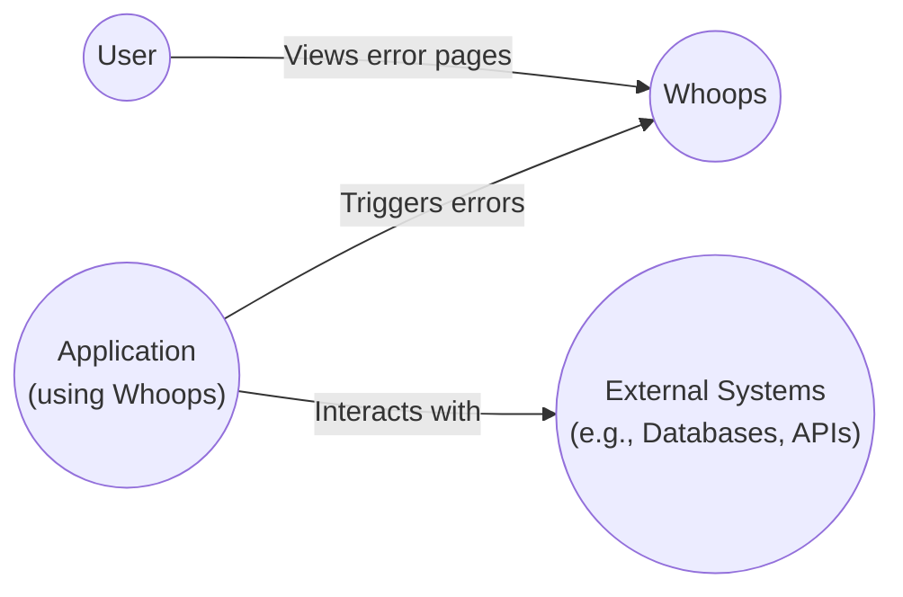
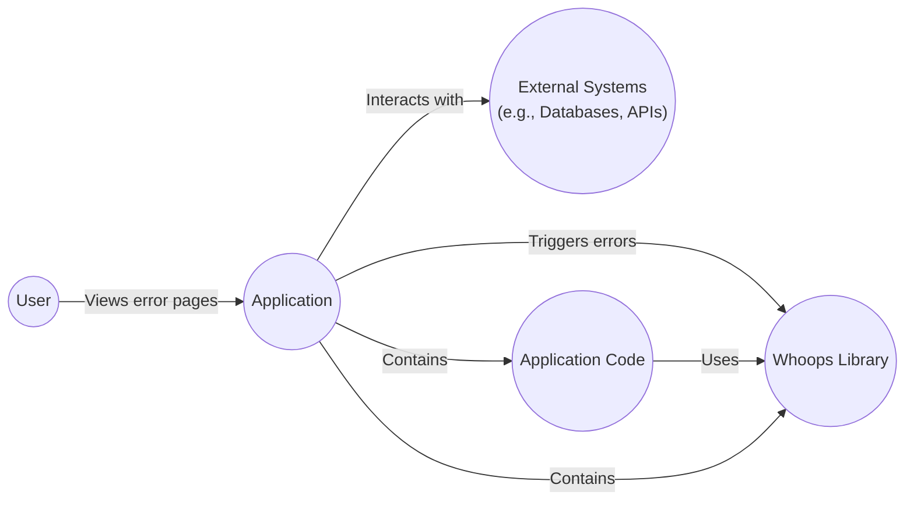
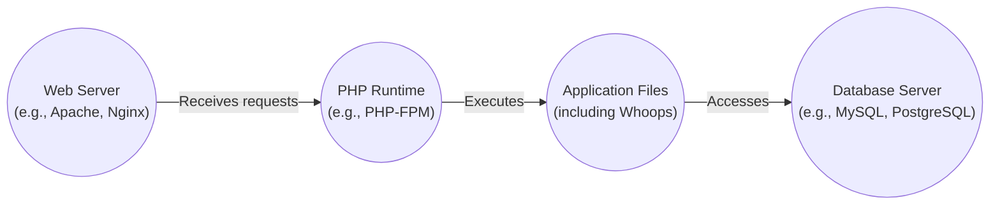
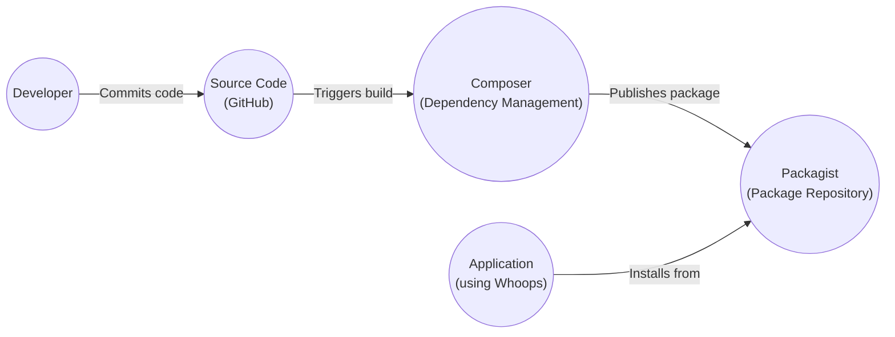

Okay, let's create a design document for the "whoops" project.

# BUSINESS POSTURE

Business Priorities and Goals:

*   Provide a simple, user-friendly error page for web applications.
*   Offer a visually appealing alternative to standard browser error pages.
*   Improve the user experience during application errors.
*   Potentially reduce user frustration and support calls.
*   The project is Open Source, so community engagement and contribution are important.

Most Important Business Risks:

*   Exposure of sensitive information (e.g., stack traces, environment variables) in error messages if not properly configured.
*   Potential for misuse if the error page becomes a vector for attacks (e.g., XSS, injection).
*   Negative impact on user perception if the error page itself is buggy or unreliable.
*   Maintenance overhead for the open-source project (responding to issues, reviewing pull requests).
*   Reputational damage if vulnerabilities are found and exploited.

# SECURITY POSTURE

Existing Security Controls:

*   security control: The project's README provides basic instructions for installation and usage, implying some level of user awareness.
*   security control: The project is open-source, allowing for community code review and vulnerability identification (although this is not a formal control).

Accepted Risks:

*   accepted risk: The project, by its nature, handles and displays error information, which inherently carries some risk of information disclosure.  The level of acceptable risk here is highly dependent on the application using "whoops" and its configuration.
*   accepted risk: The project is relatively simple, but there's an accepted risk of undiscovered vulnerabilities, particularly in dependencies.
*   accepted risk: The project maintainer might not be able to immediately address all reported security issues.

Recommended Security Controls:

*   security control: Implement robust configuration options to control the level of detail displayed in error messages (e.g., a "production" mode that hides sensitive information).
*   security control: Thoroughly sanitize any user-provided input that might be displayed on the error page to prevent XSS vulnerabilities.
*   security control: Implement a Content Security Policy (CSP) to mitigate the impact of potential XSS attacks.
*   security control: Regularly update dependencies to address known vulnerabilities.
*   security control: Provide clear security guidelines in the project documentation, emphasizing the importance of proper configuration and secure usage.
*   security control: Consider integrating static analysis tools into the development workflow to identify potential vulnerabilities early.

Security Requirements:

*   Authentication: Not directly applicable, as "whoops" itself doesn't handle authentication. However, it should not interfere with any existing authentication mechanisms of the application using it.
*   Authorization: Not directly applicable. "whoops" should not bypass or modify any authorization checks of the main application.
*   Input Validation: Critically important. Any data displayed on the error page, especially if originating from user input, must be rigorously validated and sanitized to prevent XSS and other injection attacks.
*   Cryptography: Not directly applicable, unless "whoops" is used to display encrypted data (which is unlikely and should be avoided). If any sensitive data *must* be displayed, consider using appropriate hashing or masking techniques.

# DESIGN

## C4 CONTEXT

Element Descriptions:

*   Element:
    *   Name: User
    *   Type: Person
    *   Description: The end-user of the application that integrates "whoops."
    *   Responsibilities: Interacts with the application, views error pages when errors occur.
    *   Security controls: Relies on the security controls implemented by the Application and Whoops.

*   Element:
    *   Name: Whoops
    *   Type: Software System
    *   Description: The "whoops" error handling library.
    *   Responsibilities: Provides a visually appealing and informative error page.
    *   Security controls: Input validation, output encoding, configurable error detail level, CSP (recommended).

*   Element:
    *   Name: Application (using Whoops)
    *   Type: Software System
    *   Description: The web application that integrates the "whoops" library.
    *   Responsibilities: Handles user requests, performs business logic, integrates "whoops" for error handling.
    *   Security controls: All standard web application security controls (authentication, authorization, input validation, output encoding, session management, etc.).

*   Element:
    *   Name: External Systems (e.g., Databases, APIs)
    *   Type: Software System
    *   Description: Any external systems that the Application interacts with.
    *   Responsibilities: Provide data or services to the Application.
    *   Security controls: Dependent on the specific external system (e.g., database security, API authentication).

## C4 CONTAINER

Since "whoops" is a library integrated within an existing application, the container diagram is essentially an extension of the context diagram. The "whoops" library becomes a component *within* the Application container.

Element Descriptions:

*   Element:
    *   Name: User
    *   Type: Person
    *   Description: The end-user of the application.
    *   Responsibilities: Interacts with the application, views error pages.
    *   Security controls: Relies on application and Whoops security.

*   Element:
    *   Name: Application
    *   Type: Container (Web Application)
    *   Description: The main web application.
    *   Responsibilities: Handles user requests, business logic, error handling.
    *   Security controls: Comprehensive web application security controls.

*   Element:
    *   Name: Whoops Library
    *   Type: Container (Library/Component)
    *   Description: The "whoops" library, integrated within the Application.
    *   Responsibilities: Provides error page rendering.
    *   Security controls: Input validation, output encoding, configurable detail level, CSP.

*   Element:
    *   Name: External Systems
    *   Type: Container (External Systems)
    *   Description: Databases, APIs, etc.
    *   Responsibilities: Provide data/services to the Application.
    *   Security controls: Dependent on the specific system.

*   Element:
    *   Name: Application Code
    *   Type: Container (Code)
    *   Description: Code of Application.
    *   Responsibilities: Handles user requests, business logic.
    *   Security controls: Secure coding practices.

## DEPLOYMENT

Deployment Options:

1.  **Integrated within a PHP Application:** "whoops" is a PHP library, so it's typically deployed as part of a larger PHP application.  This is the most likely scenario.
2.  **Standalone (Unlikely):**  It's technically possible, but highly unusual, to deploy "whoops" as a standalone application. This would require a web server and PHP environment configured specifically to serve the "whoops" error pages, which is not its intended use case.

Chosen Deployment (Option 1 - Integrated within a PHP Application):

Element Descriptions:

*   Element:
    *   Name: Web Server (e.g., Apache, Nginx)
    *   Type: Infrastructure Node
    *   Description: Receives HTTP requests from users.
    *   Responsibilities: Handles initial request processing, forwards requests to the PHP runtime.
    *   Security controls: Web server security best practices (e.g., secure configuration, disabling unnecessary modules, firewall rules).

*   Element:
    *   Name: PHP Runtime (e.g., PHP-FPM)
    *   Type: Infrastructure Node
    *   Description: Executes PHP code.
    *   Responsibilities: Processes PHP scripts, interacts with the web server.
    *   Security controls: Secure PHP configuration (e.g., disabling dangerous functions, limiting resource usage, enabling error logging).

*   Element:
    *   Name: Application Files (including Whoops)
    *   Type: Software Artifact
    *   Description: The PHP application code, including the "whoops" library.
    *   Responsibilities: Contains the application logic and error handling.
    *   Security controls: Secure coding practices, dependency management, regular security audits.

*   Element:
    *   Name: Database Server (e.g., MySQL, PostgreSQL)
    *   Type: Infrastructure Node
    *   Description: Stores application data.
    *   Responsibilities: Provides data persistence.
    *   Security controls: Database security best practices (e.g., access control, encryption, regular backups).

## BUILD

The "whoops" project itself is a library, and its build process is relatively simple. It doesn't involve compilation in the traditional sense. However, there are still important security considerations for its development and distribution.

Build Process Security Controls:

*   security control: Code Review: All code changes should be reviewed by at least one other developer before merging.
*   security control: Dependency Management: Use Composer to manage dependencies and keep them up-to-date. Regularly check for known vulnerabilities in dependencies.
*   security control: Static Analysis: Integrate static analysis tools (e.g., PHPStan, Psalm) into the development workflow to identify potential code quality and security issues.
*   security control: Secure Development Environment: Developers should use secure development environments and follow secure coding practices.
*   security control: Two-Factor Authentication (2FA): Enforce 2FA for access to GitHub and Packagist accounts.

# RISK ASSESSMENT

Critical Business Processes:

*   The primary business process is providing a functional and user-friendly web application. "whoops" contributes to this by improving the error handling experience.

Data to Protect and Sensitivity:

*   **Application Data:** The sensitivity of the data handled by the application that *uses* "whoops" is the primary concern. This could range from non-sensitive public data to highly sensitive personal or financial information. "whoops" itself should not handle or store this data directly.
*   **Error Data:** Error messages and stack traces can potentially contain sensitive information, such as database credentials, API keys, or internal file paths. This is the most direct risk associated with "whoops." The sensitivity of this data depends on the application's configuration and the nature of the errors.
*   **Configuration Data:** "whoops" configuration settings (if any) should be protected to prevent unauthorized modification of error handling behavior.

# QUESTIONS & ASSUMPTIONS

Questions:

*   What specific types of applications are most likely to use "whoops"? (This helps determine the likely sensitivity of data involved.)
*   What level of configuration control is planned for "whoops"? (This impacts the ability to mitigate information disclosure risks.)
*   What is the long-term maintenance plan for the project? (This affects the ability to address future security vulnerabilities.)
*   Are there any specific security certifications or compliance requirements that applications using "whoops" need to meet?

Assumptions:

*   BUSINESS POSTURE: It's assumed that the primary goal is to improve the user experience of web applications, and that the project maintainers have a reasonable understanding of web security principles.
*   SECURITY POSTURE: It's assumed that "whoops" will be used in a variety of environments, some with higher security requirements than others. It's also assumed that developers integrating "whoops" will have varying levels of security expertise.
*   DESIGN: It's assumed that "whoops" will primarily be used as a library integrated within existing PHP applications, and that its deployment will be managed as part of the larger application's deployment process. It is assumed that Composer will be used for dependency management.