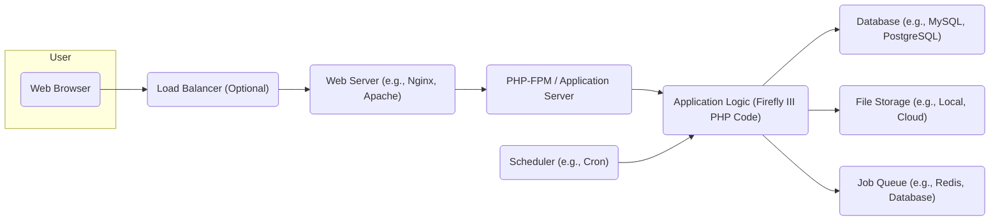
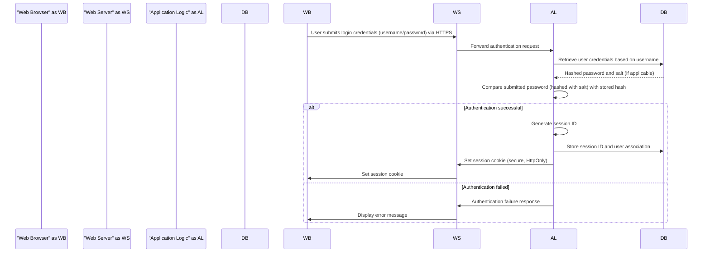
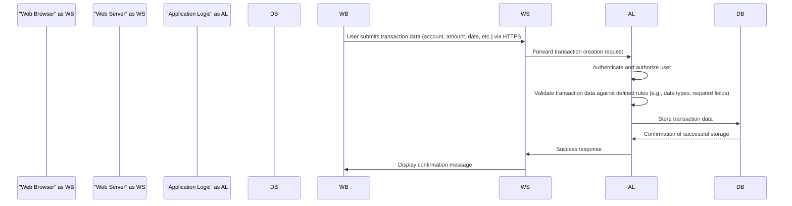
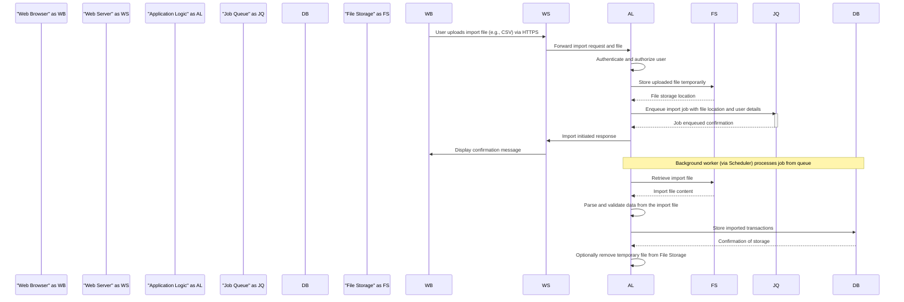

# Project Design Document: Firefly III - Personal Finance Manager

**Version:** 1.1
**Date:** October 26, 2023
**Author:** Gemini (AI Language Model)

## 1. Project Overview

Firefly III is a self-hosted, open-source personal finance manager designed to help individuals track their income, expenses, budgets, and financial goals. This document provides a detailed overview of the system's architecture, key components, and data flows, serving as a foundation for subsequent threat modeling activities. It aims to provide a comprehensive understanding of the system's inner workings to facilitate the identification of potential security vulnerabilities.

## 2. Goals and Objectives

*   Provide a clear and comprehensive overview of the Firefly III system architecture, including its various components and their interactions.
*   Identify and describe the key components of the system with a focus on their functionality and data handling.
*   Document the critical data flows within the system, highlighting data sources, destinations, and transformations.
*   Establish a solid and detailed foundation for effective threat modeling exercises, enabling the identification of potential security risks.
*   Serve as a valuable reference point for developers, security analysts, and system administrators seeking a deep understanding of the system's design and security considerations.

## 3. Target Audience

This document is primarily intended for:

*   Security engineers and analysts responsible for performing threat modeling and security assessments of Firefly III.
*   Software developers actively working on or contributing to the Firefly III project, requiring a detailed understanding of the system's architecture.
*   System administrators involved in deploying, configuring, and maintaining Firefly III instances.
*   Technical stakeholders seeking a comprehensive understanding of the Firefly III system architecture and its security implications.

## 4. System Architecture

### 4.1. High-Level Architecture

### 4.2. Detailed Component Architecture

The Firefly III system comprises the following key components, each with specific responsibilities:

*   **Web Browser:** The primary interface for users to interact with Firefly III, rendering the user interface and handling user input.
*   **Load Balancer (Optional):** Distributes incoming user traffic across multiple web server instances to enhance performance, scalability, and availability.
*   **Web Server:** Receives HTTP/HTTPS requests from users, serves static content (HTML, CSS, JavaScript), and forwards dynamic requests to the application server.
*   **PHP-FPM / Application Server:** Executes the PHP code that constitutes the core application logic of Firefly III. It manages PHP processes and handles requests from the web server.
*   **Application Logic (Firefly III PHP Code):** This is the heart of the application, responsible for:
    *   **Authentication and Authorization:** Managing user logins, sessions, and access control to different parts of the application and data.
    *   **Account Management:** Handling the creation, modification, and deletion of user accounts and financial accounts.
    *   **Transaction Processing:**  Recording, categorizing, and managing financial transactions (deposits, withdrawals, transfers). This includes data validation and business rule enforcement.
    *   **Budgeting and Forecasting:** Implementing the logic for creating and managing budgets, and generating financial forecasts based on historical data.
    *   **Reporting and Data Visualization:** Generating reports and charts to provide users with insights into their financial data.
    *   **API Endpoints:** Providing programmatic access to the application's functionality for integrations and external tools. This includes authentication and authorization for API requests.
    *   **Import and Export Functionality:** Handling the import of financial data from various sources (e.g., CSV files, bank integrations) and the export of data in different formats. This involves parsing, validating, and processing external data.
*   **Scheduler:** A system-level utility (like Cron on Linux) used to schedule and execute background tasks at specific intervals.
*   **Job Queue:** A mechanism for managing asynchronous tasks that don't need to be processed immediately. This can be implemented using message brokers like Redis or database queues. It helps in offloading long-running tasks from the main request processing flow.
*   **Database:** The persistent storage for all application data, including:
    *   User credentials (hashed passwords).
    *   Financial account details.
    *   Transaction records.
    *   Budget configurations.
    *   System settings and configurations.
*   **File Storage:** Used to store user-uploaded files, such as attachments to transactions or import configurations. This could be local storage on the server or a cloud-based object storage service.

## 5. Data Flow Diagrams

### 5.1. User Authentication Flow

### 5.2. Creating a New Transaction Flow

### 5.3. Importing Transactions from a File Flow

## 6. Key Components and their Responsibilities

*   **Web Browser:**
    *   Renders the user interface based on HTML, CSS, and JavaScript received from the server.
    *   Allows users to interact with the application through forms, buttons, and other UI elements.
    *   Sends user requests to the web server via HTTP/HTTPS.
    *   Manages cookies, including session cookies.
*   **Load Balancer:**
    *   Distributes incoming network traffic across multiple backend servers.
    *   Improves application availability by routing traffic away from failing servers.
    *   Can provide SSL/TLS termination, offloading encryption/decryption from web servers.
*   **Web Server:**
    *   Accepts incoming HTTP/HTTPS requests from clients.
    *   Serves static content (images, CSS, JavaScript files) directly.
    *   Forwards dynamic requests to the PHP-FPM/Application Server.
    *   Handles SSL/TLS encryption and decryption.
    *   May implement security features like rate limiting and request filtering.
*   **PHP-FPM / Application Server:**
    *   Executes the PHP code of the Firefly III application.
    *   Manages PHP processes efficiently.
    *   Provides an interface for the web server to interact with the PHP application.
*   **Application Logic (Firefly III PHP Code):**
    *   Implements the core business logic for managing personal finances.
    *   Handles user authentication and authorization.
    *   Interacts with the database to store and retrieve data.
    *   Processes user input and generates responses.
    *   Manages background tasks via the job queue.
    *   Provides API endpoints for external access.
*   **Scheduler:**
    *   Executes predefined tasks at scheduled intervals (e.g., running maintenance scripts, processing recurring transactions).
    *   Triggers background workers to process jobs from the job queue.
*   **Job Queue:**
    *   Provides a mechanism for asynchronous task processing.
    *   Decouples request handling from potentially long-running operations.
    *   Ensures that tasks are processed reliably, even if parts of the system are temporarily unavailable.
*   **Database:**
    *   Provides persistent storage for all application data.
    *   Ensures data integrity and consistency.
    *   Handles data retrieval and manipulation requests from the application logic.
*   **File Storage:**
    *   Stores files uploaded by users.
    *   Provides access to stored files for the application.
    *   Requires appropriate security measures to protect stored files.

## 7. Security Considerations (For Threat Modeling)

This section outlines potential security vulnerabilities and threats that should be thoroughly examined during threat modeling:

*   **Authentication and Authorization Vulnerabilities:**
    *   Brute-force attacks against login forms.
    *   Credential stuffing attacks.
    *   Weak or default password policies.
    *   Insecure storage of password hashes.
    *   Session fixation or hijacking vulnerabilities.
    *   Insufficient protection against cross-site request forgery (CSRF).
    *   Authorization bypass flaws allowing access to unauthorized data or functionality.
*   **Input Validation and Injection Attacks:**
    *   SQL injection vulnerabilities in database queries.
    *   Cross-site scripting (XSS) vulnerabilities allowing malicious scripts to be injected into web pages.
    *   Command injection vulnerabilities if the application executes external commands based on user input.
    *   LDAP injection vulnerabilities if the application interacts with LDAP directories.
    *   Improper handling of file uploads leading to path traversal or arbitrary file upload vulnerabilities.
*   **Data Protection and Privacy:**
    *   Lack of encryption for sensitive data at rest in the database or file storage.
    *   Insufficient encryption of data in transit (e.g., not enforcing HTTPS).
    *   Exposure of sensitive information in error messages or logs.
    *   Inadequate protection of personally identifiable information (PII).
    *   Vulnerabilities related to data export functionality potentially exposing sensitive data.
*   **Session Management Weaknesses:**
    *   Predictable session IDs.
    *   Session IDs not invalidated upon logout.
    *   Insecure storage of session data.
    *   Lack of proper session timeout mechanisms.
*   **Dependency Vulnerabilities:**
    *   Use of outdated or vulnerable third-party libraries and components.
    *   Lack of a robust dependency management process and regular security updates.
*   **API Security Issues:**
    *   Lack of proper authentication and authorization for API endpoints.
    *   Exposure of sensitive data through API responses.
    *   API rate limiting not implemented or insufficient, leading to potential abuse.
    *   Vulnerabilities to mass assignment or other API-specific attacks.
*   **File Handling Vulnerabilities:**
    *   Insecure storage locations for uploaded files.
    *   Lack of proper validation of uploaded file types and content.
    *   Vulnerabilities allowing access to or modification of other users' files.
*   **Error Handling and Logging:**
    *   Verbose error messages revealing sensitive information about the system.
    *   Insufficient logging for security auditing and incident response.
    *   Logs not securely stored or protected from unauthorized access.
*   **Deployment Security Misconfigurations:**
    *   Default or weak credentials for database or other services.
    *   Insecure server configurations.
    *   Open ports and services that are not required.
    *   Lack of proper access controls and firewall rules.

## 8. Deployment Considerations

Firefly III is primarily designed for self-hosting, offering users control over their data and infrastructure. Common deployment methods include:

*   **LAMP/LEMP Stack:** Traditional deployment on a Linux server using Apache or Nginx as the web server, MySQL or PostgreSQL as the database, and PHP for the application logic. Security considerations include hardening the web server, database server, and PHP configuration, as well as implementing proper firewall rules.
*   **Docker:** Deployment using Docker containers provides a more isolated and reproducible environment. Security considerations include securing the Docker host, using minimal and trusted base images, and properly managing container networking and volumes.
*   **Cloud Platforms (e.g., AWS, Azure, Google Cloud):** Deploying on cloud platforms offers scalability and managed services. Security considerations involve leveraging cloud-specific security features, such as security groups, IAM roles, and managed database services, while adhering to cloud security best practices.
*   **Security Considerations Specific to Deployment:**
    *   **HTTPS Configuration:** Ensuring HTTPS is properly configured with a valid SSL/TLS certificate is crucial for protecting data in transit.
    *   **Firewall Configuration:** Implementing a firewall to restrict access to necessary ports and services.
    *   **Regular Security Updates:** Keeping the operating system, web server, database, PHP, and other dependencies up-to-date with the latest security patches.
    *   **Access Control:** Implementing strong access controls to limit who can access the server and its resources.
    *   **Database Security:**  Securing the database by using strong passwords, limiting access, and potentially using encryption at rest.

## 9. Future Considerations

*   **Integration with Third-Party Financial Institutions via APIs (e.g., Plaid, Salt Edge):** This would introduce new security considerations related to API key management, OAuth 2.0 flows, and the security of third-party integrations.
*   **Implementation of Two-Factor Authentication (2FA):** Enhancing user account security by requiring a second factor of authentication.
*   **Mobile Application Development:** Introducing a mobile app would create new attack surfaces and require addressing mobile-specific security concerns.
*   **Enhanced Reporting and Data Analysis Features:**  Potentially involving more complex data processing and storage, requiring careful consideration of data security and privacy.
*   **Improved Import/Export Functionality with Support for More Formats:**  Increasing the attack surface related to file parsing and handling.

This improved design document provides a more detailed and comprehensive overview of the Firefly III system, specifically tailored to facilitate effective threat modeling activities. It highlights key components, data flows, and potential security considerations, offering a solid foundation for identifying and mitigating potential security risks.