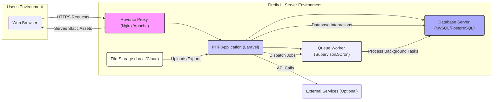
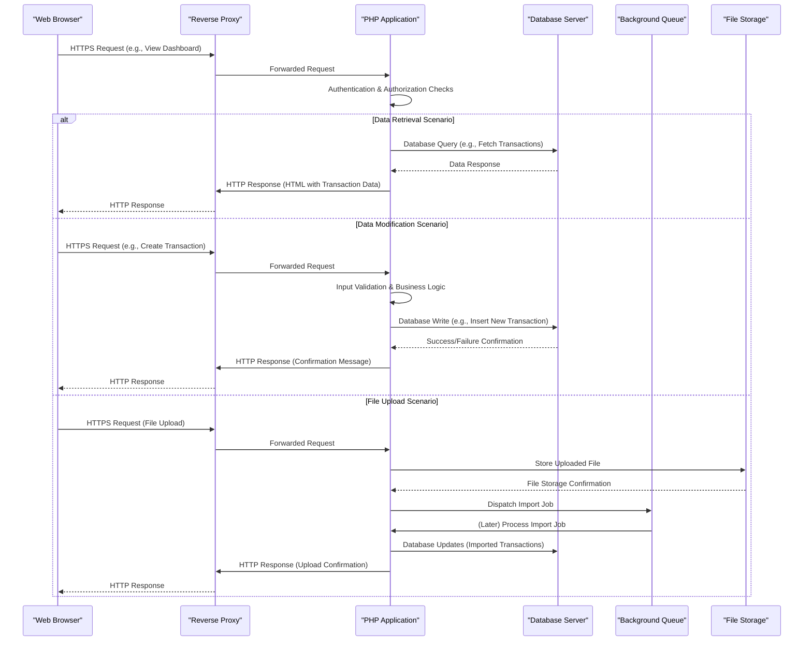

## Project Design Document: Firefly III - Personal Finance Manager (Improved)

**1. Introduction**

This document provides an enhanced architectural overview of Firefly III, a self-hosted personal finance manager. The primary goal is to offer a clear and comprehensive understanding of the system's components, their interactions, and data flows, specifically tailored for subsequent threat modeling activities. This revision aims to provide more granular detail and clarity compared to the previous version.

**2. Project Overview**

Firefly III is a web-based application meticulously designed to empower individuals in managing their financial lives. It facilitates the tracking of income, expenses, budgets, and financial goals. A core tenet of Firefly III is its commitment to data privacy and user control, achieved through its self-hosted nature, placing the responsibility for installation and maintenance directly with the user.

**3. Goals**

* Deliver a refined and more detailed overview of Firefly III's architecture.
* Clearly delineate the responsibilities of each major component within the system.
* Provide enhanced illustrations of data flow within the application, highlighting critical pathways.
* Accurately identify the key technologies and frameworks underpinning the application.
* Establish a robust and comprehensive foundation for future threat modeling exercises, enabling more effective security analysis.

**4. Target Audience**

This document is primarily intended for:

* Security engineers and architects tasked with conducting threat modeling and security assessments.
* Development team members requiring a thorough understanding of the system architecture for development and maintenance.
* Operations engineers responsible for the deployment, configuration, and ongoing maintenance of Firefly III instances.

**5. High-Level Architecture**

**6. Detailed Component Breakdown**

* **Web Browser:**
    * **Functionality:** Serves as the primary user interface, enabling interaction with Firefly III through a graphical representation of the application. Responsible for rendering HTML, applying CSS styles, and executing JavaScript code to provide dynamic functionality.
    * **Technology:** Standard web browsers such as Google Chrome, Mozilla Firefox, Safari, and Microsoft Edge.
    * **Key Interactions:** Initiates HTTPS requests to the Reverse Proxy to access application features and data. Receives HTML, CSS, JavaScript, and image resources in response.

* **Reverse Proxy (Nginx/Apache):**
    * **Functionality:** Acts as the entry point for all incoming web traffic. Performs crucial tasks such as SSL/TLS termination, load balancing (in clustered deployments), and serving static assets. Routes requests to the appropriate backend PHP application instance.
    * **Technology:**  Common web servers like Nginx or Apache HTTP Server.
    * **Key Interactions:** Receives incoming HTTPS requests from the Web Browser. Forwards requests to the PHP Application. Serves static files (CSS, JavaScript, images) directly.

* **PHP Application (Laravel):**
    * **Functionality:**  Represents the core application logic of Firefly III. Manages user authentication and authorization, processes user requests, enforces business rules, interacts with the database for data persistence, and provides API endpoints for external integrations.
    * **Technology:**  PHP programming language, leveraging the Laravel framework for its robust features and security mechanisms.
    * **Key Interactions:**
        * Receives processed requests from the Reverse Proxy.
        * Interacts with the Database Server to retrieve and store application data.
        * Dispatches asynchronous tasks to the Queue Worker for background processing.
        * Makes API calls to optional External Services for enhanced functionality.
        * Generates HTTP responses (HTML, JSON) to be sent back to the Reverse Proxy.
        * Interacts with the File Storage component for handling file uploads and exports.

* **Database Server (MySQL/PostgreSQL):**
    * **Functionality:** Provides persistent storage for all application data, including user accounts, financial transactions, categories, budgets, rules, and other configuration settings. Ensures data integrity and availability.
    * **Technology:**  Relational database management systems, typically MySQL or PostgreSQL.
    * **Key Interactions:** Receives and processes database queries (SELECT, INSERT, UPDATE, DELETE) originating from the PHP Application. Returns query results to the PHP Application.

* **Queue Worker (SupervisorD/Cron):**
    * **Functionality:** Executes asynchronous tasks that do not require immediate processing during a user's web request. This includes tasks like importing data from uploaded files, generating scheduled reports, running automated reconciliation processes, and sending notifications.
    * **Technology:**  Laravel's Queue system, often utilizing drivers like Redis or database queues. Process management tools like SupervisorD or cron jobs are used to ensure the queue worker is running reliably.
    * **Key Interactions:** Receives jobs dispatched by the PHP Application. Processes these jobs, potentially interacting with the Database Server and File Storage as needed.

* **File Storage (Local/Cloud):**
    * **Functionality:**  Provides storage for files uploaded by users (e.g., transaction CSV imports) and files generated by the application (e.g., export files). Can be local storage on the server or a cloud-based object storage service.
    * **Technology:**  Local filesystem or cloud storage services like AWS S3, Google Cloud Storage, or Azure Blob Storage.
    * **Key Interactions:** The PHP Application reads from and writes to this storage component for file handling operations.

* **External Services (Optional):**
    * **Functionality:** Represents optional integrations with external services to extend Firefly III's capabilities. Examples include currency conversion APIs, Plaid for bank account linking, or notification services like Pushover.
    * **Technology:** Varies depending on the specific external service being integrated. Typically involves RESTful APIs.
    * **Key Interactions:** The PHP Application makes API calls to these external services, sending requests and processing responses.

**7. Data Flow**

**8. Security Considerations (Detailed)**

This section expands upon the initial security considerations, providing more specific examples and categorizations.

* **Authentication and Authorization:**
    * **Mechanisms:**  Utilizes session-based authentication, potentially with options for multi-factor authentication. Role-based access control (RBAC) manages user permissions.
    * **Threats:** Brute-force attacks, credential stuffing, session hijacking, privilege escalation.
    * **Mitigations:** Strong password policies, rate limiting on login attempts, secure session management (HTTPOnly, Secure flags), regular security audits.

* **Session Management:**
    * **Implementation:** Laravel's built-in session management, typically using secure cookies.
    * **Threats:** Session fixation, session hijacking, cross-site scripting (XSS) leading to session theft.
    * **Mitigations:**  Using secure cookie attributes (HTTPOnly, Secure, SameSite), regularly regenerating session IDs, protecting against XSS vulnerabilities.

* **Input Validation and Output Encoding:**
    * **Practices:**  Server-side validation of all user inputs to prevent injection attacks. Output encoding to neutralize potentially malicious content before rendering in the browser.
    * **Threats:** SQL injection, cross-site scripting (XSS), command injection.
    * **Mitigations:**  Using parameterized queries or ORM features for database interactions, encoding output based on context, employing a Content Security Policy (CSP).

* **Data Protection at Rest:**
    * **Storage:** Sensitive data in the database (e.g., potentially notes or encrypted fields) should be encrypted.
    * **Threats:** Unauthorized access to the database, data breaches.
    * **Mitigations:**  Database encryption (at rest), strong database access controls, regular security audits of database configurations.

* **Data Protection in Transit:**
    * **Implementation:** Enforcing HTTPS for all communication between the browser and the server.
    * **Threats:** Man-in-the-middle (MITM) attacks, eavesdropping.
    * **Mitigations:**  Proper SSL/TLS certificate configuration, enforcing HTTPS through redirects or HSTS headers.

* **Dependency Management:**
    * **Process:** Regularly updating dependencies (PHP libraries, Laravel framework) to patch known vulnerabilities.
    * **Threats:** Exploiting vulnerabilities in outdated dependencies.
    * **Mitigations:**  Using dependency management tools (Composer), regularly reviewing and updating dependencies, vulnerability scanning.

* **Self-Hosting Security:**
    * **Responsibilities:** The user is responsible for the security of the underlying infrastructure (OS, network, physical security).
    * **Threats:** Vulnerabilities in the hosting environment, unauthorized access to the server.
    * **Mitigations:**  Following security best practices for server hardening, using firewalls, keeping the operating system and other server software up-to-date.

* **Background Job Security:**
    * **Considerations:** Ensuring background jobs are processed securely and do not introduce vulnerabilities (e.g., through insecure file handling).
    * **Threats:**  Unauthorized execution of background jobs, data breaches through insecure job processing.
    * **Mitigations:**  Securely configuring the queue worker, validating data processed by jobs, implementing proper error handling.

* **External Service Integrations:**
    * **Concerns:** Securely managing API keys and tokens for external services and understanding the security posture of those services.
    * **Threats:**  Exposure of API keys, vulnerabilities in external services.
    * **Mitigations:**  Storing API keys securely (e.g., using environment variables or a secrets management system), following the security recommendations of external service providers.

* **File Handling Security:**
    * **Practices:**  Properly validating file uploads, sanitizing filenames, storing uploaded files in a secure location with appropriate permissions, and preventing path traversal vulnerabilities.
    * **Threats:**  Malicious file uploads, remote code execution, information disclosure.
    * **Mitigations:**  Using robust file upload handling libraries, scanning uploaded files for malware (if feasible), restricting file types.

**9. Deployment Model**

Firefly III's self-hosted nature allows for flexible deployment options:

* **Direct Installation (LAMP/LEMP Stack):** Installing PHP, a web server (Apache or Nginx), and a database (MySQL or PostgreSQL) directly on a server (physical or virtual). This provides maximum control but requires more manual configuration and maintenance.
* **Containerization (Docker):** Utilizing Docker containers to package the application and its dependencies. Docker Compose is commonly used to orchestrate the web server, PHP application, and database containers, simplifying deployment and ensuring consistency across environments. This is a popular and recommended approach.
* **Platform as a Service (PaaS):** Deploying to PaaS providers that offer managed PHP environments and database services (e.g., Heroku, DigitalOcean App Platform). This reduces the operational burden but might introduce vendor lock-in and require adjustments to the application configuration.
* **Serverless (Less Common):** While less conventional, deploying components of Firefly III in a serverless manner (e.g., using AWS Lambda for certain background tasks) could be explored for specific use cases, but the core application is typically deployed on a persistent server.

**10. Assumptions and Constraints**

* Users are assumed to possess a reasonable level of technical proficiency to install, configure, and maintain the application and its underlying infrastructure.
* The security of the self-hosted environment is explicitly the responsibility of the user deploying and managing the instance.
* This document primarily focuses on the core application components and common deployment scenarios. Specific configurations, optional features, and community-developed extensions may introduce additional complexities not explicitly covered here.
* It is assumed that users will adhere to best practices for securing their server environments.

**11. Future Considerations**

* **Enhanced API Design and Documentation:**  Developing a more comprehensive and well-documented API for potential integrations with other applications and services.
* **Scalability and Performance Optimization:**  Exploring strategies for scaling the application horizontally to handle a growing number of users and data, including caching mechanisms and database optimizations.
* **Advanced Monitoring and Logging:** Implementing more sophisticated monitoring and logging solutions for proactive security monitoring, performance analysis, and troubleshooting. This includes centralized log management and alerting.
* **Automated Backup and Recovery Procedures:**  Developing and documenting robust procedures for automating backups of application data and configuration, as well as disaster recovery plans.
* **Improved Security Auditing Tools and Processes:**  Integrating tools and processes for regular security audits, vulnerability scanning, and penetration testing.
* **Support for More Authentication Methods:**  Exploring options for integrating additional authentication methods, such as OAuth 2.0 providers.
