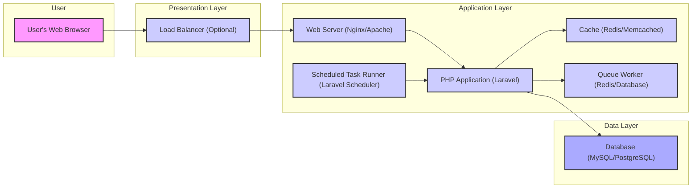
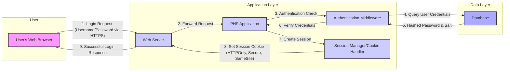
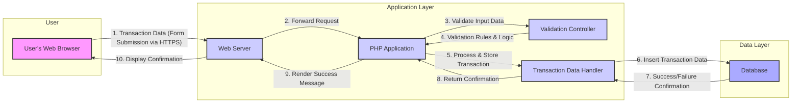

## Project Design Document: Firefly III - Personal Finance Manager

**Version:** 1.1
**Date:** October 26, 2023
**Author:** AI Software Architect

### 1. Project Overview

Firefly III is a self-hosted web application designed for personal finance management. It empowers users to track income, expenses, budgets, and financial goals through a comprehensive and user-friendly interface. This document details the architectural design of Firefly III to facilitate thorough threat modeling and security analysis.

### 2. Goals and Objectives

*   Provide a refined and more detailed architectural blueprint of Firefly III.
*   Clearly delineate the responsibilities and interactions of each component.
*   Illustrate key data flows with enhanced clarity.
*   Emphasize security-critical aspects and potential vulnerabilities within the design.
*   Serve as an improved foundation for subsequent threat modeling and security assessments.

### 3. Target Audience

This document is intended for:

*   Security engineers and architects performing threat modeling and security audits.
*   Software developers contributing to the Firefly III project.
*   DevOps and operations teams responsible for the deployment and maintenance of Firefly III instances.

### 4. High-Level Architecture

Firefly III employs a layered architecture, separating concerns for improved maintainability and scalability:

*   **Presentation Layer:**  Handles user interaction and display, primarily through a web browser.
*   **Application Layer:** Contains the core business logic, data processing, and application workflows. This is primarily implemented using the Laravel PHP framework.
*   **Data Layer:** Manages persistent data storage and retrieval, typically using a relational database.

### 5. Component Details

*   **User's Web Browser:** The client-side interface where users interact with Firefly III. It renders HTML, CSS, and executes JavaScript to provide a dynamic user experience.
*   **Load Balancer (Optional):** Distributes incoming user requests across multiple web server instances. This enhances availability and scalability by preventing overload on a single server.
*   **Web Server (Nginx/Apache):**  Acts as the entry point for user requests. It handles static content serving and reverse proxies requests to the PHP application server. It also manages SSL/TLS termination for secure communication.
*   **PHP Application (Laravel):** The core of Firefly III, responsible for:
    *   **Routing:** Directing incoming requests to the appropriate controllers.
    *   **Controllers:** Handling user input, orchestrating business logic, and returning responses.
    *   **Models (Eloquent ORM):** Representing data structures and providing an interface for database interaction.
    *   **Views (Blade Templates):** Generating HTML to be rendered by the user's browser.
    *   **Middleware:** Filtering HTTP requests for tasks like authentication, authorization, and request modification.
    *   **Services:** Encapsulating reusable business logic and functionalities.
    *   **Repositories:** Abstracting data access logic, providing a clean interface for interacting with the database.
    *   **Event Listeners:** Handling asynchronous tasks triggered by specific application events.
*   **Cache (Redis/Memcached):** An in-memory data store used to cache frequently accessed data (e.g., database query results, configuration settings, session data). This significantly improves application performance by reducing database load.
*   **Queue Worker (Redis/Database):** Processes asynchronous tasks that do not require immediate user feedback. Examples include sending emails, generating reports, and processing large data imports. This improves responsiveness for user-facing operations.
*   **Scheduled Task Runner (Laravel Scheduler):** Executes predefined tasks at specific intervals using cron jobs or a similar mechanism. Examples include recurring transaction processing, data cleanup, and sending scheduled notifications.
*   **Database (MySQL/PostgreSQL):** The persistent storage for all application data, including:
    *   User accounts and authentication credentials.
    *   Financial transactions (income, expenses, transfers).
    *   Account details (names, currencies, types).
    *   Budget configurations and spending rules.
    *   Category and tag information.
    *   System settings and preferences.

### 6. Data Flow Diagrams

#### 6.1. User Login Process

#### 6.2. Recording a New Transaction

### 7. Security Considerations

*   **Authentication:**
    *   Utilizes session-based authentication with secure cookies (HTTPOnly, Secure, SameSite).
    *   Supports API tokens for programmatic access.
    *   Consideration for Two-Factor Authentication (2FA) implementation.
*   **Authorization:**
    *   Role-Based Access Control (RBAC) to manage user permissions.
    *   Policy enforcement to restrict access to specific resources and functionalities.
*   **Data Protection:**
    *   Sensitive data (passwords) are securely hashed and salted before storage.
    *   HTTPS is essential for encrypting data in transit.
    *   Consideration for data at rest encryption for the database and backups.
*   **Input Validation:**
    *   Server-side validation is crucial to prevent injection attacks (SQL Injection, Cross-Site Scripting).
    *   Sanitization of user inputs to remove potentially harmful characters.
    *   Specific validation rules for different data types and fields.
*   **Cross-Site Scripting (XSS) Prevention:**
    *   Output encoding and escaping of user-generated content before rendering in views.
    *   Content Security Policy (CSP) implementation to restrict the sources of content the browser is allowed to load.
*   **Cross-Site Request Forgery (CSRF) Prevention:**
    *   Use of anti-CSRF tokens in forms to prevent unauthorized actions.
    *   Proper handling of state-changing requests.
*   **Session Management:**
    *   Securely generated session IDs.
    *   Session timeout mechanisms.
    *   Protection against session fixation and hijacking.
*   **Password Management:**
    *   Enforcement of strong password policies.
    *   Secure password reset mechanisms.
    *   Guidance for users on creating strong passwords.
*   **Dependency Management:**
    *   Regularly updating dependencies to patch known security vulnerabilities.
    *   Using dependency scanning tools to identify potential risks.
*   **Error Handling:**
    *   Preventing the exposure of sensitive information in error messages and logs.
    *   Generic error messages for security-sensitive operations.
*   **Rate Limiting:**
    *   Implementing rate limits on login attempts and other sensitive endpoints to prevent brute-force attacks.
*   **Secure File Uploads:**
    *   If file uploads are supported, rigorous validation of file types and sizes.
    *   Storing uploaded files outside the web root and serving them through a controlled mechanism.
    *   Scanning uploaded files for malware.
*   **Regular Security Audits:**
    *   Periodic security assessments and penetration testing to identify and address potential vulnerabilities.

### 8. Deployment Architecture

Firefly III is designed for self-hosting, offering flexibility in deployment options:

*   **Single Server Deployment:** All components (web server, application, database) are installed on a single server. This is suitable for smaller deployments or personal use.
*   **Containerized Deployment (Docker):** Components are packaged into Docker containers for easier deployment, management, and scalability. Orchestration tools like Docker Compose or Kubernetes can be used to manage multiple containers.
*   **Cloud Deployment:** Deploying on cloud platforms (e.g., AWS, Azure, Google Cloud) leveraging managed services for databases, load balancing, and other infrastructure components. This offers scalability and resilience.
    *   Example services: AWS EC2, AWS RDS, Azure App Service, Azure Database for PostgreSQL, Google Compute Engine, Google Cloud SQL.
*   **Platform as a Service (PaaS):** Utilizing platforms like Heroku or similar services to simplify deployment and management.

The chosen deployment architecture significantly impacts security considerations, particularly regarding network security, access control, and the security of underlying infrastructure.

### 9. Technology Stack

*   **Programming Language:** PHP
*   **Framework:** Laravel (PHP Framework)
*   **Web Server:** Nginx or Apache
*   **Database:** MySQL or PostgreSQL
*   **Caching:** Redis or Memcached
*   **Queueing:** Redis or Database Queues (Laravel built-in)
*   **Frontend Technologies:** HTML, CSS, JavaScript (likely utilizing a framework like Vue.js or similar for dynamic elements)

### 10. Future Considerations

*   **Enhanced Two-Factor Authentication (2FA):** Implementing support for more 2FA methods (e.g., TOTP, WebAuthn).
*   **Improved API Security:** Implementing stricter authentication and authorization mechanisms for the API.
*   **More Granular Permissions:** Expanding the RBAC system for finer-grained control over user actions.
*   **Integration with External Services:** Securely integrating with other financial services or APIs.
*   **Enhanced Logging and Monitoring:** Implementing comprehensive logging and monitoring for security auditing and incident response.

This revised document provides a more detailed and refined architectural overview of Firefly III, emphasizing security considerations and providing a stronger foundation for subsequent threat modeling activities.