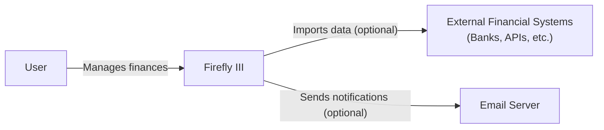
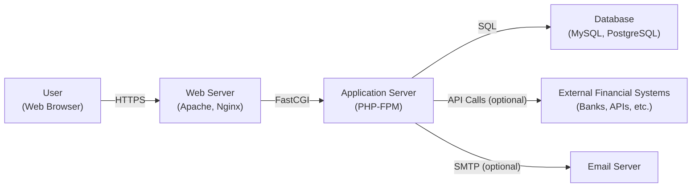
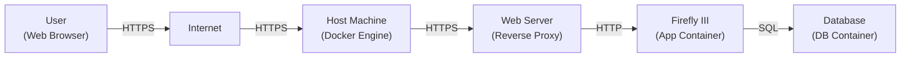
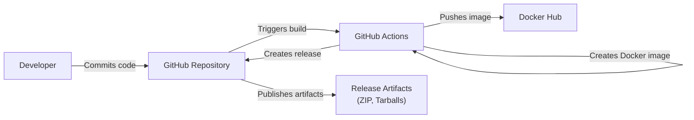

Okay, let's create a design document for the Firefly III project, focusing on aspects relevant to threat modeling.

# BUSINESS POSTURE

Firefly III is a self-hosted personal finance manager.  The primary business goal is to provide users with a reliable, private, and secure way to track their finances.  It aims to be a free and open-source alternative to commercial, cloud-based personal finance applications.  Success is measured by user adoption, community contributions, and the overall stability and security of the application.  Given its self-hosted nature, the target user base likely has a higher-than-average technical proficiency and a strong desire for data privacy.

Business Priorities:

*   Data Privacy:  Users are entrusting the application with sensitive financial data.  Maintaining the confidentiality of this data is paramount.
*   Data Integrity:  Ensuring the accuracy and consistency of financial data is critical.  Users need to trust that the application is correctly recording and calculating their finances.
*   Availability:  While self-hosted, users expect the application to be available when they need it.  Downtime or data loss can be highly disruptive.
*   Usability: The application should be user-friendly and intuitive, even for users with limited financial expertise.
*   Extensibility: The ability to import data from various sources and potentially integrate with other financial tools is a key feature.

Business Risks:

*   Data Breach: Unauthorized access to user financial data could lead to identity theft, financial loss, and reputational damage to the project.
*   Data Corruption/Loss:  Bugs, hardware failures, or user error could lead to the loss or corruption of financial data, causing significant inconvenience and potential financial harm to users.
*   Malicious User Input:  Exploiting vulnerabilities in the application through malicious input could compromise the entire system.
*   Compromised Dependencies:  Vulnerabilities in third-party libraries or dependencies could be exploited to attack the application.
*   Lack of User Awareness: Users may not follow best practices for securing their self-hosted instance, leaving it vulnerable to attack.

# SECURITY POSTURE

Existing Security Controls (based on the GitHub repository and common practices):

*   security control: Authentication: User authentication via username/password, with support for two-factor authentication (2FA) using TOTP (Time-Based One-Time Password). Implemented in application logic and described in documentation.
*   security control: Authorization: Role-based access control (RBAC) to manage user permissions. Implemented in application logic.
*   security control: Input Validation: Validation of user-supplied data to prevent common web vulnerabilities like cross-site scripting (XSS) and SQL injection. Implemented in application logic, particularly in form handling and data processing.
*   security control: Encryption at Rest: Encouragement (but not enforcement) for users to encrypt their database and server storage. Described in documentation.
*   security control: Encryption in Transit: Encouragement (but not enforcement) for users to use HTTPS to secure communication between the client and server. Described in documentation.
*   security control: Regular Updates: The project maintainers release regular updates to address bugs and security vulnerabilities. Described in release notes and documentation.
*   security control: Dependency Management: Use of Composer for managing PHP dependencies.  This allows for easier tracking and updating of libraries. Described in `composer.json` and `composer.lock` files.
*   security control: Security Headers: Some security-related HTTP headers are set, such as Content Security Policy (CSP) and X-Frame-Options. Implemented in web server configuration and application middleware.
*   security control: Docker Image: Provision of a Docker image simplifies deployment and helps ensure a consistent environment. Described in `Dockerfile` and documentation.

Accepted Risks:

*   accepted risk: Self-Hosted Responsibility: The project explicitly places the responsibility for securing the hosting environment on the user. This includes server security, network configuration, and operating system updates.
*   accepted risk: Limited Security Audits: While the project likely benefits from community scrutiny, there's no indication of regular, formal security audits.
*   accepted risk: Potential for User Misconfiguration: Users may misconfigure their instance, leaving it vulnerable to attack.

Recommended Security Controls:

*   Implement automatic security updates or notifications within the application.
*   Provide more detailed security hardening guides for various deployment scenarios.
*   Consider integrating with security scanning tools (e.g., OWASP ZAP) for automated vulnerability testing.
*   Implement rate limiting to mitigate brute-force attacks and denial-of-service attempts.
*   Provide options for more granular audit logging of user actions.

Security Requirements:

*   Authentication:
    *   Strong password policies (minimum length, complexity requirements).
    *   Account lockout after multiple failed login attempts.
    *   Secure password reset mechanism.
    *   Mandatory 2FA option.

*   Authorization:
    *   Fine-grained access control to different features and data.
    *   Principle of least privilege: Users should only have access to the data and functionality they need.

*   Input Validation:
    *   Strict validation of all user-supplied data, including data imported from external sources.
    *   Output encoding to prevent XSS vulnerabilities.
    *   Parameterized queries or ORM usage to prevent SQL injection.

*   Cryptography:
    *   Use of strong, industry-standard cryptographic algorithms for password hashing (e.g., Argon2, bcrypt).
    *   Secure generation and storage of encryption keys.
    *   If storing sensitive data at rest, use strong encryption (e.g., AES-256).

# DESIGN

## C4 CONTEXT

Element Descriptions:

*   Element:
    *   Name: User
    *   Type: Person
    *   Description: The individual using Firefly III to manage their personal finances.
    *   Responsibilities: Interacting with the application, inputting data, configuring settings, viewing reports.
    *   Security controls: Strong passwords, 2FA (if enabled).

*   Element:
    *   Name: Firefly III
    *   Type: Software System
    *   Description: The self-hosted personal finance manager.
    *   Responsibilities: Storing and processing financial data, providing a user interface, handling user authentication and authorization, importing data (optional), sending notifications (optional).
    *   Security controls: Authentication, authorization, input validation, security headers, dependency management.

*   Element:
    *   Name: External Financial Systems
    *   Type: Software System
    *   Description: External systems like banks, financial APIs, or other data sources that Firefly III can import data from.
    *   Responsibilities: Providing financial data to Firefly III (via user-initiated import).
    *   Security controls: Dependent on the specific external system (e.g., OAuth, API keys).

*   Element:
    *   Name: Email Server
    *   Type: Software System
    *   Description: An external email server used by Firefly III to send notifications (e.g., password reset emails).
    *   Responsibilities: Sending emails on behalf of Firefly III.
    *   Security controls: Secure SMTP configuration, TLS encryption.

## C4 CONTAINER

Element Descriptions:

*   Element:
    *   Name: User
    *   Type: Person
    *   Description: The individual using Firefly III via a web browser.
    *   Responsibilities: Interacting with the application's web interface.
    *   Security controls: Strong passwords, 2FA (if enabled), secure browser configuration.

*   Element:
    *   Name: Web Server
    *   Type: Container (Software)
    *   Description: The web server (e.g., Apache, Nginx) that serves the Firefly III application.
    *   Responsibilities: Handling incoming HTTP requests, serving static assets, forwarding requests to the application server.
    *   Security controls: HTTPS configuration, security headers, web server hardening.

*   Element:
    *   Name: AppServer
    *   Type: Container (Software)
    *   Description: The application server (PHP-FPM) that executes the Firefly III PHP code.
    *   Responsibilities: Processing application logic, interacting with the database, handling user authentication and authorization.
    *   Security controls: Input validation, secure coding practices, dependency management.

*   Element:
    *   Name: Database
    *   Type: Container (Software)
    *   Description: The database (e.g., MySQL, PostgreSQL) that stores Firefly III's data.
    *   Responsibilities: Storing and retrieving financial data, user accounts, and other application data.
    *   Security controls: Database user permissions, encryption at rest (user-configured), secure network configuration.

*   Element:
    *   Name: External Financial Systems
    *   Type: Software System
    *   Description: External systems for data import.
    *   Responsibilities: Providing data to Firefly III.
    *   Security controls: Dependent on the external system.

*   Element:
    *   Name: Email Server
    *   Type: Software System
    *   Description: External email server for notifications.
    *   Responsibilities: Sending emails.
    *   Security controls: Secure SMTP configuration.

## DEPLOYMENT

Possible Deployment Solutions:

1.  Bare Metal/Virtual Machine:  Installing Firefly III directly on a physical or virtual server.
2.  Docker:  Using the official Firefly III Docker image.
3.  Cloud Hosting (e.g., AWS, Azure, GCP):  Deploying Firefly III on a cloud-based virtual machine or container service.

Chosen Solution (for detailed description): Docker

Element Descriptions:

*  Element:
    *   Name: User
    *   Type: Person
    *   Description: The user accessing Firefly III via a web browser.
    *   Responsibilities: Interacting with the application.
    *   Security controls: Strong passwords, 2FA, secure browser.

*  Element:
    *   Name: Internet
    *   Type: Infrastructure
    *   Description: The public internet.
    *   Responsibilities: Routing traffic between the user and the host machine.
    *   Security controls: N/A (relies on user and host security).

*  Element:
    *   Name: Host Machine
    *   Type: Infrastructure
    *   Description: The physical or virtual machine running Docker Engine.
    *   Responsibilities: Hosting the Docker containers.
    *   Security controls: Operating system hardening, firewall, regular updates.

*   Element:
    *   Name: Web Server
    *   Type: Container
    *   Description: A reverse proxy container (e.g., Nginx, Traefik) for SSL termination and routing.
    *   Responsibilities: Handling HTTPS, forwarding requests to the Firefly III container.
    *   Security controls: HTTPS configuration, certificate management, security headers.

*   Element:
    *   Name: App Container
    *   Type: Container
    *   Description: The Docker container running the Firefly III application.
    *   Responsibilities: Running the application logic.
    *   Security controls: Application-level security controls (see previous sections).

*   Element:
    *   Name: DB Container
    *   Type: Container
    *   Description: The Docker container running the database.
    *   Responsibilities: Storing application data.
    *   Security controls: Database user permissions, data encryption (user-configured).

## BUILD

Firefly III uses a combination of manual and automated build processes.

Build Process Description:

1.  Developers commit code changes to the GitHub repository.
2.  GitHub Actions workflows are triggered by commits, pull requests, or scheduled events.
3.  The workflows perform various tasks:
    *   Linting: Code style checks using tools like PHP_CodeSniffer.
    *   Static Analysis:  Basic static analysis using tools like PHPStan.
    *   Testing: Running unit and integration tests.
    *   Building the application:  Preparing the application files for deployment.
    *   Creating a Docker image: Building a Docker image containing the application and its dependencies.
    *   Pushing the Docker image:  Pushing the built image to Docker Hub.
    *   Creating release artifacts:  Creating ZIP and tarball archives of the application code.
4.  Release artifacts are published on GitHub.

Security Controls in Build Process:

*   security control: Code Review: Pull requests are used for code review before merging changes.
*   security control: Linting:  Enforces code style and helps identify potential issues.
*   security control: Static Analysis:  Detects potential bugs and security vulnerabilities.
*   security control: Automated Testing:  Helps ensure code quality and prevent regressions.
*   security control: Dependency Management: Composer manages dependencies, allowing for easier updates and vulnerability tracking.
*   security control: Docker Image: Provides a consistent and reproducible build environment.

# RISK ASSESSMENT

Critical Business Processes:

*   Financial Data Management:  The core process of tracking, managing, and reporting on user financial data.
*   User Account Management:  Creating, managing, and securing user accounts.
*   Data Import:  Importing financial data from external sources.

Data Sensitivity:

*   Financial Transactions: Highly sensitive. Includes details about income, expenses, account balances, and potentially investment information.
*   Account Information:  Sensitive. Includes account names, numbers (potentially masked), and associated financial institutions.
*   User Credentials:  Highly sensitive.  Includes usernames, hashed passwords, and 2FA secrets.
*   Personal Information:  Potentially sensitive.  May include user names, email addresses, and other profile information.

# QUESTIONS & ASSUMPTIONS

Questions:

*   Are there any specific compliance requirements (e.g., GDPR, CCPA) that need to be considered?
*   What is the expected user base size and growth rate? This can impact scalability and performance requirements.
*   What are the specific threat models or attack scenarios that the development team is most concerned about?
*   Are there any plans for integrating with specific financial institutions or APIs?
*   What level of support is provided to users for security-related issues?

Assumptions:

*   BUSINESS POSTURE: Users are aware of the inherent risks of self-hosting and are responsible for securing their own infrastructure.
*   SECURITY POSTURE: The project relies heavily on community contributions and user feedback for identifying and addressing security vulnerabilities.
*   DESIGN: The Docker-based deployment is the recommended and most commonly used deployment method. The application is primarily accessed via a web browser over HTTPS.