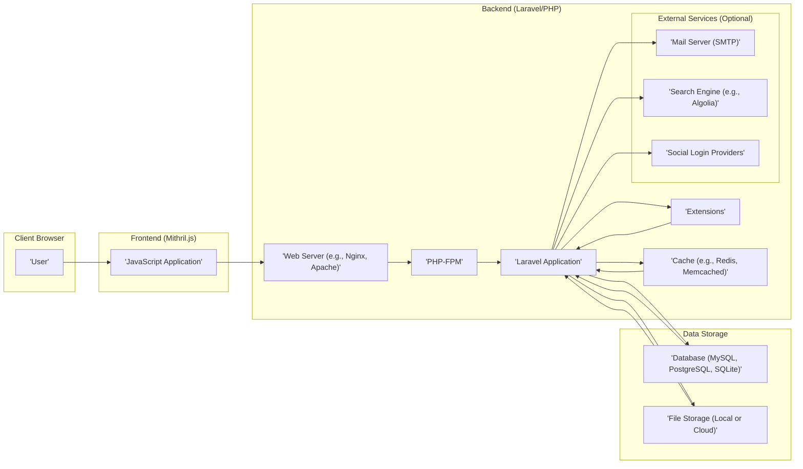

# Project Design Document: Flarum Forum Software

**Version:** 1.1
**Date:** October 26, 2023
**Prepared By:** Gemini (AI Language Model)

## 1. Introduction

This document provides a detailed architectural design of the Flarum forum software, an open-source forum platform. This document is intended to serve as a foundation for subsequent threat modeling activities. It outlines the key components, their interactions, data flow, and technologies involved in Flarum.

### 1.1. Purpose

The primary purpose of this document is to provide a comprehensive understanding of Flarum's architecture to facilitate effective threat modeling. It aims to identify potential vulnerabilities and security risks associated with the system's design and implementation.

### 1.2. Scope

This document covers the core architectural components of Flarum, including the frontend, backend, database, and the extension ecosystem. It focuses on the logical and physical structure of the system and the interactions between its parts, with a particular emphasis on aspects relevant to security.

### 1.3. Target Audience

This document is intended for:

* Security engineers and analysts involved in threat modeling, penetration testing, and security assessments.
* Developers working on the Flarum core, developing extensions, or integrating with Flarum.
* System administrators responsible for deploying, configuring, and maintaining Flarum instances in production environments.

## 2. System Overview

Flarum is a lightweight, extensible forum platform built with PHP and the Laravel framework on the backend, and Mithril.js on the frontend. It emphasizes simplicity, speed, and a modern user experience. The extension system is a core aspect, allowing for significant customization and feature expansion.

### 2.1. Key Features

* **Discussions:**  The central feature, allowing users to create and participate in threaded conversations. Features include posting, replying, editing, and deleting posts.
* **User Management:** Comprehensive features for user registration (including email verification and social login options via extensions), login, profile management (avatars, biographical information), and administrative user management (roles, permissions).
* **Tags:** A hierarchical tagging system for organizing discussions into categories and subcategories, providing a flexible way to structure forum content.
* **Notifications:** Real-time notifications (often implemented via extensions using technologies like WebSockets) to inform users of relevant activity, such as new replies or mentions.
* **Search:**  Functionality to search through forum content, typically implemented using database queries or dedicated search engines (via extensions).
* **Extensions:** A modular architecture allowing developers to add new features, modify existing behavior, and integrate with external services. Extensions can modify both frontend and backend functionality.
* **Permissions:** A granular role-based permission system that controls user access to various features and content, managed through the administrative interface.

## 3. Architectural Design

Flarum follows a layered web application architecture, clearly separating concerns between the presentation layer (frontend), the application logic layer (backend), and the data persistence layer.

### 3.1. Component Diagram

### 3.2. Component Descriptions

* **User:** The end-user interacting with the forum through a web browser, accessing the frontend application.
* **Frontend (Mithril.js):**
    * A single-page application (SPA) built with the Mithril.js JavaScript framework.
    * Responsible for rendering the user interface components, handling user interactions (clicks, form submissions, etc.), and managing the application state on the client-side.
    * Communicates with the backend API via asynchronous HTTP requests (primarily JSON).
    * Implements client-side routing and navigation, providing a smooth user experience without full page reloads.
    * Handles the display of data received from the backend and updates the UI in response to user actions and backend events.
* **Backend (Laravel/PHP):**
    * **Web Server (e.g., Nginx, Apache):**  The entry point for all HTTP requests. Responsible for serving static assets and proxying requests to the PHP-FPM process. Configuration plays a crucial role in security (e.g., HTTPS enforcement, header security).
    * **PHP-FPM:**  A FastCGI Process Manager that executes PHP scripts. It manages PHP processes and handles the execution of the Laravel application.
    * **Laravel Application:** The core PHP application built on the Laravel framework. Key responsibilities include:
        * **Routing:** Mapping incoming HTTP requests to specific controller actions based on defined routes.
        * **Controllers:** Handling application logic, receiving requests from the frontend, interacting with models and services, and returning responses.
        * **Models:** Representing database tables and providing an interface for interacting with the database using Eloquent ORM.
        * **Authentication and Authorization:** Managing user sessions, verifying user credentials, and enforcing permissions using middleware and policies.
        * **API Endpoints:** Providing a RESTful JSON API for the frontend to consume, adhering to API design principles.
        * **Event System:**  A mechanism for publishing and subscribing to events within the application, allowing for decoupled functionality and extension integration.
        * **Service Providers:**  Central points for bootstrapping application components and registering services.
    * **Extensions:**  Modular packages that extend Flarum's core functionality. They can:
        * Add new features and modify existing ones by hooking into the event system or overriding core components.
        * Introduce new database tables or modify existing schema through migrations.
        * Provide custom frontend components and modify the user interface.
        * Implement custom API endpoints and backend logic.
        * Introduce new middleware, console commands, and other application components.
    * **Cache (e.g., Redis, Memcached):** An optional component used to store frequently accessed data (e.g., database query results, rendered views) in memory to improve application performance and reduce database load.
    * **External Services (Optional):**
        * **Mail Server (SMTP):** Used for sending emails, such as password reset emails, notifications, and forum digests.
        * **Search Engine (e.g., Algolia):**  Can be integrated via extensions to provide more advanced and efficient search functionality.
        * **Social Login Providers:**  Allow users to register and log in using their accounts from platforms like Google, Facebook, etc., typically implemented through extensions using OAuth.
* **Data Storage:**
    * **Database (MySQL, PostgreSQL, SQLite):** Stores persistent application data, including:
        * User accounts and profiles.
        * Discussions, posts, and their relationships.
        * Tags and their associations with discussions.
        * Forum settings and configurations.
        * Extension-specific data.
    * **File Storage (Local or Cloud):** Stores uploaded files, such as user avatars, attachments in posts, and potentially other media. Can be configured to use local storage or cloud-based services like Amazon S3.

## 4. Data Flow

The following describes a more detailed data flow for a user creating a new discussion with an attached file:

1. **User Action:** The user interacts with the frontend in their web browser, filling out a form to create a new discussion, including a title, content, and selecting a file to attach.
2. **Frontend Request (Multipart Form):** The frontend JavaScript application sends an asynchronous HTTP request (typically a POST request) to a specific API endpoint on the backend (e.g., `/api/discussions`). This request uses the `multipart/form-data` content type to include both the textual data and the file.
3. **Backend Routing:** The web server receives the request and, based on the URL and HTTP method, routes it to the appropriate Laravel controller action defined for creating discussions.
4. **Authentication and Authorization:** The backend first authenticates the user (verifying their session or API token). Then, it authorizes the user, checking if they have the necessary permissions to create discussions (e.g., based on user roles or forum settings).
5. **CSRF Protection:** Laravel's CSRF protection middleware verifies the presence of a valid CSRF token in the request headers or body to prevent cross-site request forgery attacks.
6. **Input Validation:** The backend validates the incoming data, including the discussion title, content, and the uploaded file. File validation might include checking the file type, size, and potentially scanning for malware.
7. **File Storage:** The uploaded file is processed and stored in the configured file storage location (either locally on the server's filesystem or in a cloud storage service). The backend generates a unique identifier or path for the stored file.
8. **Data Processing:** The controller processes the validated data. It creates new database records for the discussion, the initial post, and the file attachment, linking them together.
9. **Database Interaction:** The Laravel application interacts with the configured database (MySQL, PostgreSQL, or SQLite) using Eloquent ORM to insert the new records.
10. **Cache Invalidation/Update (Optional):** If caching is enabled, the backend may invalidate relevant cached data related to the forum's discussion list or update the cache with information about the new discussion.
11. **Event Dispatch:** The backend dispatches relevant events, such as `DiscussionWasCreated` and `PostWasCreated`, allowing other parts of the application and extensions to react to this action.
12. **Extension Hooks:** Extensions listening to these events can perform additional actions, such as sending notifications, indexing the new discussion for search, or logging the activity.
13. **Response:** The backend sends an HTTP response (typically a JSON response with a `201 Created` status code) back to the frontend, indicating the successful creation of the discussion. The response may include the data of the newly created discussion and the file attachment details.
14. **Frontend Update:** The frontend JavaScript application receives the response and updates the user interface to display the newly created discussion, including the attached file.

## 5. Security Considerations (Detailed)

This section expands on the initial security considerations, providing more specific areas for threat modeling.

* **Authentication and Authorization:**
    * **Credential Storage:** Secure hashing of user passwords using strong, salted hashing algorithms (e.g., bcrypt).
    * **Session Management:** Secure session handling to prevent session fixation and hijacking, including the use of HTTP-only and secure cookies. Consider implementing session timeouts and mechanisms for invalidating sessions.
    * **Password Reset:** Secure password reset mechanisms to prevent account takeover.
    * **Multi-Factor Authentication (MFA):**  Consider the potential for implementing or supporting MFA via extensions.
    * **Role-Based Access Control (RBAC):**  Thorough review of the permission system logic and its implementation to prevent privilege escalation.
* **Input Validation and Output Encoding:**
    * **Backend Validation:**  Strict validation of all user inputs on the backend to prevent injection attacks (SQL injection, command injection, LDAP injection, etc.). Use parameterized queries or prepared statements for database interactions.
    * **Frontend Sanitization and Encoding:**  Proper encoding of user-generated content on the frontend before rendering to prevent cross-site scripting (XSS) attacks. Utilize Mithril.js's built-in mechanisms for safe rendering.
    * **File Upload Validation:**  Comprehensive validation of uploaded files, including file type, size limits, and content scanning to prevent malicious uploads. Store uploaded files outside the webroot and serve them through a separate handler.
* **Cross-Site Request Forgery (CSRF):**
    * **CSRF Token Implementation:**  Ensure proper implementation and validation of CSRF tokens for all state-changing requests.
* **Cross-Origin Resource Sharing (CORS):**
    * **CORS Configuration:**  Properly configure CORS headers to restrict cross-origin requests to authorized domains, preventing unauthorized access to API endpoints.
* **Extension Security:**
    * **Extension Review Process:**  Consider the security implications of allowing third-party extensions. Implement mechanisms for reviewing and potentially sandboxing extensions.
    * **Extension Permissions:**  Explore the possibility of implementing a permission system for extensions to limit their access to system resources and data.
* **API Security:**
    * **Authentication and Authorization for APIs:** Secure authentication (e.g., API keys, OAuth 2.0) and authorization for all API endpoints.
    * **Rate Limiting:** Implement rate limiting to prevent abuse and denial-of-service attacks on API endpoints.
    * **Input Validation for APIs:**  Strict validation of data received through API requests.
* **Data Protection:**
    * **Data Encryption in Transit:**  Enforce the use of HTTPS to encrypt all communication between the client and the server.
    * **Data Encryption at Rest:**  Consider encrypting sensitive data at rest in the database and file storage.
    * **Personally Identifiable Information (PII) Handling:**  Implement appropriate measures for handling and storing PII in compliance with privacy regulations.
* **Error Handling and Logging:**
    * **Secure Error Handling:**  Prevent the leakage of sensitive information in error messages.
    * **Security Logging:**  Implement comprehensive logging of security-related events for auditing and incident response.
* **Dependency Management:**
    * **Vulnerability Scanning:**  Regularly scan dependencies for known vulnerabilities and update them promptly.
* **Denial of Service (DoS) Prevention:**
    * **Rate Limiting:** Implement rate limiting at various levels (e.g., web server, application) to mitigate DoS attacks.
    * **Input Validation:**  Robust input validation can help prevent resource exhaustion attacks.

## 6. Technologies Used

* **Backend:**
    * **Programming Language:** PHP (version requirements should be specified)
    * **Framework:** Laravel (version requirements should be specified)
    * **Database:** MySQL (version requirements should be specified), PostgreSQL (version requirements should be specified), SQLite
    * **Web Servers:** Nginx, Apache (configuration details are important for security)
    * **Caching:** Redis, Memcached (or other caching solutions)
    * **PHP Extensions:**  List of required and recommended PHP extensions (e.g., `ext-pdo`, `ext-json`, `ext-openssl`)
    * **Mail Handling:**  Potentially SwiftMailer (integrated with Laravel) or other mail libraries.
* **Frontend:**
    * **JavaScript Framework:** Mithril.js (version requirements should be specified)
    * **HTML:**  Used for structuring the user interface.
    * **CSS:** Used for styling the user interface (potentially using a CSS framework like Tailwind CSS or Bootstrap).
* **Other:**
    * **Dependency Management (Backend):** Composer
    * **Dependency Management (Frontend):** npm or yarn
    * **Version Control:** Git (used for managing the codebase)

## 7. Deployment

Flarum offers flexibility in deployment options:

* **Traditional Web Hosting (LAMP/LEMP Stack):** Deploying on a server with Linux, Apache/Nginx, MySQL/MariaDB, and PHP. Requires careful configuration of the web server and PHP-FPM for security and performance.
* **Cloud Platforms (IaaS, PaaS):** Deployment on cloud platforms like AWS, Google Cloud, or Azure, utilizing services like EC2, Compute Engine, or App Service. This offers scalability and managed services.
* **Containerization (Docker):** Packaging Flarum and its dependencies into Docker containers for consistent and reproducible deployments. Can be orchestrated using tools like Kubernetes or Docker Compose. This simplifies deployment and management.
* **Serverless Deployment (via extensions or custom setups):** While not a primary deployment method, certain aspects or functionalities might be deployed using serverless technologies.

Deployment considerations include:

* **Security Hardening:**  Securing the underlying operating system, web server, and database.
* **HTTPS Configuration:**  Enforcing HTTPS and configuring TLS certificates.
* **Firewall Configuration:**  Setting up firewalls to restrict access to the server and specific ports.
* **Database Security:**  Securing the database server and user credentials.
* **Backup and Recovery:**  Implementing strategies for backing up data and recovering from failures.
* **Monitoring and Logging:**  Setting up monitoring and logging systems to track application health and security events.

## 8. Future Considerations

* **Enhanced Real-time Features:**  Further integration of WebSockets or other real-time technologies for features like live updates and chat.
* **Improved Search Functionality:**  Exploring integration with more advanced search engines or implementing more sophisticated search algorithms.
* **Enhanced Media Handling:**  More robust features for managing, processing, and displaying various media types.
* **Accessibility Improvements:**  Focusing on making Flarum more accessible to users with disabilities.
* **Performance Optimizations:**  Continuous efforts to improve the performance and scalability of the platform.

This document provides a comprehensive architectural overview of Flarum, serving as a valuable resource for threat modeling and security analysis. The detailed component descriptions, data flow diagrams, and security considerations offer a solid foundation for identifying and mitigating potential vulnerabilities.
