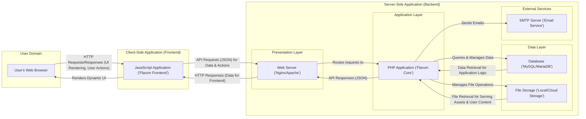

# Project Design Document: Flarum Forum Platform

**Document Version:** 1.1
**Date:** October 26, 2023
**Author:** Gemini (AI Language Model)
**Project Link:** [https://github.com/flarum/flarum](https://github.com/flarum/flarum)

## 1. Introduction

This document provides an enhanced architectural design of the Flarum forum platform, building upon the previous version. It offers a more detailed outline of the key components, their interactions, data flow, and external dependencies. This refined document is intended to serve as a robust foundation for subsequent threat modeling activities, facilitating a more granular assessment of potential security vulnerabilities.

## 2. Project Overview

Flarum is a modern, free, and open-source forum software designed for simplicity, speed, and extensibility. It employs a decoupled architecture, typically featuring a JavaScript-based frontend application communicating with a PHP-powered backend API. This separation of concerns allows for a more dynamic user experience and easier maintenance. Key features include discussion management, user administration, a rich extension ecosystem, and a responsive, mobile-first design.

## 3. Architectural Diagram

## 4. Key Components

*   **User's Web Browser:** The primary interface for users to interact with the Flarum forum. It interprets and renders HTML, CSS, and JavaScript received from the server.
*   **JavaScript Application ('Flarum Frontend'):** A sophisticated single-page application (SPA) built with a JavaScript framework (often Mithril.js or similar). It manages the user interface, handles user interactions, communicates with the backend API via asynchronous requests, and dynamically updates the displayed content without full page reloads.
*   **Web Server ('Nginx/Apache'):**  Acts as the entry point for all incoming HTTP requests. It is responsible for serving static assets (HTML, CSS, JavaScript, images), handling TLS/SSL encryption, and forwarding dynamic requests to the PHP application server. It may also perform load balancing and caching.
*   **PHP Application ('Flarum Core'):** The core business logic of the forum, typically built using a PHP framework or components from frameworks like Symfony or Laravel. It handles:
    *   **Request Routing:** Mapping incoming API requests to specific controllers and actions.
    *   **Authentication and Authorization:** Verifying user identities and controlling access to resources and functionalities.
    *   **Data Processing:** Handling user input, validating data, and performing business logic.
    *   **Database Interaction:**  Querying and manipulating data stored in the database.
    *   **Event Handling:**  Responding to events within the application lifecycle (e.g., new post created, user registered).
    *   **Extension Management:**  Loading and managing extensions that add or modify forum functionality.
*   **Database ('MySQL/MariaDB'):** A relational database system used for persistent storage of all forum data, including:
    *   User accounts and profiles.
    *   Discussions, posts, and replies.
    *   Forum settings and configurations.
    *   Extension data and configurations.
    *   Permissions and roles.
*   **File Storage ('Local/Cloud Storage'):**  Used for storing user-uploaded files and potentially other assets. This can be:
    *   **Local Storage:** Files stored directly on the server's file system.
    *   **Cloud Storage:**  Utilizing services like AWS S3, Google Cloud Storage, or similar for scalable and durable storage.
*   **SMTP Server ('Email Service'):** An external service responsible for sending outgoing emails, such as:
    *   Password reset requests.
    *   New post notifications.
    *   User registration confirmations.
    *   Forum announcements.

## 5. Data Flow

*   **Displaying a List of Discussions:**
    *   The user's browser sends an HTTP GET request to the web server for the discussions list.
    *   The web server routes the request to the PHP application.
    *   The PHP application queries the database to retrieve a list of discussions, potentially with pagination and sorting.
    *   The PHP application formats the discussion data into a JSON response.
    *   The web server sends the JSON response back to the user's browser.
    *   The JavaScript application receives the JSON data and dynamically renders the list of discussions in the user interface.
*   **Submitting a New Reply to a Post:**
    *   The user enters their reply in the input field within the browser.
    *   The JavaScript application sends an HTTP POST request (with JSON data containing the reply content and the post/discussion ID) to the web server.
    *   The web server forwards the request to the PHP application.
    *   The PHP application authenticates and authorizes the user.
    *   The PHP application validates the reply content (e.g., checks for length, profanity).
    *   The PHP application inserts the new reply into the database.
    *   The PHP application may trigger notifications to subscribed users.
    *   The PHP application sends a success response (often including the newly created reply data) back to the web server.
    *   The web server sends the response to the user's browser.
    *   The JavaScript application updates the UI to display the new reply.
*   **Downloading an Attached File:**
    *   The user clicks on a link to download an attached file.
    *   The browser sends an HTTP GET request to the web server for the file.
    *   The web server routes the request to the PHP application.
    *   The PHP application authenticates and authorizes the user to access the file.
    *   The PHP application retrieves the file from the file storage (either local or cloud).
    *   The PHP application sends the file content back to the web server with appropriate headers (e.g., `Content-Disposition`).
    *   The web server streams the file content to the user's browser, prompting a download.

## 6. User Interactions

*   **Registration and Login:** Users register by providing credentials (username, email, password). The backend securely stores the password (hashed and salted). Login involves verifying provided credentials against the stored values. Session management (using cookies or tokens) maintains the authenticated state.
*   **Profile Management:** Users can view and modify their profiles. Updates are sent to the backend, which validates the input and updates the user data in the database.
*   **Creating and Editing Discussions and Posts:** Users with appropriate permissions can create new discussions and posts. The frontend sends the content to the backend, which validates and stores it in the database. Editing follows a similar process.
*   **Searching for Content:** Users can search for discussions and posts. The frontend sends a search query to the backend, which queries the database (potentially using full-text search capabilities) and returns the results.
*   **Notifications:** The system sends notifications to users for various events (e.g., new replies, mentions). These notifications can be delivered in-app or via email, handled by the backend and the SMTP server.
*   **Extension Management (Admin Interface):** Administrators can manage extensions through a dedicated interface. This involves uploading extension files, enabling/disabling extensions, and configuring their settings. These actions interact directly with the backend's file system and database.

## 7. External Dependencies

*   **PHP Packages (via Composer):**
    *   Framework components (e.g., Symfony components, Laravel components).
    *   Database interaction libraries (e.g., Doctrine DBAL, Eloquent ORM).
    *   Security libraries (e.g., password hashing, CSRF protection).
    *   Email sending libraries (e.g., SwiftMailer, Symfony Mailer).
    *   Image manipulation libraries (e.g., Intervention Image).
*   **JavaScript Packages (via npm/Yarn):**
    *   Frontend framework (e.g., Mithril.js, React, Vue.js).
    *   UI component libraries.
    *   HTTP request libraries (e.g., Axios, Fetch API).
    *   State management libraries.
*   **Runtime Environment:**
    *   PHP interpreter.
    *   Database server (MySQL/MariaDB).
    *   Web server software (Nginx/Apache).
    *   Operating System (Linux, Windows, macOS).
*   **Optional External Services (often via Extensions):**
    *   **OAuth Providers:** For social login (e.g., Google, Facebook, GitHub).
    *   **Cloud Storage Services:** For storing user uploads (e.g., AWS S3, Google Cloud Storage, DigitalOcean Spaces).
    *   **Search Services:** For enhanced search functionality (e.g., Algolia, Elasticsearch).
    *   **Analytics Platforms:** For tracking user behavior (e.g., Google Analytics, Matomo).
    *   **Content Delivery Networks (CDNs):** For serving static assets globally.
    *   **Spam Filtering Services:** To prevent spam posts.

## 8. Security Considerations (Detailed)

This section expands on the initial security considerations, providing more detail for threat modeling:

*   **Authentication and Session Management:**
    *   **Threats:** Brute-force attacks on login forms, session hijacking, session fixation.
    *   **Mitigations:** Strong password policies, rate limiting on login attempts, secure session cookie attributes (HttpOnly, Secure, SameSite), using secure session storage, regular session regeneration.
*   **Authorization and Access Control:**
    *   **Threats:** Privilege escalation, unauthorized access to resources or functionalities.
    *   **Mitigations:** Role-based access control (RBAC), principle of least privilege, consistent enforcement of authorization checks in the backend, secure API endpoint design.
*   **Input Validation and Output Encoding:**
    *   **Threats:** Cross-Site Scripting (XSS), SQL Injection, Command Injection, Header Injection.
    *   **Mitigations:** Server-side input validation for all user-provided data, parameterized queries or prepared statements for database interactions, context-aware output encoding to prevent XSS, escaping special characters in shell commands.
*   **Cross-Site Request Forgery (CSRF):**
    *   **Threats:** Malicious websites or emails tricking authenticated users into performing unintended actions.
    *   **Mitigations:** Implementing CSRF protection mechanisms (e.g., synchronizer tokens, SameSite cookie attribute).
*   **File Upload Security:**
    *   **Threats:** Uploading malicious files (e.g., malware, scripts), path traversal vulnerabilities.
    *   **Mitigations:** Validating file types and extensions, sanitizing filenames, storing uploaded files outside the web root, using a dedicated storage service with appropriate permissions, implementing virus scanning.
*   **Password Storage:**
    *   **Threats:** Exposure of user passwords in case of a data breach.
    *   **Mitigations:** Using strong, one-way hashing algorithms with per-user salts (e.g., Argon2, bcrypt).
*   **Dependency Vulnerabilities:**
    *   **Threats:** Exploiting known vulnerabilities in third-party libraries and components.
    *   **Mitigations:** Regularly updating dependencies, using dependency scanning tools, reviewing security advisories.
*   **Email Security:**
    *   **Threats:** Email spoofing, phishing attacks originating from the forum's email system.
    *   **Mitigations:** Implementing SPF, DKIM, and DMARC records, using a reputable email sending service.
*   **API Security:**
    *   **Threats:** Unauthorized access to API endpoints, data breaches through API vulnerabilities.
    *   **Mitigations:** Secure authentication and authorization for API endpoints (e.g., API keys, OAuth 2.0), rate limiting, input validation, output encoding.
*   **Extension Security:**
    *   **Threats:** Malicious or poorly written extensions introducing vulnerabilities.
    *   **Mitigations:** Code reviews for extensions, implementing a secure extension development framework, providing clear guidelines for extension developers.
*   **Data Protection at Rest and in Transit:**
    *   **Threats:** Unauthorized access to sensitive data stored in the database or during transmission.
    *   **Mitigations:** Encrypting sensitive data at rest (e.g., using database encryption), enforcing HTTPS for all communication.

## 9. Conclusion

This enhanced design document provides a more detailed and structured overview of the Flarum forum platform's architecture. By elaborating on the key components, data flow, user interactions, and external dependencies, this document aims to provide a more comprehensive foundation for effective threat modeling. The expanded security considerations section highlights potential vulnerabilities and suggests mitigation strategies, facilitating a more thorough security assessment of the Flarum platform. Continuous review and updates to this document will be necessary as the platform evolves.
