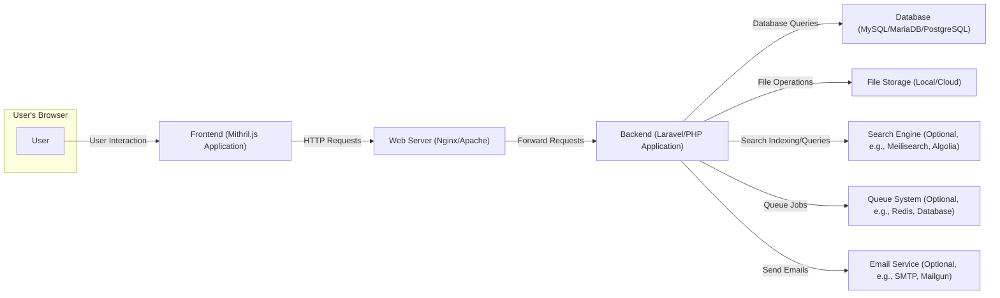
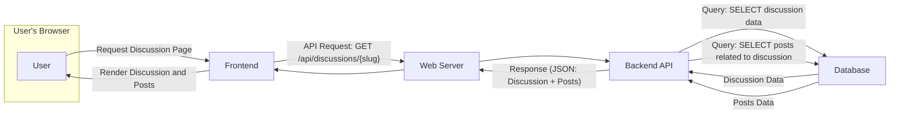
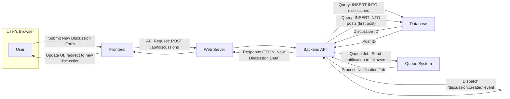
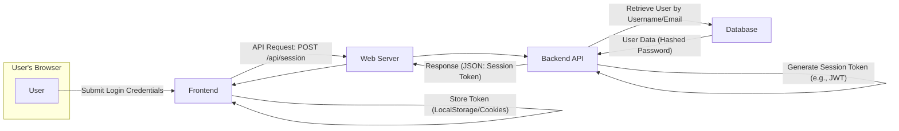

# Project Design Document: Flarum Forum Software

**Version:** 1.1
**Date:** October 26, 2023
**Author:** AI Software Architect

## 1. Introduction

This document provides an enhanced architectural design of the Flarum forum software, an open-source forum platform built with PHP (Laravel framework) for the backend and JavaScript (Mithril.js) for the frontend. This detailed design aims to facilitate comprehensive threat modeling by clearly outlining the system's components, their interactions, and data flows. This document is intended for security engineers, developers, and anyone involved in assessing the security posture of a Flarum deployment.

## 2. Project Overview

Flarum is designed as a modern, lightweight, and extensible forum platform. Its key features and characteristics include:

*   **Core Functionality:** Provides essential forum features like discussions, posts, user management, and notifications.
*   **Single-Page Application (SPA):**  The frontend is an SPA, offering a fluid and responsive user experience by minimizing page reloads.
*   **RESTful API:** The backend exposes a RESTful API for the frontend to communicate with, enabling a clear separation of concerns.
*   **Extensibility:** A well-defined extension system allows developers to add custom features and integrations without modifying the core codebase.
*   **Modularity:** The architecture is designed to be modular, making it easier to maintain and extend.

## 3. System Architecture

Flarum employs a layered architecture, separating the presentation layer (frontend) from the application and data layers (backend).

### 3.1. High-Level Architecture Diagram

### 3.2. Component Description

*   **User:** The individual accessing and interacting with the forum through a web browser.
*   **Frontend (Mithril.js Application):**
    *   Renders the user interface components and handles user interactions.
    *   Manages the application state using client-side JavaScript.
    *   Communicates with the backend API via asynchronous HTTP requests (primarily JSON).
    *   Handles routing and navigation within the single-page application.
    *   Implements UI logic and data presentation.
*   **Web Server (Nginx/Apache):**
    *   Serves static assets (HTML, CSS, JavaScript, images).
    *   Acts as a reverse proxy, directing incoming requests to the appropriate backend processes.
    *   Handles SSL/TLS termination, providing secure connections.
    *   May implement caching mechanisms for static content.
*   **Backend (Laravel/PHP Application):**
    *   Contains the core business logic of the forum.
    *   Handles user authentication and authorization.
    *   Manages data persistence through Eloquent ORM (Object-Relational Mapper).
    *   Provides a RESTful API for the frontend to perform actions (e.g., creating posts, managing users).
    *   Implements request validation and data sanitization.
    *   Handles events and listeners for extending functionality.
*   **Database (MySQL/MariaDB/PostgreSQL):**
    *   Stores persistent data, including user accounts, discussions, posts, tags, settings, and extension data.
    *   Provides data integrity and consistency.
    *   Supports indexing for efficient data retrieval.
*   **File Storage (Local/Cloud):**
    *   Stores user-uploaded files, such as avatars, attachments, and potentially extension-related assets.
    *   Can be a local filesystem or cloud-based storage services like Amazon S3 or similar.
    *   Requires proper access controls and security measures.
*   **Search Engine (Optional, e.g., Meilisearch, Algolia):**
    *   Provides full-text search capabilities for discussions and posts, improving content discoverability.
    *   Integration typically involves indexing data from the database and handling search queries.
    *   Communication with the backend occurs via API calls.
*   **Queue System (Optional, e.g., Redis, Database):**
    *   Manages asynchronous tasks that don't need immediate processing, such as sending emails, processing notifications, or handling resource-intensive operations.
    *   Improves application responsiveness by offloading tasks.
    *   Requires worker processes to consume and process queued jobs.
*   **Email Service (Optional, e.g., SMTP, Mailgun):**
    *   Handles the sending of emails for user registration, password resets, notifications, and other communication purposes.
    *   Can be a direct SMTP connection or a third-party email service.

## 4. Data Flow

This section details the flow of data for key user interactions and system processes.

### 4.1. Viewing a Discussion with Posts

### 4.2. Creating a New Discussion

### 4.3. User Login

## 5. Security Considerations

This section outlines key security considerations for the Flarum platform.

*   **Authentication and Authorization:**
    *   Secure password hashing using algorithms like bcrypt.
    *   Implementation of robust session management, potentially using JWT or secure cookies with HttpOnly and Secure flags.
    *   Role-based access control (RBAC) to manage user permissions.
    *   Protection against brute-force attacks on login endpoints (rate limiting).
*   **Input Validation and Output Encoding:**
    *   Server-side validation of all user inputs to prevent injection attacks (SQL Injection, Cross-Site Scripting - XSS).
    *   Proper output encoding/escaping of data displayed to users to mitigate XSS vulnerabilities.
    *   Protection against Mass Assignment vulnerabilities in Laravel models.
*   **Cross-Site Request Forgery (CSRF) Protection:**
    *   Use of CSRF tokens in forms and AJAX requests to prevent malicious requests from other domains.
*   **Data Protection:**
    *   Secure storage of sensitive data, including user credentials and potentially personal information.
    *   Encryption of sensitive data at rest and in transit (HTTPS).
    *   Regular security audits and penetration testing.
*   **File Upload Security:**
    *   Validation of file types, sizes, and content to prevent malicious uploads.
    *   Storage of uploaded files outside the web server's document root with restricted access.
    *   Prevention of directory traversal vulnerabilities.
*   **Dependency Management:**
    *   Regularly updating dependencies (PHP packages, JavaScript libraries) to patch known security vulnerabilities.
    *   Using tools like Composer Audit to identify vulnerable dependencies.
*   **Extension Security:**
    *   Security of third-party extensions is a significant concern.
    *   Lack of formal security review process for extensions in the core.
    *   Potential for extensions to introduce vulnerabilities (XSS, SQL Injection, etc.).
    *   Users should exercise caution when installing extensions from untrusted sources.
*   **API Security:**
    *   Secure API endpoints with proper authentication and authorization mechanisms.
    *   Rate limiting to prevent abuse and denial-of-service attacks.
    *   Input validation and output encoding for API requests and responses.
*   **Database Security:**
    *   Secure database configurations, including strong passwords and restricted access.
    *   Protection against SQL injection vulnerabilities through parameterized queries or ORM usage.
    *   Regular database backups.
*   **Error Handling and Logging:**
    *   Secure error handling to avoid leaking sensitive information in error messages.
    *   Comprehensive logging of security-related events for auditing and incident response.
*   **Content Security Policy (CSP):**
    *   Implementation of CSP headers to mitigate XSS attacks by controlling the sources from which the browser is allowed to load resources.

## 6. Deployment Considerations

Flarum can be deployed in various environments, each with its own security implications.

*   **Web Server Configuration:**
    *   Ensure HTTPS is properly configured with a valid SSL/TLS certificate.
    *   Configure web server to serve static files efficiently and restrict access to sensitive files (e.g., `.env`).
    *   Implement security headers (e.g., HSTS, X-Content-Type-Options, X-Frame-Options).
*   **Database Configuration:**
    *   Use strong and unique passwords for database users.
    *   Restrict database access to only necessary hosts and users.
    *   Keep the database server software up to date.
*   **File Storage Configuration:**
    *   Ensure proper file permissions to prevent unauthorized access or modification.
    *   Consider using cloud storage services with robust security features.
*   **Environment Variables:**
    *   Securely manage environment variables, especially those containing sensitive information (API keys, database credentials). Avoid storing them directly in code.
*   **Containerization (Docker):**
    *   Use minimal and secure base images.
    *   Follow Docker security best practices.
    *   Properly manage container orchestration and networking.
*   **Cloud Platforms (AWS, Google Cloud, Azure):**
    *   Utilize cloud-specific security features (firewalls, IAM roles, security groups).
    *   Follow the platform's security best practices.

## 7. Technologies Used

*   **Backend:** PHP (version >= 8.0), Laravel framework (version >= 9.0)
*   **Frontend:** JavaScript, Mithril.js framework
*   **Database:** MySQL (version >= 5.7), MariaDB, PostgreSQL
*   **Web Server:** Nginx (recommended), Apache
*   **Templating Engine:** Blade (Laravel)
*   **Package Manager:** Composer (PHP), npm or Yarn (JavaScript)
*   **HTTP Client:** Guzzle (PHP)
*   **Optional Integrations:** Redis, Meilisearch, Algolia, various email services, etc. (typically through extensions)

## 8. Extension Architecture and Security

Flarum's extension system is powerful but introduces potential security risks.

*   **Extension Development:** Extensions can introduce vulnerabilities if not developed with security in mind. Developers need to be aware of common web application vulnerabilities.
*   **Extension Installation:** Users should only install extensions from trusted sources. There is no central, curated, and security-vetted repository for Flarum extensions.
*   **Extension Permissions:** Extensions run with the same permissions as the core application, meaning a vulnerable extension can potentially compromise the entire forum.
*   **Extension Updates:** Keeping extensions up to date is crucial for patching security vulnerabilities.
*   **Lack of Sandboxing:** Extensions are not sandboxed, meaning they have direct access to the application's resources and database.
*   **Community Contributions:** While the open-source nature allows for community contributions, it also means that the security of extensions relies on the developers' security awareness and practices.

## 9. Conclusion

This enhanced design document provides a more detailed understanding of the Flarum forum software architecture, emphasizing aspects relevant to security. The modular nature of Flarum, particularly its extension system, presents both opportunities and challenges from a security perspective. A thorough threat model, informed by this document, is essential to identify potential vulnerabilities and implement appropriate security measures to protect Flarum deployments. Special attention should be paid to the security implications of installed extensions.