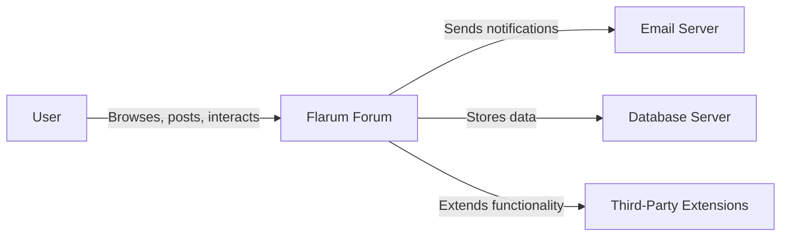
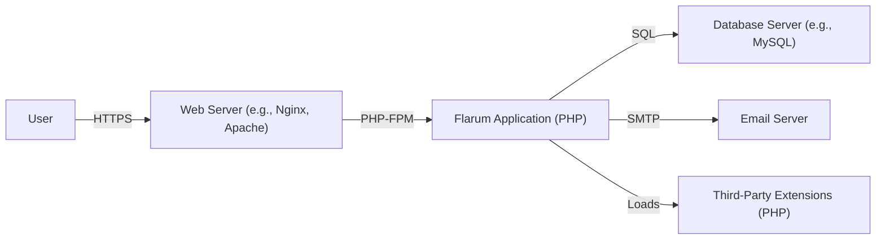
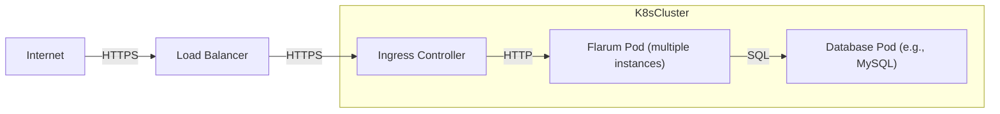
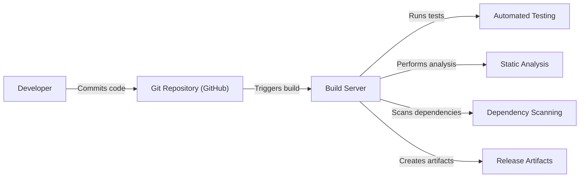

Okay, let's create a design document for the Flarum project.

# BUSINESS POSTURE

Flarum is an open-source forum software aiming to be simple, fast, and user-friendly. Its business priorities revolve around:

-   Growing a large and active user base (both forum administrators and forum users).
-   Maintaining a vibrant and engaged community of developers and contributors.
-   Providing a modern, extensible, and easy-to-use platform for online discussions.
-   Ensuring the software is performant and scalable to handle forums of varying sizes.
-   Offering a compelling alternative to existing, often more complex, forum solutions.

Key business risks that need to be addressed:

-   Reputational damage due to security vulnerabilities or data breaches.
-   Loss of user trust and adoption due to instability or poor performance.
-   Inability to attract and retain contributors, leading to stagnation of the project.
-   Competition from other forum software providers.
-   Failure to adapt to evolving user needs and web technologies.
-   Legal risks associated with user-generated content (copyright infringement, illegal content).

# SECURITY POSTURE

Flarum, being a PHP application, inherits the security considerations of the LAMP/LEMP stack. It also has specific security controls and accepted risks:

-   security control: Input validation and sanitization to prevent XSS and SQL injection. Implemented throughout the codebase, particularly in data handling and rendering components.
-   security control: Use of prepared statements for database interactions to mitigate SQL injection risks. Implemented in the database access layer.
-   security control: CSRF protection mechanisms to prevent cross-site request forgery attacks. Implemented in the form handling and API endpoints.
-   security control: Password hashing using secure algorithms (e.g., bcrypt). Implemented in the user authentication module.
-   security control: Access controls to restrict administrative functionalities to authorized users. Implemented in the middleware and authorization components.
-   security control: Regular security updates and patches to address vulnerabilities. Managed through the Flarum release process and extension ecosystem.
-   security control: Extension system with permission management. Implemented in the extension API and core functionality.
-   security control: Rate limiting to prevent brute-force attacks and denial-of-service. Implemented in the API and authentication endpoints.
-   accepted risk: Reliance on third-party extensions for some functionalities, which may introduce their own security risks. Mitigated by community vetting and security reviews, but not entirely eliminated.
-   accepted risk: Potential for vulnerabilities in the underlying PHP framework (Laravel) and its dependencies. Mitigated by staying up-to-date with framework releases and security advisories.
-   accepted risk: User-generated content may contain malicious links or scripts. Mitigated by content filtering and user reporting mechanisms, but complete prevention is impossible.

Recommended Security Controls (High Priority):

-   Implement a robust Content Security Policy (CSP) to mitigate XSS risks further.
-   Introduce security scanning tools (SAST, DAST) into the development and release pipeline.
-   Establish a clear security vulnerability disclosure program.
-   Provide comprehensive security documentation and guidelines for extension developers.
-   Consider implementing two-factor authentication (2FA) for enhanced user account security.

Security Requirements:

-   Authentication:
    -   Secure password storage using strong hashing algorithms.
    -   Protection against brute-force attacks.
    -   Session management with secure cookies (HTTPOnly, Secure flags).
    -   Optional support for 2FA.
-   Authorization:
    -   Role-based access control (RBAC) for managing user permissions.
    -   Granular control over forum access and functionalities.
    -   Secure handling of API keys and tokens.
-   Input Validation:
    -   Strict validation and sanitization of all user inputs.
    -   Prevention of XSS, SQL injection, and other injection attacks.
    -   Safe handling of file uploads.
-   Cryptography:
    -   Use of strong encryption algorithms for sensitive data (if applicable).
    -   Secure generation and management of cryptographic keys.
    -   HTTPS enforcement for all communication.

# DESIGN

## C4 CONTEXT

Element Descriptions:

-   1.  Name: User
    2.  Type: Person
    3.  Description: A person who interacts with the Flarum forum, either as a reader, poster, or administrator.
    4.  Responsibilities: Browsing forums, creating posts, replying to discussions, managing their profile, and potentially administering the forum.
    5.  Security controls: Authentication, authorization, session management, CSRF protection.

-   1.  Name: Flarum Forum
    2.  Type: Software System
    3.  Description: The core Flarum application, providing the forum functionality.
    4.  Responsibilities: Handling user requests, managing forum data, rendering the user interface, enforcing access controls, and interacting with external services.
    5.  Security controls: Input validation, output encoding, CSRF protection, authentication, authorization, rate limiting, secure configuration.

-   1.  Name: Email Server
    2.  Type: External System
    3.  Description: An external email server used for sending notifications and other emails.
    4.  Responsibilities: Delivering emails to users.
    5.  Security controls: Secure connection (TLS), authentication with the email server.

-   1.  Name: Database Server
    2.  Type: External System
    3.  Description: A database server (e.g., MySQL, PostgreSQL) used to store forum data.
    4.  Responsibilities: Storing and retrieving forum data (users, posts, discussions, etc.).
    5.  Security controls: Database access controls, secure connection, data encryption (if applicable).

-   1.  Name: Third-Party Extensions
    2.  Type: External Systems
    3.  Description: Optional extensions that add functionality to the Flarum forum.
    4.  Responsibilities: Providing additional features not included in the core Flarum application.
    5.  Security controls: Dependent on the specific extension; ideally, they should follow Flarum's security guidelines.

## C4 CONTAINER

Element Descriptions:

-   1.  Name: User
    2.  Type: Person
    3.  Description: A person interacting with the forum via a web browser.
    4.  Responsibilities: Sending HTTP requests, receiving and rendering responses.
    5.  Security controls: Browser security features, HTTPS.

-   1.  Name: Web Server
    2.  Type: Container
    3.  Description: A web server (e.g., Nginx, Apache) that handles incoming HTTP requests.
    4.  Responsibilities: Serving static assets, routing requests to the Flarum application, enforcing HTTPS.
    5.  Security controls: Secure configuration, HTTPS enforcement, request filtering, rate limiting.

-   1.  Name: Flarum Application (PHP)
    2.  Type: Container
    3.  Description: The core Flarum application code, written in PHP.
    4.  Responsibilities: Handling application logic, interacting with the database and email server, rendering views.
    5.  Security controls: Input validation, output encoding, CSRF protection, authentication, authorization, session management.

-   1.  Name: Database Server
    2.  Type: Container
    3.  Description: The database server (e.g., MySQL, PostgreSQL) storing forum data.
    4.  Responsibilities: Storing and retrieving data, enforcing data integrity.
    5.  Security controls: Database access controls, secure connection, data encryption (if applicable).

-   1.  Name: Email Server
    2.  Type: Container
    3.  Description: An external email server used for sending notifications.
    4.  Responsibilities: Sending emails on behalf of the Flarum application.
    5.  Security controls: Secure connection (TLS), authentication with the email server.

-   1.  Name: Third-Party Extensions (PHP)
    2.  Type: Container
    3.  Description: PHP extensions that extend Flarum's functionality.
    4.  Responsibilities: Providing additional features as defined by the extension.
    5.  Security controls: Dependent on the specific extension; should adhere to Flarum's security guidelines.

## DEPLOYMENT

Flarum can be deployed in several ways, including:

1.  Traditional LAMP/LEMP stack on a single server.
2.  Cloud-based deployment using managed services (e.g., AWS, Google Cloud, Azure).
3.  Containerized deployment using Docker and orchestration tools like Kubernetes.

We'll describe the containerized deployment using Docker and Kubernetes, as it offers scalability, resilience, and easier management.

Element Descriptions:

-   1.  Name: Internet
    2.  Type: External
    3.  Description: The public internet.
    4.  Responsibilities: Routing traffic to the load balancer.
    5.  Security controls: Standard internet security protocols.

-   1.  Name: Load Balancer
    2.  Type: Infrastructure Node
    3.  Description: A load balancer that distributes incoming traffic across multiple instances of the Flarum application.
    4.  Responsibilities: Distributing traffic, health checks, SSL termination.
    5.  Security controls: HTTPS enforcement, DDoS protection, secure configuration.

-   1.  Name: Kubernetes Cluster
    2.  Type: Infrastructure Node
    3.  Description: A Kubernetes cluster that manages the containerized application.
    4.  Responsibilities: Orchestrating containers, scaling, self-healing.
    5.  Security controls: Kubernetes RBAC, network policies, pod security policies.

-   1.  Name: Flarum Pod
    2.  Type: Container Instance
    3.  Description: A pod running the Flarum application container (including the web server and PHP-FPM).
    4.  Responsibilities: Handling user requests, interacting with the database.
    5.  Security controls: Container security best practices, limited privileges.

-   1.  Name: Database Pod
    2.  Type: Container Instance
    3.  Description: A pod running the database server container (e.g., MySQL).
    4.  Responsibilities: Storing and retrieving forum data.
    5.  Security controls: Database access controls, secure connection, data encryption (if applicable), limited privileges.

-   1.  Name: Ingress Controller
    2.  Type: Infrastructure Node
    3.  Description: An Ingress controller that manages external access to the services within the Kubernetes cluster.
    4.  Responsibilities: Routing traffic based on rules, TLS termination.
    5.  Security controls: Secure configuration, HTTPS enforcement.

## BUILD

Flarum's build process involves several steps, from development to the creation of release artifacts. While Flarum doesn't have a complex CI/CD pipeline in the main repository, a secure build process should include:

1.  Development: Developers write code and commit changes to the Git repository.
2.  Code Review: Pull requests are reviewed by other developers for code quality and security.
3.  Automated Testing: Unit and integration tests are run automatically on each commit or pull request.
4.  Static Analysis: Static analysis tools (e.g., PHPStan, Psalm) are used to identify potential code quality and security issues.
5.  Dependency Management: Dependencies are managed using Composer, and their versions are pinned to prevent unexpected updates.
6.  Vulnerability Scanning: Dependency vulnerability scanners (e.g., Composer audit, Snyk) are used to check for known vulnerabilities in dependencies.
7.  Release Build: When a new release is tagged, a build process creates the release artifacts (e.g., a ZIP archive containing the Flarum files).
8.  Artifact Signing: Release artifacts can be signed to ensure their integrity and authenticity.

# RISK ASSESSMENT

-   Critical Business Processes:
    -   User registration and login.
    -   Forum posting and discussion management.
    -   User profile management.
    -   Forum administration (moderation, configuration).
    -   Extension management.

-   Data to Protect:
    -   User data (usernames, email addresses, hashed passwords, IP addresses, profile information). Sensitivity: High.
    -   Forum content (posts, discussions, attachments). Sensitivity: Medium to High (depending on the content).
    -   Configuration data (database credentials, API keys). Sensitivity: Very High.
    -   Session data. Sensitivity: High.

# QUESTIONS & ASSUMPTIONS

-   Questions:
    -   What is the expected traffic volume and user base size? This impacts scalability requirements.
    -   Are there any specific compliance requirements (e.g., GDPR, CCPA)?
    -   What is the budget for security tools and infrastructure?
    -   What is the level of security expertise within the development team?
    -   What are the specific requirements for user data retention and deletion?
    -   Are there any plans for integrating with third-party authentication providers (e.g., social login)?
    -   What level of logging and monitoring is required?
    -   What is the process for handling user reports of security vulnerabilities or abuse?

-   Assumptions:
    -   The development team follows secure coding practices.
    -   The underlying operating system and infrastructure are properly secured.
    -   Regular backups of the database are performed.
    -   The Flarum community actively participates in identifying and reporting security issues.
    -   The chosen deployment environment (e.g., cloud provider, hosting company) provides a reasonable level of security.
    -   Users will choose strong passwords and practice good security hygiene.
    -   Third-party extensions are reviewed for security before being used.
    -   HTTPS is enforced for all communication with the forum.
    -   Flarum is kept up-to-date with the latest security patches.