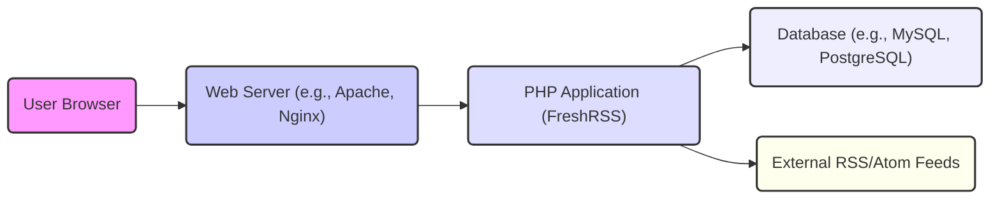
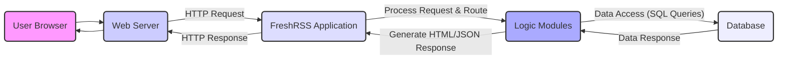
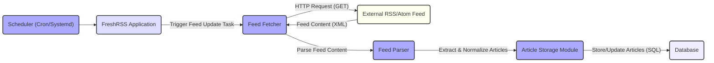

# Project Design Document: FreshRSS

**Version:** 1.1
**Date:** October 26, 2023
**Author:** AI Architecture Expert

## 1. Introduction

This document provides an enhanced and detailed design overview of the FreshRSS project, an open-source, self-hosted RSS and Atom feed aggregator. This document aims to clearly articulate the system's architecture, components, data flow, and key considerations, with a specific focus on providing the necessary information for effective threat modeling.

## 2. Goals and Objectives

The primary goal of FreshRSS is to empower users with a personal and customizable platform for aggregating and reading content from various RSS and Atom feeds. Key objectives include:

*   Providing an intuitive and user-friendly web interface for managing subscriptions and consuming articles.
*   Efficiently fetching and parsing syndicated content from numerous sources.
*   Securely storing and organizing articles for convenient access and retrieval.
*   Allowing users to personalize their reading experience through various settings and features.
*   Offering a robust extension mechanism through plugins to enhance functionality.

## 3. System Architecture

### 3.1. High-Level Architecture

*   **"User Browser"**: The web browser application used by users to interact with FreshRSS.
*   **"Web Server (e.g., Apache, Nginx)"**:  The software responsible for handling incoming HTTP requests and serving the FreshRSS application to users. This acts as the entry point for user interactions.
*   **"PHP Application (FreshRSS)"**: The core of the FreshRSS system, written in PHP. It contains the business logic for handling user requests, fetching and processing feeds, and managing data.
*   **"Database (e.g., MySQL, PostgreSQL)"**:  The persistent storage layer for FreshRSS, responsible for storing user credentials, feed subscriptions, article content, application settings, and other persistent data.
*   **"External RSS/Atom Feeds"**: The remote servers hosting the RSS and Atom feeds that FreshRSS aggregates content from.

### 3.2. Detailed Component Architecture

The FreshRSS application can be further decomposed into the following key components, highlighting their specific responsibilities:

*   **Web Interface:**
    *   Implemented using a combination of HTML, CSS, and JavaScript.
    *   Responsible for rendering the user interface, handling user interactions, and displaying information.
    *   Manages user sessions and presents data retrieved from the backend.
*   **Core Application Logic (PHP):**
    *   **"Authentication Module"**: Handles user login, logout, session creation and validation, and potentially API key management for external access.
    *   **"Feed Management Module"**:  Provides functionality for users to add, delete, categorize, and organize their feed subscriptions. It also manages the storage of feed metadata.
    *   **"Feed Fetcher"**:  Periodically retrieves content from subscribed feeds using HTTP requests. This component handles network communication and error handling during feed retrieval.
    *   **"Feed Parser"**:  Parses the XML structure of RSS and Atom feeds to extract relevant information such as article titles, content, publication dates, and authors. This component is crucial for interpreting feed data.
    *   **"Article Storage Module"**: Manages the storage, indexing, and retrieval of article data within the database. It handles data persistence and ensures efficient access to articles.
    *   **"User Preferences Module"**:  Allows users to customize their FreshRSS experience, such as display settings, reading preferences, and notification options.
    *   **"Plugin Management Module"**: Enables the installation, activation, deactivation, and management of plugins, extending the core functionality of FreshRSS.
    *   **"API (Optional)"**: Provides a programmatic interface for interacting with FreshRSS, allowing external applications or scripts to access and manipulate data. This could include endpoints for reading articles, managing subscriptions, etc.
*   **Database Layer:**
    *   Provides an abstraction layer to interact with the underlying database system (e.g., using PDO in PHP).
    *   Encapsulates database-specific operations and provides a consistent interface for the application logic.
    *   Manages database connections, executes queries, and handles data transactions.
*   **Background Processes (e.g., Cron Jobs or Systemd Timers):**
    *   **"Feed Update Scheduler"**:  Triggers the "Feed Fetcher" at defined intervals to retrieve new content from subscribed feeds. This ensures the application stays up-to-date.
    *   **"Maintenance Tasks"**:  Performs periodic tasks such as cleaning up old, read articles, optimizing database performance, and potentially handling error logging or reporting.

## 4. Data Flow

### 4.1. User Interaction Flow

*   The **"User Browser"** initiates an interaction by sending an HTTP request (e.g., to view the article list, subscribe to a new feed).
*   The **"Web Server"** receives the HTTP request and forwards it to the **"FreshRSS Application"**.
*   The **"FreshRSS Application"** processes the request, routing it to the appropriate **"Logic Modules"** based on the requested URL or action.
*   The **"Logic Modules"** interact with the **"Database"** by executing SQL queries to retrieve or modify data.
*   The **"Database"** returns the requested data to the **"Logic Modules"**.
*   The **"Logic Modules"** process the data and generate an HTML or JSON response.
*   The **"FreshRSS Application"** sends the HTTP response back to the **"Web Server"**.
*   The **"Web Server"** delivers the response to the **"User Browser"**, which renders the updated interface.

### 4.2. Feed Update Flow

*   A **"Scheduler (Cron/Systemd)"** triggers the feed update process at scheduled intervals.
*   The **"FreshRSS Application"** receives the trigger and initiates the **"Feed Fetcher"**.
*   The **"Feed Fetcher"** sends an HTTP GET request to the **"External RSS/Atom Feed"**.
*   The **"External RSS/Atom Feed"** responds with the feed content, typically in XML format.
*   The **"Feed Fetcher"** passes the content to the **"Feed Parser"**.
*   The **"Feed Parser"** extracts and normalizes article data from the XML.
*   The **"Article Storage Module"** receives the parsed articles.
*   The **"Article Storage Module"** interacts with the **"Database"** to store new articles or update existing ones.

## 5. Key Components and Technologies

*   **Programming Language:** PHP (likely version 7.x or 8.x)
*   **Web Server:** Typically Apache or Nginx
*   **Database:** Supports various relational databases, including MySQL/MariaDB, PostgreSQL, and SQLite. The specific choice impacts database interaction details.
*   **Frontend Technologies:** HTML5, CSS3, JavaScript (potentially utilizing frameworks or libraries for enhanced interactivity).
*   **Feed Parsing Libraries:** Likely utilizes XML parsing libraries available in PHP (e.g., `SimpleXML`, `DOMDocument`).
*   **HTTP Client:**  Uses PHP's built-in HTTP functions or libraries like `cURL` for fetching feed content.
*   **Caching Mechanisms:** May implement caching at various levels (e.g., object caching, page caching) to improve performance and reduce database load.
*   **Plugin System:**  A core feature allowing for extending functionality through custom PHP code adhering to FreshRSS's plugin API.

## 6. Security Considerations

This section outlines key security considerations relevant for threat modeling. Each point represents a potential area of vulnerability:

*   **Authentication and Authorization:**
    *   **Threats:** Brute-force attacks on login forms, credential stuffing, weak password policies, privilege escalation.
    *   **Considerations:** Strength of hashing algorithms for passwords, implementation of rate limiting, multi-factor authentication (if available), proper role-based access control.
*   **Input Validation and Output Encoding:**
    *   **Threats:** Cross-Site Scripting (XSS) through malicious feed content or user input, SQL Injection vulnerabilities in database queries, Command Injection through unsanitized input.
    *   **Considerations:**  Strict validation of all user inputs, proper encoding of data before rendering in the web interface, parameterized queries for database interactions.
*   **Session Management:**
    *   **Threats:** Session hijacking, session fixation.
    *   **Considerations:** Secure generation and storage of session IDs, use of HTTP-only and secure flags for cookies, session timeout mechanisms, protection against Cross-Site Request Forgery (CSRF).
*   **Cross-Site Request Forgery (CSRF):**
    *   **Threats:** Unauthorized actions performed on behalf of an authenticated user.
    *   **Considerations:** Implementation of anti-CSRF tokens for state-changing requests.
*   **Feed Security:**
    *   **Threats:** Malicious code embedded in feed content, denial-of-service through excessively large feeds or frequent requests.
    *   **Considerations:**  Sanitization of feed content, limiting the size of fetched feeds, implementing timeouts for feed requests.
*   **Database Security:**
    *   **Threats:** Unauthorized access to the database, data breaches.
    *   **Considerations:** Secure database credentials, proper database permissions, regular database backups, protection against SQL injection.
*   **Plugin Security:**
    *   **Threats:** Malicious plugins introducing vulnerabilities or backdoors.
    *   **Considerations:**  Mechanism for verifying plugin integrity (if any), awareness of the risks associated with installing third-party plugins.
*   **HTTPS:**
    *   **Threats:** Man-in-the-middle attacks, eavesdropping on communication.
    *   **Considerations:**  Enforcing HTTPS for all communication, proper SSL/TLS configuration.
*   **Regular Updates and Patching:**
    *   **Threats:** Exploitation of known vulnerabilities in the FreshRSS application or its dependencies.
    *   **Considerations:**  Importance of keeping FreshRSS and its underlying software stack up-to-date with the latest security patches.

## 7. Deployment Considerations

FreshRSS is designed for self-hosting, offering flexibility in deployment environments. Common deployment methods include:

*   **Traditional Web Server (LAMP/LEMP Stack):**
    *   Deploying the PHP application on a web server like Apache (LAMP) or Nginx (LEMP) with a PHP interpreter (e.g., PHP-FPM).
    *   Requires manual configuration of the web server, PHP, and database.
    *   Example: Installing on a Linux server with Apache, MySQL, and PHP.
*   **Docker Containerization:**
    *   Utilizing Docker containers to package FreshRSS and its dependencies into a portable and isolated environment.
    *   Simplifies deployment and management, ensuring consistency across different environments.
    *   Example: Using a pre-built FreshRSS Docker image or creating a custom one.
*   **Cloud Platforms (IaaS/PaaS):**
    *   Deploying on cloud infrastructure services (IaaS) like AWS EC2 or Google Compute Engine, providing full control over the server environment.
    *   Utilizing Platform-as-a-Service (PaaS) offerings like Heroku or AWS Elastic Beanstalk, which abstract away server management.
    *   Example: Deploying on an AWS EC2 instance with a manually configured web server or using Heroku's PHP support.

## 8. Future Considerations

*   **Enhanced API Capabilities:**  Developing a more comprehensive and well-documented API to facilitate integrations with other applications and services.
*   **Improved Mobile User Experience:**  Further optimizing the web interface for mobile devices or exploring the development of dedicated mobile applications.
*   **Advanced Search and Filtering:** Implementing more sophisticated search functionalities and filtering options for articles based on keywords, tags, or other criteria.
*   **Integration with Third-Party Services:**  Adding native support for integrations with popular read-it-later services, social media platforms, or note-taking applications.
*   **Support for More Authentication Methods:** Exploring options for integrating with other authentication providers (e.g., OAuth).

This improved document provides a more detailed and structured overview of the FreshRSS project, specifically tailored for use in threat modeling activities. The enhanced descriptions of components, data flow, and security considerations aim to facilitate a more thorough and effective security analysis.
