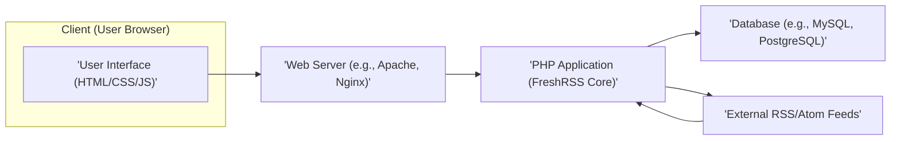
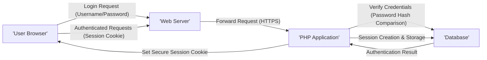
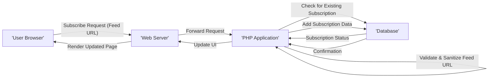
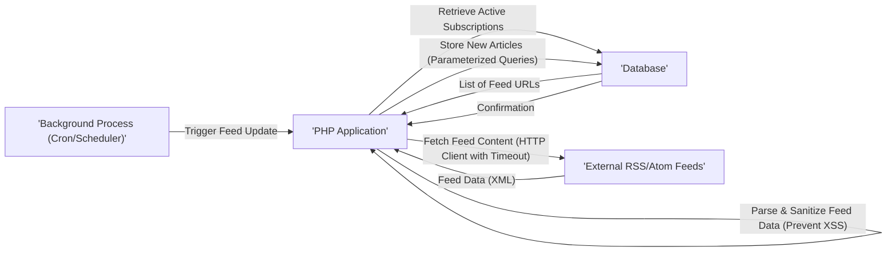
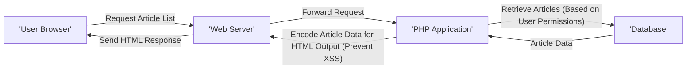

# Project Design Document: FreshRSS

**Version:** 1.1
**Date:** October 26, 2023
**Author:** AI Software Architect

## 1. Introduction

This document provides an enhanced architectural design for the FreshRSS project, a self-hosted RSS feed aggregator. Building upon the previous version, this document offers more detailed insights into the components, their interactions, data flow, and crucial security considerations, specifically tailored for effective threat modeling. The design continues to focus on the core functionalities of FreshRSS as observed in the provided GitHub repository.

## 2. Goals

*   Provide a clear and comprehensive overview of the FreshRSS architecture, emphasizing security-relevant aspects.
*   Identify key components and their responsibilities with a focus on potential attack surfaces.
*   Describe the flow of data within the system, highlighting trust boundaries and data transformation points.
*   Elaborate on potential security considerations and areas of concern, providing more specific examples.
*   Serve as a robust and detailed basis for threat modeling and security analysis.

## 3. Scope

This document covers the core functionalities of FreshRSS, including:

*   User authentication and authorization mechanisms.
*   Feed subscription and management workflows.
*   Feed fetching, parsing, and content processing.
*   Article storage, indexing, and retrieval processes.
*   User interface interactions for viewing and managing feeds and articles.
*   Background processes responsible for periodic feed updates.

This document does not cover:

*   Specific implementation details of individual functions or classes.
*   In-depth code-level analysis or vulnerability assessment.
*   Detailed deployment configurations, infrastructure setup, or operating system security.
*   Security considerations for specific third-party extensions or plugins (unless they are integral to the core observed functionality).

## 4. Architectural Overview

FreshRSS employs a standard web application architecture, primarily relying on server-side rendering with PHP. It utilizes a database for persistent data storage and interacts with external sources for fetching content.

### 4.1. High-Level Component Diagram

### 4.2. Key Components

*   **User Interface (HTML/CSS/JS):** The client-side interface rendered in the user's web browser. It handles user interactions, presents feeds and articles, and communicates with the backend via standard HTTP requests. Security considerations include protection against DOM-based XSS and ensuring secure communication with the backend.
*   **Web Server (e.g., Apache, Nginx):**  The initial point of contact for client requests. It manages routing, serves static assets, enforces basic security measures (e.g., HTTPS), and forwards dynamic requests to the PHP application. Security considerations involve proper configuration to prevent common web server vulnerabilities and ensure HTTPS is enforced.
*   **PHP Application (FreshRSS Core):** The central component containing the core application logic. It is responsible for:
    *   Managing user sessions and enforcing authentication and authorization.
    *   Handling user requests for feed subscriptions and management.
    *   Orchestrating the fetching and parsing of RSS/Atom feeds from external sources. This involves making outbound HTTP requests and processing potentially untrusted XML data.
    *   Storing and retrieving article data from the database. This includes sanitizing and validating data before database interaction.
    *   Generating the HTML content for the user interface. This requires careful encoding to prevent XSS vulnerabilities.
    *   Scheduling and executing background tasks for automated feed updates. The security of these scheduled tasks is important.
*   **Database (e.g., MySQL, PostgreSQL):** Provides persistent storage for all application data. This includes:
    *   User account details (usernames, password hashes, etc.).
    *   Feed subscription information and configurations.
    *   Fetched article content and metadata.
    *   Application settings and preferences.
    Security considerations involve securing database credentials, implementing proper access controls, and protecting against SQL injection vulnerabilities. Data at rest encryption might be a consideration for sensitive data.
*   **External RSS/Atom Feeds:** The external sources providing the content FreshRSS aggregates. These are typically publicly accessible URLs returning RSS or Atom formatted XML data. Security considerations involve the risk of fetching malicious content or being targeted by SSRF attacks.

## 5. Data Flow

The following diagrams illustrate the key data flows within the FreshRSS system, highlighting potential security implications at each stage.

### 5.1. User Login

*   The user submits login credentials via an HTTPS connection.
*   The web server forwards the request to the PHP application.
*   The PHP application retrieves the user's stored password hash from the database.
*   The submitted password is hashed and compared to the stored hash.
*   Upon successful authentication, a session ID is generated and stored (typically in the database or a session store).
*   A secure, HTTP-only session cookie is set in the user's browser to maintain the authenticated session.

**Security Notes:** This flow highlights the importance of HTTPS, secure password hashing algorithms, and secure session management practices to prevent credential theft and session hijacking.

### 5.2. Feed Subscription

*   The user submits a feed URL to subscribe.
*   The PHP application validates the format of the URL and sanitizes it to prevent injection attacks.
*   The application checks if the feed is already subscribed to by the user.
*   If not, the subscription information is added to the database.

**Security Notes:**  Proper URL validation and sanitization are crucial to prevent SSRF vulnerabilities. Checking for existing subscriptions can help mitigate potential abuse.

### 5.3. Feed Fetching and Article Storage

*   A background process initiates the feed update.
*   The PHP application retrieves a list of active feed subscriptions from the database.
*   For each feed URL, the application fetches the content using an HTTP client, ideally with timeouts to prevent indefinite hangs.
*   The fetched XML data is parsed, and crucial sanitization steps are performed to prevent stored XSS attacks.
*   New articles are stored in the database using parameterized queries to prevent SQL injection.

**Security Notes:** This flow highlights the risks associated with interacting with external resources (SSRF, fetching malicious content). Input sanitization and parameterized queries are essential for mitigating XSS and SQL injection vulnerabilities.

### 5.4. Displaying Articles to the User

*   The user requests a list of articles.
*   The PHP application retrieves the relevant articles from the database, respecting user permissions and access controls.
*   Before sending the data to the browser, the application encodes the article content and other dynamic data to prevent XSS vulnerabilities.

**Security Notes:** Proper output encoding is critical to prevent XSS. Database queries should respect user permissions to prevent unauthorized data access.

## 6. Security Considerations

This section expands on the security considerations, providing more specific examples and potential mitigation strategies.

*   **Authentication and Authorization:**
    *   **Threat:** Brute-force attacks on login forms.
        *   **Mitigation:** Implement rate limiting on login attempts, use CAPTCHA, account lockout mechanisms.
    *   **Threat:** Weak password policies leading to easily guessable passwords.
        *   **Mitigation:** Enforce strong password complexity requirements, encourage the use of password managers.
    *   **Threat:** Session hijacking due to insecure session management.
        *   **Mitigation:** Use secure, HTTP-only, and SameSite cookies; regenerate session IDs after login; implement session timeouts.
*   **Input Validation:**
    *   **Threat:** Cross-Site Scripting (XSS) through unsanitized user input in feed titles, article content, or comments (if implemented).
        *   **Mitigation:** Implement robust input sanitization and output encoding techniques. Use context-aware encoding.
    *   **Threat:** SQL Injection through unsanitized user input in search queries or subscription forms.
        *   **Mitigation:** Use parameterized queries or prepared statements for all database interactions. Employ an ORM with built-in protection against SQL injection.
    *   **Threat:** Server-Side Request Forgery (SSRF) via maliciously crafted feed URLs.
        *   **Mitigation:** Implement strict validation of feed URLs, use a whitelist of allowed protocols, and potentially use a proxy or separate network for fetching external content.
*   **Data Storage:**
    *   **Threat:** Exposure of sensitive data (user credentials, potentially article content) if the database is compromised.
        *   **Mitigation:** Encrypt sensitive data at rest in the database. Secure database server access and credentials.
    *   **Threat:** Unauthorized access to database data.
        *   **Mitigation:** Implement strong database access controls and user permissions. Follow the principle of least privilege.
*   **Network Security:**
    *   **Threat:** Man-in-the-middle attacks intercepting sensitive data.
        *   **Mitigation:** Enforce HTTPS for all communication between the client and server. Implement HSTS headers.
    *   **Threat:** Exposure of sensitive information through insecure HTTP headers.
        *   **Mitigation:** Configure security-related HTTP headers like `Content-Security-Policy`, `X-Frame-Options`, `X-Content-Type-Options`, and `Referrer-Policy`.
*   **Feed Fetching:**
    *   **Threat:** Fetching malicious content that could exploit vulnerabilities in the XML parser or other processing logic.
        *   **Mitigation:** Use a secure and up-to-date XML parser. Implement content security measures and potentially sandboxing for feed processing.
    *   **Threat:** Denial of Service (DoS) by fetching an excessive number of feeds or very large feeds.
        *   **Mitigation:** Implement timeouts for HTTP requests, limit the size of fetched content, and potentially implement rate limiting on feed updates.
*   **Dependency Management:**
    *   **Threat:** Using vulnerable third-party libraries or components.
        *   **Mitigation:** Regularly update dependencies and perform security audits of used libraries. Utilize dependency scanning tools.
*   **Error Handling and Logging:**
    *   **Threat:** Information disclosure through overly verbose error messages.
        *   **Mitigation:** Implement generic error messages for users and log detailed errors securely.
    *   **Threat:** Lack of sufficient logging hindering incident detection and response.
        *   **Mitigation:** Implement comprehensive logging of security-relevant events, including authentication attempts, access control decisions, and errors.
*   **Background Processes:**
    *   **Threat:** Compromise of background processes leading to unauthorized actions.
        *   **Mitigation:** Ensure background processes run with minimal necessary privileges and are securely scheduled and managed.

## 7. Future Considerations (Security Perspective)

*   **Two-Factor Authentication (2FA):** Implement 2FA to enhance account security.
*   **Rate Limiting:** Implement more granular rate limiting for various API endpoints and actions.
*   **Content Security Policy (CSP):**  Further refine and enforce CSP to mitigate XSS attacks.
*   **Regular Security Audits and Penetration Testing:** Conduct periodic security assessments to identify and address vulnerabilities proactively.
*   **Secure Defaults:** Ensure secure configurations are the default for new installations and upgrades.
*   **Consideration for Content Integrity:** Explore mechanisms to verify the integrity of fetched feed content.

## 8. Conclusion

This enhanced design document provides a more detailed and security-focused overview of the FreshRSS project architecture. By elaborating on potential threats and suggesting mitigation strategies, this document serves as a valuable resource for conducting a comprehensive threat modeling exercise. Understanding these architectural nuances and security considerations is crucial for building a more secure and resilient FreshRSS application.