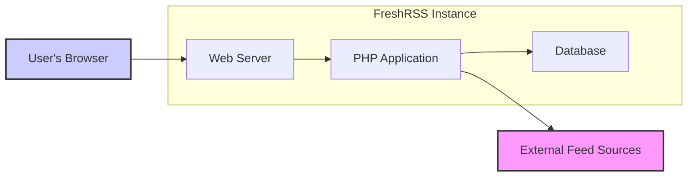
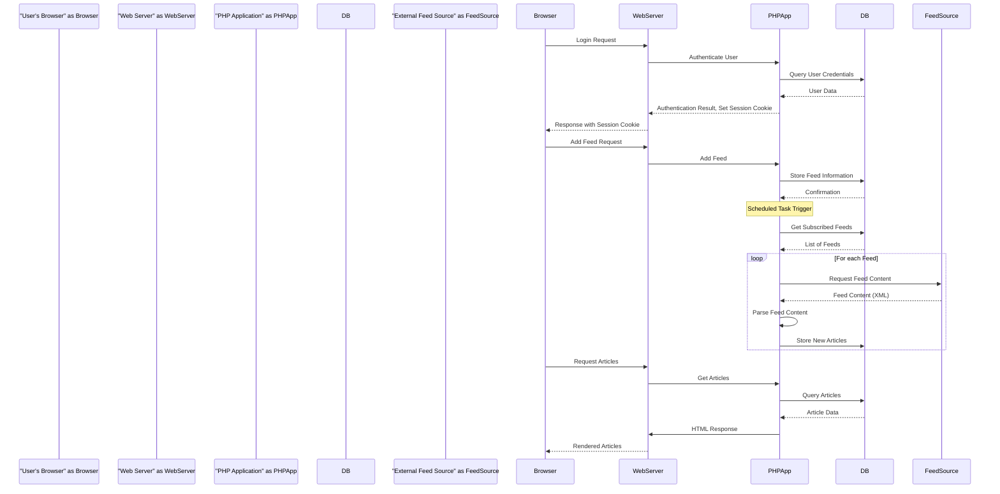

## Project Design Document: FreshRSS (Improved)

**1. Introduction**

This document provides an enhanced design overview of the FreshRSS project, an open-source, self-hosted RSS and Atom feed aggregator. The purpose of this document is to clearly articulate the system's architecture, component interactions, and data flow, specifically for the purpose of conducting thorough threat modeling. This detailed design will enable security analysts and developers to identify potential vulnerabilities and implement appropriate security measures.

**2. Goals**

*   Present a clear and comprehensive description of the FreshRSS architecture, suitable for security analysis.
*   Precisely identify the key components of the system and their respective responsibilities.
*   Illustrate the movement and transformation of data as it flows through the FreshRSS ecosystem.
*   Explicitly highlight potential areas of security concern and attack surfaces to facilitate effective threat modeling.
*   Serve as a valuable reference for development teams, security auditors, and anyone seeking a deep understanding of FreshRSS's internal workings.

**3. Scope**

This document focuses on the core functionalities of FreshRSS that are relevant to security considerations:

*   User authentication and authorization mechanisms.
*   Management of feed subscriptions (adding, removing, categorization).
*   The process of fetching and parsing content from external feeds.
*   Storage and retrieval of articles and related data.
*   The user interface used for interacting with feeds and articles.
*   The extension and plugin architecture and its implications.
*   Fundamental administrative functions.

This document explicitly excludes:

*   Fine-grained details of the user interface implementation (specific HTML, CSS, and JavaScript code).
*   In-depth code-level implementation specifics.
*   Highly specific deployment scenarios (e.g., detailed configurations for particular Docker setups or web server configurations), although general deployment considerations are included.
*   Detailed analysis of specific third-party integrations beyond the basic feed fetching process.

**4. High-Level Architecture**

FreshRSS employs a standard web application architecture, comprising the following primary components:

*   **"Web Server"**:  Responsible for receiving and processing incoming HTTP requests and serving the FreshRSS application to users. Common examples include Apache HTTP Server or Nginx.
*   **"PHP Application"**: The core of FreshRSS, containing the application logic that handles user interactions, fetches and processes feeds, and manages data within the database.
*   **"Database"**:  Used for persistent storage of application data, including user accounts, feed subscriptions, article content, and application settings. Typically supports MySQL/MariaDB and PostgreSQL.
*   **"External Feed Sources"**:  The remote servers that host the RSS or Atom feeds FreshRSS aggregates. These are external and potentially untrusted sources of data.
*   **"User's Browser"**: The client-side interface through which users access and interact with FreshRSS.

**5. Detailed Design**

This section provides a more granular view of each component and its functionalities.

*   **"Web Server"**:
    *   Accepts incoming HTTP and HTTPS requests from user browsers.
    *   Routes requests to the "PHP Application" for dynamic content processing.
    *   Serves static assets such as CSS stylesheets, JavaScript files, and images.
    *   Manages SSL/TLS certificate handling for secure communication.
    *   May implement security measures like request rate limiting, basic authentication, and request filtering based on defined rules.

*   **"PHP Application"**:
    *   **"Authentication and Authorization"**: Manages user login processes, maintains user sessions, and enforces access controls to various features based on user roles and permissions.
    *   **"Feed Management Module"**:  Provides functionality for users to add, delete, and organize their feed subscriptions. Stores metadata associated with each feed (e.g., URL, title, update frequency).
    *   **"Feed Fetcher"**:  Periodically retrieves content from the URLs of subscribed feeds. This process often involves making HTTP requests to external servers.
    *   **"Feed Parser"**:  Processes the XML or Atom content retrieved from feeds, extracting relevant information such as article titles, links, content, and publication dates.
    *   **"Article Storage Module"**:  Stores the parsed article data in the "Database". This includes details like title, URL, content, publication timestamp, and read status.
    *   **"Article Retrieval Module"**:  Queries the "Database" to retrieve articles for display to the user based on their preferences and filters.
    *   **"User Interface Rendering Engine"**:  Generates the HTML, CSS, and JavaScript code that is sent to the "User's Browser" for rendering the user interface.
    *   **"Extension/Plugin Management System"**:  Provides an interface for installing, managing, and executing extensions that extend the core functionality of FreshRSS.
    *   **"Background Task Handler"**:  Manages asynchronous operations, such as scheduled feed fetching, often implemented using cron jobs or similar mechanisms.
    *   **"Configuration Manager"**:  Handles the loading, parsing, and management of application configuration settings.

*   **"Database"**:
    *   Stores "User Accounts" including usernames, password hashes, and associated roles.
    *   Maintains "Feed Subscriptions", linking users to the feeds they have subscribed to.
    *   Stores "Feed Metadata", such as the feed URL, last fetch time, HTTP headers (e.g., ETag, Last-Modified), and any associated errors.
    *   Persists "Article Data", including title, URL, content, publication date, read status, and potentially user-specific flags.
    *   Stores "Application Settings" and user preferences.
    *   May store data specific to installed extensions.

*   **"External Feed Sources"**:
    *   Serve RSS or Atom feed content, typically in XML format, over HTTP or HTTPS.
    *   May implement various authentication mechanisms for accessing their feeds.
    *   Represent an untrusted source of data and can potentially serve malicious content or become unavailable.

*   **"User's Browser"**:
    *   Initiates HTTP requests to the "Web Server" to access FreshRSS.
    *   Renders the HTML, CSS, and JavaScript received from the server to display the user interface.
    *   Allows users to interact with the application by sending requests to perform actions like marking articles as read or adding new feeds.
    *   Stores cookies for session management and potentially other user preferences.

**6. Data Flow**

The following describes the typical flow of data through the FreshRSS system for key operations:

*   **"User Authentication"**:
    *   The "User's Browser" sends login credentials to the "Web Server".
    *   The "Web Server" forwards the credentials to the "PHP Application".
    *   The "PHP Application" queries the "Database" to verify the user's credentials.
    *   The "Database" returns the user's information (or failure).
    *   Upon successful authentication, the "PHP Application" creates a session and sends a response with a session cookie to the "User's Browser".

*   **"Adding a New Feed"**:
    *   The user enters a feed URL in the "User's Browser".
    *   The "User's Browser" sends an "add feed" request to the "Web Server".
    *   The "Web Server" forwards the request to the "PHP Application".
    *   The "PHP Application" validates the URL and stores the feed information in the "Database".

*   **"Background Feed Fetching and Processing"**:
    *   A scheduled task triggers the "Feed Fetcher" within the "PHP Application".
    *   The "Feed Fetcher" retrieves a list of subscribed feeds from the "Database".
    *   For each feed, the "Feed Fetcher" sends an HTTP request to the "External Feed Source".
    *   The "External Feed Source" responds with the feed content (XML).
    *   The "PHP Application" receives the feed content.
    *   The "Feed Parser" within the "PHP Application" parses the XML content.
    *   Extracted article data is stored in the "Database".

*   **"Viewing Articles"**:
    *   The "User's Browser" requests to view articles.
    *   The "Web Server" forwards the request to the "PHP Application".
    *   The "PHP Application" queries the "Database" for relevant articles based on user preferences.
    *   The "Database" returns the requested article data.
    *   The "PHP Application" generates HTML containing the article list and content.
    *   The "Web Server" sends the HTML response to the "User's Browser".
    *   The "User's Browser" renders the articles.

**7. Security Considerations**

This section outlines potential security vulnerabilities and attack vectors within the FreshRSS system.

*   **"Authentication and Authorization Vulnerabilities"**:
    *   Use of weak or default credentials.
    *   Susceptibility to brute-force attacks on login forms.
    *   Vulnerabilities in session management leading to session fixation or hijacking.
    *   Lack of multi-factor authentication (MFA).
    *   Insufficient or improperly implemented role-based access control, potentially allowing unauthorized access to features or data.

*   **"Input Validation and Output Encoding Issues"**:
    *   **"Cross-Site Scripting (XSS)"**: Vulnerability to reflected, stored, or DOM-based XSS through unsanitized feed content, user-provided input (e.g., feed URLs, search terms), or extension data.
    *   **"SQL Injection"**:  Risk of SQL injection vulnerabilities in database queries if user input or feed data is not properly sanitized and parameterized.
    *   **"Command Injection"**: Potential for command injection if user-provided data is used in system commands without proper sanitization.
    *   **"Path Traversal"**: Vulnerabilities arising from inadequate validation of file paths, potentially allowing access to sensitive files.

*   **"Feed Handling Security Risks"**:
    *   Exposure to malicious content embedded within feeds (e.g., malicious scripts, iframes, or exploits leveraging vulnerabilities in the parsing library).
    *   Denial-of-service (DoS) attacks through fetching excessively large feeds or a large number of feeds simultaneously.
    *   **"Server-Side Request Forgery (SSRF)"**:  Risk if the application can be tricked into making requests to internal or unintended external resources.

*   **"Database Security Weaknesses"**:
    *   Use of weak or default database credentials.
    *   Insufficiently restrictive database access controls.
    *   Storage of sensitive information (e.g., database credentials) in easily accessible configuration files.

*   **"Session Management Flaws"**:
    *   Insecure transmission of session identifiers over non-HTTPS connections.
    *   Use of predictable session IDs.
    *   Lack of proper session expiration or invalidation mechanisms.

*   **"Cross-Site Request Forgery (CSRF)"**:
    *   Vulnerability if critical actions can be performed without proper CSRF tokens or other protections.

*   **"Insecure Communication"**:
    *   Lack of mandatory HTTPS enforcement, leading to potential eavesdropping and man-in-the-middle attacks.
    *   Misconfigured SSL/TLS settings, potentially using weak ciphers or outdated protocols.

*   **"Extension Security Concerns"**:
    *   Vulnerabilities introduced by poorly written or malicious third-party extensions.
    *   Lack of proper sandboxing or isolation for extensions, allowing them excessive access to system resources or data.

*   **"Insecure Update Mechanism"**:
    *   Vulnerabilities in the update process that could allow for the deployment of malicious updates.

**8. Deployment Considerations**

The security of a FreshRSS deployment is heavily influenced by the chosen deployment environment:

*   **"Self-hosted on a Web Server (Apache, Nginx)"**: Requires careful manual configuration of the web server, PHP environment, and operating system to ensure security best practices are followed.
*   **"Using Containerization (e.g., Docker)"**: Provides a degree of isolation but still necessitates secure configuration of the Docker container, image, and host system.
*   **"Deployment on Shared Hosting Platforms"**: Security is largely dependent on the security measures implemented by the hosting provider, offering less direct control.

**9. Assumptions and Constraints**

*   It is assumed that the underlying operating system and web server are configured according to security best practices.
*   It is assumed that the database server is properly secured and hardened.
*   The primary focus is on the core FreshRSS application; specific details of individual extensions are not covered in depth.
*   This document represents a general understanding of the FreshRSS architecture and may not encompass every single implementation detail or edge case.

**10. Future Considerations**

*   Detailed design and security analysis of the extension/plugin architecture, including permission models and sandboxing.
*   Specifics of the user interface implementation and potential client-side security vulnerabilities, including a deeper look at JavaScript dependencies.
*   Implementation and enforcement of Content Security Policy (CSP) to mitigate XSS attacks.
*   Detailed analysis of the software update mechanism and its security implications.
*   Consideration of security auditing tools and practices to ensure ongoing security.