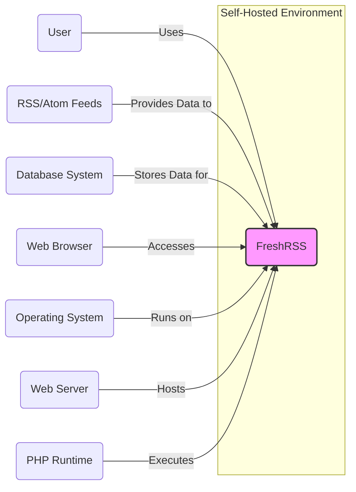
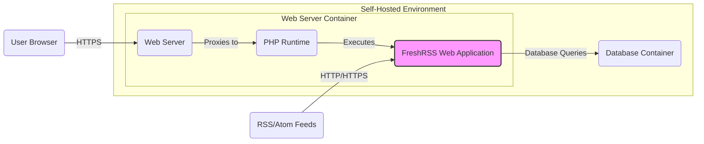
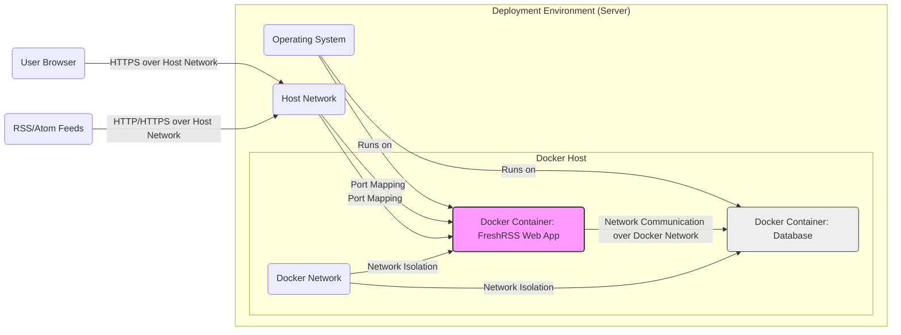

# BUSINESS POSTURE

- Business Priorities and Goals:
  - Goal: Provide users with a self-hosted, open-source RSS feed aggregator to efficiently manage and consume information from various online sources.
  - Priority: User privacy and data control, extensibility and customization, ease of use and accessibility, reliability and performance.

- Business Risks:
  - Risk: Data breaches exposing user subscriptions and reading habits, potentially leading to privacy violations and reputational damage.
  - Risk: Service unavailability due to security vulnerabilities or infrastructure issues, impacting user access to information and potentially causing user dissatisfaction.
  - Risk: Supply chain attacks targeting dependencies or build process, leading to compromised software and potential security incidents for users.
  - Risk: Lack of user trust due to security concerns, hindering adoption and community growth.

# SECURITY POSTURE

- Existing Security Controls:
  - security control: HTTPS enforcement for web access (implementation described in web server configuration documentation).
  - security control: Input sanitization and output encoding to prevent XSS vulnerabilities (implementation within the PHP codebase).
  - security control: Database access control using credentials and potentially network segmentation (implementation described in database and deployment documentation).
  - security control: Regular software updates to address known vulnerabilities in dependencies and core application (process described in project documentation and release notes).
  - accepted risk: Self-hosting model implies shared responsibility for infrastructure security with the user.
  - accepted risk: Reliance on community contributions for security audits and vulnerability reporting.

- Recommended Security Controls:
  - security control: Implement Content Security Policy (CSP) to mitigate XSS risks (implementation in web server configuration or application headers).
  - security control: Regularly perform static application security testing (SAST) and software composition analysis (SCA) on the codebase and dependencies (integration into CI/CD pipeline).
  - security control: Implement rate limiting and brute-force protection for login and API endpoints (implementation within the application or web server).
  - security control: Conduct periodic penetration testing to identify potential vulnerabilities in the application and infrastructure (external security assessment).
  - security control: Implement robust logging and monitoring for security events and anomalies (integration with logging and monitoring infrastructure).

- Security Requirements:
  - Authentication:
    - requirement: Secure authentication mechanism to verify user identity.
    - requirement: Support for strong password policies and potentially multi-factor authentication.
    - requirement: Protection against brute-force attacks and credential stuffing.
  - Authorization:
    - requirement: Role-based access control to manage user permissions and access to features.
    - requirement: Principle of least privilege applied to database access and system resources.
    - requirement: Secure API authorization to protect API endpoints from unauthorized access.
  - Input Validation:
    - requirement: Comprehensive input validation for all user-provided data to prevent injection attacks (SQL injection, XSS, etc.).
    - requirement: Validation on both client-side and server-side to ensure data integrity.
    - requirement: Use of parameterized queries or ORM to prevent SQL injection vulnerabilities.
  - Cryptography:
    - requirement: Secure storage of sensitive data such as user passwords using strong hashing algorithms.
    - requirement: Encryption of sensitive data in transit using HTTPS.
    - requirement: Consider encryption of sensitive data at rest if required by user or business needs.

# DESIGN

## C4 CONTEXT

- Context Diagram Elements:
  - - Name: FreshRSS
    - Type: Software System
    - Description: Self-hosted RSS feed aggregator application. It fetches, stores, and displays content from RSS and Atom feeds, allowing users to manage and read news and updates from various sources in one place.
    - Responsibilities:
      - Fetching and parsing RSS/Atom feeds.
      - Storing feed data and user preferences in a database.
      - Providing a web interface for users to interact with feeds.
      - Managing user accounts and authentication.
    - Security controls:
      - Input validation and output encoding.
      - Authentication and authorization mechanisms.
      - HTTPS enforcement.
      - Regular security updates.
  - - Name: User
    - Type: Person
    - Description: Individuals who use FreshRSS to read and manage their RSS feeds through a web browser.
    - Responsibilities:
      - Authenticating to access FreshRSS.
      - Configuring feed subscriptions and preferences.
      - Reading and managing feed articles.
      - Maintaining strong passwords and protecting their accounts.
    - Security controls:
      - Strong password management.
      - Awareness of phishing and social engineering attacks.
  - - Name: RSS/Atom Feeds
    - Type: External System
    - Description: External websites and services that provide content in RSS or Atom feed formats. FreshRSS fetches data from these feeds.
    - Responsibilities:
      - Providing content in RSS/Atom formats.
      - Ensuring feed availability and integrity.
    - Security controls:
      - HTTPS for feed delivery (recommended).
      - Feed content security (responsibility of feed provider).
  - - Name: Database System
    - Type: Infrastructure System
    - Description: Database system (e.g., MySQL, PostgreSQL, SQLite) used by FreshRSS to store application data, including user accounts, feed subscriptions, and article content.
    - Responsibilities:
      - Storing and retrieving application data.
      - Ensuring data integrity and availability.
      - Providing access control to data.
    - Security controls:
      - Access control lists (ACLs).
      - Database user authentication.
      - Encryption at rest (optional, depending on database system and configuration).
      - Regular backups.
  - - Name: Web Browser
    - Type: Software System
    - Description: Web browser used by users to access and interact with the FreshRSS web interface.
    - Responsibilities:
      - Rendering the FreshRSS web interface.
      - Sending user requests to FreshRSS.
      - Storing user session data (cookies, local storage).
    - Security controls:
      - Browser security features (CSP enforcement, XSS protection).
      - User awareness of browser security settings and extensions.
  - - Name: Operating System
    - Type: Infrastructure System
    - Description: Operating system (e.g., Linux, Windows) on which FreshRSS, Web Server, PHP Runtime, and Database System are running.
    - Responsibilities:
      - Providing a platform for running software.
      - Managing system resources.
      - Providing basic security features (firewall, user permissions).
    - Security controls:
      - Operating system hardening.
      - Regular security updates and patching.
      - Firewall configuration.
  - - Name: Web Server
    - Type: Infrastructure System
    - Description: Web server (e.g., Apache, Nginx) that hosts the FreshRSS application and handles HTTP requests.
    - Responsibilities:
      - Serving static files and proxying requests to PHP Runtime.
      - Handling HTTPS connections.
      - Implementing web server security configurations.
    - Security controls:
      - HTTPS configuration.
      - Web server hardening.
      - Access control and rate limiting.
  - - Name: PHP Runtime
    - Type: Software System
    - Description: PHP runtime environment that executes the FreshRSS PHP code.
    - Responsibilities:
      - Executing PHP code.
      - Providing necessary PHP extensions and libraries.
    - Security controls:
      - PHP security configurations (e.g., disable dangerous functions).
      - Regular PHP updates.

## C4 CONTAINER

- Container Diagram Elements:
  - - Name: FreshRSS Web Application
    - Type: Web Application
    - Description: PHP application code that handles user requests, fetches and processes feeds, and interacts with the database. It implements the core logic of FreshRSS.
    - Responsibilities:
      - Handling user authentication and authorization.
      - Processing user requests from the web interface.
      - Fetching and parsing RSS/Atom feeds.
      - Storing and retrieving data from the database.
      - Generating the web interface.
    - Security controls:
      - Input validation and output encoding.
      - Authentication and authorization logic.
      - Secure session management.
      - Protection against common web application vulnerabilities (OWASP Top 10).
  - - Name: Web Server
    - Type: Web Server
    - Description: Web server (e.g., Nginx, Apache) responsible for handling HTTP/HTTPS requests, serving static files, and proxying PHP requests to the PHP Runtime.
    - Responsibilities:
      - Handling incoming HTTP/HTTPS requests.
      - Serving static assets (HTML, CSS, JavaScript, images).
      - Proxying dynamic requests to the PHP Runtime.
      - Enforcing HTTPS and other security headers.
      - Rate limiting and basic DDoS protection.
    - Security controls:
      - HTTPS configuration (TLS/SSL certificates).
      - Web server hardening and security configurations.
      - Access control and rate limiting.
      - Content Security Policy (CSP) enforcement.
  - - Name: PHP Runtime
    - Type: Runtime Environment
    - Description: PHP runtime environment (e.g., PHP-FPM) that executes the FreshRSS PHP application code.
    - Responsibilities:
      - Executing PHP code.
      - Providing necessary PHP extensions and libraries.
      - Managing PHP processes.
    - Security controls:
      - PHP security configurations (disable dangerous functions, enable security extensions).
      - Regular PHP updates and patching.
      - Resource limits and process isolation.
  - - Name: Database Container
    - Type: Database
    - Description: Containerized database system (e.g., MySQL, PostgreSQL, SQLite) used to store FreshRSS data.
    - Responsibilities:
      - Storing and retrieving application data.
      - Ensuring data persistence and availability.
      - Managing database connections and users.
    - Security controls:
      - Database user authentication and authorization.
      - Network segmentation and access control.
      - Encryption at rest (optional, depending on database system and configuration).
      - Regular backups and disaster recovery.

## DEPLOYMENT

- Deployment Options:
  - Option 1: Docker Compose - Deploy FreshRSS and database using Docker Compose for easy setup and management.
  - Option 2: Manual Installation on Web Server - Install FreshRSS manually on a web server (e.g., Apache, Nginx) with PHP and a database system.
  - Option 3: Cloud Platform Deployment - Deploy FreshRSS on a cloud platform (e.g., AWS, Azure, GCP) using managed services for web server, database, and container orchestration.

- Selected Deployment Architecture: Docker Compose

- Deployment Diagram Elements:
  - - Name: Docker Container: FreshRSS Web App
    - Type: Container
    - Description: Docker container running the FreshRSS web application, including the web server (e.g., Nginx or Apache with PHP-FPM) and FreshRSS application code.
    - Responsibilities:
      - Hosting and running the FreshRSS web application.
      - Handling web requests and responses.
      - Interacting with the database container.
      - Fetching RSS/Atom feeds.
    - Security controls:
      - Container image security scanning (if using pre-built image).
      - Minimal container image with only necessary components.
      - Container runtime security (e.g., resource limits, security profiles).
      - Application-level security controls (as described in Container Diagram).
  - - Name: Docker Container: Database
    - Type: Container
    - Description: Docker container running the database system (e.g., MySQL, PostgreSQL) used by FreshRSS.
    - Responsibilities:
      - Storing and managing FreshRSS data.
      - Providing database access to the FreshRSS web application container.
    - Security controls:
      - Official and hardened database container image.
      - Database access control within the container.
      - Network isolation within the Docker network.
      - Data volume security (permissions, encryption if needed).
  - - Name: Docker Network
    - Type: Network
    - Description: Docker network that isolates the FreshRSS web application container and the database container, allowing them to communicate with each other but restricting external access.
    - Responsibilities:
      - Providing network connectivity between containers.
      - Enforcing network isolation.
    - Security controls:
      - Docker network isolation features.
      - Network policies (if applicable).
  - - Name: Operating System
    - Type: Infrastructure
    - Description: Host operating system running the Docker engine and containers.
    - Responsibilities:
      - Providing the underlying infrastructure for Docker.
      - Managing system resources.
      - Providing host-level security features.
    - Security controls:
      - Operating system hardening and patching.
      - Docker host security configuration.
      - Firewall configuration on the host.
  - - Name: Host Network
    - Type: Network
    - Description: Network to which the server is connected, allowing external access from users and to RSS/Atom feeds.
    - Responsibilities:
      - Providing external network connectivity.
    - Security controls:
      - Firewall at the network level.
      - Network intrusion detection/prevention systems (IDS/IPS).
  - - Name: Port Mapping
    - Type: Network Configuration
    - Description: Docker port mapping that exposes the FreshRSS web application port (e.g., 80 or 443) from the container to the host network, allowing external access.
    - Responsibilities:
      - Enabling external access to the FreshRSS application.
    - Security controls:
      - Restricting exposed ports to only necessary ones.
      - Using HTTPS and port 443 for web access.

## BUILD

```mermaid
flowchart LR
    A("Developer") -- Code Changes --> B("Version Control System (GitHub)")
    B -- Triggers --> C("CI/CD Pipeline (GitHub Actions)")
    C -- Checkout Code, Dependencies --> D("Build Environment")
    D -- Run SAST, SCA, Linters --> E("Security Checks")
    E -- Build Application --> F("Build Artifacts (e.g., Docker Image)")
    F -- Push Image --> G("Container Registry (e.g., GitHub Container Registry)")
    G -- Deploy --> H("Deployment Environment")
    style F fill:#f9f,stroke:#333,stroke-width:2px
```

- Build Process Elements:
  - - Name: Developer
    - Type: Person
    - Description: Software developer who writes and modifies the FreshRSS codebase.
    - Responsibilities:
      - Writing secure and well-tested code.
      - Committing code changes to the version control system.
      - Participating in code reviews.
    - Security controls:
      - Secure coding practices training.
      - Code review process.
      - Local development environment security.
  - - Name: Version Control System (GitHub)
    - Type: Software Service
    - Description: GitHub repository hosting the FreshRSS source code and managing version history.
    - Responsibilities:
      - Storing and managing source code.
      - Tracking code changes and history.
      - Facilitating collaboration among developers.
    - Security controls:
      - Access control and permissions management.
      - Branch protection and code review enforcement.
      - Audit logging of code changes.
  - - Name: CI/CD Pipeline (GitHub Actions)
    - Type: Automation System
    - Description: GitHub Actions workflow that automates the build, test, and deployment process for FreshRSS.
    - Responsibilities:
      - Automating the build process.
      - Running security checks (SAST, SCA, linters).
      - Building and publishing build artifacts (e.g., Docker images).
      - Deploying the application to target environments.
    - Security controls:
      - Secure pipeline configuration and access control.
      - Secrets management for credentials and API keys.
      - Pipeline code review and version control.
      - Isolation of build environments.
  - - Name: Build Environment
    - Type: Infrastructure
    - Description: Environment where the FreshRSS application is built and tested, typically within the CI/CD pipeline.
    - Responsibilities:
      - Providing resources for building and testing the application.
      - Isolating build processes.
    - Security controls:
      - Secure build environment configuration.
      - Regular updates and patching of build tools and dependencies.
      - Access control to build environment.
  - - Name: Security Checks
    - Type: Software Tools
    - Description: Automated security tools integrated into the CI/CD pipeline, including SAST scanners, SCA tools, and linters, to identify potential vulnerabilities and code quality issues.
    - Responsibilities:
      - Performing static analysis of code for security vulnerabilities.
      - Analyzing dependencies for known vulnerabilities.
      - Enforcing code quality standards.
    - Security controls:
      - Regularly updated security tool versions and vulnerability databases.
      - Configuration of security tools to match project security requirements.
      - Review and remediation of security findings.
  - - Name: Build Artifacts (e.g., Docker Image)
    - Type: Software Package
    - Description: Output of the build process, such as a Docker image containing the FreshRSS application, ready for deployment.
    - Responsibilities:
      - Packaging the application and its dependencies.
      - Ensuring the integrity and security of the build artifact.
    - Security controls:
      - Signing and verifying build artifacts.
      - Minimal and hardened build artifacts.
      - Vulnerability scanning of build artifacts.
  - - Name: Container Registry (e.g., GitHub Container Registry)
    - Type: Software Service
    - Description: Registry for storing and managing Docker images, used to distribute the FreshRSS Docker image.
    - Responsibilities:
      - Storing and managing container images.
      - Providing access control to images.
      - Ensuring image availability and integrity.
    - Security controls:
      - Access control and permissions management for images.
      - Image scanning for vulnerabilities.
      - Audit logging of image access and modifications.
  - - Name: Deployment Environment
    - Type: Infrastructure
    - Description: Target environment where FreshRSS is deployed and running, as described in the DEPLOYMENT section.
    - Responsibilities:
      - Running the FreshRSS application.
      - Providing runtime environment and resources.
    - Security controls:
      - Deployment environment security controls as described in DEPLOYMENT section.
      - Infrastructure security hardening and monitoring.

# RISK ASSESSMENT

- Critical Business Processes:
  - Process: Content Aggregation and Delivery - Fetching, parsing, and storing RSS/Atom feeds and delivering content to users. Disruption can lead to users missing important information.
  - Process: User Authentication and Authorization - Verifying user identity and controlling access to the application and data. Compromise can lead to unauthorized access and data breaches.
  - Process: Application Availability - Ensuring the FreshRSS application is accessible and functional for users. Downtime can impact user productivity and satisfaction.

- Data Sensitivity:
  - Data: User Credentials (passwords) - Highly Sensitive. Requires strong cryptographic protection and access control. Exposure can lead to unauthorized account access.
  - Data: User Preferences and Subscriptions - Sensitive. Reveals user interests and information consumption habits. Exposure can lead to privacy violations.
  - Data: Feed Content (articles, titles, descriptions) - Moderately Sensitive. Publicly available information, but aggregated data can reveal user reading habits. Exposure has moderate privacy implications.
  - Data: Application Logs - Moderately Sensitive. Can contain user activity and system information. Exposure can aid in security analysis or reveal user behavior.

# QUESTIONS & ASSUMPTIONS

- Questions:
  - Question: What is the expected user base size and growth for FreshRSS? This will help in scaling security controls and infrastructure.
  - Question: Are there any specific compliance requirements (e.g., GDPR, HIPAA) that FreshRSS needs to adhere to? This will influence data privacy and security requirements.
  - Question: What is the acceptable downtime for FreshRSS service? This will impact availability and disaster recovery planning.
  - Question: What is the budget allocated for security measures and tools? This will guide the selection of security controls and technologies.

- Assumptions:
  - Assumption: FreshRSS is intended for self-hosting by individual users or small organizations with moderate technical skills.
  - Assumption: Users are concerned about data privacy and control over their information.
  - Assumption: Security is a priority, but ease of use and functionality are also important considerations.
  - Assumption: The deployment environment is assumed to be a standard server or cloud infrastructure capable of running Docker or a web server with PHP and a database.