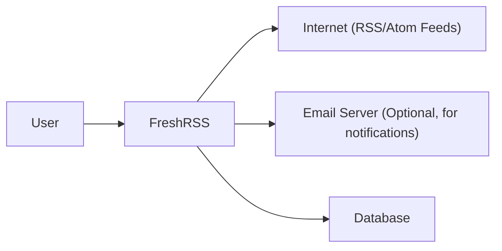
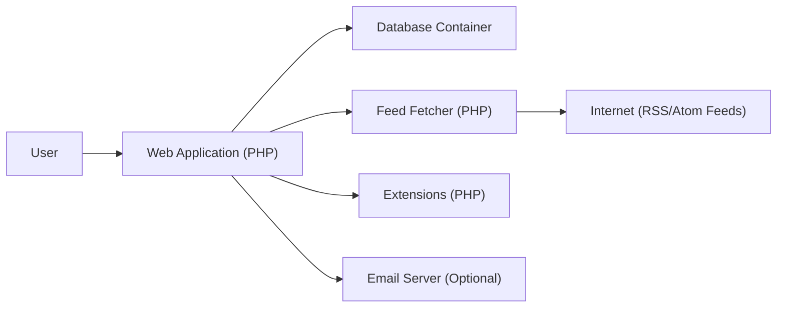
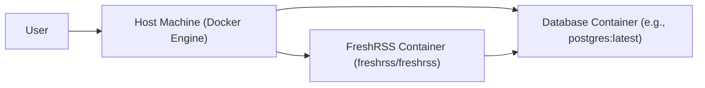
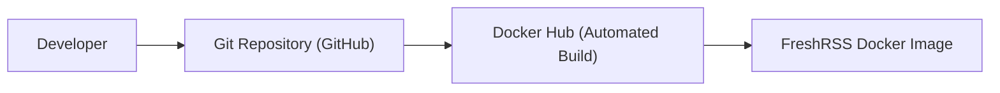

Okay, let's create a design document for the FreshRSS project, suitable for later threat modeling.

# BUSINESS POSTURE

FreshRSS is an open-source, self-hosted RSS feed aggregator.  This suggests a user base that prioritizes control over their data, privacy, and potentially cost savings compared to managed services.  The project's success hinges on ease of use, reliability, and maintaining a positive reputation within the open-source community.  Since it's self-hosted, the ultimate responsibility for security rests with the user deploying the instance, but the project should strive to provide secure defaults and clear guidance.

Business Priorities:

*   Provide a free and open-source alternative to commercial RSS aggregators.
*   Enable users to control their own data and privacy.
*   Offer a user-friendly and feature-rich experience.
*   Maintain a secure and reliable application.
*   Foster a strong community around the project.

Business Goals:

*   Increase user adoption and community engagement.
*   Maintain a positive reputation for security and reliability.
*   Provide regular updates and bug fixes.
*   Ensure the application is easy to install and maintain.

Most Important Business Risks:

*   Reputational Damage: Security vulnerabilities or data breaches could severely damage the project's reputation and erode user trust, especially given the privacy-conscious user base.
*   Data Loss: Users rely on FreshRSS to store and manage their feeds. Data loss due to bugs, vulnerabilities, or inadequate user-side security could be a significant issue.
*   Resource Exhaustion:  While not a direct financial risk, excessive resource consumption (CPU, memory, bandwidth) due to inefficient code or malicious activity could impact users' self-hosted environments.
*   Abandonment: If the project loses active maintainers, it could become vulnerable to security threats and fall behind competing solutions.
*   Supply Chain Attacks: Compromise of dependencies or build tools could introduce vulnerabilities into the application.

# SECURITY POSTURE

Existing Security Controls (based on the GitHub repository and common practices):

*   security control: Input Validation: The project appears to use PHP's built-in functions and potentially custom logic to sanitize user inputs and prevent common web vulnerabilities like XSS and SQL injection. (Needs further investigation in code).
*   security control: Authentication: FreshRSS implements user authentication to protect access to the application. (Details in `app/Models/User.php` and related authentication logic).
*   security control: Authorization:  Access control mechanisms are likely in place to restrict user actions based on roles or permissions (e.g., admin vs. regular user). (Needs further investigation in code).
*   security control: Regular Updates: The project has a history of regular releases, suggesting that security patches and bug fixes are addressed promptly.
*   security control: Dependency Management: The project uses Composer for dependency management, allowing for easier tracking and updating of third-party libraries.
*   security control: Configuration Options: FreshRSS provides configuration options that can impact security, such as setting database credentials and enabling HTTPS.
*   security control: Docker Support: Official Docker images are provided, which can simplify deployment and improve security through containerization.

Accepted Risks:

*   accepted risk: Self-Hosted Responsibility: Users are ultimately responsible for securing their own hosting environment, including the web server, database, and operating system.
*   accepted risk: Default Configuration: The default configuration may not be the most secure, requiring users to actively configure security settings.
*   accepted risk: Third-Party Dependencies: While Composer helps manage dependencies, vulnerabilities in third-party libraries could still impact FreshRSS.
*   accepted risk: Limited Built-in Protections: FreshRSS, being a PHP application, may not have built-in protections against all types of attacks, relying on server-level configurations (e.g., web application firewalls) for some defenses.

Recommended Security Controls:

*   Content Security Policy (CSP): Implement a strong CSP to mitigate XSS and other code injection attacks.
*   HTTP Security Headers: Enforce security-related HTTP headers like HSTS, X-Frame-Options, X-Content-Type-Options, and Referrer-Policy.
*   Two-Factor Authentication (2FA): Offer 2FA to enhance account security.
*   Rate Limiting: Implement rate limiting to prevent brute-force attacks and denial-of-service.
*   Regular Security Audits: Conduct periodic security audits and penetration testing.
*   Automated Security Scanning: Integrate SAST and DAST tools into the development workflow.
*   Clear Security Documentation: Provide comprehensive security documentation and best practices for users.

Security Requirements:

*   Authentication:
    *   Strong password policies (length, complexity).
    *   Secure password storage (hashing with salt).
    *   Protection against brute-force attacks.
    *   Session management (secure cookies, timeouts).
    *   Optional 2FA.

*   Authorization:
    *   Role-based access control (RBAC) or similar mechanism.
    *   Restrict access to administrative functions.
    *   Ensure users can only access their own data.

*   Input Validation:
    *   Validate all user inputs (feeds, URLs, search queries, etc.).
    *   Sanitize data to prevent XSS and SQL injection.
    *   Use parameterized queries for database interactions.

*   Cryptography:
    *   Use strong encryption for sensitive data (e.g., API keys, passwords).
    *   Use HTTPS for all communication.
    *   Properly manage cryptographic keys.

# DESIGN

## C4 CONTEXT

Element Descriptions:

*   Element:
    *   Name: User
    *   Type: Person
    *   Description: A person who uses FreshRSS to read and manage their RSS feeds.
    *   Responsibilities: Interacts with the FreshRSS web interface, adds/removes feeds, manages settings.
    *   Security controls: Strong passwords, potentially 2FA (if implemented).

*   Element:
    *   Name: FreshRSS
    *   Type: Software System
    *   Description: The FreshRSS application itself.
    *   Responsibilities: Fetches and parses RSS/Atom feeds, provides a web interface for users, stores data in a database.
    *   Security controls: Input validation, authentication, authorization, secure configuration, regular updates.

*   Element:
    *   Name: Internet (RSS/Atom Feeds)
    *   Type: External System
    *   Description: The external websites and services that provide RSS/Atom feeds.
    *   Responsibilities: Provides content in RSS/Atom format.
    *   Security controls: Relies on the security of the external websites. FreshRSS should validate and sanitize feed content.

*   Element:
    *   Name: Email Server (Optional, for notifications)
    *   Type: External System
    *   Description: An optional email server used for sending notifications to users.
    *   Responsibilities: Sends emails based on FreshRSS configuration.
    *   Security controls: Relies on the security of the email server. FreshRSS should use secure email sending protocols (e.g., TLS).

*   Element:
    *   Name: Database
    *   Type: External System
    *   Description: The database used to store FreshRSS data (users, feeds, articles, etc.).
    *   Responsibilities: Stores and retrieves data.
    *   Security controls: Database access control, encryption at rest (if supported by the database), regular backups.

## C4 CONTAINER

Element Descriptions:

*   Element:
    *   Name: User
    *   Type: Person
    *   Description: A person who uses FreshRSS.
    *   Responsibilities: Interacts with the web application.
    *   Security controls: Strong passwords, potentially 2FA.

*   Element:
    *   Name: Web Application (PHP)
    *   Type: Container
    *   Description: The main FreshRSS web application, handling user interface and logic.
    *   Responsibilities: Renders the web interface, handles user requests, interacts with other containers.
    *   Security controls: Input validation, authentication, authorization, session management, output encoding.

*   Element:
    *   Name: Database Container
    *   Type: Container
    *   Description: The database used to store data.
    *   Responsibilities: Stores and retrieves data.
    *   Security controls: Database access control, encryption at rest (if supported), regular backups.

*   Element:
    *   Name: Feed Fetcher (PHP)
    *   Type: Container
    *   Description: A component responsible for fetching and parsing RSS/Atom feeds.
    *   Responsibilities: Retrieves feed data from the internet, parses the data, and stores it in the database.
    *   Security controls: Input validation (feed URLs), secure HTTP connections, protection against XML vulnerabilities (e.g., XXE).

*   Element:
    *   Name: Internet (RSS/Atom Feeds)
    *   Type: External System
    *   Description: External websites providing RSS/Atom feeds.
    *   Responsibilities: Provides content.
    *   Security controls: Relies on external site security.

*   Element:
    *   Name: Extensions (PHP)
    *   Type: Container
    *   Description: Optional extensions that add functionality to FreshRSS.
    *   Responsibilities: Provides additional features.
    *   Security controls: Should follow secure coding practices, undergo security reviews.

*   Element:
    *   Name: Email Server (Optional)
    *   Type: External System
    *   Description: Optional email server for notifications.
    *   Responsibilities: Sends emails.
    *   Security controls: Relies on email server security.

## DEPLOYMENT

Possible Deployment Solutions:

1.  Manual Installation:  Installing PHP, a web server (Apache, Nginx), and a database (MySQL, PostgreSQL, SQLite) manually on a server.
2.  Docker Compose: Using the provided Docker images and Docker Compose to orchestrate the deployment.
3.  Cloud Hosting: Deploying on a cloud platform (AWS, Azure, Google Cloud) using virtual machines, containers, or managed services.
4.  Pre-built Packages: Using pre-built packages for specific Linux distributions (e.g., .deb, .rpm).

Chosen Solution (for detailed description): Docker Compose

Deployment Diagram:

Element Descriptions:

* Element:
    * Name: Host Machine (Docker Engine)
    * Type: Infrastructure Node
    * Description: The physical or virtual server running Docker Engine.
    * Responsibilities: Runs Docker containers.
    * Security controls: Operating system security, firewall, Docker security best practices.

* Element:
    * Name: FreshRSS Container (freshrss/freshrss)
    * Type: Container
    * Description: The Docker container running the FreshRSS application.
    * Responsibilities: Runs the FreshRSS web application and feed fetcher.
    * Security controls: Container security best practices, regular image updates, minimal base image.

* Element:
    * Name: Database Container (e.g., postgres:latest)
    * Type: Container
    * Description: The Docker container running the database server.
    * Responsibilities: Runs the database.
    * Security controls: Database security best practices, secure configuration, regular image updates.
* Element:
    * Name: User
    * Type: Person
    * Description: A person who uses FreshRSS.
    * Responsibilities: Interacts with the web application.
    * Security controls: Strong passwords, potentially 2FA.

## BUILD

FreshRSS uses a combination of manual steps and automated processes for building and publishing releases. The primary build process involves creating Docker images.

Build Process Diagram:

Build Process Description:

1.  Developer: Developers write code and commit changes to the Git repository on GitHub.
2.  Git Repository (GitHub): The central repository for the FreshRSS source code.
3.  Docker Hub (Automated Build): Docker Hub is configured to automatically build Docker images when changes are pushed to specific branches (e.g., `edge`, `latest`) in the GitHub repository.  This uses the `Dockerfile` in the repository.
4.  FreshRSS Docker Image: The resulting Docker image is published on Docker Hub, making it available for users to download and deploy.

Security Controls in Build Process:

*   security control: Version Control (Git): All code changes are tracked in Git, providing an audit trail and allowing for rollbacks.
*   security control: Automated Builds (Docker Hub): Docker Hub's automated build system ensures that images are built consistently from the source code in the repository.
*   security control: Dockerfile Best Practices: The `Dockerfile` should follow security best practices, such as using minimal base images, avoiding unnecessary packages, and running as a non-root user.
*   security control: Dependency Management (Composer): Composer helps manage PHP dependencies, making it easier to track and update them.  However, regular auditing of dependencies for vulnerabilities is crucial.
*   security control: (Recommended) Image Scanning: Integrate Docker image scanning tools (e.g., Trivy, Clair) into the Docker Hub build process or a separate CI pipeline to detect vulnerabilities in the base image and application dependencies.
*   security control: (Recommended) Code Scanning: Integrate SAST tools (e.g., PHPStan, Psalm) into a CI pipeline (e.g., GitHub Actions) to detect potential code vulnerabilities before they are merged into the main branch.

# RISK ASSESSMENT

Critical Business Processes:

*   Feed Aggregation: The core function of FreshRSS is to fetch, parse, and present RSS/Atom feeds to users.  Disruption of this process would render the application unusable.
*   Data Storage: FreshRSS stores user data, including feed subscriptions, read/unread status, and potentially saved articles.  Loss or corruption of this data would be a significant issue.
*   User Authentication and Authorization:  Protecting user accounts and ensuring that users can only access their own data is critical.

Data Sensitivity:

*   Feed Subscriptions:  While not inherently sensitive, a user's feed subscriptions could reveal their interests and potentially be used for profiling. (Medium Sensitivity)
*   Read/Unread Status:  Similar to feed subscriptions, this data could provide insights into a user's reading habits. (Low Sensitivity)
*   Saved Articles:  If users save articles within FreshRSS, the content of those articles could be sensitive, depending on the source. (Medium to High Sensitivity, depending on content)
*   User Credentials:  Usernames and hashed passwords are highly sensitive and must be protected with strong security measures. (High Sensitivity)
*   API Keys (if used):  API keys for external services (e.g., for sharing or full-text extraction) are sensitive and should be stored securely. (High Sensitivity)

# QUESTIONS & ASSUMPTIONS

Questions:

*   What specific database systems are officially supported and tested? (The documentation mentions MySQL, PostgreSQL, and SQLite, but the level of support and testing for each may vary).
*   What are the recommended server configurations (hardware, software) for different usage scenarios (e.g., number of users, feeds)?
*   Are there any existing security audits or penetration testing reports available?
*   What is the process for reporting security vulnerabilities?
*   What are the plans for future security enhancements (e.g., 2FA, CSP)?
*   How are extensions reviewed for security before being included in the official list?
*   What level of input sanitization is performed on feed content itself (beyond just the feed URL)?  Are there protections against malicious content within feeds?
*   Is there any logging implemented, and if so, what information is logged and for how long?

Assumptions:

*   BUSINESS POSTURE: Assumes a user base primarily concerned with privacy and data control. Assumes the project aims for a balance between ease of use and security.
*   SECURITY POSTURE: Assumes that basic security measures (input validation, authentication) are implemented, but may need strengthening. Assumes users are responsible for securing their own hosting environment.
*   DESIGN: Assumes a standard LAMP-like architecture (Linux, Apache/Nginx, MySQL/PostgreSQL/SQLite, PHP). Assumes Docker is the preferred deployment method. Assumes the build process relies heavily on Docker Hub's automated builds. Assumes extensions are loaded dynamically.