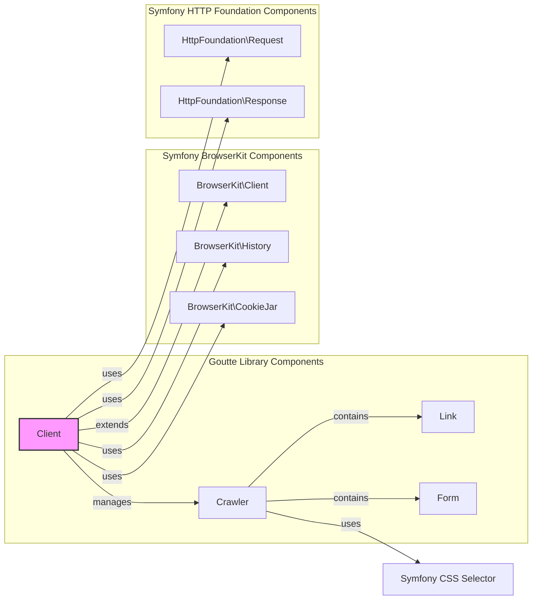
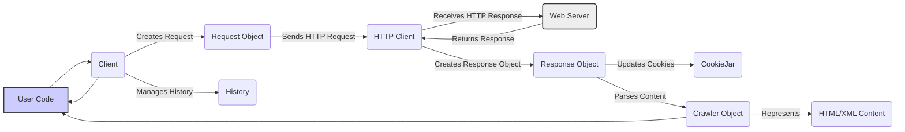

# Project Design Document: Goutte Web Scraping Library

**Version:** 1.1
**Date:** October 26, 2023
**Author:** AI Software Architect

## 1. Introduction

This document provides a detailed design overview of the Goutte PHP library, a screen scraping and web crawling library. This document is intended to serve as a foundation for subsequent threat modeling activities. It outlines the key components, architecture, and data flow within Goutte, highlighting potential areas of interest for security analysis. This revision aims to provide more clarity and detail compared to the initial version.

## 2. Goals and Non-Goals

### 2.1. Goals

*   Provide a comprehensive architectural overview of the Goutte library.
*   Clearly identify the key components and their interactions within the system.
*   Describe the typical data flow during a web scraping operation using Goutte.
*   Highlight potential security considerations based on the design and data flow.
*   Serve as a well-structured and informative basis for future threat modeling exercises.

### 2.2. Non-Goals

*   Provide a detailed, line-by-line code-level analysis of every function and method within Goutte or its dependencies.
*   Offer specific security recommendations, code fixes, or implementation details for mitigating identified threats.
*   Document the library's public API in exhaustive detail, including all available methods and parameters.
*   Include performance analysis, benchmarking data, or optimization strategies for Goutte.

## 3. Architectural Overview

Goutte leverages the robust foundation of the Symfony BrowserKit and CSS Selector components to provide its web scraping capabilities. At its core, Goutte simulates a web browser's behavior programmatically, allowing developers to make HTTP requests, navigate web pages, and efficiently extract data from HTML and XML responses.

### 3.1. Key Components

*   **`Client`:** The primary interface for interacting with Goutte. It extends Symfony's `BrowserKit\Client` and is responsible for initiating and managing HTTP requests, handling cookies and history.
*   **`Crawler`:** Represents the parsed HTML or XML document retrieved from a web page. It offers methods for traversing the Document Object Model (DOM), selecting specific elements using CSS selectors or XPath expressions, and extracting relevant data.
*   **`Request`:** Encapsulates an HTTP request, including details such as the URI, HTTP method (GET, POST, PUT, DELETE, etc.), request headers, and request parameters. This is inherited from Symfony's `HttpFoundation\Request`.
*   **`Response`:** Represents the HTTP response received from the web server. It includes the HTTP status code, response headers, and the response content (typically HTML or XML). This is inherited from Symfony's `HttpFoundation\Response`.
*   **`History`:** Manages the browsing history within a Goutte `Client` instance, enabling navigation through previously visited pages (e.g., "back" and "forward" functionality). This is part of Symfony's `BrowserKit\History`.
*   **`CookieJar`:** Responsible for managing cookies, allowing Goutte to maintain session state and handle website authentication that relies on cookies. This is part of Symfony's `BrowserKit\CookieJar`.
*   **`Link`:** Represents an HTML hyperlink (`<a>` tag) found within a `Crawler` instance. It provides methods to follow the link, triggering a new request.
*   **`Form`:** Represents an HTML form element found within a `Crawler` instance. It allows programmatic interaction with forms, including setting form values and submitting the form.
*   **Symfony BrowserKit:** Provides the foundational framework for simulating browser behavior, handling the underlying mechanics of making requests, managing responses, and dealing with history and cookies.
*   **Symfony CSS Selector:** Enables the powerful selection of HTML elements within a `Crawler` object using familiar CSS selector syntax.

### 3.2. Component Diagram

## 4. Data Flow

The typical data flow within Goutte during a web scraping operation can be broken down into the following steps:

1. **User Initiates Action:** The user's code interacts with the `Client` object, typically by calling methods like `request()` to initiate a new HTTP request or `click()` to follow a link.
    *   The `Client` prepares a `Request` object, encapsulating the target URI, HTTP method, headers, and any necessary parameters.
2. **Request is Sent:** The `Client` utilizes an underlying HTTP client (often the default PHP stream wrapper or a configured alternative like cURL) to transmit the `Request` to the target web server.
3. **Response is Received:** The web server processes the request and sends back an HTTP `Response`.
4. **Response Processing:** The `Client` receives the `Response`.
    *   The `Response` object stores the HTTP status code, headers, and the raw content.
    *   The `CookieJar` updates its stored cookies based on the `Set-Cookie` headers in the `Response`.
    *   If the response content is HTML or XML, a `Crawler` object is created, parsing the content and building a traversable DOM representation.
5. **Data Extraction and Navigation:** The user's code interacts with the `Crawler` object to:
    *   Traverse the DOM structure using methods provided by the `Crawler`.
    *   Select specific elements using CSS selectors via the Symfony CSS Selector component.
    *   Extract data (text content, attribute values, etc.) from the selected elements.
    *   Identify and interact with `Link` elements to navigate to other pages, triggering new requests (back to step 1).
    *   Identify and interact with `Form` elements to submit data, also triggering new requests.
6. **History Management:** The `History` component tracks the sequence of visited pages, allowing the user to simulate browser navigation (e.g., going back to the previous page).

### 4.1. Data Flow Diagram

## 5. Security Considerations

Based on the architectural design and data flow of Goutte, several potential security considerations warrant attention:

*   **Server-Side Request Forgery (SSRF):**
    *   Goutte's core functionality involves making HTTP requests to URLs. If the target URL is derived from untrusted user input without proper sanitization and validation, an attacker could potentially force Goutte to make requests to internal or unintended systems, leading to information disclosure or other malicious actions.
*   **Injection Attacks (Indirect):**
    *   While Goutte doesn't directly execute code received from the target server, vulnerabilities on the scraped website could lead to the extraction of malicious content (e.g., JavaScript). If this extracted data is then used without proper sanitization in other parts of the user's application, it could lead to Cross-Site Scripting (XSS) or other injection vulnerabilities.
*   **Denial of Service (DoS):**
    *   A malicious actor could potentially use Goutte to send a large number of requests to a target website, overwhelming its resources and causing a denial of service. Proper rate limiting and responsible scraping practices are essential to mitigate this risk.
*   **Information Disclosure:**
    *   Goutte is designed to extract information from web pages. If the target website contains sensitive data, improper handling or storage of the extracted data could lead to information disclosure.
*   **Dependency Vulnerabilities:**
    *   Goutte relies on Symfony components (BrowserKit, CSS Selector, HTTP Foundation) and the underlying HTTP client. Vulnerabilities in these dependencies could directly impact Goutte's security. Regular updates and security audits of dependencies are crucial.
*   **HTML/XML Parsing Vulnerabilities:**
    *   The process of parsing HTML and XML content to build the `Crawler` object could be susceptible to vulnerabilities if the parser encounters malformed or intentionally malicious content designed to exploit parsing flaws.
*   **Cookie Handling and Security:**
    *   Goutte's `CookieJar` manages cookies. Improper handling or insecure storage of these cookies could potentially lead to session hijacking or other authentication-related vulnerabilities.
*   **Exposure of Sensitive Data in Logs:**
    *   Care must be taken to avoid logging sensitive information, such as API keys, authentication tokens, or personally identifiable information (PII) that might be included in requests or extracted from responses.
*   **Bypass of Security Measures:**
    *   Attackers might attempt to use Goutte to bypass security measures on target websites, such as CAPTCHAs or rate limiting, if not implemented robustly.

## 6. Deployment Considerations

The security of the environment where Goutte is deployed is critical. Key considerations include:

*   **Secure Hosting Environment:** Ensure the server or environment running the PHP application using Goutte is properly secured and hardened.
*   **Dependency Management:** Utilize a dependency management tool like Composer to manage Goutte and its dependencies, facilitating easy updates for security patches.
*   **Configuration Best Practices:** Configure Goutte appropriately, including setting reasonable timeouts, user agents, and potentially utilizing proxy servers.
*   **Rate Limiting and Error Handling:** Implement rate limiting within the application using Goutte to prevent abuse and overload of target websites. Implement robust error handling to prevent sensitive information from being exposed in error messages.
*   **Input Validation and Output Encoding:**  Even though Goutte is primarily for *receiving* data, if the application using Goutte takes user input to determine scraping targets, proper validation is crucial to prevent SSRF. If extracted data is displayed, proper output encoding is necessary to prevent XSS.

## 7. Future Considerations

Potential future enhancements or changes to Goutte could introduce new security considerations:

*   **JavaScript Rendering Capabilities:** If Goutte were to incorporate the ability to render JavaScript, it would introduce the complexities and security risks associated with executing potentially untrusted JavaScript code.
*   **Advanced Authentication Support:** Supporting more complex authentication mechanisms might require careful handling and secure storage of credentials.
*   **Plugin or Extension System:** If Goutte were to introduce a plugin or extension system, the security of these extensions would need to be carefully considered.

This document provides a detailed design overview of the Goutte library, serving as a foundation for subsequent threat modeling activities. Understanding the architecture, components, and data flow is crucial for identifying potential vulnerabilities and developing appropriate mitigation strategies.