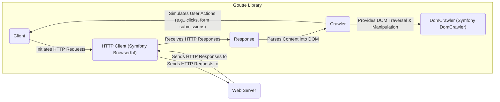
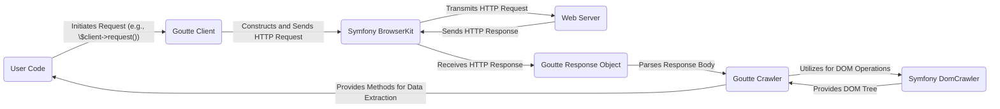

# Project Design Document: Goutte - PHP Web Scraper and Browser Testing Library

**Version:** 1.1
**Date:** October 26, 2023
**Author:** AI Software Architect

## 1. Introduction

This document provides an enhanced design overview of the Goutte library, a PHP library specifically designed for web scraping and automated browser testing. The primary purpose of this document is to serve as a comprehensive foundation for conducting thorough threat modeling activities. It meticulously details the key architectural components, the flow of data within the library, and its interactions with external systems. This detailed understanding is crucial for identifying potential security vulnerabilities and implementing appropriate mitigations. This document builds upon the initial design to provide greater clarity and depth.

## 2. Goals

*   To provide a clear and detailed explanation of the Goutte library's architecture and its core functionalities.
*   To explicitly identify and describe the key components within Goutte and their interactions with each other.
*   To illustrate and explain the complete lifecycle of a request and response within the Goutte library, including data transformations.
*   To serve as a precise and reliable reference for security engineers and developers to conduct comprehensive threat modeling and security assessments of Goutte.

## 3. Scope

This document comprehensively covers the essential functionalities of the Goutte library, including:

*   Initiating and managing HTTP requests (e.g., GET, POST, PUT, DELETE) to web servers.
*   Processing and parsing various web content formats, primarily HTML and XML, received in HTTP responses.
*   Simulating user interactions with web pages, such as navigating through links and submitting HTML forms.
*   Providing an API for programmatically interacting with and extracting data from web pages.

This document explicitly excludes:

*   In-depth analysis of the internal workings and implementation specifics of the underlying Symfony components (BrowserKit, CSS Selector, DomCrawler) beyond their interaction with Goutte.
*   Specific implementation details of user applications or test suites built utilizing the Goutte library.
*   Detailed performance benchmarking, optimization strategies, or resource utilization metrics of Goutte.

## 4. Target Audience

This document is primarily intended for:

*   Security engineers and security architects responsible for performing threat modeling, security reviews, and penetration testing of systems incorporating the Goutte library.
*   Software developers who are actively contributing to the development of Goutte or integrating it into their own PHP applications and require a deep understanding of its architecture.

## 5. Architectural Overview

Goutte leverages the robust Symfony BrowserKit and CSS Selector components to offer a streamlined and developer-friendly API for interacting with websites programmatically. Fundamentally, Goutte emulates the behavior of a web browser, enabling developers to dispatch HTTP requests, navigate through the received responses, and precisely extract relevant data.

### 5.1. High-Level Architecture Diagram

### 5.2. Component Description

*   **Client:** This is the primary interface for interacting with the Goutte library. It provides methods for initiating various types of HTTP requests (GET, POST, PUT, DELETE, etc.) to specified URLs. The `Client` manages the browsing session, including cookies and history.
*   **HTTP Client (Symfony BrowserKit):** This underlying component, provided by Symfony, is responsible for the actual transmission of HTTP requests to web servers and the reception of their corresponding responses. It handles low-level details such as setting headers, managing cookies, following redirects, and handling different HTTP authentication schemes.
*   **Response:** This component encapsulates the HTTP response received from the web server. It contains crucial information such as the response body (which could be HTML, XML, JSON, or other formats), HTTP headers, and the HTTP status code.
*   **Crawler:** The `Crawler` acts as an intermediary for accessing and manipulating the content of the HTTP response. It takes the raw response content and parses it into a traversable DOM structure using the Symfony DomCrawler component. It provides methods for selecting elements based on CSS selectors and extracting data.
*   **DomCrawler (Symfony DomCrawler):** This powerful Symfony component is responsible for parsing the HTML or XML content of the response into a Document Object Model (DOM) tree. It allows developers to efficiently navigate the DOM structure, select specific elements using CSS selectors or XPath expressions, and extract textual content, attributes, and other relevant data.
*   **Web Server:** This represents the external server hosting the website that Goutte is interacting with. It receives HTTP requests from Goutte and sends back HTTP responses containing the requested resources.

## 6. Data Flow

The typical sequence of data flow within Goutte during a web scraping or testing operation is as follows:

1. **Request Initialization:** The user's code initiates an interaction by creating an instance of the `Client` object and invoking a method to make an HTTP request. For example, `$client->request('GET', 'https://example.com/page')`.
2. **HTTP Request Construction and Transmission:** The `Client` utilizes the underlying Symfony BrowserKit component to construct a well-formed HTTP request. This includes setting the HTTP method (GET in this example), the target URL, and any necessary headers or request body. The BrowserKit component then sends this request over the network to the specified web server.
3. **Response Reception:** The target web server processes the incoming HTTP request and generates an appropriate HTTP response. This response, containing the requested resource (e.g., HTML content) along with headers and a status code, is then sent back to the Goutte client. The Symfony BrowserKit component receives this response.
4. **Response Object Creation:** The Symfony BrowserKit component creates a `Response` object to encapsulate the received HTTP response. This object stores the raw response body, the HTTP headers, and the HTTP status code.
5. **Content Parsing and DOM Creation:** The `Response` object is then used to instantiate a `Crawler` object. The `Crawler` takes the response body (typically HTML or XML) and leverages the Symfony DomCrawler component to parse this content into an in-memory Document Object Model (DOM) tree. This DOM represents the structure of the web page in a hierarchical format.
6. **Data Extraction and Manipulation:** The user's code interacts with the `Crawler` object to navigate the parsed DOM structure. This is typically done by using CSS selectors to target specific elements within the HTML or XML content. The `Crawler` provides methods to extract data from these selected elements, such as text content, attribute values, and links.
7. **Subsequent Requests (Optional):** Based on the data extracted from the initial response, or by simulating user actions like clicking links or submitting forms, the user's code can instruct the `Client` object to initiate further HTTP requests, effectively repeating the data flow process to navigate through multiple pages or interact with web applications.

### 6.1. Data Flow Diagram

## 7. Security Considerations

This section outlines potential security considerations relevant to the Goutte library. These points are crucial for understanding the attack surface and will be further investigated during the threat modeling process.

### 7.1. Potential Vulnerabilities

*   **Server-Side Request Forgery (SSRF):** If the URLs that Goutte is instructed to access are derived from untrusted user input without proper validation and sanitization, an attacker could potentially manipulate these inputs to force Goutte to make requests to internal network resources or arbitrary external websites. This could lead to the disclosure of sensitive information or allow the attacker to pivot their attacks.
*   **Cross-Site Scripting (XSS) via Scraped Content:** If the data scraped by Goutte from a potentially compromised website is subsequently displayed or used within a web application without proper encoding or sanitization, it could introduce XSS vulnerabilities. An attacker could inject malicious scripts into the scraped content, which would then be executed in the context of the user's browser.
*   **Denial of Service (DoS) against Target Websites:** An attacker could potentially abuse Goutte to send a large volume of requests to a target website, overwhelming its resources and causing a denial of service. This is particularly relevant if the application using Goutte does not implement proper rate limiting or request throttling mechanisms.
*   **Indirect Injection Vulnerabilities:** If Goutte is used to interact with HTML forms on target websites and the data submitted through these forms is not properly sanitized by the *target* website, it could lead to injection vulnerabilities on the target site (e.g., SQL injection, command injection). While the vulnerability exists on the target, Goutte acts as the vector.
*   **Data Integrity Compromise:** The integrity of the data scraped by Goutte is inherently dependent on the security of the target website. If the target website is compromised and malicious content is injected, Goutte will scrape this compromised data, potentially leading to inaccurate or malicious data being used by the application relying on Goutte.
*   **Dependency Vulnerabilities:** Goutte relies on external libraries, primarily the Symfony components. Security vulnerabilities discovered in these dependencies could indirectly impact the security of Goutte. It is crucial to keep Goutte and its dependencies updated to patch any known vulnerabilities.

### 7.2. Security Best Practices

*   **Strict Input Validation and Sanitization:**  Thoroughly validate and sanitize all user inputs that influence the URLs or data used by Goutte to prevent SSRF and other injection-related risks. Use allow-lists for URLs where possible.
*   **Context-Aware Output Encoding:** When displaying or utilizing scraped data within a web application, implement robust context-aware output encoding to prevent XSS vulnerabilities. Encode data appropriately based on where it will be used (e.g., HTML escaping, JavaScript escaping).
*   **Implement Rate Limiting and Request Throttling:** Implement mechanisms to limit the rate at which Goutte makes requests to target websites to prevent abuse and potential DoS attacks. Respect `robots.txt` directives.
*   **Regularly Update Dependencies:** Keep Goutte and all its dependencies (especially the Symfony components) updated to the latest versions to patch any known security vulnerabilities. Utilize dependency management tools to facilitate this process.
*   **Apply the Principle of Least Privilege:** When deploying applications that utilize Goutte, ensure that the application runs with the minimum necessary permissions to perform its intended tasks. Avoid running with overly permissive credentials.
*   **Monitor Network Activity:** Monitor the network activity of applications using Goutte to detect any anomalous or suspicious behavior, such as unexpected requests to internal resources.
*   **Consider Using a Proxy:**  When scraping public websites, consider routing requests through a proxy server to obscure the origin of the requests and potentially bypass basic blocking mechanisms. However, be mindful of the security implications of the proxy itself.

## 8. Dependencies

Goutte relies on the following core external dependencies:

*   **Symfony BrowserKit:** Provides the core functionality for simulating browser behavior and handling HTTP requests and responses.
*   **Symfony CSS Selector:** Enables the use of CSS selectors for efficiently selecting elements within HTML and XML documents.
*   **Symfony DomCrawler:** Offers a robust API for traversing and manipulating the Document Object Model (DOM) of HTML and XML content.
*   **PHP:** The fundamental programming language in which Goutte is written and executed. The specific PHP version requirements should be considered during deployment.

## 9. Deployment Considerations

Key deployment considerations for applications utilizing Goutte include:

*   **PHP Version Compatibility:** Ensure that the server environment meets the minimum PHP version requirements specified by the Goutte library.
*   **Network Connectivity:** The server hosting the Goutte application must have reliable network connectivity to the target websites being scraped or tested. Firewall rules might need adjustments.
*   **Resource Management:**  Consider the potential resource consumption (CPU, memory, network bandwidth) of Goutte, especially for large-scale scraping operations. Implement appropriate resource limits and monitoring.
*   **Asynchronous Processing:** For long-running scraping tasks, consider implementing asynchronous processing or queueing mechanisms to prevent blocking the main application thread.
*   **Error Handling and Logging:** Implement robust error handling and logging within the application to capture any issues encountered during Goutte operations, including network errors or parsing failures.

## 10. Future Considerations

*   Explore potential integrations with more advanced HTTP client libraries for greater control over request configurations.
*   Investigate options for enhancing error handling and providing more granular error information to the user.
*   Consider adding support for more complex authentication mechanisms beyond basic HTTP authentication.

This enhanced design document provides a more detailed and comprehensive overview of the Goutte library, serving as a valuable resource for security professionals and developers alike. By thoroughly understanding the architecture, data flow, and potential security implications, teams can effectively assess and mitigate risks associated with using Goutte in their applications.
