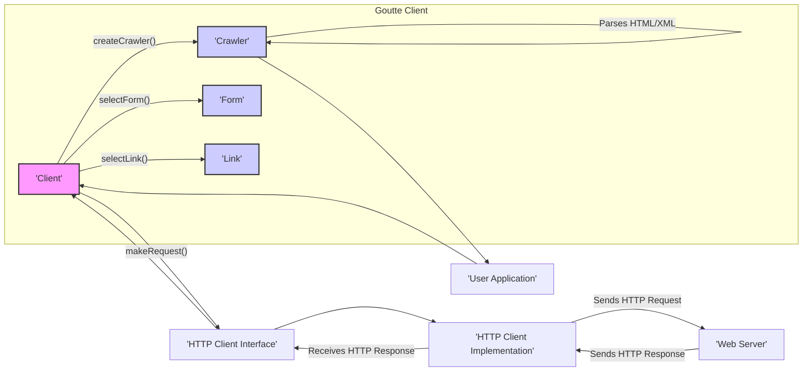

# Project Design Document: Goutte - Web Scraping Library

**Version:** 1.1
**Date:** October 26, 2023
**Author:** AI Software Architect

## 1. Introduction

This document provides a detailed design overview of the Goutte project, a PHP library for web scraping. This document is intended to serve as a foundation for future activities, particularly threat modeling. It clearly defines the system boundaries, components, data flows, and potential security considerations inherent in its design and usage.

### 1.1. Purpose

The primary purpose of this document is to provide a comprehensive architectural understanding of Goutte to facilitate effective threat modeling. It aims to clearly delineate the library's internal workings and its interactions with external systems, enabling security engineers to identify potential vulnerabilities and attack vectors.

### 1.2. Scope

This document covers the core functionalities of the Goutte library, including:

*   Initiating and managing HTTP requests to web servers.
*   Receiving and parsing HTML and XML responses.
*   Programmatically navigating web pages and extracting structured data.
*   Interacting with and submitting HTML forms.
*   Handling basic HTTP authentication schemes.
*   Managing cookies and sessions during scraping sessions.

This document does not cover:

*   The intricate implementation details of the underlying Symfony components.
*   The design and security of applications that integrate and utilize Goutte.
*   Advanced scraping techniques designed to bypass anti-bot measures.

### 1.3. Target Audience

This document is intended for:

*   Security engineers and architects responsible for performing threat modeling and security assessments.
*   Software developers who are actively working with or extending the Goutte library.
*   Technical stakeholders requiring a detailed understanding of Goutte's architecture and potential security implications.

## 2. Overview

Goutte is a lightweight yet powerful PHP library designed to simplify the process of web scraping. It offers a user-friendly API built upon the robust foundation of Symfony components, specifically the HTTP Client for making requests and the DomCrawler for parsing responses. Goutte abstracts away the complexities of raw HTTP communication and DOM manipulation, allowing developers to focus on extracting valuable data and automating web interactions.

### 2.1. Key Features

*   **Intuitive API:** Provides a clear and expressive interface for common web scraping tasks.
*   **Robust HTTP Handling:** Leverages the Symfony HTTP Client for reliable execution of GET, POST, and other HTTP methods.
*   **Flexible Data Extraction:** Employs the Symfony DomCrawler, enabling precise selection and extraction of data using CSS selectors and XPath queries.
*   **Simplified Form Interaction:** Streamlines the process of programmatically filling and submitting HTML forms.
*   **Effortless Link Traversal:** Offers convenient methods for navigating through hyperlinks within web pages.
*   **Stateful Session Management:**  Automatically handles cookies and sessions to maintain context across multiple requests.
*   **Basic Authentication Support:** Facilitates interaction with websites requiring basic HTTP authentication.

## 3. Architectural Design

The core of Goutte's architecture revolves around the `Client` class, which serves as the primary interface for interacting with web resources. It orchestrates the process of making requests, receiving responses, and parsing the content. The `Client` delegates specific tasks to other components, promoting modularity and maintainability.

### 3.1. Components

*   **`Client`:** The central class responsible for initiating and managing the web scraping process. It encapsulates the HTTP client, cookie jar, and request history.
*   **`Crawler`:** A wrapper around the Symfony DomCrawler component. It represents the parsed HTML or XML document and provides methods for selecting elements and extracting data. This is the primary interface for interacting with the content of a web page.
*   **HTTP Client Interface (`Psr\Http\Client\ClientInterface`):** Defines the contract for making HTTP requests. This abstraction allows Goutte to work with different HTTP client implementations.
*   **HTTP Client Implementation (e.g., `Symfony\Component\HttpClient\HttpClient`):** The concrete implementation responsible for sending HTTP requests and receiving responses. Symfony HTTP Client is the default.
*   **Request (`Psr\Http\Message\RequestInterface`):** Represents an outgoing HTTP request, including details like headers, HTTP method, and the target URI.
*   **Response (`Psr\Http\Message\ResponseInterface`):** Represents an incoming HTTP response from the web server, containing headers, status code, and the response body.
*   **URI:** Represents the Uniform Resource Identifier of the target web page or resource.
*   **Form:** Represents an HTML form element on a web page, providing methods for setting form values and submitting the form.
*   **Link:** Represents a hyperlink (`<a>` tag) on a web page, allowing programmatic navigation.
*   **CookieJar:** Manages HTTP cookies across multiple requests, maintaining session state.

### 3.2. Interactions and Data Flow

The following diagram illustrates the typical sequence of operations during a web scraping task using Goutte:

**Detailed Flow:**

1. The **User Application** initiates a scraping action by calling methods on the `Client` object.
2. The `Client`'s `makeRequest()` method utilizes the configured **HTTP Client Interface** to prepare and send an HTTP request to the target **Web Server**.
3. The **HTTP Client Implementation** (e.g., Symfony HTTP Client) transmits the request over the network.
4. The **Web Server** processes the incoming request and generates an HTTP response.
5. The **HTTP Client Implementation** receives the **HTTP Response** from the server.
6. The `Client` receives the complete **HTTP Response**, including headers and body.
7. The `Client` then creates a `Crawler` object, passing the response body (typically HTML or XML) to it for parsing.
8. The `Crawler` parses the content, building a traversable DOM structure.
9. The **User Application** can then interact with the `Crawler` to select specific elements using CSS selectors or XPath expressions, and extract the desired data.
10. The `Client` also provides methods to directly interact with `Form` and `Link` objects discovered within the parsed `Crawler` content, facilitating form submission and navigation.

### 3.3. Data Handling

Goutte primarily handles data in memory during the scraping process. It does not inherently provide mechanisms for persistent data storage.

*   **Cookies:** Stored and managed within the `CookieJar` object, enabling session persistence across requests.
*   **Request/Response History:** The `Client` can optionally maintain a history of requests and responses for debugging or more complex scraping logic.
*   **Parsed DOM:** The structured representation of the scraped web page is held within the `Crawler` object.

## 4. Security Considerations

This section details potential security considerations relevant to the design and usage of the Goutte library.

*   **Server-Side Request Forgery (SSRF):** If the target URL for scraping is derived from untrusted user input without proper validation, an attacker could manipulate the application to make requests to internal or unintended systems. This could expose internal services or lead to further attacks.
    *   **Mitigation:** Implement strict validation and sanitization of all user-provided URLs. Utilize allow lists to restrict target domains to known and trusted sources.
*   **Cross-Site Scripting (XSS) via Scraped Content:** If the scraped data is displayed or used within the user application without proper encoding or sanitization, malicious scripts embedded in the scraped content could be executed in the user's browser.
    *   **Mitigation:** Always sanitize and encode scraped data before rendering it in a web browser or using it in contexts where it could be interpreted as code. Follow context-specific output encoding practices.
*   **Denial of Service (DoS) against Target Websites:**  Aggressive or uncontrolled scraping can overwhelm target web servers, potentially leading to service disruption.
    *   **Mitigation:** Implement rate limiting mechanisms to control the frequency of requests. Respect the target website's `robots.txt` file. Consider using delays between requests.
*   **Exposure of Sensitive Information from Target Websites:** Scraping might inadvertently expose sensitive data if the target website is compromised or if access controls are weak.
    *   **Mitigation:** Only scrape necessary data. Ensure secure communication (HTTPS) is used. Be aware of the target website's security posture and the sensitivity of the data being accessed.
*   **Dependency Vulnerabilities:** Goutte relies on external libraries, primarily Symfony components. Vulnerabilities in these dependencies could introduce security risks.
    *   **Mitigation:** Regularly update Goutte and its dependencies to the latest stable versions. Utilize dependency management tools to identify and address known vulnerabilities.
*   **Insecure Handling of Authentication Credentials:** If the scraping process involves authentication, improper handling of credentials can lead to their exposure.
    *   **Mitigation:** Avoid hardcoding credentials directly in the code. Utilize secure methods for storing and retrieving credentials (e.g., environment variables, secrets management). Be cautious about logging or exposing credentials.
*   **Man-in-the-Middle (MitM) Attacks:** If HTTPS is not enforced, communication between the Goutte client and the target website could be intercepted, potentially exposing sensitive data or allowing manipulation of the communication.
    *   **Mitigation:** Ensure that all scraping targets are accessed over HTTPS. Configure the HTTP client to enforce TLS/SSL verification.
*   **Handling of Redirects:**  Careless handling of redirects could lead to unexpected behavior or expose the application to open redirect vulnerabilities if the redirect target is influenced by untrusted input.
    *   **Mitigation:**  Validate redirect targets if they are derived from external sources. Limit the number of redirects to prevent infinite loops.

## 5. Deployment

Goutte is typically deployed as a library integrated within a PHP application. Developers include Goutte as a dependency using a package manager like Composer. The application then instantiates and utilizes the Goutte `Client` to perform web scraping tasks as needed.

### 5.1. Deployment Environment Considerations

*   **PHP Runtime Environment:** Requires a compatible PHP version.
*   **Composer:** Used for managing Goutte and its dependencies.
*   **Network Connectivity:** The environment must have network access to the target web servers.
*   **Resource Limits:** Be mindful of resource limits (e.g., memory, execution time) when performing extensive scraping operations.

## 6. Dependencies

Goutte relies on the following key dependencies:

*   `php`: The PHP programming language.
*   `psr/http-client-implementation`:  An interface defining how HTTP requests are sent.
*   `psr/http-factory-implementation`: An interface for creating HTTP message factories.
*   `symfony/browser-kit`: Provides an interface for simulating browser behavior.
*   `symfony/dom-crawler`:  Offers tools for navigating and manipulating HTML and XML documents.
*   `symfony/http-client`: A powerful and flexible HTTP client implementation.
*   `symfony/css-selector`:  Converts CSS selectors into XPath expressions for DOM traversal.

## 7. Future Considerations

*   **Enhanced Proxy Support:** Implementing more robust and configurable proxy support for advanced scraping scenarios and anonymity.
*   **Integration with Headless Browsers:** Exploring integration with headless browsers (e.g., Puppeteer, Playwright) to handle JavaScript-rendered content more effectively. This would introduce new security considerations related to the browser environment.
*   **Advanced Authentication Handling:** Supporting more complex authentication methods beyond basic HTTP authentication, such as OAuth.
*   **Improved Error Handling and Logging:** Providing more granular and informative error reporting and logging capabilities for debugging and monitoring.
*   **Rate Limiting and Backoff Strategies:**  Implementing built-in mechanisms for rate limiting and exponential backoff to promote responsible scraping and avoid overloading target servers.

This document provides a detailed architectural overview of the Goutte library, with a strong focus on security considerations relevant for threat modeling. It serves as a valuable resource for understanding the library's design and potential security implications.