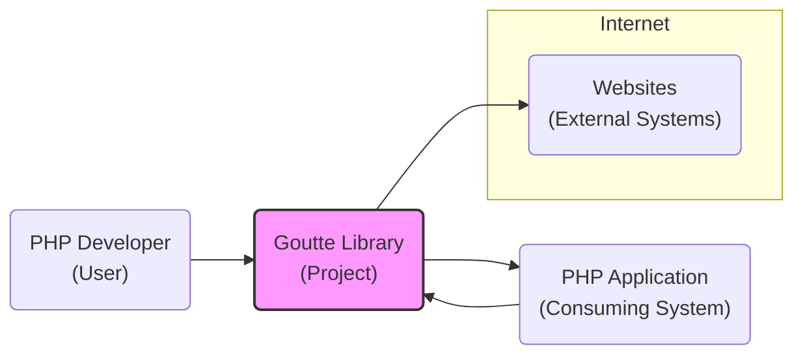
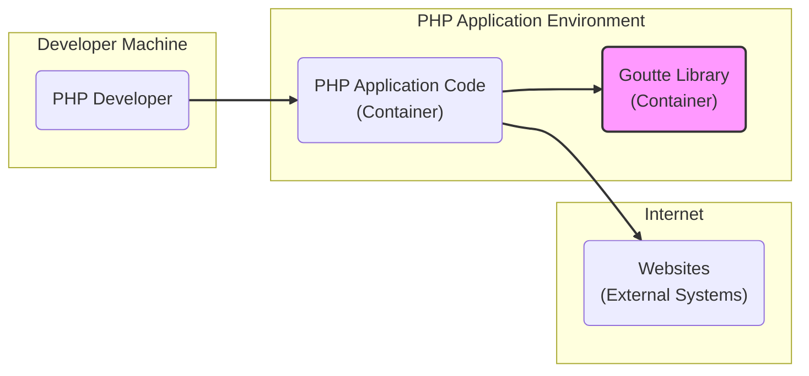
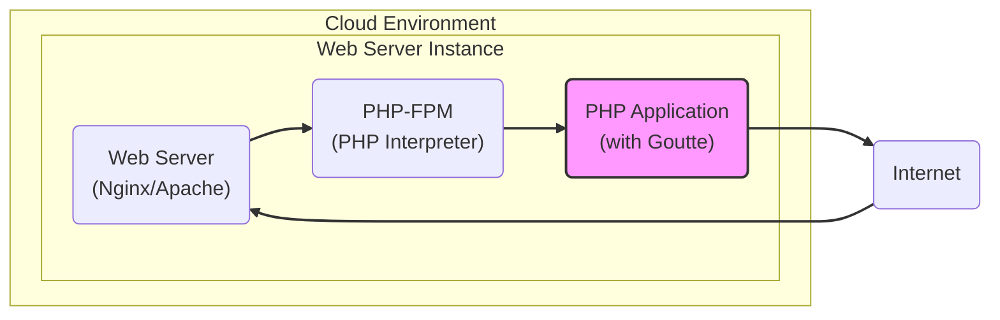
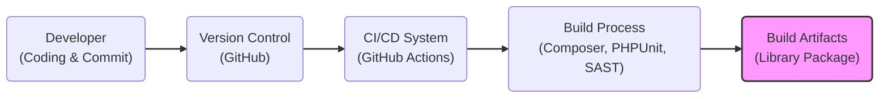

# BUSINESS POSTURE

This project, represented by the Goutte library, aims to provide a developer-friendly tool for web scraping and web testing in PHP.

*   Business Priorities and Goals:
    *   Enable automated data extraction from websites for various purposes like data analysis, content aggregation, and market research.
    *   Facilitate automated web application testing, improving software quality and reducing manual testing effort.
    *   Provide a robust and reliable library that simplifies web scraping and testing tasks for PHP developers.
    *   Maintain an open-source project that benefits the PHP community and encourages contributions.

*   Business Risks:
    *   Legal and ethical concerns related to web scraping, including violating website terms of service and robots.txt rules.
    *   Potential for misuse of the library for malicious purposes, such as denial-of-service attacks or unauthorized data collection.
    *   Dependence on external websites, which can change their structure and break scraping scripts, leading to maintenance overhead.
    *   Security vulnerabilities in the library itself or its dependencies, which could be exploited by malicious actors.
    *   Reputational damage if the library is associated with unethical or illegal web scraping activities.

# SECURITY POSTURE

*   Existing Security Controls:
    *   security control: Code review process for contributions (GitHub pull requests). Implemented in: GitHub repository contribution workflow.
    *   security control: Dependency management using Composer. Implemented in: `composer.json` and `composer.lock` files.
    *   security control: Unit testing. Implemented in: `phpunit.xml.dist` and `tests/` directory.
    *   accepted risk: Reliance on third-party dependencies, which may contain vulnerabilities.

*   Recommended Security Controls:
    *   security control: Implement automated dependency scanning to identify known vulnerabilities in dependencies.
    *   security control: Integrate Static Application Security Testing (SAST) tools into the development workflow to detect potential code-level vulnerabilities.
    *   security control: Consider adding fuzz testing to identify potential input validation issues.
    *   security control: Encourage security vulnerability reporting and establish a process for addressing reported vulnerabilities.

*   Security Requirements:
    *   Authentication: Not directly applicable to the library itself, as it's a client-side tool. Authentication is relevant in the context of applications using Goutte when interacting with websites that require authentication.
    *   Authorization: Not directly applicable to the library itself. Authorization is relevant in the context of applications using Goutte to control access to scraped data and actions performed based on it.
    *   Input Validation: Goutte should handle various types of web content and responses robustly and securely. Input validation is crucial when parsing HTML, XML, and other data formats to prevent vulnerabilities like cross-site scripting (XSS) if scraped data is displayed in a web application. Goutte should also validate URLs and other inputs to prevent issues like server-side request forgery (SSRF) in consuming applications.
    *   Cryptography: Cryptography is relevant when Goutte handles sensitive data during scraping, such as credentials or personal information transmitted over HTTPS. Goutte should correctly handle HTTPS connections and ensure data confidentiality and integrity during transmission. Applications using Goutte might need to encrypt sensitive scraped data at rest.

# DESIGN

## C4 CONTEXT

*   Context Diagram Elements:
    *   Element:
        *   Name: PHP Developer
        *   Type: User
        *   Description: Developers who use the Goutte library to build web scraping and testing applications.
        *   Responsibilities:  Utilize Goutte to automate web interactions, write scraping scripts, and perform web application testing. Responsible for using the library ethically and legally, respecting website terms of service and robots.txt.
        *   Security controls:  Responsible for securely configuring and using Goutte within their applications, including handling sensitive data appropriately and implementing necessary security measures in their applications.

    *   Element:
        *   Name: Goutte Library
        *   Type: Project
        *   Description: A PHP library for web scraping and web testing. It provides an API to make HTTP requests, navigate HTML/XML responses, and extract data.
        *   Responsibilities: Provide a robust, reliable, and easy-to-use API for web scraping and testing. Handle HTTP requests and responses, parse HTML/XML content, and offer data extraction capabilities. Maintain code quality, address bug fixes, and consider security aspects of the library.
        *   Security controls:  Implement secure coding practices, perform code reviews, manage dependencies securely, and address reported security vulnerabilities.

    *   Element:
        *   Name: Websites
        *   Type: External System
        *   Description: External websites that are targeted for scraping or testing using the Goutte library.
        *   Responsibilities: Serve web content and respond to HTTP requests. Define terms of service and robots.txt rules that govern web scraping activities. Implement security measures to protect their websites from malicious activities.
        *   Security controls: Implement security controls to protect against excessive scraping or malicious requests, such as rate limiting, CAPTCHA, and web application firewalls (WAFs).

    *   Element:
        *   Name: PHP Application
        *   Type: Consuming System
        *   Description: PHP applications built by developers that utilize the Goutte library for web scraping or testing functionalities.
        *   Responsibilities:  Consume the Goutte library to perform web scraping or testing tasks. Process and utilize the data extracted by Goutte. Implement application-level security controls and handle scraped data securely.
        *   Security controls: Implement input validation for data received from Goutte, secure storage for scraped data, authorization controls for accessing scraped data, and protection against vulnerabilities like XSS if scraped data is displayed in web interfaces.

## C4 CONTAINER

*   Container Diagram Elements:
    *   Element:
        *   Name: PHP Developer
        *   Type: Person
        *   Description:  A software developer using their local machine to develop and test PHP applications that utilize the Goutte library.
        *   Responsibilities: Write PHP code that uses the Goutte library. Develop and test scraping and testing scripts. Manage dependencies using Composer.
        *   Security controls:  Secure development environment, code editor security, and secure handling of development credentials.

    *   Element:
        *   Name: PHP Application Code
        *   Type: Container
        *   Description: The PHP application code that is built by the developer and utilizes the Goutte library. This code will be deployed to a PHP application environment.
        *   Responsibilities: Implement the business logic of the web scraping or testing application. Integrate with the Goutte library. Handle application configuration and data processing.
        *   Security controls: Application-level security controls, input validation, output encoding, secure session management, authorization, and error handling.

    *   Element:
        *   Name: Goutte Library
        *   Type: Container
        *   Description: The Goutte PHP library, which is included as a dependency in the PHP application. It provides the core web scraping and testing functionalities.
        *   Responsibilities: Handle HTTP requests, parse HTML/XML responses, provide data extraction methods, and manage browser simulation.
        *   Security controls:  Secure coding practices within the library, dependency management, input validation within the library's code, and handling of HTTP requests and responses securely.

    *   Element:
        *   Name: Websites
        *   Type: External System
        *   Description: External websites accessed over the internet by the PHP application using the Goutte library.
        *   Responsibilities: Serve web content, respond to HTTP requests, and potentially implement security measures against scraping.
        *   Security controls: Website security controls, such as firewalls, intrusion detection systems, and rate limiting.

## DEPLOYMENT

For a PHP application using Goutte, a typical deployment architecture would involve a web server (like Apache or Nginx) and a PHP interpreter (like PHP-FPM) running on a server, potentially in a cloud environment or on-premises.

*   Deployment Diagram Elements:
    *   Element:
        *   Name: Web Server (Nginx/Apache)
        *   Type: Software
        *   Description:  A web server responsible for handling HTTP requests from the internet and serving the PHP application. Examples include Nginx or Apache.
        *   Responsibilities:  Receive HTTP requests, route requests to the PHP-FPM interpreter, serve static content, and handle SSL/TLS termination for HTTPS.
        *   Security controls:  Web server security configuration, firewall rules, DDoS protection, SSL/TLS configuration, and access logs.

    *   Element:
        *   Name: PHP-FPM (PHP Interpreter)
        *   Type: Software
        *   Description:  A FastCGI Process Manager for PHP, responsible for executing the PHP application code.
        *   Responsibilities:  Execute PHP code, manage PHP processes, and interact with the web server.
        *   Security controls:  PHP configuration hardening, process isolation, resource limits, and security updates.

    *   Element:
        *   Name: PHP Application (with Goutte)
        *   Type: Software
        *   Description: The deployed PHP application code that utilizes the Goutte library for web scraping or testing.
        *   Responsibilities:  Implement the application's business logic, use the Goutte library for web interactions, process data, and interact with other systems if needed.
        *   Security controls:  Application-level security controls (as mentioned in Container Diagram), secure configuration management, logging and monitoring, and regular security patching.

    *   Element:
        *   Name: Internet
        *   Type: Environment
        *   Description: The public internet, from which user requests originate and to which the application may connect to external websites.
        *   Responsibilities: Provide network connectivity.
        *   Security controls:  Network security controls at the infrastructure level, such as firewalls and intrusion detection systems.

## BUILD

*   Build Process Elements:
    *   Element:
        *   Name: Developer
        *   Type: Person
        *   Description: A developer writing code for the Goutte library and committing changes to the version control system.
        *   Responsibilities: Write code, run local tests, and commit code changes.
        *   Security controls: Secure development environment, code editor security, and secure access to the version control system.

    *   Element:
        *   Name: Version Control (GitHub)
        *   Type: System
        *   Description: GitHub repository hosting the Goutte library source code and managing version history.
        *   Responsibilities: Store source code, manage branches and versions, track changes, and control access to the codebase.
        *   Security controls: Access control (authentication and authorization), audit logs, branch protection rules, and vulnerability scanning for the repository itself.

    *   Element:
        *   Name: CI/CD System (GitHub Actions)
        *   Type: System
        *   Description:  An automated CI/CD system, such as GitHub Actions, used to build, test, and potentially publish the Goutte library.
        *   Responsibilities: Automate the build process, run tests, perform security checks, and create build artifacts.
        *   Security controls: Secure CI/CD pipeline configuration, secrets management, access control to the CI/CD system, and audit logs.

    *   Element:
        *   Name: Build Process (Composer, PHPUnit, SAST)
        *   Type: Process
        *   Description: The automated build process that includes dependency management using Composer, unit testing with PHPUnit, and Static Application Security Testing (SAST) for security checks.
        *   Responsibilities:  Resolve dependencies, compile code (if needed), run unit tests, perform SAST scans, and generate build artifacts.
        *   Security controls: Dependency scanning during build, SAST tool integration, secure build environment, and validation of build outputs.

    *   Element:
        *   Name: Build Artifacts (Library Package)
        *   Type: Data
        *   Description: The packaged Goutte library, typically distributed as a Composer package, ready for use by PHP developers.
        *   Responsibilities:  Represent the distributable version of the library.
        *   Security controls:  Signing of packages (if applicable), secure storage of build artifacts, and vulnerability scanning of the final package.

# RISK ASSESSMENT

*   Critical Business Processes:
    *   For the Goutte library itself, the critical business process is maintaining a secure, reliable, and functional library that meets the needs of its users (PHP developers).
    *   For applications using Goutte, critical business processes depend on the application's purpose. Examples include:
        *   Data collection for market research or business intelligence.
        *   Automated testing of critical web application functionalities.
        *   Content aggregation for content platforms.

*   Data Sensitivity:
    *   The Goutte library itself does not directly handle sensitive data.
    *   Applications using Goutte may handle data of varying sensitivity depending on the websites being scraped and the application's purpose.
        *   Publicly available website content: Generally low sensitivity.
        *   Personal data scraped from public profiles: Medium sensitivity (depending on regulations like GDPR, CCPA).
        *   Data scraped from authenticated areas or APIs: High sensitivity (credentials, personal information, financial data).
    *   Sensitivity also depends on the context of use. Data aggregated for internal analysis might be less sensitive than data used to make public reports or decisions.

# QUESTIONS & ASSUMPTIONS

*   Questions:
    *   What is the specific business context for using Goutte? (e.g., specific industry, application type).
    *   What types of websites will be scraped? (public, authenticated, e-commerce, etc.).
    *   What is the sensitivity of the data being scraped and processed by applications using Goutte?
    *   What are the compliance requirements for applications using Goutte (e.g., GDPR, CCPA, industry-specific regulations)?
    *   What is the risk appetite of the organization using Goutte? (startup vs. Fortune 500).

*   Assumptions:
    *   The primary use case for Goutte is web scraping and automated web testing.
    *   Applications using Goutte will be deployed in standard web server environments.
    *   Security is a concern for both the Goutte library and applications that use it.
    *   The organization using Goutte aims to operate ethically and legally in its web scraping activities.
    *   The development and build process for Goutte utilizes modern DevOps practices, including version control and CI/CD.