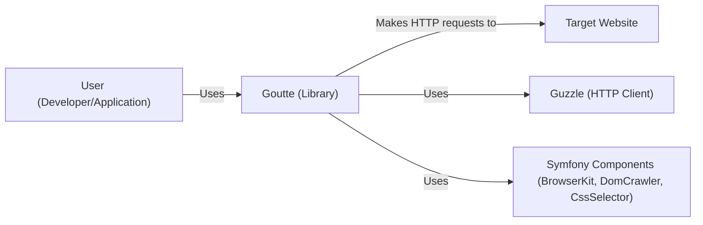
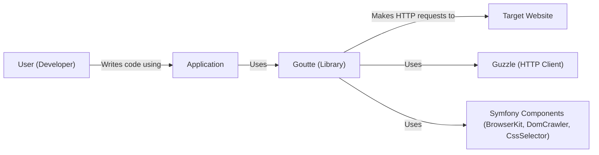
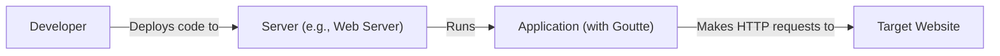
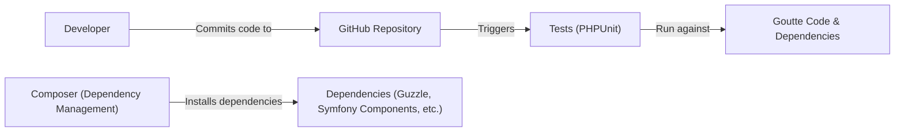

Okay, let's create a design document for the Goutte project, focusing on aspects relevant for threat modeling.

# BUSINESS POSTURE

Goutte is a screen scraping and web crawling library for PHP.  It provides a simple API to interact with websites, making it useful for tasks like data extraction, automated testing, and website monitoring.  The business priorities and goals that Goutte addresses are:

*   Data Acquisition: Enabling users to efficiently extract data from websites without manual effort.
*   Automated Testing: Facilitating the creation of automated tests that interact with web applications.
*   Website Monitoring: Allowing users to monitor websites for changes or specific content.
*   Ease of Use: Providing a simple and intuitive API for interacting with websites.
*   Reduced Development Time: Speeding up the development of applications that require web interaction.

Based on these, the most important business risks are:

*   Legal and Compliance Risks: Users might use Goutte to scrape websites without proper authorization, violating terms of service or data privacy regulations (e.g., GDPR, CCPA).
*   Reputational Risk: If Goutte is associated with malicious scraping activities, it could damage the reputation of the project and its maintainers.
*   Service Abuse: Goutte could be used to create bots that overload target websites, causing denial-of-service or other disruptions.
*   Data Integrity: Incorrect or incomplete data extraction due to changes in target website structure.
*   Maintenance Overhead: Keeping up with changes in web technologies and target website structures to ensure Goutte remains functional.

# SECURITY POSTURE

Goutte itself is a client-side library; it doesn't run as a service. Therefore, many traditional server-side security controls aren't directly applicable. The security posture primarily revolves around how *users* employ Goutte and the inherent risks of interacting with external, untrusted websites.

Existing Security Controls:

*   security control: Goutte builds on top of well-established libraries like Symfony's BrowserKit, DomCrawler, and CssSelector, which themselves have undergone security scrutiny. (Described in `composer.json` and project documentation).
*   security control: Goutte uses Guzzle, a robust HTTP client, which handles many low-level security aspects of HTTP communication (e.g., redirect handling, timeouts). (Described in `composer.json` and project documentation).
*   security control: The project is open-source, allowing for community review and identification of potential vulnerabilities. (Visible on GitHub).
*   security control: The project has a testing suite, which helps to identify and prevent regressions, including potential security issues. (Visible in the `tests/` directory on GitHub).

Accepted Risks:

*   accepted risk: Goutte, by its nature, interacts with potentially untrusted third-party websites. This introduces inherent risks like exposure to malicious content (XSS, CSRF if interacting with authenticated sessions), and potential data breaches if scraped data is mishandled.
*   accepted risk: Goutte does not inherently enforce rate limiting or ethical scraping practices. It's the user's responsibility to use the library responsibly and avoid overloading target servers.
*   accepted risk: Goutte relies on the structure of target websites. Changes to those websites can break Goutte's functionality, requiring updates to the scraping logic.
*   accepted risk: Goutte does not provide built-in mechanisms for handling CAPTCHAs or other anti-bot measures.

Recommended Security Controls (High Priority):

*   security control: Provide clear documentation and examples emphasizing ethical scraping practices, including respecting `robots.txt`, implementing appropriate delays, and handling user-agent strings responsibly.
*   security control: Consider adding optional features for basic rate limiting or delay mechanisms to help users avoid overloading target servers.
*   security control: Encourage users to sanitize and validate any data extracted using Goutte, treating it as untrusted input.

Security Requirements:

*   Authentication:
    *   Goutte should support common authentication methods used by websites, such as HTTP Basic Auth, form-based authentication, and potentially API key-based authentication (via headers).  This is largely handled by Guzzle, but Goutte's API should expose these capabilities conveniently.
*   Authorization:
    *   Goutte itself doesn't handle authorization in the sense of RBAC or ABAC.  Authorization is the responsibility of the target website.  However, Goutte should facilitate the handling of authentication tokens (e.g., cookies, session IDs) necessary for interacting with authorized sections of websites.
*   Input Validation:
    *   Goutte should ensure that user-provided inputs (e.g., URLs, form data) are properly encoded and handled to prevent injection vulnerabilities within Goutte itself.  This is primarily handled by the underlying Symfony and Guzzle components.  *Crucially*, users of Goutte must treat all scraped data as untrusted and perform their own input validation.
*   Cryptography:
    *   Goutte should leverage Guzzle's support for HTTPS to ensure secure communication with websites.  Users should be strongly encouraged to use HTTPS whenever possible.  Goutte should not introduce any custom cryptography.

# DESIGN

## C4 CONTEXT

C4 CONTEXT Element Descriptions:

*   Element:
    *   Name: User (Developer/Application)
    *   Type: Person/System
    *   Description: The developer who integrates Goutte into their application or the application itself that uses Goutte.
    *   Responsibilities: Uses Goutte to scrape data, interact with websites, or perform automated testing.
    *   Security controls: Implements rate limiting, respects robots.txt, validates scraped data, handles authentication securely.

*   Element:
    *   Name: Goutte (Library)
    *   Type: Library
    *   Description: The Goutte web scraping library.
    *   Responsibilities: Provides a high-level API for making HTTP requests, navigating HTML documents, and extracting data.
    *   Security controls: Relies on underlying libraries (Guzzle, Symfony Components) for security.

*   Element:
    *   Name: Target Website
    *   Type: External System
    *   Description: The website being scraped or interacted with.
    *   Responsibilities: Serves web pages and data.
    *   Security controls: Implements its own security measures (e.g., authentication, authorization, input validation, rate limiting, CAPTCHAs).

*   Element:
    *   Name: Guzzle (HTTP Client)
    *   Type: Library
    *   Description: The underlying HTTP client used by Goutte.
    *   Responsibilities: Handles low-level HTTP communication, including security aspects like HTTPS.
    *   Security controls: Implements secure HTTP communication, handles redirects, timeouts, etc.

*   Element:
    *   Name: Symfony Components (BrowserKit, DomCrawler, CssSelector)
    *   Type: Library
    *   Description: Symfony components used by Goutte for simulating browser behavior, navigating DOM, and selecting elements.
    *   Responsibilities: Provide functionalities for web browsing simulation and DOM manipulation.
    *   Security controls: Undergone security reviews as part of the Symfony project.

## C4 CONTAINER

Since Goutte is a library, the container diagram is essentially the same as the context diagram, with the addition of the user's application as a container.

C4 CONTAINER Element Descriptions:

*   Element:
    *   Name: Application
    *   Type: Container
    *   Description: The user's application that utilizes the Goutte library.
    *   Responsibilities: Implements the specific logic for scraping, testing, or monitoring using Goutte.
    *   Security controls: Implements rate limiting, respects robots.txt, validates scraped data, handles authentication securely, and any other application-specific security measures.

*   Element:
    *   Name: User (Developer)
    *   Type: Person
    *   Description: The developer who integrates Goutte into their application.
    *   Responsibilities: Uses Goutte to scrape data, interact with websites, or perform automated testing.
    *   Security controls: Implements rate limiting, respects robots.txt, validates scraped data, handles authentication securely.

*   Element:
    *   Name: Goutte (Library)
    *   Type: Library
    *   Description: The Goutte web scraping library.
    *   Responsibilities: Provides a high-level API for making HTTP requests, navigating HTML documents, and extracting data.
    *   Security controls: Relies on underlying libraries (Guzzle, Symfony Components) for security.

*   Element:
    *   Name: Target Website
    *   Type: External System
    *   Description: The website being scraped or interacted with.
    *   Responsibilities: Serves web pages and data.
    *   Security controls: Implements its own security measures (e.g., authentication, authorization, input validation, rate limiting, CAPTCHAs).

*   Element:
    *   Name: Guzzle (HTTP Client)
    *   Type: Library
    *   Description: The underlying HTTP client used by Goutte.
    *   Responsibilities: Handles low-level HTTP communication, including security aspects like HTTPS.
    *   Security controls: Implements secure HTTP communication, handles redirects, timeouts, etc.

*   Element:
    *   Name: Symfony Components (BrowserKit, DomCrawler, CssSelector)
    *   Type: Library
    *   Description: Symfony components used by Goutte for simulating browser behavior, navigating DOM, and selecting elements.
    *   Responsibilities: Provide functionalities for web browsing simulation and DOM manipulation.
    *   Security controls: Undergone security reviews as part of the Symfony project.

## DEPLOYMENT

Goutte is a library, not a standalone application. Therefore, "deployment" refers to how it's integrated into a user's project.  The most common deployment scenarios are:

1.  **Local Development:** Used directly within a developer's local environment for testing or development purposes.
2.  **Server-Side Application:** Included as a dependency in a server-side application (e.g., a web application, a command-line script) running on a server.
3.  **Cloud Function/Lambda:** Used within a serverless function (e.g., AWS Lambda, Google Cloud Functions) triggered by events.

We'll describe the **Server-Side Application** scenario in detail:

DEPLOYMENT Element Descriptions:

*   Element:
    *   Name: Developer
    *   Type: Person
    *   Description: The developer who deploys the application.
    *   Responsibilities: Writes and deploys the code.
    *   Security controls: Uses secure deployment practices (e.g., SSH, secure CI/CD pipelines).

*   Element:
    *   Name: Server (e.g., Web Server)
    *   Type: Infrastructure
    *   Description: The server where the application is deployed.
    *   Responsibilities: Hosts and runs the application.
    *   Security controls: Implements server-level security measures (firewall, intrusion detection, OS hardening, etc.).

*   Element:
    *   Name: Application (with Goutte)
    *   Type: Application
    *   Description: The application that includes Goutte as a dependency.
    *   Responsibilities: Performs the scraping, testing, or monitoring tasks.
    *   Security controls: Implements application-level security measures, including those related to Goutte usage (rate limiting, data validation, etc.).

*   Element:
    *   Name: Target Website
    *   Type: External System
    *   Description: The website being scraped or interacted with.
    *   Responsibilities: Serves web pages and data.
    *   Security controls: Implements its own security measures.

## BUILD

Goutte's build process is relatively simple, primarily involving dependency management and testing. It uses Composer for dependency management and PHPUnit for testing. There isn't a complex CI/CD pipeline specifically for Goutte itself, as it's a library. However, projects *using* Goutte should have their own CI/CD pipelines.

Build Process Description:

1.  **Developer Commits Code:** A developer makes changes to the Goutte codebase and commits them to the GitHub repository.
2.  **Composer Installs Dependencies:** Composer is used to manage Goutte's dependencies (Guzzle, Symfony Components, etc.). `composer install` or `composer update` downloads and installs these dependencies.
3.  **Tests Run:** PHPUnit tests are executed to ensure the code functions correctly and doesn't introduce regressions.
4.  **Manual Release:** Releases are created manually by tagging commits in the Git repository. There isn't an automated build artifact creation process in the traditional sense.

Security Controls in Build Process:

*   security control: Dependency Management (Composer): Composer helps ensure that the correct versions of dependencies are used, reducing the risk of using vulnerable libraries.  `composer.lock` file ensures consistent builds.
*   security control: Automated Testing (PHPUnit): The test suite helps to identify and prevent bugs, including potential security vulnerabilities.
*   security control: Code Review: As an open-source project, Goutte benefits from community code review, which can help identify security issues.
*   security control: Static Analysis: While not explicitly mentioned in the repository, users *should* incorporate static analysis tools (e.g., PHPStan, Psalm) into their own build processes to catch potential errors and vulnerabilities.
*   security control: Dependency Scanning: Users *should* use dependency scanning tools (e.g., Composer audit, Dependabot) to identify known vulnerabilities in Goutte's dependencies.

# RISK ASSESSMENT

*   **Critical Business Processes:**
    *   Data extraction for business intelligence.
    *   Automated testing of web applications.
    *   Monitoring of website availability and content.

*   **Data We Are Trying to Protect and Sensitivity:**
    *   **Scraped Data:** The sensitivity of scraped data varies greatly depending on the target website. It could range from publicly available information (low sensitivity) to highly sensitive personal data (high sensitivity).  Goutte itself doesn't handle the storage or processing of this data; that's the responsibility of the user.
    *   **Authentication Credentials:** If Goutte is used to interact with authenticated sections of websites, the credentials used (usernames, passwords, API keys) are highly sensitive and must be protected.
    *   **Goutte's Own Code:** While not data in the traditional sense, the integrity of Goutte's codebase is important to prevent the introduction of malicious code.

# QUESTIONS & ASSUMPTIONS

*   **Questions:**
    *   Are there any specific compliance requirements (e.g., GDPR, CCPA) that users of Goutte typically need to adhere to? This would influence the recommendations for responsible scraping.
    *   What is the typical scale of usage for Goutte? (e.g., small scripts vs. large-scale crawling operations) This helps determine the importance of rate limiting and resource management.
    *   Are there any plans to add features to Goutte that might introduce new security considerations (e.g., support for JavaScript rendering)?

*   **Assumptions:**
    *   **BUSINESS POSTURE:** We assume that users of Goutte have a legitimate need to scrape data or interact with websites. We also assume that they are aware of the ethical and legal implications of web scraping.
    *   **SECURITY POSTURE:** We assume that users will treat scraped data as untrusted and implement appropriate validation and sanitization. We also assume that users will handle authentication credentials securely.
    *   **DESIGN:** We assume that Goutte will continue to rely on well-established libraries like Guzzle and Symfony Components for core functionality. We also assume that the primary use case remains client-side scraping, not server-side hosting of a scraping service.