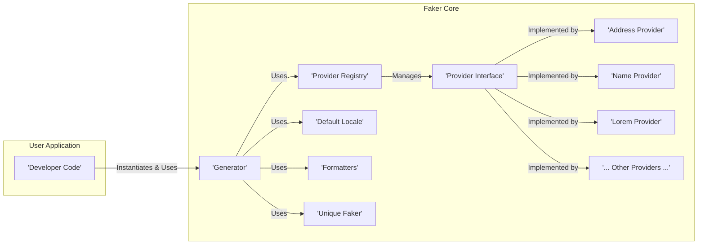

# Project Design Document: Faker - PHP Library for Generating Fake Data

**Version:** 1.1
**Date:** October 26, 2023
**Author:** AI Software Architect

## 1. Introduction

This document provides an enhanced design overview of the Faker PHP library, a widely used tool for generating realistic fake data. This detailed description is intended to serve as a robust foundation for subsequent threat modeling activities. The subject of this document is the open-source library available at [https://github.com/fzaninotto/faker](https://github.com/fzaninotto/faker).

## 2. Goals and Objectives

The core goal of Faker is to empower developers with a flexible and user-friendly mechanism for generating synthetic data within PHP applications. Key objectives supporting this goal include:

*   **Simplicity and Ease of Integration:** Offer an intuitive API that is straightforward to incorporate into existing PHP projects.
*   **Extensibility through Providers:**  Enable developers to create and integrate custom data generation logic for specific needs.
*   **Comprehensive Data Type Coverage:** Provide a wide range of built-in providers for common data types (names, addresses, dates, etc.).
*   **Localization and Regionalization:** Support the generation of data that is contextually relevant to different languages and geographic regions.
*   **Customization and Formatting:** Allow developers to define specific patterns and formats for the generated data.
*   **Maintainable and Well-Documented Codebase:** Ensure the library is easy to understand, maintain, and extend by the community.

## 3. Architectural Overview

Faker's architecture is modular and provider-centric. The central `Generator` class orchestrates the process of generating fake data by leveraging specialized `Provider` classes.

Here's a detailed component diagram:



**Component Descriptions:**

*   **Generator:** This is the central orchestrator. It holds the configuration (including the active locale), manages the `Provider Registry`, and provides the main API for developers to request fake data. It parses formatting strings and delegates data generation to the appropriate providers.
*   **Provider Registry:** This component acts as a directory of available `Provider` classes. It allows the `Generator` to dynamically locate and instantiate the correct provider based on the requested data type. It often uses naming conventions to map requested data types (e.g., "name") to specific provider classes (e.g., `Faker\Provider\en_US\Name`).
*   **Provider Interface:** This interface defines the contract that all `Provider` classes must adhere to. It ensures a consistent structure and allows the `Generator` to interact with different providers in a uniform way.
*   **Specific Providers (e.g., Address Provider, Name Provider, Lorem Provider):** These classes contain the actual logic for generating specific types of fake data. They often rely on internal data sets (arrays of names, cities, words, etc.) that are specific to a particular locale. For example, the `Address Provider` might contain methods for generating street addresses, city names, and postal codes.
*   **Default Locale:** This component stores the default language and region setting for data generation. If no specific locale is requested, Faker will use this default. Locale settings influence the data sets used by providers.
*   **Formatters:** This mechanism allows developers to define custom patterns for generating data by combining calls to different provider methods. For example, a formatter could define a full name as `{{firstName}} {{lastName}}`. The `Generator` parses these formatters and calls the corresponding provider methods.
*   **Unique Faker:** This feature allows developers to generate unique fake data within a certain scope. It tracks previously generated values to avoid duplicates.

## 4. Data Flow

The process of generating fake data in Faker involves a request from the developer's application, resolution of the appropriate provider, and the execution of a specific method within that provider.

Here's a more detailed sequence diagram:

```mermaid
sequenceDiagram
    participant UserApp as User Application
    participant Generator
    participant ProviderRegistry as Provider Registry
    participant NameProvider as Name Provider
    participant LocaleData as Locale Data

    UserApp->>Generator: `$faker->name();` // Request a fake name
    Generator->>ProviderRegistry: `getProvider('Name')`
    ProviderRegistry->>ProviderRegistry: Check if Name Provider exists
    alt Provider does not exist
        ProviderRegistry->>ProviderRegistry: Instantiate Name Provider (e.g., `Faker\Provider\en_US\Name`)
        ProviderRegistry->>LocaleData: Load locale-specific data (names.php)
        LocaleData-->>ProviderRegistry: Returns name data
    end
    ProviderRegistry-->>Generator: Returns instance of Name Provider
    Generator->>NameProvider: `$nameProvider->firstName()`
    NameProvider->>LocaleData: Access list of first names
    LocaleData-->>NameProvider: Returns list of first names
    NameProvider->>NameProvider: Select a random first name
    NameProvider-->>Generator: Returns generated first name
    Generator-->>UserApp: Returns generated fake name
```

**Detailed Steps:**

1. **Developer Request:** The developer's code calls a method on the `$faker` object (an instance of `Faker\Generator`), specifying the desired type of fake data (e.g., `$faker->name()`, `$faker->address()`, `$faker->email()`).
2. **Provider Resolution:** The `Generator` examines the requested method name and uses naming conventions to determine the relevant provider (e.g., `name()` maps to the `Name` provider).
3. **Provider Retrieval and Instantiation:** The `Generator` interacts with the `Provider Registry`. The registry checks if an instance of the required provider already exists. If not, it instantiates the provider class, often based on the current locale (e.g., `Faker\Provider\en_US\Name`).
4. **Locale Data Loading:** When a provider is instantiated, it may load locale-specific data sets (e.g., arrays of first names, last names, street names) from files or internal data structures.
5. **Method Invocation:** The `Generator` calls the specific method on the provider responsible for generating the requested data (e.g., `firstName()` in the `Name` provider).
6. **Data Generation:** The provider's method accesses its data sets (potentially filtered by locale) and uses random selection or other logic to generate the fake data.
7. **Data Return:** The generated fake data is returned from the provider to the `Generator`.
8. **Response to User:** The `Generator` returns the generated fake data to the developer's application.

## 5. Dependencies

Faker relies on the following external libraries, managed through Composer:

*   `php`: The fundamental requirement for running PHP code.
*   `nesbot/carbon`: Used for generating realistic fake date and time values.
*   `symfony/polyfill-intl-normalizer`: Provides Unicode normalization functionality, primarily used for ensuring consistent string comparisons and handling in different locales. This is an optional dependency for certain locales.
*   `symfony/polyfill-mbstring`: Offers support for multibyte string functions, crucial for handling text in various languages and character encodings.

## 6. Security Considerations (Detailed)

While Faker is primarily a development and testing tool, understanding potential security implications is crucial, especially when considering its usage in various contexts.

*   **Supply Chain Vulnerabilities:**  A compromise in any of Faker's dependencies could introduce malicious code into projects using Faker. This highlights the importance of regularly updating dependencies and monitoring for security advisories related to `nesbot/carbon` and the Symfony polyfills.
*   **Accidental Use of Sensitive Data in Providers:** If developers create custom providers and inadvertently include real or sensitive data within their data sets, this could lead to unintended exposure if that Faker instance is used in a non-development environment.
*   **Unintended Data Exposure in Error Messages/Logs:** If Faker is used to generate data that is then included in error messages or logs in production environments, this could potentially expose information that, while fake, might resemble real data and could be misleading or exploited.
*   **Denial of Service (DoS) through Custom Providers:**  Poorly written custom providers with inefficient algorithms or unbounded loops could potentially lead to excessive resource consumption, causing performance issues or even DoS if a large number of fake data generations are requested.
*   **Code Injection Risks (Indirect):** While Faker itself doesn't directly execute arbitrary code, if user input is used to dynamically determine which Faker methods or formatters to call without proper sanitization, it could create indirect code injection vulnerabilities within the application using Faker. For example, if a user-provided string is directly used in a formatter string without validation.
*   **Locale Data Tampering:** If the locale data files are not properly secured during development or distribution, a malicious actor could potentially modify these files to inject harmful or misleading data.
*   **Predictable Data Generation (Security by Obscurity):** While not a direct vulnerability in Faker, relying on the "fakeness" of the data for security purposes is a bad practice. The generated data, while random, follows patterns and could potentially be reverse-engineered or guessed, especially for simpler data types.
*   **Information Disclosure through Unique Faker Misuse:** If the "unique" feature is used without understanding its scope and limitations, it might inadvertently reveal information about the size or structure of underlying data sets.

## 7. Deployment Considerations

Faker is typically integrated into PHP projects as a development dependency using Composer. Common deployment scenarios include:

*   **Local Development Environments:** Developers use Faker to generate data for testing features, populating local databases, and creating realistic-looking prototypes.
*   **Automated Testing:** Faker is extensively used in unit, integration, and end-to-end tests to create realistic test data, ensuring that the application behaves correctly under various data conditions.
*   **Database Seeding:** Faker is used to populate development and staging databases with realistic but non-sensitive data for demonstration and testing purposes.
*   **Data Anonymization (with caution):** While Faker can generate fake data to replace real data, it's crucial to understand the limitations and ensure that the anonymization process is robust and meets privacy requirements. Simply replacing real data with Faker data might not be sufficient for true anonymization.
*   **Generating Sample Data for Documentation and Demos:** Faker can be used to create realistic sample data for documentation, tutorials, and demonstrations of software applications.

The deployment process generally involves adding `fzaninotto/faker` to the `require-dev` section of the `composer.json` file and running `composer install`. The Faker library itself doesn't require any specific server configurations beyond a standard PHP environment.

## 8. Diagrams

The architectural component diagram and the data flow sequence diagram are provided in sections 3 and 4 respectively.

## 9. Future Considerations

*   **Enhanced Locale Data Management:** Explore more sophisticated methods for managing and updating locale-specific data, potentially leveraging external data sources or community contributions.
*   **Formal Security Audits:** Conduct regular security audits of the Faker codebase and its dependencies to identify and address potential vulnerabilities proactively.
*   **Resource Usage Monitoring in Custom Providers:** Implement mechanisms or guidelines to encourage developers of custom providers to consider resource usage and prevent potential DoS scenarios.
*   **Improved Documentation on Security Best Practices:** Provide clearer guidance in the documentation on potential security implications and best practices for using Faker safely, especially in the context of custom providers and data anonymization.
*   **Consider Signing Releases:**  Explore the possibility of signing releases to enhance trust and verify the integrity of the distributed library.

This improved design document provides a more detailed and comprehensive overview of the Faker library, offering a solid foundation for thorough threat modeling and security assessments.