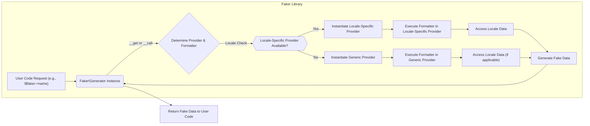

# Project Design Document: Faker Library (Improved)

**1. Introduction**

This document provides an enhanced design overview of the Faker library (https://github.com/fzaninotto/faker). Its primary purpose is to serve as a detailed reference for understanding the library's internal architecture, component interactions, and data flow. This deep understanding is essential for conducting thorough threat modeling to identify potential security vulnerabilities and assess risks associated with its integration and usage in software projects.

**2. Project Overview**

Faker is a widely used PHP library designed to generate realistic-looking fake data. It simplifies the process of creating data for various purposes, including:

*   Bootstrapping databases with sample data.
*   Generating representative data for XML or JSON documents.
*   Populating data layers for stress testing applications.
*   Anonymizing sensitive data extracted from production systems (with careful consideration of its limitations).

The library offers a rich set of data generators, categorized into **Providers**, covering common data types such as names, addresses, phone numbers, dates, times, text, and internet-related information. Faker's support for multiple **Locales** enables the generation of culturally relevant fake data for different geographic regions and languages.

**3. System Architecture**

Faker's architecture is modular and extensible, centered around the concept of **Providers** and a central **Generator**.

*   **Core Engine (`Faker\Generator`):** This is the heart of the library. It manages the overall data generation process, holds references to loaded providers, and acts as the primary interface for users to request fake data. It uses a pseudo-random number generator (PRNG) internally to ensure variability in the generated data.
*   **Providers (e.g., `Faker\Provider\Name`, `Faker\Provider\Address`):** These are classes responsible for generating specific categories of fake data. Each provider contains a set of **Formatters** (methods) that implement the logic for generating specific data elements (e.g., `firstName()`, `streetAddress()`). Providers can be specific to a locale (e.g., `Faker\Provider\en_US\Name`) or be generic.
*   **Locales (e.g., `en_US`, `fr_FR`):** These represent specific geographic regions and languages. Each locale has associated data files (typically PHP arrays) containing lists of names, addresses, words, and other locale-specific data used by the providers to generate realistic output.
*   **Formatters (Methods within Providers):** These methods contain the core logic for generating fake data. They often utilize data from the loaded locale and may combine or manipulate this data to produce the desired output. For instance, a `name()` formatter might combine a `firstName()` and a `lastName()`.
*   **`Faker\Factory`:** This class provides static methods for creating instances of the `Faker\Generator`. It allows users to easily instantiate a generator with a specific locale.
*   **Configuration (Implicit):** While not explicitly a component, the locale setting acts as a configuration parameter, influencing which provider and locale data are used.

**4. Data Flow**

The process of generating fake data using Faker typically follows these steps:

*   A developer instantiates a `Faker\Generator` object, often using `Faker\Factory::create()`, optionally specifying a locale.
*   The developer calls a method on the `$faker` instance (e.g., `$faker->name`, `$faker->address`, `$faker->email`).
*   The `Faker\Generator`'s magic methods (`__get` or `__call`) are invoked.
*   The `Generator` determines the appropriate **Provider** and **Formatter** to handle the request. This involves mapping the requested method name to a corresponding provider and its method. Locale-specific providers are prioritized if available.
*   The corresponding **Formatter** method within the **Provider** is executed.
*   The **Formatter** may access locale-specific data arrays to select random elements (e.g., a random first name from the `en_US` name list).
*   The **Formatter** generates the fake data and returns it to the `Generator`.
*   The `Generator` returns the generated fake data to the calling code.

**5. Key Components and their Interactions (Detailed)**

*   **`Faker\Factory`:** Provides a convenient way to create `Faker\Generator` instances. The `create()` method accepts an optional locale argument.
*   **`Faker\Generator`:**
    *   Holds an array of loaded providers.
    *   Uses magic methods (`__get`, `__call`) to dynamically route method calls to the appropriate provider.
    *   Manages the internal PRNG.
    *   Provides methods for accessing providers directly (e.g., `$faker->getGenerator('name')`).
*   **Provider Classes (e.g., `Faker\Provider\en_US\Name`):**
    *   Extend the base `Faker\Provider\Base` class.
    *   Contain methods (formatters) for generating specific types of fake data.
    *   May have dependencies on other providers.
    *   Access locale-specific data through protected properties.
*   **Locale Data Files (e.g., `en_US/name.php`):**
    *   PHP files that return arrays of data (e.g., `$firstNameMale`, `$lastName`, `$cityPrefix`).
    *   Organized by provider and data type.
    *   Loaded dynamically based on the configured locale.

**Interaction Flow Example (`$faker->name` with locale `en_US`):**

1. The user calls `$faker->name`.
2. The `__get()` magic method in `Faker\Generator` is invoked.
3. `__get()` checks for a provider named 'name'. If found, it returns the `Faker\Provider\en_US\Name` instance (if loaded) or instantiates it.
4. If `$faker->name()` is called (with parentheses), the `__call()` magic method is invoked.
5. `__call()` looks for a method named `name` in the `Faker\Provider\en_US\Name` provider.
6. The `name()` formatter in `Faker\Provider\en_US\Name` is executed.
7. The `name()` formatter might internally call other formatters within the same provider (e.g., `firstName()`, `lastName()`) or access locale data arrays like `$firstNameMale`, `$lastName` to construct the full name.
8. The generated name string is returned.

**6. Security Considerations (For Threat Modeling)**

While Faker's primary function is to generate non-sensitive data, potential security considerations arise from its usage and the nature of the generated output:

*   **Predictability of Generated Data:**
    *   **Threat:** If the underlying PRNG is weak or predictable, the generated data might also be predictable. This could be a risk in scenarios where the "fake" data is used for security-sensitive purposes (e.g., generating seemingly random tokens or passwords, which is not the intended use of Faker).
    *   **Mitigation:** Faker relies on PHP's built-in random number generation functions. Ensure the PHP environment uses a secure PRNG. For security-critical random data generation, use dedicated libraries.
*   **Inclusion of Sensitive-Looking Data:**
    *   **Threat:** Although fake, the generated data can resemble real Personally Identifiable Information (PII). Accidental exposure of this data in logs, error messages, or public demos could raise privacy concerns or lead to misinterpretations.
    *   **Mitigation:** Exercise caution when using Faker in environments where the resemblance to real data could be problematic. Clearly label any generated data as "fake."
*   **Locale Data Integrity:**
    *   **Threat:** If locale data files were compromised and modified to contain malicious content (e.g., code injection), this could potentially lead to unexpected behavior if the generated data is processed without proper sanitization or validation. This is a low-probability threat for the core library but a higher risk for custom or community-contributed providers/locales.
    *   **Mitigation:** Ensure the integrity of the Faker library source and any extensions. Implement proper output encoding and validation when using generated data in applications.
*   **Dependency Vulnerabilities:**
    *   **Threat:** Faker depends on other PHP packages. Vulnerabilities in these dependencies could indirectly affect Faker users.
    *   **Mitigation:** Regularly update Faker and its dependencies to patch known vulnerabilities.
*   **Denial of Service (DoS):**
    *   **Threat:**  While unlikely with standard usage, poorly implemented custom providers or excessive generation of very large data sets could potentially lead to performance issues or DoS in the application using Faker.
    *   **Mitigation:**  Implement resource limits and timeouts when generating large amounts of data. Carefully review and test custom providers.
*   **Accidental Exposure of Real Data (Misuse):**
    *   **Threat:** Developers might mistakenly use Faker in a context where real data should be used or mix fake and real data inappropriately, potentially leading to accidental data leaks.
    *   **Mitigation:**  Provide clear guidelines and training on the proper use of Faker. Implement code reviews to catch potential misuse.
*   **Security of Seed Data:**
    *   **Threat:** If Faker is used to generate seed data for databases, the security of this seed data needs consideration, especially if used in staging or production-like environments. Avoid including sensitive-looking data in seed data for non-production environments.
    *   **Mitigation:**  Treat seed data like any other data and apply appropriate security measures.

**7. Deployment Considerations**

Faker is typically included as a development dependency in PHP projects using Composer. Its usage is primarily within the application's codebase.

*   **Development Environments:**  The primary use case is generating data for local development, prototyping, and UI/UX design.
*   **Testing Environments (Unit, Integration, End-to-End):** Faker is crucial for creating realistic test data to exercise different parts of an application.
*   **CI/CD Pipelines:** Faker can be used in automated testing and environment setup scripts within CI/CD pipelines.
*   **Data Anonymization (Use with Caution):** While Faker can generate replacement data, it's essential to understand its limitations for robust anonymization. It might be suitable for simple pseudonymization but not for complex anonymization requirements.

**8. Future Considerations**

*   **Pluggable Random Number Generators:**  Allow users to specify a custom PRNG implementation for scenarios requiring stronger randomness.
*   **Advanced Data Masking Features:**  Expand Faker's capabilities to include more sophisticated data masking techniques beyond simple generation.
*   **Improved Custom Provider Development Tools:** Provide better tooling and documentation for creating secure and well-tested custom providers.
*   **Formal Security Audits:** Conduct periodic security audits of the core library and commonly used providers.
*   **Standardized Data Generation Schemas:** Explore the possibility of defining and using schemas to ensure consistency and structure in generated data.

This improved design document provides a more in-depth understanding of the Faker library's architecture and potential security considerations, making it a more effective resource for threat modeling. By carefully considering the points outlined, developers and security professionals can better assess and mitigate risks associated with integrating and using Faker in their projects.
