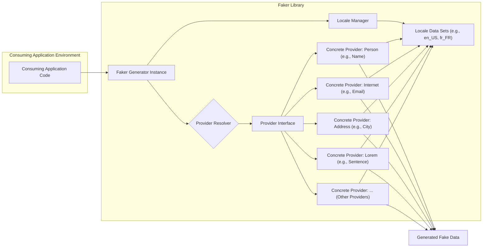
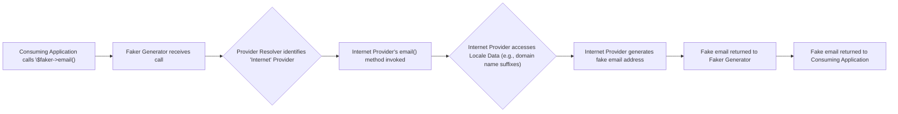

# Project Design Document: Faker (PHP Library)

**Version:** 1.1
**Date:** October 26, 2023
**Author:** AI Software Architect

## 1. Project Overview

This document provides an enhanced design overview of the Faker PHP library, a widely used tool for generating realistic-looking fake data. This data is invaluable for various software development activities, including testing, database seeding, prototyping, and anonymization. This document aims to clearly articulate the library's architecture, component interactions, and data flow, specifically to facilitate effective threat modeling. The subject of this design is the open-source library hosted at [https://github.com/fzaninotto/faker](https://github.com/fzaninotto/faker).

## 2. Goals

* Deliver a comprehensive and easily understandable description of the Faker library's internal structure and operation.
* Clearly define the roles and responsibilities of the key components within the library.
* Illustrate the flow of data during the fake data generation process.
* Explicitly identify potential security considerations and areas of concern relevant to threat modeling exercises.
* Serve as a definitive reference for security analysts, developers, and architects working with or evaluating the Faker library.

## 3. Non-Goals

* This document does not provide a line-by-line code analysis of the Faker library's implementation.
* It will not delve into the intricate details of every individual data provider available within the library.
* A complete catalog of all possible fake data types and formats is outside the scope of this document.
* The document does not cover the library's internal testing methodologies, continuous integration/continuous deployment (CI/CD) pipelines, or contribution guidelines.

## 4. Target Audience

* Security engineers and analysts tasked with performing threat modeling and security assessments.
* Software developers integrating the Faker library into their PHP projects.
* Software architects seeking a high-level understanding of the library's design and potential security implications.
* DevOps engineers responsible for managing dependencies and ensuring the security of the software supply chain.

## 5. System Architecture

The Faker library employs a plugin-based architecture centered around the concept of "providers." This modular design allows for extensibility and the organization of fake data generation logic by category.

**Detailed Explanation of Architectural Components:**

* **Consuming Application Environment:** The PHP application that includes and utilizes the Faker library. This is the context where Faker is invoked.
* **Faker Generator Instance (`Faker\Generator`):** The primary entry point for interacting with the library. The consuming application instantiates this class to access Faker's functionalities. It manages the lifecycle of providers and locale settings.
* **Provider Resolver:**  A component within the `Faker\Generator` responsible for dynamically locating and instantiating the appropriate provider based on the requested fake data type (e.g., when `$faker->name()` is called, the resolver finds the `Person` provider).
* **Provider Interface (`Faker\Provider\Base`):**  A base class or interface that defines the common structure and methods that all concrete providers must implement. This ensures a consistent API across different data categories.
* **Concrete Providers (`Faker\Provider\*`):**  Specific classes dedicated to generating particular types of fake data. They are organized into namespaces reflecting the data category (e.g., `Faker\Provider\en_US\Person`, `Faker\Provider\Internet`, `Faker\Provider\Address`). Each provider contains methods for generating variations of its data type.
* **Locale Manager:**  A component responsible for managing the currently active locale. It determines which set of locale-specific data will be used by the providers.
* **Locale Data Sets (`Faker\Provider\*\locales\*`):**  PHP files containing arrays of data specific to a particular language and region (e.g., `en_US`, `fr_FR`). These datasets include lists of first names, last names, street names, city names, and other locale-sensitive information used by the providers during data generation.

## 6. Data Flow

The process of generating fake data using the Faker library involves the following steps:

- The consuming application instantiates the `Faker\Generator` class.
- The consuming application calls a method on the Faker instance, typically using the dynamic property access or method invocation syntax (e.g., `$faker->name` or `$faker->email`).
- The `Faker\Generator`'s internal mechanism (the Provider Resolver) intercepts the call and determines the requested data type.
- The Provider Resolver locates and instantiates the appropriate concrete provider class based on the requested data type and the current locale.
- The corresponding method within the provider is invoked.
- The provider may access data from the relevant Locale Data Set based on the configured locale.
- The provider generates the fake data, potentially using random number generators or predefined data sets.
- The generated fake data is returned to the `Faker\Generator` instance.
- The `Faker\Generator` returns the generated fake data to the consuming application.

## 7. Security Considerations

While Faker is primarily intended for development and testing, it's important to consider potential security implications, especially when used in contexts where the generated data might interact with security-sensitive systems or when considering the security of the software supply chain.

**Categorized Security Considerations:**

* **Data Exposure (Indirect Risk):**
    * **Schema Inference:** If the patterns and formats of the generated fake data closely mirror real-world data, it could inadvertently reveal information about the underlying data schemas and structures of the application. This is a concern if the fake data is exposed in non-production environments.
    * **Accidental Exposure of Sensitive Patterns:**  Care must be taken when customizing providers or locale data to avoid unintentionally generating data that resembles real sensitive information, even if it's technically fake.

* **Code Execution and Injection Risks:**
    * **Malicious Custom Providers:** If developers implement custom providers without proper input validation or sanitization within their logic, it could introduce vulnerabilities. If the data sources used by a custom provider are compromised, it could lead to code injection or other malicious activities.
    * **Vulnerabilities in Provider Logic:**  Bugs or vulnerabilities within the core Faker providers could potentially be exploited if they mishandle data or external resources.

* **Denial of Service (DoS):**
    * **Resource Exhaustion in Custom Providers:** Poorly designed custom providers could potentially consume excessive resources (CPU, memory) if they contain inefficient algorithms or unbounded loops.
    * **Locale Data Manipulation:** While less likely, if locale data sets are maliciously crafted to be extremely large or complex, it could potentially lead to performance issues or DoS when those locales are used.

* **Supply Chain Security:**
    * **Dependency Vulnerabilities:** Faker relies on other PHP packages. Vulnerabilities in these dependencies could indirectly impact the security of projects using Faker. Regular dependency updates and security scanning are crucial.
    * **Compromised Locale Data:** If the locale data files within the Faker library itself are compromised (e.g., through a supply chain attack), it could lead to the generation of unexpected or potentially harmful fake data across all applications using that version of Faker.

* **Predictability and Randomness:**
    * **Insufficient Randomness:** If the random number generation used by Faker is not sufficiently strong or predictable, it could have implications for security testing scenarios where the goal is to generate unpredictable data.
    * **Seed Management:**  Using a fixed seed for Faker can make the generated data predictable, which might be desirable for consistent testing but could be a security concern if this predictability is exploited in other contexts.

## 8. Deployment Considerations

Faker is typically deployed as a development dependency within a PHP project using a package manager like Composer.

* **Installation via Composer:** Developers add Faker as a dependency in their `composer.json` file, specifying the desired version.
* **Versioning and Updates:**  Following semantic versioning principles is crucial for managing updates and ensuring that security patches are applied. Regularly updating Faker to the latest stable version is recommended.
* **No Standalone Deployment:** Faker is a library and is not deployed as a standalone application or service. Its security posture is primarily determined by how it's used within the consuming application.
* **Development vs. Production:** Faker is generally intended for use in development, testing, and staging environments. It should typically not be included as a dependency in production deployments unless there is a specific and well-justified reason.

## 9. Future Considerations

* **Enhanced Security Audits:**  Regular, independent security audits of the Faker codebase and its dependencies would help identify and address potential vulnerabilities proactively.
* **Improved Input Validation in Core Providers:**  Strengthening input validation within the core Faker providers could help mitigate potential risks associated with unexpected or malicious data.
* **Mechanisms for Locale Data Integrity Verification:**  Exploring methods to verify the integrity and authenticity of locale data sets could enhance supply chain security.
* **Guidance on Secure Custom Provider Development:**  Providing more comprehensive documentation and best practices for developers creating custom providers would help reduce the risk of introducing vulnerabilities.
* **Consideration of Data Privacy Implications:**  While generating fake data, future development could consider incorporating features or guidelines to help users avoid unintentionally generating data that too closely resembles real sensitive information.

This enhanced design document provides a more detailed and structured understanding of the Faker library, specifically tailored for threat modeling purposes. By outlining the architecture, data flow, and potential security considerations, this document empowers security analysts and developers to proactively identify and mitigate potential risks associated with the use of this valuable tool.