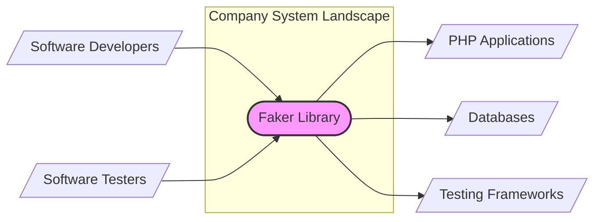
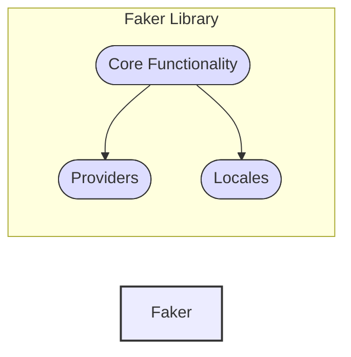
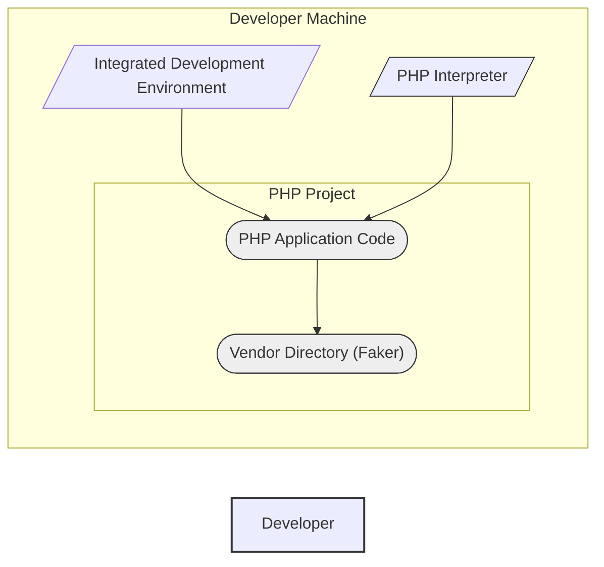
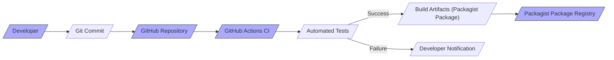

# BUSINESS POSTURE

- Business Priorities and Goals:
  - The Faker library aims to accelerate software development and improve the quality of testing by providing a convenient way to generate realistic fake data.
  - It helps developers quickly populate databases, create realistic UI mockups, and write robust tests without relying on real or manually created test data.
  - The primary goal is to increase developer productivity and improve software quality by simplifying data generation for development and testing purposes.

- Business Risks:
  - Dependency Risk: Projects using Faker become dependent on an external, open-source library.  Disruptions in the library's availability, maintenance, or security could impact dependent projects.
  - Software Supply Chain Risk:  Vulnerabilities in Faker could be introduced into projects that depend on it, posing a supply chain security risk.
  - Misuse Risk: While unlikely for this library, there's a theoretical risk of misusing Faker to generate data in contexts where real or carefully controlled data is required, although this is not the intended use case.
  - Compatibility Risk:  Updates to Faker or changes in the PHP ecosystem could introduce compatibility issues with projects relying on older versions of Faker.

# SECURITY POSTURE

- Existing Security Controls:
  - security control: Open Source Community Review: The library is open source, allowing for community review of the code, which can help identify and address potential security vulnerabilities. Implemented through GitHub repository and public accessibility of code.
  - security control: Version Control: The library is hosted on GitHub, utilizing Git for version control, which provides traceability of changes and facilitates collaboration and security reviews. Implemented through GitHub.
  - security control: Dependency Management:  Typically used with Composer, a PHP dependency manager, which helps manage library versions and updates. Implemented by developers using Composer in their projects.

- Accepted Risks:
  - accepted risk: Dependency on External Code:  Acceptance of the inherent risks associated with using external, open-source code, including potential undiscovered vulnerabilities.
  - accepted risk: Community-Driven Security: Reliance on the open-source community to identify and report security issues, which may have delays or gaps.

- Recommended Security Controls:
  - security control: Dependency Scanning: Implement automated dependency scanning tools in projects that use Faker to identify known vulnerabilities in Faker and its dependencies.
  - security control: Regular Updates:  Keep Faker updated to the latest stable version to benefit from security patches and bug fixes.
  - security control: Software Composition Analysis (SCA):  Perform SCA on projects using Faker to gain visibility into all open-source components and their associated risks.
  - security control: Secure Development Practices in Dependent Projects: Ensure that projects using Faker follow secure development practices to mitigate any potential risks arising from the use of the library.

- Security Requirements:
  - Authentication: Not applicable to Faker library itself. Authentication is relevant for systems that *use* Faker, but not for Faker's core functionality.
  - Authorization: Not applicable to Faker library itself. Authorization is relevant for systems that *use* Faker, but not for Faker's core functionality.
  - Input Validation: Faker library takes input in the form of format strings and locale settings. Input validation should be considered in the Faker library itself to prevent unexpected behavior or vulnerabilities if format strings or locales are derived from untrusted sources (though this is unlikely in typical usage).
  - Cryptography: Not directly applicable to the core functionality of Faker, which is focused on generating fake data, not handling sensitive or cryptographic operations. However, if Faker were to be extended to generate data that *resembles* encrypted data (e.g., fake hashes), care should be taken to avoid creating misleading or insecure patterns.

# DESIGN

## C4 CONTEXT

- Context Diagram Elements:
  - - Name: Faker Library
    - Type: Software Library
    - Description: A PHP library for generating fake data for various purposes, primarily used in software development and testing.
    - Responsibilities: Generating realistic fake data based on provided formats and locales.
    - Security controls: Open Source Community Review, Version Control.
  - - Name: Software Developers
    - Type: User
    - Description: Developers who use Faker to generate data for development, prototyping, and testing purposes.
    - Responsibilities: Integrating Faker into their projects, using Faker to create test data and mock data.
    - Security controls: Secure Development Practices, Dependency Scanning (in their projects).
  - - Name: Software Testers
    - Type: User
    - Description: Testers who use Faker to generate data for automated and manual testing scenarios.
    - Responsibilities: Utilizing Faker to create diverse and realistic test datasets.
    - Security controls: Secure Testing Practices, Dependency Scanning (in testing environments).
  - - Name: PHP Applications
    - Type: Software System
    - Description: PHP applications that integrate and utilize the Faker library to generate data within their codebase.
    - Responsibilities: Using Faker to populate data models, generate sample data for features, and integrate with other systems.
    - Security controls: Input Validation, Authorization, Authentication, Secure Configuration, Dependency Scanning (for the application itself and its dependencies including Faker).
  - - Name: Databases
    - Type: Data Store
    - Description: Databases that may be populated with fake data generated by Faker for development, testing, or demonstration purposes.
    - Responsibilities: Storing and managing data, including fake data generated by Faker.
    - Security controls: Access Control, Encryption at Rest, Data Masking (if sensitive data is present even in test databases).
  - - Name: Testing Frameworks
    - Type: Software System
    - Description: Testing frameworks (e.g., PHPUnit, Behat) that can be used in conjunction with Faker to generate data for automated tests.
    - Responsibilities: Executing tests, integrating with Faker to generate test data dynamically.
    - Security controls: Secure Test Environment, Test Data Management.

## C4 CONTAINER

- Container Diagram Elements:
  - - Name: Faker Library
    - Type: Software Library
    - Description: The overall Faker library, composed of core functionality, providers, and locale data.
    - Responsibilities: Providing a comprehensive fake data generation framework for PHP.
    - Security controls: Open Source Community Review, Version Control, Input Validation (within the library).
  - - Name: Core Functionality
    - Type: Code Module
    - Description: The central logic of Faker, handling data generation requests and orchestrating providers and locales.
    - Responsibilities: Processing requests, managing providers, handling locale settings, and generating data based on formatters.
    - Security controls: Input Validation, Code Reviews, Unit Testing.
  - - Name: Providers
    - Type: Code Modules
    - Description: Collections of classes that provide specific data generation functionalities (e.g., address, name, text, internet).
    - Responsibilities: Implementing specific data generation logic for different data types.
    - Security controls: Input Validation, Code Reviews, Unit Testing, Provider-Specific Security Considerations (e.g., if a provider interacts with external resources, which is unlikely for core Faker providers).
  - - Name: Locales
    - Type: Data
    - Description: Data files containing locale-specific data (e.g., names, addresses, localized text) used by providers.
    - Responsibilities: Providing localized data for data generation.
    - Security controls: Data Integrity Checks, Version Control.

## DEPLOYMENT

- Deployment Model:
  - Faker is not deployed as a standalone application or service. It is distributed as a PHP library and is deployed as part of other PHP applications or development/testing environments.
  - Distribution Channels:
    - Packagist (via Composer): The primary distribution channel for PHP packages, including Faker. Developers use Composer to include Faker in their projects.
    - GitHub: Source code repository, used for development, issue tracking, and direct download (less common for end-users).

- Detailed Deployment (Example: Developer's Local Machine):

- Deployment Diagram Elements (Developer Machine):
  - - Name: Developer Machine
    - Type: Environment
    - Description: The local development environment of a software developer.
    - Responsibilities: Running development tools, hosting the PHP project, executing code.
    - Security controls: Local Machine Security (OS hardening, antivirus, firewall), Developer Access Control.
  - - Name: PHP Project
    - Type: Software Project
    - Description: The PHP application project that is using the Faker library.
    - Responsibilities: Implementing application logic, integrating Faker for data generation.
    - Security controls: Secure Development Practices, Dependency Scanning, Input Validation (within the application).
  - - Name: PHP Application Code
    - Type: Code
    - Description: The application-specific PHP code that utilizes Faker.
    - Responsibilities: Application logic, calling Faker methods to generate data.
    - Security controls: Code Reviews, Unit Testing, Application-Level Security Controls.
  - - Name: Vendor Directory (Faker)
    - Type: Directory
    - Description: The directory within the PHP project where Faker library files are installed (typically via Composer).
    - Responsibilities: Storing Faker library code.
    - Security controls: File System Permissions, Dependency Integrity Checks (by Composer).
  - - Name: Integrated Development Environment (IDE)
    - Type: Software Application
    - Description: The IDE used by the developer (e.g., VS Code, PhpStorm).
    - Responsibilities: Code editing, debugging, project management.
    - Security controls: IDE Security Features, Plugin Security.
  - - Name: PHP Interpreter
    - Type: Software Application
    - Description: The PHP interpreter used to execute the PHP application code.
    - Responsibilities: Executing PHP code, running the application and Faker library.
    - Security controls: PHP Security Configuration, Regular Updates.

## BUILD

- Build Process Description:
  - Developer commits code changes to the GitHub repository.
  - GitHub Actions CI is triggered on code commits (e.g., push, pull request).
  - Automated tests are executed as part of the CI pipeline.
  - If tests pass, build artifacts (typically a packaged version for Packagist) are created.
  - The build artifacts are published to Packagist, making the new version of Faker available for users.
  - If tests fail, developers are notified to address the issues.

- Build Process Security Controls:
  - security control: Automated Tests: Automated unit and integration tests help ensure code quality and prevent regressions, indirectly contributing to security by reducing bugs. Implemented in GitHub Actions.
  - security control: CI/CD Pipeline (GitHub Actions):  Automated build and deployment pipeline reduces manual steps and potential human errors, and allows for integration of security checks. Implemented using GitHub Actions.
  - security control: Version Control (Git): Git provides traceability of changes and allows for code reviews and rollback if necessary. Implemented through GitHub.
  - security control: Code Reviews (Implicit): While not explicitly automated in the build process diagram, code reviews are a recommended practice for open-source projects and contribute to security. Implemented as a development practice.
  - security control: Dependency Management (Composer): Composer is used to manage dependencies, ensuring consistent and reproducible builds. Implemented by developers and in CI environment.
  - security control: Packagist Security: Packagist, as a package registry, has its own security measures to protect packages from tampering and unauthorized access. Implemented by Packagist platform.

# RISK ASSESSMENT

- Critical Business Processes:
  - For the Faker library itself, the critical business process is maintaining the library's integrity, availability, and functionality for the open-source community and dependent projects.
  - For organizations *using* Faker, the critical business processes are software development, testing, and potentially demo creation, which rely on Faker to generate data.

- Data Sensitivity:
  - Faker generates *fake* data. By its nature, the data generated is not intended to be real or sensitive.
  - However, if Faker is used to populate test databases that are similar in structure to production databases, there is an indirect risk if these test databases are not properly secured.  Exposure of test databases, even with fake data, could reveal database schemas or application logic.
  - The sensitivity is low for the data generated by Faker itself, but the context of its use in dependent projects needs to be considered.

# QUESTIONS & ASSUMPTIONS

- Questions:
  - What is the specific context in which this design document will be used for threat modeling? (e.g., a company using Faker in their projects, the Faker library project itself).
  - Are there any specific security concerns or incidents related to Faker that are driving this threat modeling exercise?
  - What is the risk appetite of the organization using or evaluating Faker? (e.g., startup vs. Fortune 500).
  - Are there any specific compliance requirements that need to be considered in relation to Faker's use?

- Assumptions:
  - The primary use case for Faker is in software development and testing environments, not directly in production systems handling real user data.
  - Organizations using Faker are expected to have basic software development security practices in place, such as dependency management and testing.
  - The threat model is primarily concerned with risks related to the Faker library itself and its potential impact on dependent projects, rather than the internal security of the Faker library project's infrastructure (GitHub, Packagist).
  - The focus is on common security concerns for open-source libraries, such as supply chain security and dependency vulnerabilities.