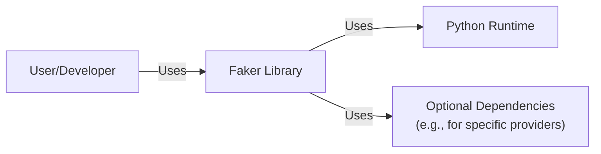
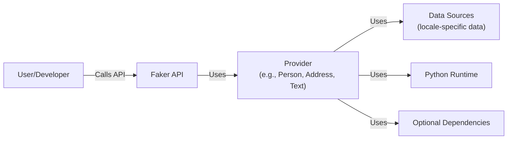
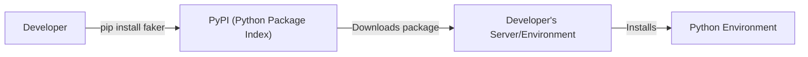
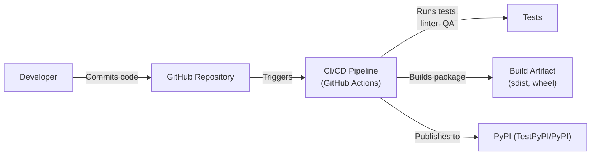

Okay, let's create a design document for the `faker` library, focusing on aspects relevant for threat modeling.

# BUSINESS POSTURE

Business Priorities and Goals:

*   Provide a readily available, easy-to-use library for generating fake data.
*   Support a wide variety of data types and locales.
*   Maintain a high level of code quality and test coverage.
*   Minimize external dependencies to reduce potential security and maintenance overhead.
*   Offer the library as open-source to foster community contributions and adoption.

Most Important Business Risks:

*   Malicious Use: The library, while intended for testing and development, could be misused to generate realistic-looking data for fraudulent purposes (e.g., creating fake user accounts, generating deceptive content).
*   Supply Chain Attacks: Compromise of the library's codebase or build process could lead to the distribution of malicious versions of the library.
*   Data Exposure (Indirect): While the library itself doesn't handle sensitive data, it could be used in environments where generated data is inadvertently treated as real, leading to potential privacy or security issues.
*   Denial of Service (DoS): Although unlikely, resource exhaustion within the library could be triggered by specific inputs, potentially impacting applications that use it.
*   Reputational Damage: Security vulnerabilities or misuse of the library could negatively impact the reputation of the project and its maintainers.

# SECURITY POSTURE

Existing Security Controls:

*   security control: Extensive Test Suite: The project has a comprehensive test suite, which helps ensure the correctness and stability of the library. (Described in the `tests/` directory and CI configuration).
*   security control: Input Validation: Some providers likely include basic input validation to prevent unexpected behavior or errors. (Implicit in the provider implementations).
*   security control: Static Analysis: The project uses tools like `make test`, `make lint`, and `make qa` which likely include static analysis to identify potential code quality and security issues. (Described in the `Makefile`).
*   security control: Dependency Management: The project has a relatively small number of external dependencies, reducing the attack surface. (Described in `pyproject.toml`).
*   security control: Community Scrutiny: As an open-source project, the codebase is subject to review by the community, increasing the likelihood of identifying and addressing security concerns.

Accepted Risks:

*   accepted risk: Misuse Potential: The library is inherently designed to generate fake data, which can be misused. This risk is acknowledged and mitigated through documentation and disclaimers.
*   accepted risk: Limited Input Sanitization: While some input validation exists, the library is not designed as a security tool and may not comprehensively sanitize all inputs.
*   accepted risk: No Cryptographic Security: The library is not intended for cryptographic purposes and does not provide strong random number generation suitable for security-sensitive applications.

Recommended Security Controls:

*   security control: Security-Focused Code Review: Conduct regular code reviews with a specific focus on identifying potential security vulnerabilities.
*   security control: Supply Chain Security Measures: Implement measures to secure the build and distribution process, such as code signing and vulnerability scanning of dependencies.
*   security control: Fuzz Testing: Integrate fuzz testing to identify unexpected behavior or vulnerabilities caused by malformed inputs.
*   security control: Documentation Warnings: Explicitly warn users in the documentation about the potential for misuse and the limitations of the library for security-sensitive applications.

Security Requirements:

*   Authentication: Not applicable, as the library is not an authentication system.
*   Authorization: Not applicable, as the library does not manage access control.
*   Input Validation:
    *   Providers should validate input parameters to prevent unexpected behavior or errors.
    *   Input validation should be primarily focused on preventing crashes or resource exhaustion, not on enforcing strict data formats.
*   Cryptography:
    *   The library should not be used for generating cryptographic keys or other security-sensitive random data.
    *   If random number generation is required, use a cryptographically secure pseudo-random number generator (CSPRNG) from a dedicated security library.

# DESIGN

## C4 CONTEXT

Element Descriptions:

*   Element:
    *   Name: User/Developer
    *   Type: Person
    *   Description: A developer or system that utilizes the Faker library to generate fake data.
    *   Responsibilities: Integrates the Faker library into their application, calls Faker providers to generate data, and handles the generated data appropriately.
    *   Security controls: Not directly applicable, as this is the user of the library.

*   Element:
    *   Name: Faker Library
    *   Type: Software System
    *   Description: The Faker library itself, providing a collection of providers for generating various types of fake data.
    *   Responsibilities: Provides an API for generating fake data, manages providers, handles locale-specific data generation.
    *   Security controls: Input validation, test suite, static analysis.

*   Element:
    *   Name: Python Runtime
    *   Type: Software System
    *   Description: The Python interpreter and standard library.
    *   Responsibilities: Executes the Faker library code.
    *   Security controls: Python's built-in security features and any security updates applied to the runtime.

*   Element:
    *   Name: Optional Dependencies
    *   Type: Software System
    *   Description: External libraries that Faker may optionally depend on for specific providers (e.g., libraries for generating specific data formats).
    *   Responsibilities: Provide functionality for specific providers.
    *   Security controls: Dependent on the security of the individual optional dependencies.

## C4 CONTAINER

Element Descriptions:

*   Element:
    *   Name: User/Developer
    *   Type: Person
    *   Description: A developer or system that utilizes the Faker library.
    *   Responsibilities: Integrates the Faker library, calls API methods.
    *   Security controls: Not directly applicable.

*   Element:
    *   Name: Faker API
    *   Type: API
    *   Description: The public interface of the Faker library.
    *   Responsibilities: Exposes methods for generating fake data, handles locale selection.
    *   Security controls: Input validation (basic).

*   Element:
    *   Name: Provider
    *   Type: Component
    *   Description: A component responsible for generating a specific type of fake data (e.g., names, addresses, text).
    *   Responsibilities: Generates data of a specific type, potentially using locale-specific data sources.
    *   Security controls: Input validation (provider-specific).

*   Element:
    *   Name: Data Sources
    *   Type: Data Store
    *   Description: Locale-specific data used by providers (e.g., lists of names, addresses).
    *   Responsibilities: Stores data used for generation.
    *   Security controls: Data integrity checks (if applicable).

*   Element:
    *   Name: Python Runtime
    *   Type: Software System
    *   Description: The Python interpreter.
    *   Responsibilities: Executes the code.
    *   Security controls: Python's built-in security features.

*   Element:
    *   Name: Optional Dependencies
    *   Type: Software System
    *   Description: External libraries used by specific providers.
    *   Responsibilities: Provide functionality for specific providers.
    *   Security controls: Dependent on the security of the individual dependencies.

## DEPLOYMENT

Possible Deployment Solutions:

1.  Installation via `pip` from PyPI (most common).
2.  Direct download from GitHub.
3.  Inclusion as a vendored dependency within another project.

Chosen Solution (Detailed Description): Installation via `pip` from PyPI

Element Descriptions:

*   Element:
    *   Name: Developer
    *   Type: Person
    *   Description: The developer installing the library.
    *   Responsibilities: Initiates the installation process.
    *   Security controls: Not directly applicable.

*   Element:
    *   Name: PyPI (Python Package Index)
    *   Type: Software System
    *   Description: The central repository for Python packages.
    *   Responsibilities: Stores and serves Faker package releases.
    *   Security controls: PyPI's security measures (e.g., package signing, malware scanning).

*   Element:
    *   Name: Developer's Server/Environment
    *   Type: Infrastructure
    *   Description: The server or environment where the library is being installed.
    *   Responsibilities: Hosts the Python environment.
    *   Security controls: Operating system security, network security.

*   Element:
    *   Name: Python Environment
    *   Type: Software System
    *   Description: The Python environment where Faker is installed.
    *   Responsibilities: Provides the runtime for Faker.
    *   Security controls: Python's built-in security features, virtual environment isolation.

## BUILD

Build Process Description:

1.  Developer commits code to the GitHub repository.
2.  GitHub Actions (CI/CD pipeline) is triggered.
3.  The CI pipeline runs tests, linters, and other quality assurance checks.
4.  If all checks pass, the pipeline builds the package (source distribution and wheel).
5.  The package is published to PyPI (or TestPyPI for testing).

Security Controls:

*   security control: Automated Testing: The CI pipeline runs a comprehensive test suite on every commit.
*   security control: Static Analysis: Linters and quality assurance tools are used to identify potential code quality and security issues.
*   security control: CI/CD Pipeline: The build process is automated, reducing the risk of manual errors and ensuring consistency.
*   security control: TestPyPI: The use of TestPyPI allows for testing the release process before publishing to the main PyPI repository.

# RISK ASSESSMENT

Critical Business Processes to Protect:

*   The integrity and availability of the Faker library on PyPI.
*   The reputation of the project and its maintainers.

Data to Protect and Sensitivity:

*   Source Code: The source code of the Faker library itself is not highly sensitive, as it is open-source. However, its integrity is crucial to prevent the introduction of malicious code.
*   Locale Data: The locale-specific data used by Faker is not inherently sensitive, but it should be accurate and consistent.
*   No User Data: Faker does not handle or store any user data directly. The primary risk is the *misuse* of the generated data by users of the library.

# QUESTIONS & ASSUMPTIONS

Questions:

*   Are there any specific compliance requirements (e.g., GDPR, CCPA) that need to be considered, even though Faker doesn't directly handle personal data?  (Assumption: No specific compliance requirements beyond general best practices for open-source libraries.)
*   What is the expected level of security assurance required by users of the library? (Assumption: Users primarily expect the library to be stable and reliable, with reasonable security precautions taken.)
*   Are there any plans to add features that might introduce new security concerns (e.g., network access, database connections)? (Assumption: No plans for features that would significantly increase the attack surface.)

Assumptions:

*   BUSINESS POSTURE: The primary goal is to provide a useful and reliable library for generating fake data, with a secondary focus on security.
*   SECURITY POSTURE: The existing security controls are considered adequate for the current risk profile, but continuous improvement is desired.
*   DESIGN: The design is relatively simple and does not involve complex interactions with external systems. The primary security focus is on preventing the introduction of vulnerabilities into the library itself and mitigating the risk of misuse.
*   The Python environment in which Faker is used is reasonably secured.
*   Optional dependencies are vetted for security before being used.
*   Developers using Faker are aware of the potential for misuse and take appropriate precautions.