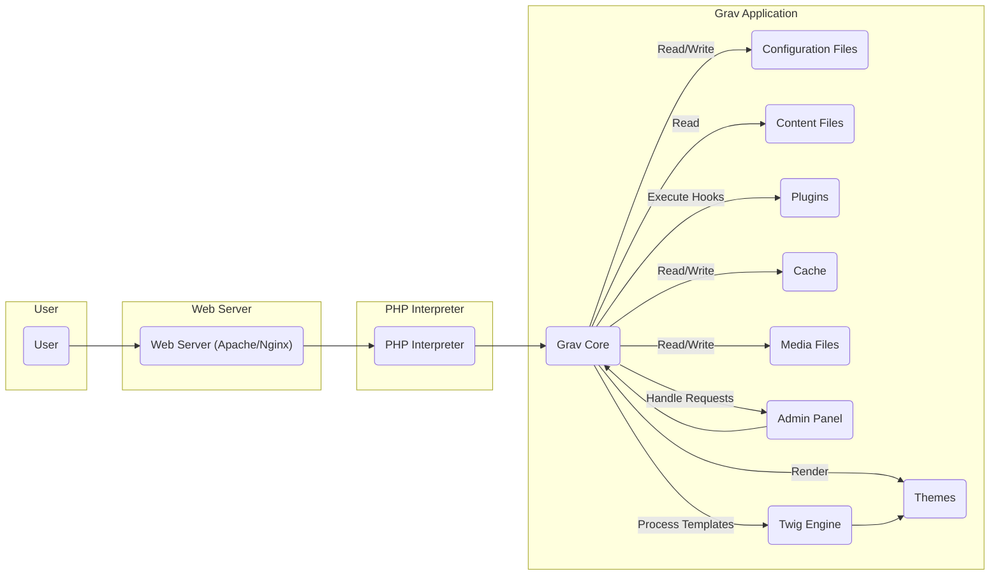
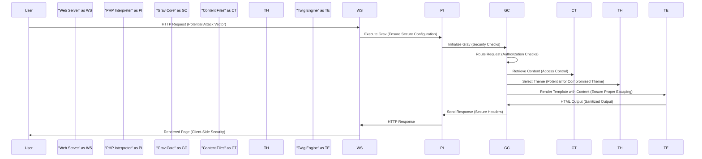

# Project Design Document: Grav CMS

**Version:** 1.1
**Date:** October 26, 2023
**Author:** AI Software Architect

## 1. Introduction

This document provides a detailed architectural design of the Grav Content Management System (CMS), an open-source, flat-file CMS written in PHP. This design document aims to provide a comprehensive understanding of Grav's components, interactions, and data flow, serving as a robust foundation for subsequent threat modeling activities. It focuses on the architectural aspects relevant to identifying potential security vulnerabilities.

## 2. Goals

The primary goals of this design document are:

*   Clearly articulate the architecture of the Grav CMS, emphasizing security-relevant aspects.
*   Identify key components and their specific responsibilities within the system.
*   Describe the detailed data flow within the system, highlighting data transformations and access points.
*   Highlight potential areas of interest for security analysis and threat modeling, linking them to specific components and data flows.
*   Provide clear and informative visual representations of the system's structure and interactions using diagrams.

## 3. Scope

This document covers the core architectural components and functionalities of Grav CMS that are most relevant for security analysis. It includes:

*   The core Grav application, encompassing routing, content management, and event handling.
*   The Admin Panel, including its authentication and authorization mechanisms.
*   The Twig templating engine and its role in rendering user-facing content.
*   The plugin and theme architecture, focusing on their integration points and potential security implications.
*   Caching mechanisms and their impact on data integrity and confidentiality.
*   Media handling processes, including upload, storage, and retrieval.
*   Basic user interaction workflows for both front-end visitors and administrative users.

This document does not cover:

*   Specific implementation details of individual plugins or themes beyond their general interaction patterns.
*   Detailed code-level implementation or specific algorithms used within components.
*   Specific server configurations or deployment environments, although general considerations are included.
*   Third-party integrations beyond outlining their general interaction points with the core system.

## 4. High-Level Architecture

Grav is designed as a flat-file CMS, eliminating the need for a traditional database. Content, configuration, and user data are stored in files and folders. The system operates on a request-response cycle, primarily initiated by user interactions through a web browser. Security is a key consideration in the design, with various mechanisms in place to protect the system and its data.

Key components and their interactions:

*   **User:** Interacts with the system through a web browser, either on the public-facing front-end or the administrative back-end (Admin Panel).
*   **Web Server (e.g., Apache, Nginx):**  Acts as the entry point, receiving HTTP requests and directing them to the PHP interpreter. Security configurations at this level are crucial.
*   **PHP Interpreter:** Executes the Grav application code. The security of the PHP environment itself is a dependency.
*   **Grav Core:** The central application logic, responsible for request routing, content processing, security checks, and rendering the final output.
*   **Configuration Files:** Store system-wide, site-specific, plugin, and theme settings in YAML format. Access control to these files is critical.
*   **Content Files (Markdown, etc.):** Store the website's content in various formats, primarily Markdown. Protection against unauthorized modification is important.
*   **Plugins:** Extend Grav's functionality. Their integration points represent potential attack surfaces.
*   **Themes:** Control the presentation layer. Vulnerabilities here can lead to client-side attacks.
*   **Cache:** Stores processed data to improve performance. Cache poisoning is a potential threat.
*   **Media Files:** Images, videos, and other assets. Security considerations include preventing malicious uploads and unauthorized access.
*   **Admin Panel:** A privileged interface for managing the Grav site. Its security is paramount.
*   **Twig Engine:** The templating engine responsible for rendering dynamic content. Security vulnerabilities in templates can lead to XSS.

## 5. Component Details

This section provides a more detailed description of the key components within the Grav architecture, with a focus on their security-relevant aspects.

*   **Grav Core:**
    *   **Router:** Maps incoming HTTP requests to specific controllers or content. Vulnerabilities here could allow unauthorized access to functionalities.
    *   **Page Manager:** Loads, processes, and renders content pages. Responsible for sanitizing and escaping content to prevent XSS.
    *   **Configuration Manager:** Loads and manages configuration settings. Secure access and validation of these settings are crucial.
    *   **Event Dispatcher:** Allows plugins and themes to intercept and modify Grav's behavior. Improperly secured event listeners can introduce vulnerabilities.
    *   **Cache Manager:** Manages the caching of processed data. Needs to prevent cache poisoning and ensure sensitive data is not cached inappropriately.
    *   **Media Manager:** Handles the processing and serving of media files. Responsible for validating file uploads and preventing access to unauthorized files.
    *   **User Manager:** Manages user authentication and authorization, primarily for the Admin Panel. Secure password handling, session management, and role-based access control are critical.

*   **Admin Panel:**
    *   Provides a web-based interface for privileged users to manage the Grav site. A prime target for attacks.
    *   Key functionalities with security implications:
        *   **Content Management:**  Potential for XSS through content injection if not properly sanitized.
        *   **Configuration Management:**  Unauthorized modification can compromise the entire site.
        *   **Plugin and Theme Management:**  Installing malicious extensions can severely impact security.
        *   **User Management:**  Compromised accounts can lead to full site control.
        *   **System Updates:**  Failure to update can leave the system vulnerable.
    *   Relies on strong authentication and authorization mechanisms within the Grav Core.

*   **Twig Templating Engine:**
    *   Renders the final HTML output. Vulnerabilities in templates can lead to Cross-Site Scripting (XSS) attacks.
    *   Provides mechanisms for escaping output to mitigate XSS risks. Proper usage is essential.
    *   Theme developers need to be aware of potential security pitfalls when writing templates.

*   **Plugins:**
    *   Extend Grav's core functionality. Represent a significant potential attack surface if not developed securely.
    *   Can introduce vulnerabilities such as:
        *   SQL Injection (if interacting with databases).
        *   Cross-Site Scripting (XSS).
        *   Remote Code Execution (if handling user input unsafely).
        *   Authentication bypasses.
    *   Grav's security relies on the security of its plugin ecosystem.

*   **Themes:**
    *   Control the visual presentation. Can introduce client-side vulnerabilities.
    *   Potential security issues:
        *   Cross-Site Scripting (XSS) through malicious JavaScript or improperly escaped data.
        *   Inclusion of vulnerable third-party libraries.
        *   Clickjacking vulnerabilities.

*   **Configuration Files:**
    *   Store sensitive information. Unauthorized access or modification can have severe consequences.
    *   Proper file permissions and secure storage are essential.

*   **Content Files:**
    *   While primarily containing content, vulnerabilities can arise if user-provided content is not properly handled.
    *   Potential for stored XSS if user input is directly rendered without sanitization.

*   **Cache:**
    *   Improves performance but can introduce security risks if not managed properly.
    *   Potential threats:
        *   Cache poisoning:  Injecting malicious content into the cache.
        *   Exposure of sensitive data if not properly secured.

*   **Media Files:**
    *   Handling user-uploaded media requires careful security considerations.
    *   Potential vulnerabilities:
        *   Malicious file uploads (e.g., web shells).
        *   Path traversal vulnerabilities allowing access to unauthorized files.
        *   Exif data containing sensitive information.

## 6. Data Flow

The following describes the typical data flow for a front-end page request, highlighting security considerations at each stage:

1. **User Request:** A user requests a page through their web browser. Malicious requests are a constant threat.
2. **Web Server Receives Request:** The web server receives the HTTP request. Web server security configurations (e.g., firewalls, access controls) are the first line of defense.
3. **Request Routing:** The web server (or a front controller) directs the request to the PHP interpreter. Misconfigurations can expose internal files.
4. **Grav Core Initialization:** The Grav application is initialized. Security checks and initialization routines are executed.
5. **Routing:** The Grav Router analyzes the request URI and determines the corresponding content page or action. Vulnerabilities in the router can lead to unauthorized access.
6. **Content Retrieval:** The Page Manager retrieves the relevant content file(s) from the file system. Access control to content files is crucial.
7. **Content Processing:** The content file (e.g., Markdown) is parsed and processed. Plugins may hook into this process. Careful sanitization of user-provided content is necessary to prevent XSS.
8. **Template Selection:** The appropriate theme template is selected based on configuration and page settings. Compromised themes can introduce vulnerabilities.
9. **Rendering:** The Twig engine renders the template, combining it with the processed content and any relevant data. Proper escaping of variables is essential to prevent XSS.
10. **Output Generation:** The rendered HTML output is generated. Ensure all dynamic content is properly encoded.
11. **Response:** The Grav application sends the HTML response back to the PHP interpreter. Response headers should be configured securely (e.g., Content Security Policy).
12. **Web Server Response:** The web server sends the HTTP response to the user's browser.
13. **User Receives Page:** The user's browser renders the web page. Client-side security measures can help mitigate some risks.

The data flow for an Admin Panel request includes additional steps for authentication and authorization before proceeding with content or configuration manipulation. These steps are critical for preventing unauthorized access.

## 7. Security Considerations

This section expands on the initial security considerations, linking them to specific components and data flows for more targeted threat modeling.

*   **Input Validation:**
    *   **Relevant Components:** Admin Panel, Plugins, Forms (handled by plugins).
    *   **Potential Threats:** Cross-Site Scripting (XSS), SQL Injection (if plugins interact with databases), Command Injection, Path Traversal.
    *   **Mitigation:** Implement robust server-side validation and sanitization of all user inputs.

*   **Authentication and Authorization:**
    *   **Relevant Components:** Admin Panel, User Manager (Grav Core).
    *   **Potential Threats:** Brute-force attacks, credential stuffing, session hijacking, privilege escalation, insecure password storage.
    *   **Mitigation:** Enforce strong password policies, implement multi-factor authentication, secure session management, role-based access control.

*   **File System Security:**
    *   **Relevant Components:** Grav Core, Configuration Files, Content Files, Media Files.
    *   **Potential Threats:** Unauthorized access, modification, or deletion of files; path traversal vulnerabilities.
    *   **Mitigation:** Implement strict file permissions, disable directory listing, sanitize file paths.

*   **Plugin and Theme Security:**
    *   **Relevant Components:** Plugins, Themes, Grav Core (Event Dispatcher).
    *   **Potential Threats:** Introduction of vulnerabilities through malicious or poorly coded extensions, backdoors, arbitrary code execution.
    *   **Mitigation:** Encourage users to install plugins and themes from trusted sources, implement security reviews for popular extensions, utilize sandboxing or isolation techniques if feasible.

*   **Output Encoding:**
    *   **Relevant Components:** Twig Engine, Grav Core (Page Manager).
    *   **Potential Threats:** Cross-Site Scripting (XSS).
    *   **Mitigation:** Utilize Twig's auto-escaping features, ensure proper encoding of all dynamic content.

*   **CSRF Protection:**
    *   **Relevant Components:** Admin Panel, Forms (handled by plugins).
    *   **Potential Threats:** Unauthorized actions performed on behalf of an authenticated user.
    *   **Mitigation:** Implement anti-CSRF tokens for all state-changing requests.

*   **Media Handling Security:**
    *   **Relevant Components:** Media Manager (Grav Core), Media Files.
    *   **Potential Threats:** Malicious file uploads (e.g., web shells), access to unauthorized files, information leakage through EXIF data.
    *   **Mitigation:** Validate file types and content, sanitize filenames, store uploads outside the web root, implement access controls.

*   **Configuration Security:**
    *   **Relevant Components:** Configuration Files, Grav Core (Configuration Manager).
    *   **Potential Threats:** Exposure of sensitive information (API keys, database credentials), unauthorized modification of settings.
    *   **Mitigation:** Secure file permissions, avoid storing sensitive information directly in configuration files (consider environment variables or secure vault solutions).

*   **Caching Security:**
    *   **Relevant Components:** Cache, Cache Manager (Grav Core).
    *   **Potential Threats:** Cache poisoning, exposure of sensitive data in the cache.
    *   **Mitigation:** Implement cache validation mechanisms, avoid caching sensitive data, use secure caching mechanisms.

## 8. Deployment Considerations

Secure deployment practices are crucial for mitigating risks.

*   **Web Server Configuration:**
    *   Disable unnecessary modules and features.
    *   Implement access controls and firewalls.
    *   Configure secure headers (e.g., HSTS, Content Security Policy).

*   **PHP Configuration:**
    *   Disable dangerous functions.
    *   Set appropriate security directives (e.g., `open_basedir`, `disable_functions`).
    *   Keep PHP up-to-date.

*   **File Permissions:**
    *   Apply the principle of least privilege.
    *   Ensure web server user has minimal necessary permissions.

*   **HTTPS:**
    *   Enforce HTTPS for all communication.
    *   Use a valid SSL/TLS certificate.

*   **Regular Updates:**
    *   Keep Grav core, plugins, themes, and server software updated to patch vulnerabilities.

*   **Security Audits:**
    *   Regularly perform security audits and penetration testing.

## 9. Technologies Used

*   **Programming Language:** PHP
*   **Templating Engine:** Twig
*   **Data Storage:** Flat files (Markdown, YAML, JSON, etc.)
*   **Web Servers (Common):** Apache, Nginx
*   **Markup Language:** Markdown (primarily)
*   **Frontend Technologies (Theme Dependent):** HTML, CSS, JavaScript
*   **Data Serialization:** YAML, JSON

This improved design document provides a more detailed and security-focused overview of the Grav CMS architecture, serving as a valuable resource for conducting thorough threat modeling and implementing appropriate security measures.