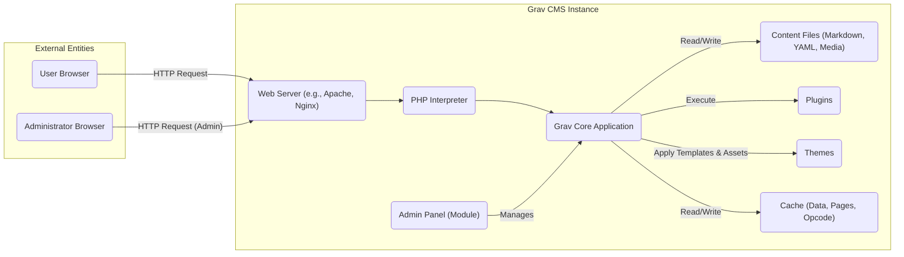
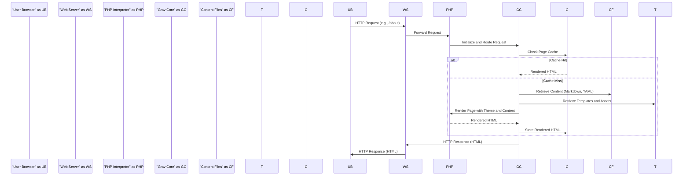
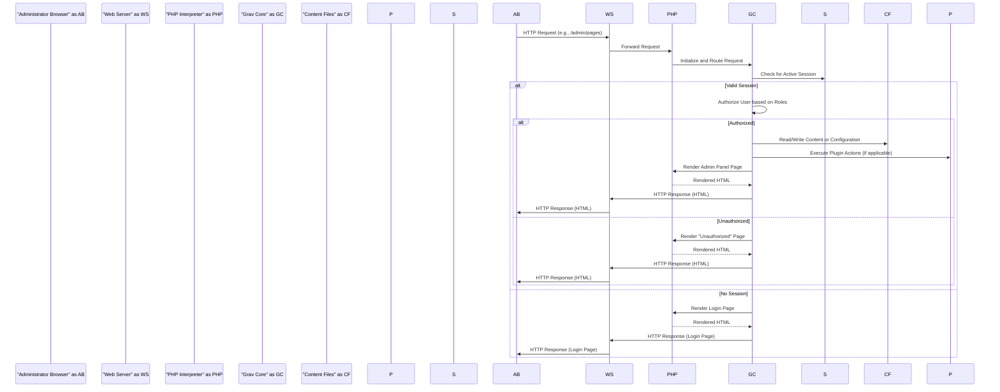

# Project Design Document: Grav CMS

**Version:** 1.1
**Date:** October 26, 2023
**Author:** AI Software Architect

## 1. Introduction

This document provides an enhanced and more detailed design overview of the Grav CMS project, an open-source flat-file content management system. This document is specifically intended to serve as a comprehensive foundation for subsequent threat modeling activities. It meticulously outlines the key components, data flow, and interactions within the Grav ecosystem, providing the necessary context for identifying potential security vulnerabilities.

## 2. Goals and Objectives

The primary goals of Grav are to provide a fast, flexible, and user-friendly content management system that operates without the need for a traditional database. Key objectives include:

*   Simplifying the process of content creation, editing, and management for users of varying technical skill levels.
*   Providing a rich and extensible architecture through a robust plugin and theme ecosystem, allowing for customization and feature enhancement.
*   Offering a high-performance and lightweight platform suitable for various hosting environments.
*   Maintaining a strong emphasis on security and stability through regular updates and community contributions.
*   Providing a straightforward installation and configuration process.

## 3. High-Level Architecture

Grav's architecture is fundamentally built upon a flat-file system and a PHP-based core. The following diagram illustrates the primary components and their interactions within a typical Grav instance:

**Components:**

*   **User Browser:** The web browser application used by visitors to access the public-facing front-end of the Grav website.
*   **Administrator Browser:** The web browser application used by authorized administrators to access and manage the back-end administrative interface of the Grav website.
*   **Web Server (e.g., Apache, Nginx):**  Acts as the entry point for all incoming HTTP requests. It receives requests from clients and routes them appropriately, often forwarding PHP requests to the PHP interpreter. It also serves static assets.
*   **PHP Interpreter:** The software that executes the PHP code comprising the Grav Core, plugins, and themes. It processes requests and generates dynamic content.
*   **Grav Core Application:** The central application logic of the CMS. It handles routing, content retrieval and processing, template rendering, plugin management, user authentication (for the admin panel), and interaction with the file system.
*   **Content Files (Markdown, YAML, Media):**  Stores the website's content, configuration settings, and media assets as plain text files within a defined directory structure. This includes Markdown files for page content, YAML files for configuration and frontmatter, and various media files (images, videos, etc.).
*   **Plugins:**  Extend the core functionality of Grav. They are PHP scripts that can hook into various events and modify Grav's behavior, add new features, or integrate with external services.
*   **Themes:** Control the visual presentation and layout of the website. They consist of Twig templates, CSS stylesheets, JavaScript files, and asset files (images, fonts).
*   **Cache (Data, Pages, Opcode):**  Used to store processed data, rendered HTML pages, and compiled PHP code (opcode) to improve performance and reduce server load. Different caching mechanisms may be employed.
*   **Admin Panel (Module):** A specific module within the Grav Core that provides a web-based user interface for managing the Grav installation. It handles user authentication, content management, plugin/theme management, and configuration settings.

## 4. Detailed Design

### 4.1. Web Server Interaction

The web server plays a crucial role in handling incoming requests and serving content. Key aspects include:

*   **Request Handling:** Receives HTTP requests from user and administrator browsers, parsing headers and request bodies.
*   **Static Asset Serving:** Directly serves static files such as images, CSS, JavaScript, and other assets from the file system.
*   **PHP Request Forwarding:**  Identifies requests for PHP files (typically `index.php`) and forwards them to the configured PHP interpreter (e.g., via FastCGI). Configuration directives (e.g., in `.htaccess` for Apache or server blocks in Nginx) determine this behavior.
*   **SSL/TLS Termination:** Handles the decryption of HTTPS traffic, ensuring secure communication.
*   **Access Control:** May implement basic access control mechanisms based on IP addresses or other criteria.
*   **URL Rewriting:**  Uses rules (e.g., in `.htaccess` or Nginx configuration) to rewrite URLs, enabling Grav's clean URL structure.

### 4.2. PHP Interpreter and Grav Core

The PHP interpreter executes the Grav application code, which is the core of the CMS.

*   **Initialization:** Upon receiving a request, the PHP interpreter initializes the Grav Core application.
*   **Request Lifecycle:** Grav Core processes the request through a defined lifecycle:
    *   **Routing:**  Determines the appropriate controller and action based on the requested URL.
    *   **Content Lookup:**  Retrieves the relevant content files based on the route.
    *   **Frontmatter Processing:** Parses the YAML frontmatter within content files to extract metadata.
    *   **Plugin Event Handling:** Triggers relevant plugin events, allowing plugins to modify the request or response.
    *   **Template Selection:**  Determines the appropriate Twig template based on the page and theme configuration.
    *   **Content Rendering:**  Renders the content using the selected template and data.
    *   **Response Generation:**  Generates the final HTML response.
*   **Key Modules/Components:**
    *   **Pages:** Handles content retrieval and management.
    *   **Taxonomy:** Manages categories and tags for content organization.
    *   **Config:**  Loads and manages configuration settings from YAML files.
    *   **Cache:** Provides an interface for interacting with the caching system.
    *   **Session:** Manages user sessions (primarily for the Admin Panel).
    *   **User/Account Management (Admin Panel):** Handles user authentication, authorization, and role management for administrative access.
*   **File System Interaction:**  Reads and writes content files, configuration files, cache files, and plugin/theme files.

### 4.3. Content Files

Grav's flat-file approach centers around storing content in the file system.

*   **Markdown Files (`.md`):** The primary format for page content, allowing for easy formatting.
*   **YAML Files (`.yaml`, `.yml`):** Used for:
    *   **Page Frontmatter:** Metadata associated with each page (e.g., title, template, order).
    *   **Configuration Files:**  Settings for Grav core, plugins, and themes.
    *   **Data Files:**  Storing structured data that can be accessed by themes and plugins.
*   **Media Files (Images, Videos, Documents):** Stored in the file system, typically within page-specific folders or a dedicated media directory.
*   **Directory Structure:** Content is organized in a hierarchical folder structure, where each folder represents a page or section of the website. The folder names often correspond to the URL structure.

### 4.4. Plugins and Themes

Plugins and themes provide extensibility and customization.

*   **Plugins:**
    *   **Event-Driven Architecture:** Plugins register event listeners that are triggered by Grav Core during the request lifecycle.
    *   **API Access:** Plugins can interact with Grav Core's API to access data, modify behavior, and add new functionality.
    *   **Installation and Management:**  Plugins can be installed, updated, and configured through the Admin Panel or via the command line.
    *   **Potential Security Risks:** As third-party code, plugins can introduce vulnerabilities if not developed securely.
*   **Themes:**
    *   **Twig Templating Engine:** Themes use Twig templates to generate HTML output.
    *   **Asset Management:** Themes include CSS, JavaScript, images, and other assets to control the visual presentation.
    *   **Template Overriding:** Child themes can override templates from parent themes for customization.
    *   **Theme Inheritance:** Allows for creating variations of existing themes.

### 4.5. Admin Panel

The Admin Panel provides a web-based interface for managing Grav.

*   **Authentication:**  Uses username/password credentials (and potentially other methods) to authenticate administrators. Session management is crucial for maintaining authenticated sessions.
*   **Authorization:**  Implements role-based access control to restrict access to certain features based on the administrator's assigned roles and permissions.
*   **Key Functionalities:**
    *   **Content Management:** Creating, editing, and deleting pages and media files.
    *   **Plugin Management:** Installing, updating, enabling/disabling, and configuring plugins.
    *   **Theme Management:** Selecting, configuring, and editing themes.
    *   **Configuration Settings:** Modifying Grav's core settings and plugin configurations.
    *   **User Management:** Creating, editing, and deleting administrator accounts and managing their roles.
    *   **System Information:** Viewing system status, logs, and diagnostics.
    *   **Cache Management:** Clearing the various caches.

### 4.6. Caching

Grav utilizes various caching mechanisms for performance optimization.

*   **Page Cache:** Stores the rendered HTML output of pages, avoiding the need to re-render on subsequent requests.
*   **Data Cache:** Stores frequently accessed data from configuration files, content files, or plugin data.
*   **Opcode Cache (PHP):**  Caches the compiled bytecode of PHP scripts, reducing the overhead of compiling PHP code on each request. This is typically handled by PHP extensions like OPcache.
*   **Cache Invalidation:** Mechanisms exist to invalidate the cache when content or configuration changes are made.

## 5. Data Flow

### 5.1. Front-End Request Flow

**Description:**  A user requests a page. The web server forwards the request to the PHP interpreter, which initializes Grav Core. Grav Core checks the page cache. If a cached version exists, it's returned. Otherwise, Grav Core retrieves content and theme files, renders the page, stores it in the cache, and sends the response back through the web server to the user's browser.

### 5.2. Admin Panel Request Flow

**Description:** An administrator accesses the Admin Panel. The web server forwards the request to the PHP interpreter. Grav Core checks for an active session. If a valid session exists, the user is authorized based on their roles. If authorized, Grav Core interacts with content files and plugins as needed, renders the requested page, and sends the response. If no session exists, the login page is displayed.

## 6. Security Considerations (Initial)

This section provides a more detailed initial overview of potential security considerations relevant to threat modeling.

*   **Input Validation & Sanitization:**
    *   **User-Supplied Data:**  Validate and sanitize all user input from both the front-end (e.g., forms, search queries) and the Admin Panel to prevent XSS, HTML injection, and other injection attacks.
    *   **File Uploads:**  Strictly validate file uploads (type, size, content) to prevent malicious file uploads and potential code execution vulnerabilities.
*   **Authentication & Authorization:**
    *   **Admin Panel Authentication:** Ensure strong password policies, protection against brute-force attacks, and consider multi-factor authentication for the Admin Panel.
    *   **Session Management:** Securely manage administrator sessions using secure cookies (HttpOnly, Secure flags) and implement session timeouts to prevent session hijacking.
    *   **Role-Based Access Control (RBAC):** Properly implement and enforce RBAC in the Admin Panel to restrict access to sensitive functionalities based on user roles.
*   **File System Security:**
    *   **Content File Protection:**  Implement appropriate file system permissions to prevent unauthorized access or modification of content and configuration files.
    *   **Path Traversal Prevention:**  Ensure that the application properly handles file paths to prevent attackers from accessing files outside of the intended directories.
*   **Plugin & Theme Security:**
    *   **Third-Party Code Risks:** Recognize that plugins and themes are third-party code and can introduce vulnerabilities. Implement mechanisms for plugin/theme verification (if possible) and encourage secure development practices.
    *   **Template Injection:**  Sanitize data passed to Twig templates to prevent template injection vulnerabilities.
*   **Cross-Site Request Forgery (CSRF):** Implement CSRF protection measures (e.g., anti-CSRF tokens) for all state-changing operations in the Admin Panel.
*   **Information Disclosure:**
    *   **Error Handling:**  Avoid displaying verbose error messages that could reveal sensitive information about the system.
    *   **Directory Listing:** Disable directory listing on the web server to prevent attackers from browsing the file structure.
*   **Denial of Service (DoS):**
    *   **Rate Limiting:** Implement rate limiting for sensitive operations (e.g., login attempts) to mitigate brute-force and DoS attacks.
    *   **Resource Limits:** Configure appropriate resource limits (e.g., upload size limits) to prevent resource exhaustion.
*   **Cryptographic Security:**
    *   **Password Hashing:** Use strong hashing algorithms (e.g., Argon2i) to securely store administrator passwords.
    *   **HTTPS Enforcement:** Enforce HTTPS to protect communication between the client and server.
*   **Security Headers:** Implement security-related HTTP headers (e.g., Content Security Policy, X-Frame-Options, X-Content-Type-Options) to enhance security.

## 7. Assumptions and Constraints

*   It is assumed that the underlying operating system and server infrastructure are properly secured and maintained.
*   It is assumed that the web server and PHP interpreter are configured according to security best practices.
*   This design document focuses primarily on the core Grav CMS functionality and does not delve into the specific implementation details and security considerations of individual plugins unless explicitly mentioned.
*   The flat-file nature of Grav inherently mitigates certain database-specific vulnerabilities (like SQL injection against a traditional database) but introduces its own set of security considerations related to file system access and manipulation.
*   The security of third-party libraries and dependencies used by Grav is considered an external factor but should be monitored for known vulnerabilities.
*   Regular security audits and penetration testing are recommended to identify and address potential vulnerabilities.

This improved design document provides a more detailed and comprehensive understanding of the Grav CMS architecture, making it a more effective foundation for conducting thorough threat modeling. The expanded descriptions of components, data flows, and security considerations offer a clearer picture of the system's attack surface and potential vulnerabilities.