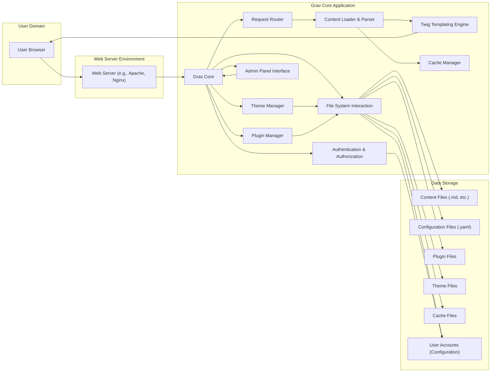

## Project Design Document: Grav CMS - Threat Modeling Focus

**Project Name:** Grav - Modern Flat-File CMS

**Document Version:** 1.1

**Date:** October 26, 2023

**Author:** AI Software Architect

**1. Introduction**

This document provides an enhanced architectural design of the Grav CMS (Content Management System), an open-source, flat-file CMS. This version specifically focuses on providing the necessary details for effective threat modeling. It builds upon the previous version by elaborating on potential security vulnerabilities and attack vectors based on the system's components, interactions, and data flow. The information presented here is derived from the publicly available source code and documentation of the Grav project found at [https://github.com/getgrav/grav](https://github.com/getgrav/grav).

**2. Goals**

*   Provide a comprehensive and detailed overview of the Grav CMS architecture, emphasizing security-relevant aspects.
*   Clearly identify key components, their functionalities, and potential security weaknesses.
*   Describe the data flow within the system with a focus on potential points of compromise.
*   Highlight specific security considerations and potential threats associated with each component and interaction.
*   Serve as a robust foundation for conducting thorough and targeted threat modeling activities.

**3. Scope**

This document focuses on the core architectural components and functionalities of the Grav CMS relevant to security. It includes:

*   The core application logic and its security implications.
*   The plugin and theme system, with a focus on extension security.
*   The admin panel interface and its authentication/authorization mechanisms.
*   Content management and rendering processes, highlighting potential injection points.
*   Detailed user interaction flows, considering both authenticated and unauthenticated users.

This document does not cover:

*   Specific plugin implementations in exhaustive detail (though general plugin security is addressed).
*   Highly granular configuration options unless they have direct security implications.
*   Deployment specifics beyond general considerations (server hardening is assumed).
*   Detailed code-level implementation beyond architectural considerations.

**4. System Architecture**

The following diagram provides a high-level overview of the Grav CMS architecture, emphasizing components relevant to security:

**5. Component Details with Security Considerations**

This section describes the key components of the Grav CMS, highlighting potential security vulnerabilities associated with each:

*   **User Browser:** The client-side application.
    *   *Security Consideration:* Susceptible to attacks originating from malicious content served by the Grav site (e.g., XSS).
*   **Web Server (e.g., Apache, Nginx):** The entry point for all requests.
    *   *Security Considerations:* Vulnerable to standard web server attacks if not properly configured and patched (e.g., DDoS, HTTP request smuggling). Misconfigurations can expose sensitive files.
*   **Grav Core:** The central application logic.
    *   *Security Considerations:*  Vulnerabilities in the core logic could have widespread impact. Improper input validation here can lead to various injection attacks.
*   **Request Router:** Maps incoming requests to specific handlers.
    *   *Security Considerations:*  Incorrect routing logic or lack of proper sanitization of route parameters could lead to unauthorized access or information disclosure.
*   **Content Loader & Parser:** Loads and processes content files.
    *   *Security Considerations:* Vulnerable to path traversal attacks if not carefully implemented. Improper parsing of content could lead to vulnerabilities if malicious content is uploaded.
*   **Twig Templating Engine:** Renders dynamic HTML.
    *   *Security Considerations:* Susceptible to Server-Side Template Injection (SSTI) if user-controlled data is directly embedded in templates without proper sanitization.
*   **Cache Manager:** Stores processed content for performance.
    *   *Security Considerations:* Cache poisoning vulnerabilities could allow attackers to serve malicious content to users. Insecure cache storage could expose sensitive data.
*   **Plugin Manager:** Handles the installation, update, and management of plugins.
    *   *Security Considerations:*  A significant attack surface. Vulnerabilities in the plugin manager could allow for arbitrary code execution through malicious plugin uploads or compromised plugin repositories.
*   **Theme Manager:** Manages the website's visual themes.
    *   *Security Considerations:* Similar to plugins, themes can introduce vulnerabilities if they contain malicious code or are poorly written.
*   **Admin Panel Interface:** The web interface for administrative tasks.
    *   *Security Considerations:* A prime target for attackers. Vulnerabilities here could lead to complete site compromise. Requires strong authentication and authorization.
*   **Authentication & Authorization:** Manages user logins and access control.
    *   *Security Considerations:* Weak authentication mechanisms (e.g., easily guessable passwords, lack of multi-factor authentication) and authorization flaws can grant unauthorized access.
*   **File System Interaction:**  Handles reading and writing files.
    *   *Security Considerations:*  Critical for security. Improper handling can lead to path traversal, arbitrary file read/write, and code execution vulnerabilities.
*   **Content Files (.md, etc.):** Store the website's content.
    *   *Security Considerations:* If writable by the web server process, they could be modified by attackers gaining unauthorized access.
*   **Configuration Files (.yaml):** Store application settings.
    *   *Security Considerations:* Contain sensitive information (e.g., API keys, database credentials if used by plugins). Unauthorized access can lead to significant compromise.
*   **Plugin Files:** Contain the code for installed plugins.
    *   *Security Considerations:*  Can contain vulnerabilities or malicious code.
*   **Theme Files:** Contain the code for installed themes.
    *   *Security Considerations:* Can contain vulnerabilities or malicious code.
*   **Cache Files:** Store cached data.
    *   *Security Considerations:*  While generally not containing critical secrets, cache poisoning is a concern.
*   **User Accounts (Configuration):** Stores user credentials.
    *   *Security Considerations:*  Must be securely stored (e.g., using strong hashing algorithms).

**6. Data Flow with Security Implications**

This section outlines the typical data flow for common user interactions, highlighting potential security vulnerabilities at each stage:

*   **Front-end Page Request (Anonymous User):**
    *   **User Browser -> Web Server:** HTTP request. *Security Implication:* Potential for malicious requests targeting web server vulnerabilities.
    *   **Web Server -> Grav Core (Request Router):** Forwarded request. *Security Implication:* Web server misconfiguration could expose internal details.
    *   **Request Router -> Content Loader & Parser:** Determines content. *Security Implication:*  Vulnerable to path traversal if input is not sanitized.
    *   **Content Loader & Parser -> Twig Templating Engine:** Loads and parses content. *Security Implication:*  Improper parsing could lead to vulnerabilities if malicious content exists.
    *   **Twig Templating Engine -> Cache Manager:** Renders content. *Security Implication:* SSTI vulnerabilities if user input is directly used in templates.
    *   **Cache Manager -> User Browser (via Web Server):** Serves cached or rendered content. *Security Implication:* Cache poisoning could serve malicious content.

*   **Admin Panel Login:**
    *   **User Browser -> Web Server:** Login request. *Security Implication:*  Man-in-the-middle attacks if not using HTTPS.
    *   **Web Server -> Grav Core (Request Router -> Admin Panel Interface):** Forwarded request.
    *   **Admin Panel Interface -> Authentication & Authorization:** Processes login credentials. *Security Implication:* Brute-force attacks if no rate limiting. Vulnerable to credential stuffing.
    *   **Authentication & Authorization -> User Accounts (Configuration):** Verifies credentials. *Security Implication:* Weak password hashing algorithms could be compromised.
    *   **Authentication & Authorization -> Admin Panel Interface -> User Browser:** Establishes session (if successful). *Security Implication:* Insecure session management (e.g., predictable session IDs) can be exploited.

*   **Content Creation/Modification via Admin Panel:**
    *   **User Browser -> Web Server -> Grav Core (Admin Panel Interface):**  Authenticated request to modify content. *Security Implication:* CSRF vulnerabilities if requests are not properly protected.
    *   **Admin Panel Interface -> Content Loader & Parser:** Processes user input. *Security Implication:*  Vulnerable to XSS if input is not sanitized before saving.
    *   **Content Loader & Parser -> File System Interaction:** Saves content to the file system. *Security Implication:*  Improper file handling could lead to writing to unintended locations.
    *   **Cache Manager (Invalidation):**  Cache is invalidated.

*   **Plugin Installation/Update:**
    *   **User Browser -> Web Server -> Grav Core (Admin Panel Interface -> Plugin Manager):** Authenticated request to manage plugins.
    *   **Plugin Manager -> External Source (Optional):** Downloads plugin files. *Security Implication:*  Risk of downloading malicious plugins if the source is compromised or not verified.
    *   **Plugin Manager -> File System Interaction:** Writes plugin files to the file system. *Security Implication:*  Vulnerabilities in the plugin installation process could allow for arbitrary file write.

**7. Authentication and Authorization**

This section details how Grav handles user authentication and authorization, crucial for securing the admin panel:

*   **Authentication:** Typically involves verifying user credentials (username and password) against stored user data in configuration files (usually YAML).
    *   *Security Considerations:* The strength of the password hashing algorithm used is critical. Lack of features like password salting or key stretching weakens security. The absence of multi-factor authentication increases risk.
*   **Authorization:** Determines what actions a logged-in user is permitted to perform. Grav likely uses a role-based access control (RBAC) system, where users are assigned roles with specific permissions.
    *   *Security Considerations:*  Misconfigured permissions can lead to privilege escalation, where a user gains access to functionalities they shouldn't have. Vulnerabilities in the authorization logic could allow bypassing access controls.

**8. Security Considerations (Detailed)**

This section expands on the initial security considerations, providing more specific examples of potential threats:

*   **Web Server Vulnerabilities:**
    *   Exploiting known vulnerabilities in Apache or Nginx versions.
    *   DDoS attacks overwhelming the server.
    *   HTTP request smuggling to bypass security controls.
*   **File System Access:**
    *   Path traversal vulnerabilities allowing access to sensitive files.
    *   Arbitrary file upload vulnerabilities leading to code execution.
    *   Local file inclusion (LFI) vulnerabilities.
*   **Plugin Security:**
    *   Malicious plugins containing backdoors or malware.
    *   Vulnerabilities in popular plugins being exploited.
    *   Supply chain attacks targeting plugin dependencies.
*   **Admin Panel Security:**
    *   Brute-force attacks on login forms.
    *   Credential stuffing attacks using leaked credentials.
    *   Session hijacking due to insecure session management.
    *   Authorization bypass vulnerabilities.
*   **Twig Templating Engine Vulnerabilities:**
    *   Server-Side Template Injection (SSTI) allowing arbitrary code execution.
*   **Caching Vulnerabilities:**
    *   Cache poisoning to serve malicious content.
    *   Cache injection to inject malicious code into cached pages.
*   **Cross-Site Scripting (XSS):**
    *   Stored XSS in content allowing attackers to inject malicious scripts.
    *   Reflected XSS through vulnerable parameters.
*   **Cross-Site Request Forgery (CSRF):**
    *   Tricking authenticated users into performing unintended actions.
*   **Information Disclosure:**
    *   Exposing sensitive information through error messages or debug logs.
    *   Insecure file permissions allowing unauthorized access to configuration files.
*   **Dependency Vulnerabilities:**
    *   Exploiting known vulnerabilities in PHP libraries or other dependencies.

**9. Technologies Used**

*   **PHP:** The core programming language. *Security Consideration:* Requires secure coding practices to avoid common PHP vulnerabilities.
*   **Twig:** The templating engine. *Security Consideration:* Requires careful handling of user input to prevent SSTI.
*   **Markdown:** For content creation. *Security Consideration:* Potential for XSS if not properly sanitized when rendered.
*   **YAML:** For configuration. *Security Consideration:* Sensitive data should be protected.
*   **HTML, CSS, JavaScript:** For the front-end and admin panel. *Security Consideration:* Susceptible to standard web front-end vulnerabilities (XSS, etc.).
*   **Various PHP libraries and dependencies.** *Security Consideration:* Requires regular updates to patch vulnerabilities.

**10. Deployment Considerations**

*   Secure web server configuration (HTTPS, proper permissions, etc.).
*   Regular security updates for the web server and PHP.
*   Consideration of web application firewalls (WAFs).
*   Secure file system permissions.
*   Regular backups.

**11. Future Considerations**

*   Detailed threat modeling using frameworks like STRIDE.
*   Security testing (penetration testing, vulnerability scanning).
*   Secure coding guidelines for plugin development.
*   Implementation of security headers (e.g., Content Security Policy).

This enhanced design document provides a more detailed and security-focused view of the Grav CMS architecture, making it a more effective tool for conducting thorough threat modeling and identifying potential security risks.