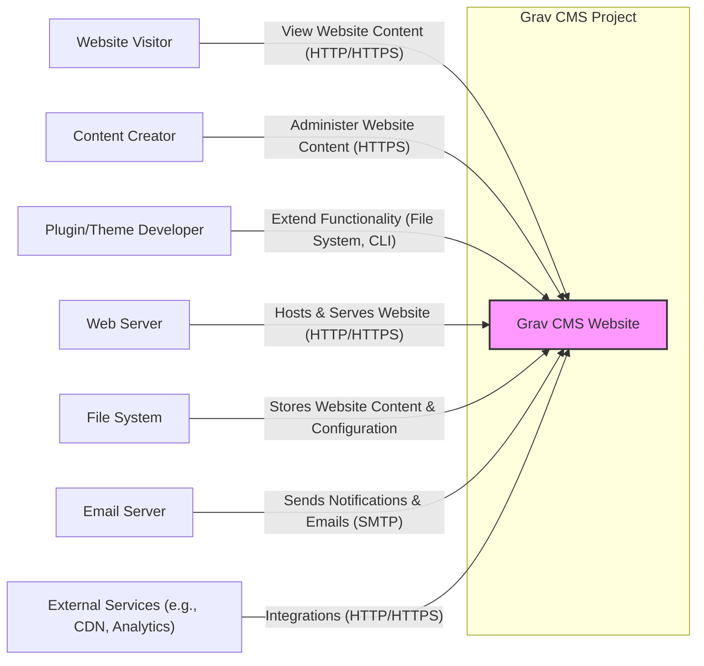
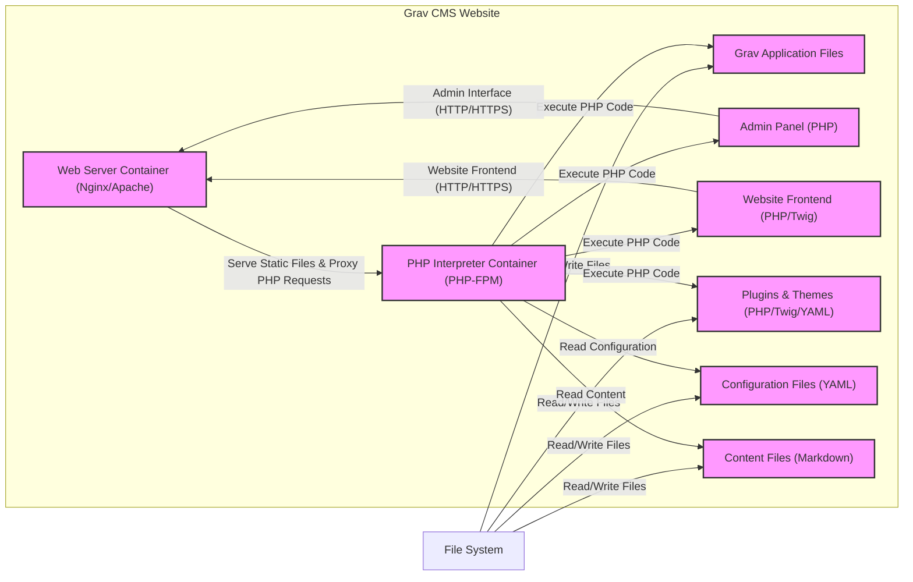
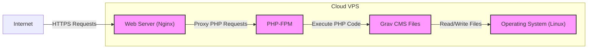

# BUSINESS POSTURE

- Business Priorities and Goals:
  - Goal: To provide a fast, flexible, and easy-to-use content management system (CMS) that is based on flat-files, eliminating the need for a database.
  - Priority: User experience for both content creators and website visitors, ease of installation and maintenance, extensibility through plugins and themes, performance and speed.
  - Priority: Community growth and adoption of Grav CMS as a preferred flat-file CMS solution.

- Business Risks:
  - Risk: Data loss due to improper file system permissions or backups, as Grav relies on the file system for data storage.
  - Risk: Security vulnerabilities in plugins or themes developed by the community, potentially leading to website compromise.
  - Risk: Performance issues if not properly configured or if hosting infrastructure is inadequate, impacting user experience and SEO.
  - Risk: Difficulty in scaling for very large websites or high traffic volumes compared to database-driven CMS solutions.
  - Risk: Competition from other CMS platforms, both flat-file and database-driven, potentially limiting market share and adoption.

# SECURITY POSTURE

- Existing Security Controls:
  - security control: Regular security updates for the Grav core and official plugins, described in Grav documentation and release notes.
  - security control: User authentication and authorization for accessing the Grav Admin Panel, implemented within the Grav core.
  - security control: Input validation and sanitization to prevent common web vulnerabilities like XSS and SQL injection (although SQL injection is less relevant for a flat-file CMS), implemented within the Grav core and expected in plugins.
  - security control: Password hashing for user credentials, implemented within the Grav core.
  - security control: File system permissions recommendations in the Grav documentation to secure file storage.
  - security control: HTTPS support for secure communication between users and the website, dependent on server configuration.
  - accepted risk: Reliance on community-developed plugins and themes, which may have varying levels of security.
  - accepted risk: Flat-file nature might be perceived as less robust against certain types of attacks compared to database-backed systems, although this is not inherently true.

- Recommended Security Controls:
  - security control: Implement automated security scanning (SAST/DAST) in the development and release pipeline for Grav core and official plugins.
  - security control: Provide security guidelines and best practices for plugin and theme developers to minimize vulnerabilities.
  - security control: Encourage and facilitate security audits of Grav core and popular plugins by independent security researchers.
  - security control: Implement Content Security Policy (CSP) to mitigate XSS risks.
  - security control: Regularly review and update file system permission recommendations based on evolving security best practices.
  - security control: Implement rate limiting and brute-force protection for login attempts to the Admin Panel.

- Security Requirements:
  - Authentication:
    - requirement: Secure authentication mechanism for Admin Panel access, using strong password policies and potentially multi-factor authentication.
    - requirement: Role-based access control (RBAC) to manage user permissions within the Admin Panel.
    - requirement: Secure session management to prevent session hijacking.
  - Authorization:
    - requirement: Granular authorization controls to manage access to different functionalities and content within the Admin Panel.
    - requirement: Principle of least privilege should be applied to user roles and permissions.
  - Input Validation:
    - requirement: Comprehensive input validation and sanitization for all user inputs, both in the Admin Panel and frontend forms.
    - requirement: Protection against common web vulnerabilities such as XSS, CSRF, and injection attacks.
  - Cryptography:
    - requirement: Secure storage of sensitive data, such as user passwords, using strong hashing algorithms.
    - requirement: Use of HTTPS for all communication to protect data in transit.
    - requirement: Consider encryption for sensitive data at rest if required by specific use cases or regulations.

# DESIGN

## C4 CONTEXT

- Context Diagram Elements:
  - Element:
    - Name: Grav CMS Website
    - Type: Software System
    - Description: The Grav CMS application itself, responsible for managing and serving website content.
    - Responsibilities: Content management, website rendering, user authentication and authorization, plugin and theme management, configuration management.
    - Security controls: Input validation, authentication, authorization, session management, password hashing, security updates, CSP.
  - Element:
    - Name: Website Visitor
    - Type: Person
    - Description: End-users who browse the public-facing website.
    - Responsibilities: Viewing website content.
    - Security controls: None directly, relies on Grav CMS and Web Server security.
  - Element:
    - Name: Content Creator
    - Type: Person
    - Description: Users who create, edit, and manage website content through the Grav Admin Panel.
    - Responsibilities: Content creation and management, website administration.
    - Security controls: Authentication, authorization, access control to Admin Panel.
  - Element:
    - Name: Plugin/Theme Developer
    - Type: Person
    - Description: Developers who create plugins and themes to extend Grav CMS functionality and appearance.
    - Responsibilities: Developing and maintaining plugins and themes.
    - Security controls: Code review guidelines, security best practices documentation.
  - Element:
    - Name: Web Server
    - Type: Software System
    - Description: Web server (e.g., Apache, Nginx) that hosts and serves the Grav CMS website.
    - Responsibilities: Handling HTTP/HTTPS requests, serving static files, executing PHP code.
    - Security controls: HTTPS configuration, web server hardening, access controls, firewall.
  - Element:
    - Name: File System
    - Type: Infrastructure
    - Description: File system where Grav CMS files, content, and configuration are stored.
    - Responsibilities: Persistent storage of website data.
    - Security controls: File system permissions, access controls, backups, encryption at rest (optional).
  - Element:
    - Name: Email Server
    - Type: Software System
    - Description: Email server used by Grav CMS to send notifications and emails (e.g., password reset, form submissions).
    - Responsibilities: Sending emails.
    - Security controls: SMTP authentication, secure connection to email server, email content sanitization.
  - Element:
    - Name: External Services (e.g., CDN, Analytics)
    - Type: Software System
    - Description: External services integrated with Grav CMS for functionalities like content delivery network (CDN), website analytics, etc.
    - Responsibilities: Providing additional website functionalities.
    - Security controls: HTTPS communication, API key management, data privacy considerations for external services.

## C4 CONTAINER

- Container Diagram Elements:
  - Element:
    - Name: Web Server Container (Nginx/Apache)
    - Type: Container
    - Description: Web server software responsible for handling HTTP/HTTPS requests, serving static files, and proxying PHP requests.
    - Responsibilities: Web request handling, static file serving, reverse proxy for PHP.
    - Security controls: HTTPS configuration, web server hardening, access controls, rate limiting, firewall, security updates.
  - Element:
    - Name: PHP Interpreter Container (PHP-FPM)
    - Type: Container
    - Description: PHP FastCGI Process Manager (PHP-FPM) responsible for executing PHP code for Grav CMS.
    - Responsibilities: PHP code execution, processing Grav CMS logic.
    - Security controls: PHP configuration hardening (disable dangerous functions, limit resource usage), security updates, process isolation.
  - Element:
    - Name: Grav Application Files
    - Type: Container (File System Directory)
    - Description: Core Grav CMS application files, including PHP scripts, libraries, and assets.
    - Responsibilities: Core CMS functionality.
    - Security controls: File system permissions, regular security updates.
  - Element:
    - Name: Admin Panel (PHP)
    - Type: Container (PHP Application)
    - Description: PHP application providing the administrative interface for managing Grav CMS.
    - Responsibilities: Content management, user management, configuration management, plugin/theme management.
    - Security controls: Authentication, authorization, input validation, session management, CSRF protection, security updates.
  - Element:
    - Name: Website Frontend (PHP/Twig)
    - Type: Container (PHP Application)
    - Description: PHP application and Twig templates responsible for rendering the public-facing website.
    - Responsibilities: Displaying website content to visitors.
    - Security controls: Input validation (especially for user-generated content), output encoding, CSP, security updates.
  - Element:
    - Name: Plugins & Themes (PHP/Twig/YAML)
    - Type: Container (File System Directory)
    - Description: Directory containing plugins and themes that extend Grav CMS functionality and appearance.
    - Responsibilities: Extending CMS features and customizing website design.
    - Security controls: Code review (for custom/internal plugins/themes), security updates for official plugins/themes, security guidelines for developers.
  - Element:
    - Name: Configuration Files (YAML)
    - Type: Container (File System Files)
    - Description: YAML files storing Grav CMS configuration settings.
    - Responsibilities: CMS configuration.
    - Security controls: File system permissions, secure storage of sensitive configuration (e.g., API keys).
  - Element:
    - Name: Content Files (Markdown)
    - Type: Container (File System Files)
    - Description: Markdown files storing website content.
    - Responsibilities: Website content storage.
    - Security controls: File system permissions, backups.
  - Element:
    - Name: File System
    - Type: Infrastructure
    - Description: Underlying file system where all Grav CMS files are stored.
    - Responsibilities: Persistent storage.
    - Security controls: File system permissions, access controls, backups, encryption at rest (optional).

## DEPLOYMENT

Deployment Solution: **Cloud VPS (Virtual Private Server)**

- Deployment Diagram Elements:
  - Element:
    - Name: Operating System (Linux)
    - Type: Infrastructure (Operating System)
    - Description: Linux operating system running on the VPS instance.
    - Responsibilities: Providing base operating system functionalities, resource management.
    - Security controls: OS hardening, security updates, firewall, access controls (SSH keys, user management).
  - Element:
    - Name: Web Server (Nginx)
    - Type: Software (Web Server)
    - Description: Nginx web server software installed on the VPS.
    - Responsibilities: Handling HTTP/HTTPS requests, serving static files, proxying PHP requests to PHP-FPM.
    - Security controls: HTTPS configuration, web server hardening, access controls, rate limiting, firewall, security updates.
  - Element:
    - Name: PHP-FPM
    - Type: Software (PHP Processor)
    - Description: PHP-FPM (FastCGI Process Manager) installed on the VPS.
    - Responsibilities: Executing PHP code for Grav CMS.
    - Security controls: PHP configuration hardening, security updates, process isolation.
  - Element:
    - Name: Grav CMS Files
    - Type: Software (Application Files)
    - Description: Grav CMS application files deployed on the VPS file system.
    - Responsibilities: CMS application logic and data.
    - Security controls: File system permissions, regular backups, security updates.
  - Element:
    - Name: Internet
    - Type: Network
    - Description: Public internet network.
    - Responsibilities: Providing network connectivity for users to access the website.
    - Security controls: Rely on web server and network security configurations on the VPS.

## BUILD

```mermaid
flowchart LR
    A["Developer"] -- "Code Changes (Git)" --> B["GitHub Repository"]
    B -- "Webhook Trigger" --> C["CI/CD Pipeline (GitHub Actions)"]
    C -- "Checkout Code" --> D["Build Environment"]
    C -- "Run Linters & SAST" --> D
    C -- "Run Composer Install" --> D
    C -- "Build Assets" --> D
    D -- "Create Build Artifacts (ZIP)" --> E["Artifact Storage (GitHub Actions Artifacts)"]
    E -- "Deployment Trigger" --> F["Deployment Process"]
    F -- "Deploy Artifacts" --> G["Target Environment (VPS)"]

    style A fill:#ccf,stroke:#333,stroke-width:2px
    style B fill:#ccf,stroke:#333,stroke-width:2px
    style C fill:#f9f,stroke:#333,stroke-width:2px
    style D fill:#f9f,stroke:#333,stroke-width:2px
    style E fill:#ccf,stroke:#333,stroke-width:2px
    style F fill:#f9f,stroke:#333,stroke-width:2px
    style G fill:#ccf,stroke:#333,stroke-width:2px
```

- Build Process Elements:
  - Element:
    - Name: Developer
    - Type: Person
    - Description: Software developer making code changes to Grav CMS or plugins/themes.
    - Responsibilities: Writing and committing code.
    - Security controls: Secure development practices, code review, local development environment security.
  - Element:
    - Name: GitHub Repository
    - Type: Software (Version Control System)
    - Description: GitHub repository hosting the Grav CMS source code.
    - Responsibilities: Version control, code storage, collaboration.
    - Security controls: Access controls, branch protection, audit logs.
  - Element:
    - Name: CI/CD Pipeline (GitHub Actions)
    - Type: Software (Automation System)
    - Description: GitHub Actions workflow automating the build, test, and deployment process.
    - Responsibilities: Automated build, testing, and deployment.
    - Security controls: Secure pipeline configuration, access controls, secret management, vulnerability scanning of dependencies.
  - Element:
    - Name: Build Environment
    - Type: Infrastructure (Virtual Environment)
    - Description: Isolated environment where the build process is executed.
    - Responsibilities: Providing a consistent and secure build environment.
    - Security controls: Secure environment configuration, minimal tools installed, isolated from production.
  - Element:
    - Name: Run Linters & SAST
    - Type: Software (Security Tools)
    - Description: Static analysis security testing (SAST) tools and linters used to automatically check code for security vulnerabilities and code quality issues.
    - Responsibilities: Automated security and quality checks.
    - Security controls: Regularly updated tools, configured with relevant security rules.
  - Element:
    - Name: Run Composer Install
    - Type: Software (Dependency Management)
    - Description: Composer dependency manager used to install PHP dependencies.
    - Responsibilities: Dependency management.
    - Security controls: Dependency vulnerability scanning, using verified package sources, dependency lock files.
  - Element:
    - Name: Build Assets
    - Type: Software (Build Process)
    - Description: Process of compiling assets (e.g., CSS, JavaScript), optimizing images, etc.
    - Responsibilities: Asset optimization and preparation for deployment.
    - Security controls: Secure build tools, input validation for asset processing.
  - Element:
    - Name: Create Build Artifacts (ZIP)
    - Type: Software (Build Process)
    - Description: Packaging the built application into deployable artifacts (e.g., ZIP archive).
    - Responsibilities: Artifact creation for deployment.
    - Security controls: Integrity checks of artifacts, secure artifact storage.
  - Element:
    - Name: Artifact Storage (GitHub Actions Artifacts)
    - Type: Software (Storage System)
    - Description: Storage location for build artifacts within GitHub Actions.
    - Responsibilities: Secure storage of build artifacts.
    - Security controls: Access controls, secure storage configuration.
  - Element:
    - Name: Deployment Process
    - Type: Software (Automation System)
    - Description: Automated deployment process triggered by new artifacts.
    - Responsibilities: Automated deployment to target environments.
    - Security controls: Secure deployment scripts, access controls to target environments, deployment process auditing.
  - Element:
    - Name: Target Environment (VPS)
    - Type: Infrastructure (Server)
    - Description: Target VPS server where Grav CMS is deployed.
    - Responsibilities: Hosting the live Grav CMS website.
    - Security controls: OS hardening, web server hardening, application security controls (as described in other sections).

# RISK ASSESSMENT

- Critical Business Processes:
  - Process: Content creation and publishing - essential for website functionality and providing information to users.
  - Process: Website availability and performance - critical for user experience and SEO.
  - Process: User management and access control to the Admin Panel - necessary for maintaining website security and integrity.

- Data to Protect and Sensitivity:
  - Data: Website content (Markdown files) - Sensitivity: Publicly available, but integrity and availability are important.
  - Data: Configuration files (YAML) - Sensitivity: Medium, may contain sensitive settings, but generally not highly confidential.
  - Data: User credentials (hashed passwords) - Sensitivity: High, confidentiality and integrity are critical.
  - Data: Plugin and theme code - Sensitivity: Medium, potential for vulnerabilities if compromised.
  - Data: System logs - Sensitivity: Low to Medium, can contain information useful for security monitoring and incident response.

# QUESTIONS & ASSUMPTIONS

- Questions:
  - What is the intended audience and purpose of the website built with Grav CMS? (e.g., blog, corporate website, e-commerce). This would help to refine business priorities and risk assessment.
  - What are the specific compliance requirements (e.g., GDPR, HIPAA) if any? This would influence security requirements and controls.
  - What is the expected traffic volume and scalability requirements for the website? This would impact infrastructure and performance considerations.
  - Are there any specific integrations with other systems or services beyond those mentioned? This would expand the context diagram and security considerations.
  - What is the organization's risk appetite? This would help prioritize security controls and accepted risks.

- Assumptions:
  - BUSINESS POSTURE: Assumed focus is on general website content management, not specific high-risk applications. Assumed priority is on ease of use and flexibility, with security as a secondary but important consideration.
  - SECURITY POSTURE: Assumed standard web security best practices are desired. Assumed reliance on community plugins and themes is a known and accepted risk. Assumed basic security controls are already in place or planned.
  - DESIGN: Assumed typical web hosting environment (VPS or similar). Assumed standard web server (Nginx/Apache) and PHP-FPM setup. Assumed basic CI/CD pipeline for build and deployment.