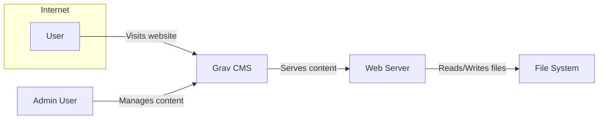
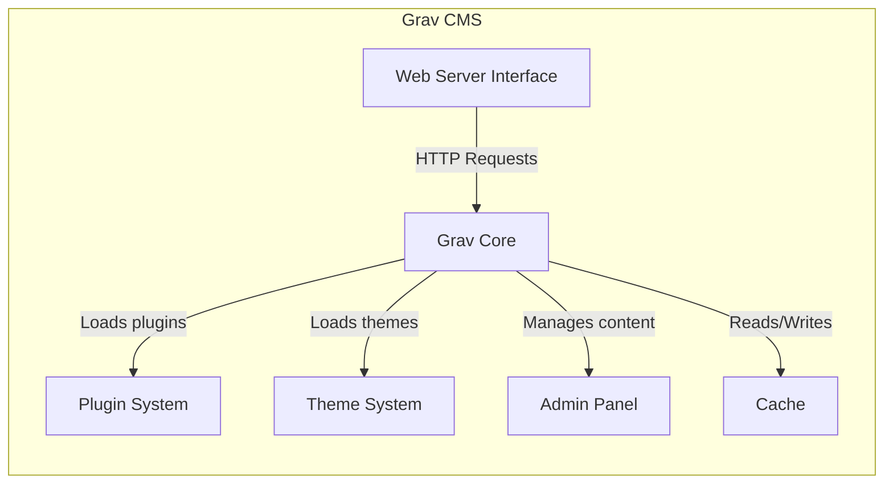
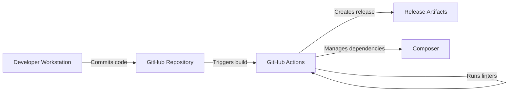

Okay, let's create a design document for the Grav CMS project, focusing on aspects relevant to threat modeling.

# BUSINESS POSTURE

Grav is a flat-file content management system (CMS).  It's designed to be fast, simple, and flexible, appealing to users who want a lightweight alternative to database-driven CMSs like WordPress or Drupal.  The business priorities likely revolve around:

*   Ease of Use:  Attracting users with a simple installation and management process.
*   Performance:  Providing a fast website experience, leveraging its flat-file architecture.
*   Extensibility:  Allowing users to customize and extend functionality through plugins and themes.
*   Community:  Fostering a strong community for support, development, and contribution.
*   Reputation: Maintaining a reputation for being secure, reliable, and well-maintained.

Based on these priorities, the most important business risks are:

*   Security Vulnerabilities:  Exploitable vulnerabilities in the core CMS, plugins, or themes could lead to website defacement, data breaches, or complete site takeover. This is a critical risk given the public-facing nature of websites.
*   Performance Degradation:  Poorly written plugins, themes, or excessive content could negatively impact website performance, driving users away.
*   Lack of Adoption:  If Grav fails to attract and retain users, its long-term viability is threatened.
*   Reputational Damage:  Security incidents or negative user experiences could damage Grav's reputation, hindering adoption and community growth.
*   Supply Chain Attacks: Compromise of third-party libraries or build processes could introduce vulnerabilities.

# SECURITY POSTURE

Grav, being a self-hosted CMS, has a security posture that heavily relies on the user's implementation and the inherent security of the platform itself.

Existing Security Controls (based on the GitHub repository and general knowledge of flat-file CMSs):

*   security control: Input Validation: Grav likely employs input validation to sanitize user-provided data before processing or storing it, mitigating risks like Cross-Site Scripting (XSS) and code injection. Implemented in core code and recommended for plugin/theme developers.
*   security control: Configuration Hardening: Grav provides configuration options to enhance security, such as disabling unnecessary features or restricting access to sensitive files. Described in documentation and configuration files.
*   security control: Regular Updates: The Grav team releases updates to address security vulnerabilities and improve functionality.  This relies on users actively updating their installations. Described in release notes and update mechanisms.
*   security control: Plugin/Theme Vetting (Limited): While there's a plugin/theme ecosystem, the level of vetting before inclusion may vary.  Users should exercise caution when installing third-party extensions. Described in plugin/theme repository guidelines.
*   security control: File Permissions: Proper file permissions on the server are crucial for preventing unauthorized access. This is primarily the responsibility of the user during installation and maintenance. Described in installation documentation.
*   security control: .htaccess (Apache): Grav utilizes .htaccess files (on Apache servers) to configure security settings like directory listing prevention and access control. Described in default .htaccess files.
*   security control: YAML Configuration: Uses YAML files for configuration, which are less prone to injection vulnerabilities compared to executable configuration files. Implemented in core code.

Accepted Risks:

*   accepted risk: User Responsibility: A significant portion of the security responsibility rests with the user, including server configuration, plugin/theme selection, and regular updates.
*   accepted risk: Third-Party Plugin/Theme Risk: While the core Grav system might be secure, vulnerabilities in third-party plugins or themes can compromise the entire site.
*   accepted risk: Limited Built-in Protections: Compared to some enterprise-grade CMSs, Grav may have fewer built-in security features like Web Application Firewalls (WAFs) or Intrusion Detection Systems (IDSs).

Recommended Security Controls:

*   security control: Security Audits: Regular security audits (both manual code review and automated scanning) of the core Grav code and popular plugins/themes.
*   security control: Content Security Policy (CSP): Implementing CSP headers to mitigate XSS and other code injection attacks.
*   security control: Two-Factor Authentication (2FA): Offering 2FA for administrative accounts to enhance login security.
*   security control: Security Headers: Enforcing the use of security-related HTTP headers (e.g., HSTS, X-Frame-Options, X-Content-Type-Options).
*   security control: Automated Security Scanning: Integrating automated security scanning tools into the development and release process.

Security Requirements:

*   Authentication:
    *   Secure password storage using strong hashing algorithms (e.g., bcrypt, Argon2).
    *   Protection against brute-force attacks (e.g., rate limiting, account lockout).
    *   Optional support for multi-factor authentication.
*   Authorization:
    *   Role-Based Access Control (RBAC) to manage user permissions.
    *   Clear separation of privileges between different user roles (e.g., administrator, editor, contributor).
    *   Secure handling of user sessions.
*   Input Validation:
    *   Strict validation of all user-provided input, including form data, URL parameters, and file uploads.
    *   Whitelist-based validation where possible, rather than blacklist-based.
    *   Output encoding to prevent XSS vulnerabilities.
*   Cryptography:
    *   Use of strong, industry-standard cryptographic algorithms for sensitive data (e.g., passwords, API keys).
    *   Secure generation and management of cryptographic keys.
    *   Avoidance of deprecated or weak cryptographic algorithms.

# DESIGN

## C4 CONTEXT



Context Diagram Element List:

*   Element:
    *   Name: User
    *   Type: Person
    *   Description: A person who visits the website hosted by Grav CMS.
    *   Responsibilities: Browses website content, interacts with forms (if any).
    *   Security controls: Browser security settings, safe browsing practices.

*   Element:
    *   Name: Admin User
    *   Type: Person
    *   Description: A person who manages the content and configuration of the Grav CMS.
    *   Responsibilities: Creates, edits, and deletes content; manages users; installs plugins and themes; configures the CMS.
    *   Security controls: Strong passwords, secure network connection, potentially 2FA.

*   Element:
    *   Name: Grav CMS
    *   Type: Software System
    *   Description: The flat-file content management system.
    *   Responsibilities: Processes user requests, retrieves content from the file system, renders web pages, manages users and plugins.
    *   Security controls: Input validation, output encoding, secure configuration, regular updates.

*   Element:
    *   Name: Web Server
    *   Type: Software System
    *   Description: The web server software (e.g., Apache, Nginx) that hosts the Grav CMS.
    *   Responsibilities: Receives HTTP requests, serves static files, executes PHP scripts.
    *   Security controls: Secure configuration, regular updates, file permissions, potentially a WAF.

*   Element:
    *   Name: File System
    *   Type: System
    *   Description: The file system of the server where Grav CMS files (content, configuration, plugins, themes) are stored.
    *   Responsibilities: Stores and retrieves files.
    *   Security controls: File permissions, operating system security, potentially disk encryption.

## C4 CONTAINER



Container Diagram Element List:

*   Element:
    *   Name: Web Server Interface
    *   Type: Component
    *   Description: The interface between the web server and Grav (e.g., PHP-FPM, mod_php).
    *   Responsibilities: Handles incoming HTTP requests and passes them to Grav Core.
    *   Security controls: Secure configuration of the web server and PHP.

*   Element:
    *   Name: Grav Core
    *   Type: Component
    *   Description: The core functionality of the Grav CMS.
    *   Responsibilities: Routing, content processing, template rendering, user management, plugin/theme loading.
    *   Security controls: Input validation, output encoding, secure coding practices.

*   Element:
    *   Name: Plugin System
    *   Type: Component
    *   Description: The system for managing and loading plugins.
    *   Responsibilities: Loads and executes plugins, provides APIs for plugins to interact with Grav Core.
    *   Security controls: Plugin vetting (limited), sandboxing (ideally).

*   Element:
    *   Name: Theme System
    *   Type: Component
    *   Description: The system for managing and loading themes.
    *   Responsibilities: Loads and applies themes, provides templating engine.
    *   Security controls: Theme vetting (limited), secure template design.

*   Element:
    *   Name: Admin Panel
    *   Type: Component
    *   Description: The web-based interface for managing Grav.
    *   Responsibilities: Provides UI for content management, user management, configuration, etc.
    *   Security controls: Authentication, authorization, input validation, session management.

*   Element:
    *   Name: Cache
    *   Type: Component
    *   Description: Caching system to improve performance.
    *   Responsibilities: Stores and retrieves cached data.
    *   Security controls: Secure cache configuration, cache invalidation mechanisms.

## DEPLOYMENT

Possible Deployment Solutions:

1.  Traditional Web Hosting: Deploying Grav on a shared or dedicated web hosting account with a provider like Bluehost, SiteGround, etc.
2.  Virtual Private Server (VPS): Deploying Grav on a VPS like DigitalOcean, Linode, or AWS Lightsail.
3.  Cloud Platform (PaaS): Deploying Grav on a Platform-as-a-Service provider like Heroku or Google App Engine.
4.  Containerized Deployment: Deploying Grav using Docker and a container orchestration platform like Kubernetes.

Chosen Solution (for detailed description): VPS (e.g., DigitalOcean Droplet)

```mermaid
graph LR
    subgraph "DigitalOcean"
    A[Droplet (VPS)]
    B[Ubuntu Server]
    C[Nginx]
    D[PHP-FPM]
    E[Grav Files]
    A -- "Runs" --> B
    B -- "Runs" --> C
    B -- "Runs" --> D
    D -- "Accesses" --> E
    end
```

Deployment Diagram Element List:

*   Element:
    *   Name: Droplet (VPS)
    *   Type: Infrastructure
    *   Description: A virtual private server instance on DigitalOcean.
    *   Responsibilities: Provides the computing resources for running the Grav CMS.
    *   Security controls: Firewall, SSH key authentication, regular system updates.

*   Element:
    *   Name: Ubuntu Server
    *   Type: Operating System
    *   Description: The operating system running on the VPS.
    *   Responsibilities: Manages system resources, runs software.
    *   Security controls: Regular security updates, user account management, firewall configuration.

*   Element:
    *   Name: Nginx
    *   Type: Web Server
    *   Description: The web server software.
    *   Responsibilities: Serves static files, proxies requests to PHP-FPM.
    *   Security controls: Secure configuration, regular updates, potentially a WAF.

*   Element:
    *   Name: PHP-FPM
    *   Type: Process Manager
    *   Description: The FastCGI Process Manager for PHP.
    *   Responsibilities: Executes PHP scripts.
    *   Security controls: Secure configuration, regular updates, resource limits.

*   Element:
    *   Name: Grav Files
    *   Type: Files
    *   Description: The Grav CMS files (core, plugins, themes, content).
    *   Responsibilities: Stores the website data.
    *   Security controls: File permissions, regular backups.

## BUILD

Grav's build process is relatively simple, as it's primarily a collection of PHP files and doesn't require compilation in the traditional sense. However, there are still build-related aspects to consider, particularly for releases and development.



Build Process Description:

1.  Development: Developers work on the Grav core, plugins, and themes locally.
2.  Version Control: Code is managed using Git and hosted on GitHub.
3.  Dependency Management: Composer is used to manage PHP dependencies.
4.  Automated Builds (GitHub Actions): GitHub Actions is used to automate tasks like:
    *   Running unit tests.
    *   Running code linters (e.g., PHP_CodeSniffer).
    *   Managing dependencies with Composer.
    *   Creating release artifacts (zip files).
5.  Release: When a new version is tagged, GitHub Actions creates a release artifact (a zip file containing the Grav files) and publishes it on GitHub.

Security Controls in Build Process:

*   security control: Code Review: Pull requests are used to review code changes before merging them into the main branch.
*   security control: Automated Testing: Unit tests help ensure code quality and prevent regressions.
*   security control: Code Linting: Linters enforce coding standards and help identify potential security issues.
*   security control: Dependency Management: Composer helps manage dependencies and ensures that known vulnerable versions are not used (with proper configuration and updates).
*   security control: GitHub Actions Security: Using a secure CI/CD environment like GitHub Actions, with appropriate permissions and secrets management.

# RISK ASSESSMENT

Critical Business Processes:

*   Website Availability: Ensuring the website is accessible to users.
*   Content Management: Allowing authorized users to create, edit, and publish content.
*   User Authentication: Securely authenticating users and managing their access.
*   Plugin/Theme Management: Allowing users to extend functionality through plugins and themes.

Data to Protect:

*   Website Content (Low to Medium Sensitivity): The actual content of the website, which may include text, images, and other media. The sensitivity depends on the nature of the website.
*   User Data (Medium to High Sensitivity): Usernames, hashed passwords, email addresses, and potentially other personal information.
*   Configuration Data (Medium Sensitivity): Configuration files containing settings, API keys, and potentially other sensitive information.
*   System Files (High Sensitivity): Core Grav files, plugin files, and theme files.  Compromise of these files could lead to complete site takeover.

# QUESTIONS & ASSUMPTIONS

Questions:

*   What is the specific threat model that Grav uses (if any)?
*   What are the plans for implementing more robust security features like 2FA and CSP?
*   What is the process for reporting and handling security vulnerabilities?
*   How are plugins and themes vetted for security before being listed in the official repository?
*   What level of support is provided for security-related issues?

Assumptions:

*   BUSINESS POSTURE: Assumes that Grav's primary target audience is individuals and small businesses who prioritize ease of use and performance over enterprise-grade security features.
*   SECURITY POSTURE: Assumes that users are responsible for securing their own server environment and keeping Grav and its components updated.
*   DESIGN: Assumes a standard LAMP/LEMP stack deployment, although other configurations are possible. Assumes that GitHub Actions is the primary CI/CD pipeline.