## Project Design Document: Sentry PHP SDK (Improved)

**1. Introduction**

This document provides an enhanced design overview of the Sentry PHP SDK (hereafter referred to as "the SDK"), based on the project available at [https://github.com/getsentry/sentry-php](https://github.com/getsentry/sentry-php). This document aims to provide a clear and detailed understanding of the SDK's architecture, components, and data flow, specifically tailored for subsequent threat modeling activities.

**2. Goals**

*   Present a clear and comprehensive description of the SDK's architecture and its constituent components.
*   Detail the journey of data within the SDK, emphasizing interactions with external systems.
*   Explicitly highlight critical security considerations relevant to the SDK's design and operation.
*   Serve as a robust and informative reference for conducting thorough threat modeling exercises.

**3. Scope**

This document focuses specifically on the design of the `sentry-php` library itself. The scope includes:

*   The fundamental functionalities of the SDK: capturing, processing, and transmitting error events and other data.
*   The key internal components of the SDK and their interactions with each other.
*   The complete data flow, starting from within a PHP application and ending at the Sentry backend.
*   The various configuration options and mechanisms available for the SDK.

This document explicitly excludes:

*   The internal implementation details and workings of the Sentry backend platform.
*   The specific code and architecture of the PHP applications that integrate the SDK.
*   Fine-grained implementation details of individual functions or classes within the SDK's codebase.

**4. High-Level Architecture**

The Sentry PHP SDK acts as an intermediary, facilitating communication between a PHP application and the Sentry error tracking platform. It intercepts events such as errors, exceptions, and messages within the application and securely transmits them to the Sentry backend for centralized aggregation, analysis, and alerting.

*   **PHP Application:** The target application where the SDK is integrated. This application generates events that need to be tracked.
*   **Sentry PHP SDK:** The core library responsible for capturing, processing, enriching, and sending events to Sentry.
*   **Transport Layer:** The abstraction responsible for the actual transmission of data to the Sentry backend (typically using HTTPS).
*   **Sentry Backend:** The remote Sentry platform that receives, processes, stores, and analyzes the incoming events.

**5. Detailed Architecture and Components**

The SDK is composed of several interconnected components, each with specific responsibilities:

*   **Client Interface:**
    *   Serves as the primary point of interaction for developers using the SDK.
    *   Provides methods for initializing the SDK with configuration options (DSN, environment, release, etc.).
    *   Offers methods for manually capturing exceptions, errors, messages, and creating breadcrumbs.
*   **Event Processing Pipeline:**
    *   **Error and Exception Handlers:**
        *   Registers with PHP to intercept native errors and uncaught exceptions using `set_error_handler` and `set_exception_handler`.
        *   Transforms intercepted errors and exceptions into Sentry Event objects.
    *   **Event Builder:**
        *   Constructs the structured event payload that will be sent to Sentry.
        *   Gathers relevant contextual information, including server details, user information (if available), tags, and request data.
        *   Formats the event data according to the Sentry event specification.
    *   **Breadcrumb Management:**
        *   Provides mechanisms for automatically and manually recording breadcrumbs, which are contextual events leading up to an error.
        *   Includes integrations for capturing breadcrumbs from various sources (e.g., database queries, HTTP requests, log messages).
    *   **Integration System:**
        *   Offers a way to extend the SDK's functionality through modular integrations.
        *   Integrations can modify event data before it's sent, add custom context, or perform other actions.
*   **Transport Abstraction:**
    *   Defines an interface for sending events to the Sentry backend, decoupling the core SDK from the specific transport mechanism.
    *   Allows for different transport implementations (e.g., synchronous HTTP, asynchronous using background processes).
*   **HTTP Transport (Default Implementation):**
    *   The standard implementation of the Transport Interface.
    *   Utilizes PHP's HTTP client libraries (e.g., `curl`, `fopen` with `allow_url_fopen`) to transmit events over HTTPS.
    *   Handles authentication with the Sentry backend using the DSN.
*   **Serialization:**
    *   Responsible for converting the structured event data into a format suitable for network transmission (typically JSON).
*   **Configuration Management:**
    *   Handles the loading and management of the SDK's configuration settings.
    *   Supports configuration through various methods: code, environment variables, and potentially configuration files.
    *   Includes validation of configuration options.
*   **Context Management:**
    *   Provides a way to store and manage contextual information that can be attached to events.
    *   Includes user context, tags, and extra data.
    *   Allows for setting and clearing context at different scopes.

**6. Data Flow (Error Event)**

The following diagram illustrates the typical flow of data when an error or exception occurs within a PHP application using the Sentry PHP SDK:

```mermaid
graph LR
    A("PHP Application: Error/Exception Thrown") --> B("Error/ExceptionHandler Intercepts");
    B --> C("Event Builder: Create Sentry Event Object");
    C --> D("Breadcrumb Integration: Attach Relevant Breadcrumbs");
    D --> E("Integrations: Modify/Enrich Event Data");
    E --> F("Context Management: Apply Current Context");
    F --> G("Serializer: Serialize Event to JSON");
    G --> H("Transport Layer: Send Event via HTTPS");
    H --> I("Sentry Backend");
    style A fill:#ffa,stroke:#333,stroke-width:2px
    style I fill:#bbf,stroke:#333,stroke-width:2px
```

*   **PHP Application: Error/Exception Thrown:** An error or exception is triggered within the execution of the PHP application.
*   **Error/ExceptionHandler Intercepts:** The SDK's registered error or exception handler captures the event.
*   **Event Builder: Create Sentry Event Object:** The Event Builder constructs a structured Sentry Event object, populating it with details about the error, stack trace, and the execution environment.
*   **Breadcrumb Integration: Attach Relevant Breadcrumbs:**  Relevant breadcrumbs (contextual actions leading up to the error) are attached to the event.
*   **Integrations: Modify/Enrich Event Data:** Registered integrations have the opportunity to modify or add information to the event payload.
*   **Context Management: Apply Current Context:**  The current user context, tags, and extra data are applied to the event.
*   **Serializer: Serialize Event to JSON:** The complete event object is serialized into a JSON payload for transmission.
*   **Transport Layer: Send Event via HTTPS:** The Transport Layer (typically HTTP Transport) sends the JSON payload to the Sentry backend using an HTTPS request.
*   **Sentry Backend:** The Sentry backend receives, processes, and stores the event data.

**7. Security Considerations (Relevant for Threat Modeling)**

The following security aspects are critical to consider when threat modeling the Sentry PHP SDK:

*   **DSN Security:**
    *   The DSN contains sensitive credentials (public and secret keys) for authenticating with the Sentry backend.
    *   **Threat:** Exposure of the DSN could allow unauthorized individuals to send malicious data to the Sentry project.
    *   **Mitigation:**  Store the DSN securely (e.g., environment variables, secure configuration management). Avoid hardcoding it in the application code or version control. Implement access controls to limit who can access the DSN.
*   **Transport Layer Security:**
    *   The SDK relies on HTTPS for transmitting event data.
    *   **Threat:** Man-in-the-middle attacks could intercept event data if HTTPS is not enforced or configured correctly.
    *   **Mitigation:** Ensure the underlying HTTP client is configured to verify SSL certificates. Avoid insecure HTTP connections.
*   **Sensitive Data in Events:**
    *   Events may contain sensitive information like user details, request parameters, and environment variables.
    *   **Threat:** Accidental or intentional capture of sensitive data could lead to data breaches or privacy violations.
    *   **Mitigation:** Implement mechanisms to sanitize or filter sensitive data before it is sent. Provide configuration options to control what data is captured. Consider using data scrubbing techniques.
*   **Configuration Vulnerabilities:**
    *   Insecure configuration options or vulnerabilities in the configuration loading process could be exploited.
    *   **Threat:** Attackers might manipulate configuration to disable security features, send data to unauthorized endpoints, or cause denial of service.
    *   **Mitigation:** Validate all configuration options. Use secure configuration methods. Avoid exposing configuration details unnecessarily.
*   **Dependency Vulnerabilities:**
    *   The SDK depends on third-party libraries, which may contain security vulnerabilities.
    *   **Threat:** Vulnerabilities in dependencies could be exploited to compromise the SDK or the application.
    *   **Mitigation:** Regularly review and update dependencies using dependency management tools like Composer. Monitor for security advisories related to dependencies.
*   **Security of Integrations:**
    *   Custom or third-party integrations could introduce security vulnerabilities.
    *   **Threat:** Malicious integrations could be used to exfiltrate data, perform unauthorized actions, or compromise the application.
    *   **Mitigation:**  Carefully review and vet integrations before using them. Implement security best practices when developing custom integrations.
*   **Rate Limiting and DoS:**
    *   Lack of proper rate limiting or error handling could make the SDK susceptible to denial-of-service attacks.
    *   **Threat:** An attacker could flood the Sentry backend with malicious events or cause excessive resource consumption on the application.
    *   **Mitigation:** Implement retry mechanisms with exponential backoff. Consider the Sentry backend's rate limiting policies.
*   **Local Storage Security (If Applicable):**
    *   If the SDK temporarily stores data locally (e.g., for offline caching), this storage needs to be secure.
    *   **Threat:** Sensitive data stored locally could be accessed by unauthorized users.
    *   **Mitigation:** Encrypt local storage if it contains sensitive information. Implement appropriate file system permissions.

**8. Deployment Considerations**

*   The SDK is typically installed as a Composer dependency within PHP projects.
*   Configuration is commonly managed through environment variables or within the application's configuration files.
*   Ensure the PHP environment has the necessary extensions enabled for the chosen transport mechanism (e.g., `curl` extension for the HTTP Transport).
*   When deploying, ensure that the DSN is securely provisioned and not exposed in publicly accessible configuration files or version control.
*   Consider using a Content Security Policy (CSP) to further restrict the capabilities of the application and mitigate potential cross-site scripting (XSS) attacks that could potentially lead to DSN exposure.

**9. Future Considerations**

*   Exploring alternative transport mechanisms for improved performance or resilience (e.g., message queues).
*   Enhancing the integration system to provide more flexibility and control.
*   Improving the SDK's performance and reducing its overhead on the application.
*   Adding support for more advanced features offered by the Sentry platform.
*   Implementing more robust mechanisms for data scrubbing and redaction.

This improved design document provides a more detailed and security-focused overview of the Sentry PHP SDK, making it a more effective resource for conducting thorough threat modeling activities. By understanding the architecture, data flow, and specific security considerations outlined here, potential vulnerabilities can be more readily identified and addressed.
