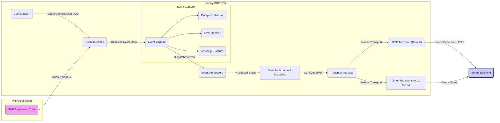

# Project Design Document: Sentry PHP SDK

**Version:** 1.1
**Date:** October 26, 2023
**Author:** AI Software Architect

## 1. Introduction

This document provides an enhanced and more detailed design overview of the Sentry PHP SDK (referenced from [https://github.com/getsentry/sentry-php](https://github.com/getsentry/sentry-php)). This revised document aims to further strengthen its utility as a foundation for threat modeling activities by providing greater clarity on the SDK's architecture, component interactions, data flow, and associated security considerations.

## 2. Goals

*   Provide a comprehensive and granular understanding of the Sentry PHP SDK's architecture and functionality.
*   Clearly identify key components, their responsibilities, and their interactions with each other.
*   Precisely describe the flow of data within the SDK and its journey to the Sentry backend.
*   Highlight potential security considerations, attack surfaces, and associated risks for thorough threat modeling.

## 3. Architecture Overview

The Sentry PHP SDK serves as an integration point within PHP applications, facilitating the capture and reporting of errors, exceptions, and other relevant events to the centralized Sentry error tracking platform.



## 4. Detailed Design

The Sentry PHP SDK is structured into distinct modules, each with specific responsibilities in the error and event reporting process.

### 4.1. Configuration

*   **Purpose:**  To manage and provide the SDK's operational settings. This includes the crucial DSN (Data Source Name), environment details, application release information, sampling rates, and other customization options.
*   **Details:** Configuration parameters can be supplied through various methods: environment variables, direct code instantiation, or configuration files. The DSN is paramount, as it contains the Sentry project's public key, optional secret key (within the DSN itself), and the URL of the Sentry server.

### 4.2. Client Interface

*   **Purpose:**  To offer the primary and simplified interaction points for developers to engage with the SDK's functionalities. This encompasses methods for programmatically capturing exceptions, reporting errors, and dispatching manual messages or custom events.
*   **Details:**  The client interface acts as an abstraction layer, simplifying the SDK's internal complexities and providing a user-friendly API for integration.

### 4.3. Event Capture

*   **Purpose:**  To reliably capture various types of events occurring within the PHP application. This component is further divided into specialized handlers:
    *   **Exception Handler:** Automatically captures uncaught exceptions that propagate through the application.
    *   **Error Handler:**  Intercepts and processes PHP errors based on the configured error reporting levels (e.g., `E_WARNING`, `E_NOTICE`).
    *   **Message Capture:** Enables developers to explicitly send log messages, debugging information, or custom application events to Sentry.
*   **Details:** This component leverages PHP's built-in error and exception handling mechanisms to intercept and manage these events.

### 4.4. Event Processors

*   **Purpose:**  To provide a mechanism for modifying or enriching event data before it is transmitted to the Sentry backend.
*   **Details:**  Developers can register custom event processors (functions or callable objects) that are executed sequentially. These processors can add contextual information (e.g., user details, request data), redact sensitive information beyond the default scrubbing, or filter out specific events based on defined criteria.

### 4.5. Data Sanitization & Scrubbing

*   **Purpose:**  To automatically remove or mask potentially sensitive information from the captured event data before it leaves the application. This is crucial for preventing the accidental logging of confidential data.
*   **Details:**  The SDK includes a configurable set of default scrubbing rules based on common patterns for sensitive data (e.g., passwords, API keys, credit card numbers). Users can define additional custom scrubbing rules using regular expressions or callback functions to target application-specific sensitive information.

### 4.6. Transport Interface

*   **Purpose:**  To abstract the underlying method used to transmit the processed event data to the Sentry backend. This allows for flexibility and the potential use of different communication mechanisms.
*   **Details:**  The transport interface defines a contract for sending data. Concrete implementations, like the HTTP transport, fulfill this contract.

### 4.7. HTTP Transport (Default)

*   **Purpose:**  The standard and default transport mechanism for sending event data to the Sentry server over the HTTP or HTTPS protocol.
*   **Details:**  Typically utilizes the `curl` PHP extension or, as a fallback, the `fopen` function with HTTP wrappers. A critical security consideration is ensuring that HTTPS is used to encrypt the data during transmission, protecting it from eavesdropping.

### 4.8. Other Transports

*   **Purpose:**  To offer alternative methods for transmitting data to Sentry, potentially for specialized environments or requirements.
*   **Details:**  Examples could include transports using different HTTP client libraries, asynchronous sending mechanisms (e.g., using message queues), or even custom transport implementations.

## 5. Data Flow

The typical lifecycle of an event within the Sentry PHP SDK involves the following steps:

1. An error condition, an unhandled exception, or a deliberate log message occurs within the execution of the PHP application code.
2. The appropriate component within the Sentry PHP SDK's "Event Capture" module (Exception Handler, Error Handler, or Message Capture) intercepts the event.
3. The raw event data is then passed sequentially through any registered "Event Processors," allowing for modification and enrichment.
4. The "Data Sanitization & Scrubbing" module applies its configured rules to remove or mask potentially sensitive information from the event payload.
5. The sanitized event data is serialized into a format suitable for network transmission (typically JSON).
6. The "Transport Interface" selects the configured transport mechanism. The default "HTTP Transport" then prepares and sends the serialized data to the Sentry backend, ideally over a secure HTTPS connection.
7. The Sentry backend receives the event data, processes it, and makes it available within the Sentry platform.

## 6. Security Considerations

This section details potential security considerations and potential attack vectors relevant for threat modeling the Sentry PHP SDK integration.

### 6.1. Exposure of Sensitive Data in Configuration (DSN)

*   **Risk:** The DSN, especially if it contains the secret key, is a sensitive credential. If exposed (e.g., through version control, insecure storage), it could allow unauthorized individuals to send arbitrary data to the Sentry project, potentially leading to data pollution or abuse.
*   **Mitigation:** Store the DSN securely. Utilize environment variables, secure configuration management tools (like HashiCorp Vault), or infrastructure-as-code secrets management. Avoid hardcoding the DSN directly in the application code or committing it to version control systems. Consider using a DSN without the secret key where appropriate, relying on server-side validation.

### 6.2. Unencrypted Data Transmission

*   **Risk:** If the connection to the Sentry backend is not secured with HTTPS, the event data transmitted, which might contain sensitive application or user information, could be intercepted and read by attackers performing Man-in-the-Middle attacks.
*   **Mitigation:** Ensure the Sentry server URL specified in the DSN uses the `https://` protocol. The Sentry PHP SDK defaults to using HTTPS, but verify the configuration and underlying HTTP client library settings.

### 6.3. Inadequate Data Sanitization & Scrubbing

*   **Risk:** If the data sanitization and scrubbing rules are not comprehensive or correctly configured, sensitive information (e.g., passwords, API keys, personal data) might inadvertently be included in the error reports sent to Sentry.
*   **Mitigation:**  Carefully define and regularly review scrubbing rules to cover all potential sources of sensitive data within the application. Utilize both the default scrubbing mechanisms and custom event processors for more specific redaction needs. Test scrubbing rules thoroughly to ensure they are effective.

### 6.4. Information Disclosure through Verbose Error Messages

*   **Risk:**  Highly detailed error messages or stack traces captured by Sentry could reveal sensitive information about the application's internal workings, database structure, file paths, or user data, aiding attackers in understanding vulnerabilities.
*   **Mitigation:**  Implement robust error handling practices within the application to avoid exposing excessive internal details in error messages. Use event processors to filter or redact sensitive information from error messages before they are sent to Sentry.

### 6.5. Vulnerabilities in Dependencies

*   **Risk:** The Sentry PHP SDK relies on third-party libraries. Security vulnerabilities in these dependencies could be exploited if not properly managed and updated.
*   **Mitigation:**  Utilize dependency management tools like Composer to track and update dependencies. Regularly audit dependencies for known vulnerabilities using security scanning tools and promptly update to patched versions.

### 6.6. Client-Side Manipulation of SDK

*   **Risk:** While the SDK operates within the client application, a compromised environment could potentially allow malicious actors to manipulate the SDK's behavior, sending fabricated or misleading error reports to Sentry, potentially disrupting monitoring or masking real issues.
*   **Mitigation:**  While direct mitigation within the SDK for a fully compromised client is limited, focus on securing the application environment itself. Server-side validation of critical actions and anomaly detection on the Sentry backend can help identify potentially manipulated data.

### 6.7. Transport Layer Attacks on Non-HTTPS Transports

*   **Risk:** If alternative, non-HTTPS transports are used (against best practices), the data transmitted is vulnerable to eavesdropping and manipulation.
*   **Mitigation:**  Strongly recommend and default to HTTPS for the transport layer. If alternative transports are absolutely necessary, ensure they provide equivalent security measures.

### 6.8. Logging of Sensitive Information by the SDK

*   **Risk:**  The Sentry PHP SDK itself might, in certain debugging scenarios or due to misconfiguration, log sensitive information about the application or its configuration.
*   **Mitigation:** Review the SDK's logging configuration and ensure it adheres to security best practices. Avoid logging sensitive data. If debugging is necessary, ensure logs are stored securely and access is restricted.

## 7. Dependencies

The Sentry PHP SDK has dependencies on the following components:

*   **PHP Itself:**  The core runtime environment.
*   **Composer:**  Used for managing the SDK's dependencies and installation.
*   **`psr/http-client-implementation` (e.g., `php-http/curl-client`, `guzzlehttp/guzzle`):**  For making HTTP requests to the Sentry backend. The specific implementation used can be configured.
*   **`psr/log-implementation` (e.g., `monolog/monolog`):** For optional logging within the SDK itself.

## 8. Deployment

Deploying the Sentry PHP SDK typically involves these steps:

*   **Installation:** Add the `sentry/sentry` package as a dependency to your project using Composer: `composer require sentry/sentry`.
*   **Initialization:** Initialize the SDK within your application's bootstrap or entry point. This usually involves providing the DSN. Example:

    ```php
    <?php

    use Sentry\State\Hub;
    use Sentry\ClientBuilder;

    $clientBuilder = ClientBuilder::create(['dsn' => 'YOUR_DSN_HERE']);
    $client = $clientBuilder->getClient();
    $hub = new Hub($client);
    Hub::setCurrent($hub);
    ```
*   **Configuration:** Configure any additional options as needed (e.g., environment, release, sample rate).
*   **Error and Exception Handling:** The SDK automatically registers its error and exception handlers upon initialization.

## 9. Future Considerations

*   Enhanced client-side security features, such as more granular control over data scrubbing and the ability to implement custom security policies.
*   Improved mechanisms for secure DSN management and distribution.
*   Support for more advanced transport options and asynchronous event sending.
*   Enhanced logging and debugging capabilities within the SDK with a focus on security and avoiding sensitive data leaks.

This improved document provides a more detailed and nuanced understanding of the Sentry PHP SDK's design, offering a stronger foundation for comprehensive threat modeling and security analysis. By carefully considering the architecture, data flow, and potential security risks outlined here, developers and security professionals can better secure their applications and the data they process.