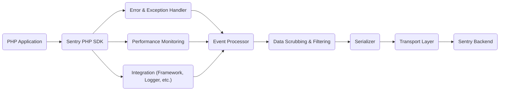
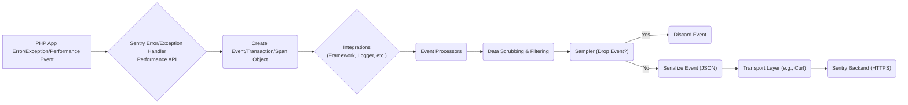

# Project Design Document: Sentry PHP SDK

**Project Name:** Sentry PHP SDK (getsentry/sentry-php)

**Version:** 1.1 (Improved Design for Threat Modeling)

**Date:** October 26, 2023

**Author:** AI Software Architecture Expert

## 1. Introduction

This document provides an enhanced design overview of the Sentry PHP SDK, a library enabling PHP applications to report errors, exceptions, and performance data to the Sentry observability platform. This iteration focuses on providing a detailed understanding of the SDK's architecture, components, and data flow specifically for threat modeling and security analysis.

## 2. Goals

The primary goals of the Sentry PHP SDK are:

*   Capture and report errors, exceptions, and messages from PHP applications, including contextual data.
*   Capture and report performance data (transactions, spans) from PHP applications.
*   Provide rich contextual information about captured events to facilitate debugging and performance analysis.
*   Integrate seamlessly with a wide range of PHP frameworks, libraries, and environments.
*   Offer robust and configurable options for data scrubbing, filtering, and sampling to manage data volume and privacy.
*   Minimize performance impact on the monitored application while providing accurate data.
*   Securely transmit error and performance data to the Sentry service, protecting sensitive information.

## 3. Scope

This design document covers the core functionalities of the Sentry PHP SDK relevant to security and threat modeling, including:

*   Mechanisms for capturing errors, exceptions, and performance data.
*   The lifecycle of an event from capture to transmission.
*   Data processing and enrichment steps, including scrubbing and filtering.
*   The transport layer and its security implications.
*   Key integration points with PHP frameworks and error handling mechanisms.
*   Configuration options that impact security and data privacy.

This document does not cover:

*   The internal workings and architecture of the Sentry backend service.
*   Detailed implementation specifics of individual framework integrations beyond their interaction with the core SDK.
*   The complete internal implementation details of third-party libraries used by the SDK, focusing on their interfaces and security implications.

## 4. High-Level Architecture

The Sentry PHP SDK operates as an in-process client library within a PHP application. It intercepts events (errors, exceptions, performance data), processes them, and transmits the resulting data to the Sentry backend.

*   **PHP Application:** The application being monitored by the Sentry PHP SDK.
*   **Sentry PHP SDK:** The core library responsible for capturing, processing, and sending event data.
*   **Error & Exception Handler:** The SDK's mechanism for automatically intercepting PHP errors and uncaught exceptions.
*   **Performance Monitoring:** Components responsible for capturing performance data like transactions and spans.
*   **Integration (Framework, Logger, etc.):** Components providing specific integration with PHP frameworks (e.g., Laravel, Symfony), logging libraries (e.g., Monolog), or other parts of the application.
*   **Event Processor:** Components that modify or enrich event data with contextual information before transmission.
*   **Data Scrubbing & Filtering:** Components responsible for removing or modifying sensitive data from events based on configuration.
*   **Serializer:** Responsible for converting PHP data structures into a secure and efficient format (typically JSON) for transmission.
*   **Transport Layer:** The component responsible for securely transmitting the serialized data to the Sentry backend.
*   **Sentry Backend:** The external service that receives, processes, and stores the event data.

## 5. Detailed Design

### 5.1. Core Components

*   **Client:** The primary interface for interacting with the SDK. It holds the configuration, manages the Hub, and provides methods for capturing events.
*   **Hub:** A thread-safe, context-aware container for the current Scope and Client. This enables associating contextual data with events in different parts of the application.
*   **Scope:** Stores contextual information that is attached to events, such as tags, user data, breadcrumbs, and context data (e.g., server information). Scopes can be layered and inherited.
*   **Event:** Represents a captured occurrence, which can be an error, exception, message, or performance sample. It contains details like the message, stack trace, context, tags, and timestamps.
*   **Transaction:** Represents a logical unit of work within the application, used for performance monitoring. It can contain multiple Spans.
*   **Span:** Represents a specific timed operation within a Transaction, providing granular performance insights.
*   **Serializer:** Responsible for converting PHP data structures into a JSON format suitable for transmission to the Sentry backend. This component must handle serialization securely to prevent information leakage.
*   **Transport Interface:** Defines the contract for sending serialized events to the Sentry backend. Implementations handle the actual network communication.
*   **Default Transport (CurlTransport):** The default implementation of the Transport interface, utilizing PHP's `curl` extension for making HTTPS requests.
*   **Event Manager:** Manages the lifecycle of an event, including processing through various processors and integrations.
*   **Integration Interface:** Defines the contract for integrating with different PHP frameworks, logging libraries, and other components. Integrations can modify events or provide additional context.
*   **Error Handler (ErrorHandler):** Registers itself as a PHP error and exception handler using `set_error_handler` and `set_exception_handler` to automatically capture these events.
*   **ExceptionHandler (ExceptionHandler):** Specifically handles uncaught exceptions.
*   **Breadcrumb:** Represents an application-specific event that occurred before an error, providing valuable context for debugging.
*   **Context:** Provides structured data about the environment, user, request, and other relevant details associated with an event.
*   **Sampler:** Determines whether an event should be sent to Sentry based on a configured sample rate.

### 5.2. Data Flow

The typical data flow for capturing and reporting an error or performance event is as follows:

1. An error, exception, or a performance-related event (e.g., start/end of a transaction) occurs within the PHP application.
2. For errors and exceptions, the registered Sentry ErrorHandler or ExceptionHandler intercepts the event. For performance events, instrumentation code within the application interacts with the SDK.
3. An `Event`, `Transaction`, or `Span` object is created, representing the captured occurrence.
4. Active integrations contribute contextual data to the event (e.g., framework request data, user information from the session).
5. Event processors modify or enrich the event based on configuration and context. This may include adding tags, context data, or modifying the event payload.
6. Data scrubbing and filtering mechanisms are applied to remove or redact sensitive information from the event payload based on configured rules.
7. The Sampler determines if the event should be sent based on the configured sample rate.
8. The `Event`, `Transaction`, or `Span` is serialized into a JSON format by the Serializer.
9. The configured `Transport` (e.g., CurlTransport) securely transmits the serialized data to the Sentry backend via an HTTPS request, including necessary authentication headers.
10. The Sentry backend receives, processes, and stores the event data.

### 5.3. Integration Points

The Sentry PHP SDK offers various integration points to seamlessly integrate with different parts of a PHP application:

*   **Global Error and Exception Handling:** The SDK registers itself as the global error and exception handler using `set_error_handler` and `set_exception_handler`, providing automatic error and exception capture.
*   **Framework Integrations:** Dedicated integrations exist for popular frameworks like Laravel, Symfony, and others. These integrations often provide:
    *   Automatic capture of framework-specific context (e.g., request data, route information, user authentication details).
    *   Integration with framework logging mechanisms to capture log messages as breadcrumbs or events.
    *   Middleware or service providers for simplified setup and integration.
*   **Logging Integration (PSR-3):** The SDK can integrate with PSR-3 compatible logging libraries (e.g., Monolog) to capture log messages as breadcrumbs or Sentry events.
*   **Performance Monitoring APIs:**  The SDK provides APIs for manually instrumenting code to capture performance data, including creating Transactions and Spans.
*   **Manual Capture:** Developers can manually capture exceptions, messages, and breadcrumbs using the SDK's API for more fine-grained control.

### 5.4. Configuration

The Sentry PHP SDK is highly configurable, allowing customization for various environments and requirements. Key configuration options with security implications include:

*   **DSN (Data Source Name):** The unique identifier for your Sentry project, containing the URL for the Sentry backend and authentication information (public key). Secure storage and handling of the DSN are crucial.
*   **Environment:** Specifies the environment the application is running in (e.g., production, staging). This helps in filtering and analyzing events.
*   **Release:** The version of the application being deployed. This aids in identifying regressions and tracking errors to specific releases.
*   **Server Name:** The hostname or identifier of the server.
*   **Tags:** Key-value pairs that can be attached to events for filtering and searching. Avoid including sensitive information in global tags.
*   **User Context:** Information about the currently logged-in user. Ensure proper handling and anonymization of user data if necessary.
*   **Sample Rate:** The percentage of events to send to Sentry. This helps manage data volume but can impact the completeness of error reporting.
*   **Before Send Callback:** A powerful function that allows modifying or discarding an event before it's sent. This can be used for advanced data scrubbing or filtering but requires careful implementation to avoid introducing vulnerabilities.
*   **Before Breadcrumb Callback:** A function to modify or discard a breadcrumb before it's recorded.
*   **Data Scrubbing Options:** Configuration to remove or redact sensitive data from events using various strategies (e.g., regular expressions, block lists). Ensure these configurations are comprehensive and up-to-date.
*   **Transport Options:** Configuration for the transport layer, including:
    *   **HTTP Proxy:**  Settings for using an HTTP proxy, which could introduce security risks if the proxy is compromised.
    *   **SSL/TLS Verification:** Options for verifying the SSL certificate of the Sentry backend. Disabling this weakens security.
    *   **Timeout Settings:** Configuration for request timeouts.
*   **Integrations:** Enabling or disabling specific integrations. Disabling unnecessary integrations reduces the attack surface.
*   **Send PII (Personally Identifiable Information):** Configuration options to control the sending of PII. This should be carefully managed to comply with privacy regulations.

## 6. Security Considerations (For Threat Modeling)

This section details potential security considerations relevant for threat modeling the Sentry PHP SDK:

*   **DSN Exposure:** The DSN contains the public key for your Sentry project. Exposure in client-side code, public repositories, or insecure configuration files allows attackers to send arbitrary data to your Sentry project, potentially leading to:
    *   **Data Pollution:** Flooding your Sentry project with irrelevant or malicious data, making it difficult to identify genuine issues.
    *   **Information Disclosure (Indirect):** Attackers could potentially infer information about your application by observing the types of errors and data being sent.
*   **Insufficient Data Scrubbing:** If data scrubbing configurations are not comprehensive or correctly implemented, sensitive data (e.g., passwords, API keys, personal information) might be inadvertently sent to Sentry.
*   **Transport Layer Vulnerabilities:**
    *   **Man-in-the-Middle Attacks:** If HTTPS is not enforced or if there are issues with SSL/TLS certificate validation (e.g., due to misconfiguration), attackers could intercept communication and potentially steal sensitive data being transmitted to Sentry.
    *   **Vulnerabilities in `curl`:** The default transport relies on the `curl` extension. Security vulnerabilities in `curl` could potentially be exploited.
*   **Dependency Vulnerabilities:** The SDK depends on other PHP packages. Vulnerabilities in these dependencies could be exploited if not regularly updated.
*   **Configuration Injection:** If configuration values, especially the DSN or transport options, are sourced from untrusted sources (e.g., user input, external APIs without proper validation), attackers might be able to inject malicious configurations, potentially redirecting error data to a malicious endpoint.
*   **Denial of Service (DoS):** While the SDK aims to be lightweight, misconfigurations or vulnerabilities could lead to excessive resource consumption if the application spends too much time capturing and sending data, potentially leading to a DoS.
*   **Information Disclosure through Error Messages:** Overly detailed error messages sent to Sentry might reveal sensitive information about the application's internal workings, database structure, or file paths.
*   **Breadcrumb Security:** Breadcrumbs might capture sensitive user actions or data if not carefully considered and if appropriate scrubbing is not applied.
*   **`before_send` Callback Vulnerabilities:** If the `before_send` callback is not implemented securely, it could introduce vulnerabilities, such as:
    *   **Remote Code Execution:** If the callback executes arbitrary code based on event data.
    *   **Security Bypass:** If the callback incorrectly filters or modifies events, it might allow malicious data to be sent to Sentry.
*   **Insecure Storage of DSN:** Storing the DSN in easily accessible locations (e.g., version control, publicly accessible files) increases the risk of exposure.
*   **Replay Attacks:** If the authentication mechanism for sending data to Sentry is weak or if the transport is compromised, attackers might be able to replay captured requests to send malicious data.

## 7. Deployment Considerations

Deploying the Sentry PHP SDK involves:

*   Installing the SDK as a dependency using Composer.
*   Configuring the SDK, ensuring the DSN is securely managed (e.g., using environment variables or secure configuration management).
*   Ensuring the necessary PHP extensions (e.g., `curl`) are enabled on the server.
*   Deploying the application code with the integrated SDK.
*   Regularly updating the SDK and its dependencies to patch security vulnerabilities.

## 8. Future Considerations

*   Exploring more secure transport mechanisms or options for enhanced encryption.
*   Enhancing data scrubbing capabilities with more advanced techniques and pre-built rules.
*   Improving performance monitoring features and reducing overhead.
*   Adding more granular control over data sampling and filtering.
*   Providing more comprehensive security auditing and logging capabilities within the SDK.
*   Developing tools and best practices for secure configuration management of the SDK.

This improved document provides a more detailed and security-focused design overview of the Sentry PHP SDK, intended to be a valuable resource for threat modeling and security analysis. By understanding the architecture, data flow, configuration options, and potential security considerations, developers and security professionals can better identify and mitigate potential risks associated with using this library.