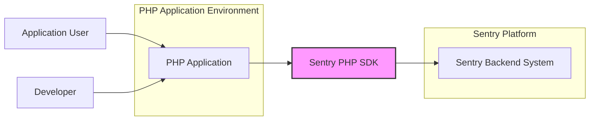
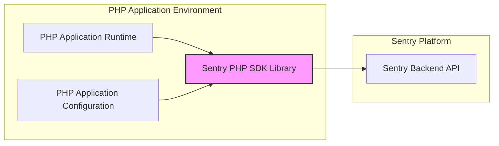

# BUSINESS POSTURE

This project, Sentry PHP SDK, aims to provide error tracking and performance monitoring capabilities for PHP applications. By integrating this SDK into their PHP applications, developers can capture and report errors, exceptions, and performance data to the Sentry platform. This allows for proactive identification and resolution of issues, leading to improved application stability, user experience, and faster debugging cycles.

- Business priorities:
  - Application stability and reliability.
  - Faster issue resolution and debugging.
  - Improved user experience through reduced errors and performance issues.
  - Data-driven insights into application health and performance.

- Business risks:
  - Data breaches of error and performance data sent to Sentry.
  - Service disruption if the SDK or Sentry platform becomes unavailable.
  - Reputational damage if sensitive data is exposed through error reports.
  - Compliance risks if data handling practices are not aligned with regulations (e.g., GDPR, HIPAA).

# SECURITY POSTURE

- Security controls:
  - security control: Secure coding practices are likely followed during development, although explicit documentation within the repository needs to be verified. (Location: Repository code and potentially contribution guidelines).
  - security control: Dependency management using Composer to manage third-party libraries. (Location: `composer.json` and `composer.lock` files).
  - security control: HTTPS is used for communication with the Sentry backend. (Location: Code within the SDK handling communication).
  - security control: API keys are used for authentication with the Sentry backend. (Location: Documentation and code examples within the repository).

- Accepted risks:
  - accepted risk: Vulnerabilities in third-party dependencies managed by Composer.
  - accepted risk: Potential for insecure configurations by users when integrating the SDK.
  - accepted risk: Exposure of API keys if not handled securely by users.
  - accepted risk: Open-source nature implies reliance on community contributions, which may introduce vulnerabilities if not properly reviewed.

- Recommended security controls:
  - security control: Implement automated dependency scanning to identify and address vulnerabilities in third-party libraries.
  - security control: Integrate Static Application Security Testing (SAST) tools into the development pipeline to identify potential security flaws in the code.
  - security control: Conduct regular security code reviews, especially for critical components and contributions.
  - security control: Provide clear and comprehensive security guidelines for users on how to securely configure and use the SDK, including API key management and data sanitization.
  - security control: Implement a process for security vulnerability reporting and incident response.

- Security requirements:
  - Authentication:
    - Requirement: The SDK must securely authenticate with the Sentry backend using API keys.
    - Requirement: API keys should be treated as secrets and not hardcoded in the application.
    - Requirement: Support for different authentication methods offered by Sentry, if applicable.
  - Authorization:
    - Requirement: The SDK should operate within the authorization context of the Sentry project it is configured for.
    - Requirement: Ensure that data is only sent to the authorized Sentry project.
  - Input validation:
    - Requirement: The SDK should validate and sanitize data before sending it to the Sentry backend to prevent injection attacks or data corruption.
    - Requirement: Users should be guided on how to sanitize sensitive data before capturing it with the SDK.
  - Cryptography:
    - Requirement: All communication between the SDK and the Sentry backend must be encrypted using HTTPS to protect data in transit.
    - Requirement: Consider encryption of sensitive data within the SDK itself if it is stored locally or temporarily before transmission (though less likely for an SDK).

# DESIGN

## C4 CONTEXT



- Context Diagram Elements:
  - - Name: PHP Application
    - Type: Software System
    - Description: The PHP application that is being monitored. This is the system where the Sentry PHP SDK is integrated.
    - Responsibilities: Executes business logic, interacts with users, and generates errors and performance data.
    - Security controls: Application-level security controls, web application firewall (WAF), input validation, authorization within the application.
  - - Name: Sentry PHP SDK
    - Type: Software System (Library)
    - Description: The Sentry PHP SDK library integrated into the PHP application. It captures errors, exceptions, and performance data from the PHP application.
    - Responsibilities: Capture errors and exceptions, collect performance data, format data, and transmit data to the Sentry Backend.
    - Security controls: Secure coding practices, input validation before sending data, secure communication (HTTPS), API key management (delegated to the user application).
  - - Name: Sentry Backend System
    - Type: Software System
    - Description: Sentry's cloud-based platform that receives, processes, stores, and analyzes error and performance data.
    - Responsibilities: Receive data from SDKs, store and process data, provide user interface for error monitoring and analysis, manage projects and users.
    - Security controls: Sentry platform security controls (authentication, authorization, data encryption at rest and in transit, infrastructure security). Refer to Sentry's security documentation.
  - - Name: Developer
    - Type: Person
    - Description: Developers who integrate the Sentry PHP SDK into their PHP applications and use the Sentry platform to monitor and debug their applications.
    - Responsibilities: Integrate SDK, configure SDK, monitor errors, debug issues, manage Sentry projects.
    - Security controls: Secure development practices, secure API key management, access control to Sentry platform.
  - - Name: Application User
    - Type: Person
    - Description: Users of the PHP application. Their interactions with the application may generate errors or performance issues that are captured by Sentry.
    - Responsibilities: Use the PHP application. Unknowingly contribute to error and performance data collection.
    - Security controls: User authentication to the PHP application, authorization within the application, data privacy controls within the application.

## C4 CONTAINER



- Container Diagram Elements:
  - - Name: PHP Application Runtime
    - Type: Container (Runtime Environment)
    - Description: The runtime environment where the PHP application executes, such as a web server (e.g., Apache, Nginx) with PHP-FPM or a PHP CLI environment.
    - Responsibilities: Execute PHP application code, handle user requests, manage application processes.
    - Security controls: Web server security configuration, PHP runtime security configuration, operating system security controls, resource limits.
  - - Name: Sentry PHP SDK Library
    - Type: Container (Library)
    - Description: The Sentry PHP SDK library, which is a set of PHP code files that are included in the PHP application.
    - Responsibilities: Provide API for capturing errors and performance data, format data for Sentry, handle communication with Sentry Backend API.
    - Security controls: Secure coding practices within the SDK, input validation, secure communication logic, dependency management.
  - - Name: PHP Application Configuration
    - Type: Container (Configuration Files)
    - Description: Configuration files for the PHP application, including Sentry SDK configuration (DSN, environment, etc.).
    - Responsibilities: Store application settings, including Sentry SDK configuration parameters.
    - Security controls: Secure storage of configuration files, access control to configuration files, secure handling of sensitive configuration data (e.g., DSN).
  - - Name: Sentry Backend API
    - Type: Container (API)
    - Description: Sentry's backend API that the SDK communicates with to send error and performance data.
    - Responsibilities: Receive and process data from SDKs, authenticate SDK requests, provide API endpoints for data ingestion.
    - Security controls: API security controls (authentication, authorization, rate limiting, input validation), backend system security controls.

## DEPLOYMENT

Deployment of the Sentry PHP SDK is inherently tied to the deployment of the PHP application itself. The SDK is a library that is integrated into the application code and runs within the application's deployment environment.

Common PHP Application Deployment Architectures:
1. Traditional Web Server (Apache/Nginx with PHP-FPM)
2. Containerized Deployment (Docker/Kubernetes)
3. Serverless Deployment (AWS Lambda, etc. - less common for full PHP applications but possible for specific use cases)

We will focus on a common Containerized Deployment using Docker and Kubernetes for illustration.

```mermaid
flowchart LR
    subgraph "Kubernetes Cluster"
        subgraph "Nodes"
            NodeA["Node"]
            NodeB["Node"]
        end
        subgraph "Pods"
            PHPAppPodA["PHP Application Pod"] -- NodeA
            PHPAppPodB["PHP Application Pod"] -- NodeB
        end
        subgraph "Containers in Pod"
            PHPAppContainerA["PHP Application Container"] -- PHPAppPodA
            SentryPHPSDKLibA["Sentry PHP SDK Library"] -- PHPAppContainerA
            PHPAppContainerB["PHP Application Container"] -- PHPAppPodB
            SentryPHPSDKLibB["Sentry PHP SDK Library"] -- PHPAppContainerB
        end
        K8sService["Kubernetes Service"] -- PHPAppPodA & PHPAppPodB
        Ingress["Ingress Controller"] -- K8sService
    end
    SentryBackend["Sentry Backend"]

    Ingress --> K8sService
    K8sService --> PHPAppPodA & PHPAppPodB
    PHPAppContainerA --> SentryPHPSDKLibA
    PHPAppContainerB --> SentryPHPSDKLibB
    SentryPHPSDKLibA --> SentryBackend
    SentryPHPSDKLibB --> SentryBackend

    style SentryPHPSDKLibA fill:#f9f,stroke:#333,stroke-width:2px
    style SentryPHPSDKLibB fill:#f9f,stroke:#333,stroke-width:2px
```

- Deployment Diagram Elements:
  - - Name: Kubernetes Cluster
    - Type: Infrastructure (Container Orchestration Platform)
    - Description: A Kubernetes cluster providing container orchestration for deploying and managing the PHP application.
    - Responsibilities: Container orchestration, scaling, load balancing, service discovery, health monitoring.
    - Security controls: Kubernetes security controls (RBAC, network policies, pod security policies, secrets management), infrastructure security controls for the cluster nodes.
  - - Name: Nodes
    - Type: Infrastructure (Compute Instances)
    - Description: Worker nodes in the Kubernetes cluster, providing the compute resources for running containers.
    - Responsibilities: Run container runtime (e.g., Docker), execute containers, provide compute and network resources.
    - Security controls: Operating system security hardening, container runtime security, network security controls, access control to nodes.
  - - Name: PHP Application Pods
    - Type: Deployment Unit (Kubernetes Pod)
    - Description: Kubernetes pods encapsulating the PHP application containers and the Sentry PHP SDK library.
    - Responsibilities: Run PHP application containers, provide network namespace and shared resources for containers within the pod.
    - Security controls: Pod security policies, resource limits, network policies, container image security.
  - - Name: PHP Application Containers
    - Type: Container (Docker Container)
    - Description: Docker containers running the PHP application code.
    - Responsibilities: Execute PHP application logic, handle requests, integrate with Sentry PHP SDK.
    - Security controls: Container image security scanning, application-level security controls, resource limits, least privilege principles.
  - - Name: Sentry PHP SDK Library (Deployed)
    - Type: Library (Code within Container)
    - Description: Instances of the Sentry PHP SDK library running within the PHP application containers.
    - Responsibilities: Capture and transmit error and performance data for the specific application instance.
    - Security controls: Inherits security controls from the container and application environment, secure configuration.
  - - Name: Kubernetes Service
    - Type: Networking (Kubernetes Service)
    - Description: Kubernetes service providing a stable endpoint to access the PHP application pods.
    - Responsibilities: Load balancing traffic to pods, service discovery within the cluster.
    - Security controls: Network policies, service account security.
  - - Name: Ingress Controller
    - Type: Networking (Ingress)
    - Description: Kubernetes Ingress controller managing external access to the Kubernetes services, typically handling HTTP/HTTPS routing.
    - Responsibilities: Route external requests to services, TLS termination, load balancing, WAF integration (optional).
    - Security controls: Ingress controller security configuration, TLS configuration, WAF rules, access control.
  - - Name: Sentry Backend
    - Type: External System
    - Description: Sentry's cloud-based backend system.
    - Responsibilities: Receive and process data from SDKs.
    - Security controls: Sentry platform security controls.

## BUILD

```mermaid
flowchart LR
    Developer["Developer"] --> VCS["Version Control System (GitHub)"]
    VCS --> CI["CI/CD System (GitHub Actions)"]
    CI --> BuildProcess["Build Process"]
    BuildProcess --> ArtifactRepo["Artifact Repository (e.g., Packagist)"]
    ArtifactRepo --> PHPAppDeployment["PHP Application Deployment"]

    subgraph "Build Process Steps"
        direction TB
        CheckoutCode["Checkout Code"] -- BuildProcess
        DependencyInstall["Install Dependencies (Composer)"] -- CheckoutCode
        StaticAnalysis["Static Analysis (SAST, Linters)"] -- DependencyInstall
        UnitTests["Run Unit Tests"] -- StaticAnalysis
        PackageBuild["Package Build (Create Package)"] -- UnitTests
        PublishArtifact["Publish Artifact"] -- PackageBuild
    end
    CI --> BuildProcess

    style BuildProcess fill:#f9f,stroke:#333,stroke-width:2px
```

- Build Process Elements:
  - - Name: Developer
    - Type: Person
    - Description: Software developers contributing to the Sentry PHP SDK project.
    - Responsibilities: Write code, commit code to VCS, create pull requests, review code.
    - Security controls: Developer workstation security, secure coding practices, code review process, access control to VCS.
  - - Name: Version Control System (GitHub)
    - Type: Software System (VCS)
    - Description: GitHub repository hosting the Sentry PHP SDK source code.
    - Responsibilities: Source code management, version control, collaboration platform, pull request management.
    - Security controls: Access control (authentication, authorization), branch protection, audit logging, vulnerability scanning (GitHub Dependabot).
  - - Name: CI/CD System (GitHub Actions)
    - Type: Software System (CI/CD)
    - Description: GitHub Actions used for automated build, test, and potentially release processes.
    - Responsibilities: Automate build pipeline, run tests, perform static analysis, package artifacts, publish releases.
    - Security controls: Secure pipeline configuration, secret management (GitHub Secrets), access control to workflows, audit logging.
  - - Name: Build Process
    - Type: Automated Process
    - Description: Automated steps defined in the CI/CD pipeline to build, test, and package the SDK.
    - Responsibilities: Compile code (if needed, though PHP is interpreted), install dependencies, run tests, perform static analysis, create distributable packages.
    - Security controls: Dependency scanning during build, SAST tools integration, linting, unit testing, secure build environment, artifact signing (if applicable).
  - - Name: Artifact Repository (e.g., Packagist)
    - Type: Software System (Package Registry)
    - Description: Package repository (like Packagist for PHP) where the built SDK packages are published for distribution.
    - Responsibilities: Host and distribute SDK packages, manage package versions, provide package metadata.
    - Security controls: Package signing, vulnerability scanning of published packages, access control to publishing process, repository security controls.
  - - Name: PHP Application Deployment
    - Type: Process
    - Description: The process of deploying PHP applications that depend on the Sentry PHP SDK. Developers use package managers like Composer to download and integrate the SDK from the artifact repository.
    - Responsibilities: Integrate SDK into applications, manage dependencies, deploy applications.
    - Security controls: Secure dependency management practices, verifying package integrity, application deployment security controls.

# RISK ASSESSMENT

- Critical business process we are trying to protect:
  - Application Monitoring and Error Tracking: Ensuring the continuous and reliable monitoring of PHP applications to identify and resolve issues quickly. This directly impacts application uptime, user experience, and developer productivity.

- Data we are trying to protect and their sensitivity:
  - Error Data: Stack traces, error messages, application logs, user context data (IP address, user ID, etc.).
    - Sensitivity: Can range from low to high depending on the application and what data is captured. Stack traces might reveal code implementation details. User context data can be PII (Personally Identifiable Information).
  - Performance Data: Transaction timings, resource usage, performance metrics.
    - Sensitivity: Generally lower sensitivity than error data, but can still reveal application behavior and potentially indirect information about users or business processes.

  - Data Sensitivity Levels:
    - Low: Generic error messages, performance metrics without user context.
    - Medium: Stack traces, application logs, non-sensitive user context (e.g., generic user roles).
    - High: PII within error reports (e.g., email addresses, usernames, sensitive user IDs), business-critical application data exposed in logs or errors.

# QUESTIONS & ASSUMPTIONS

- Questions:
  - What is the target audience for this design document? Is it for internal Sentry developers, external contributors, or security auditors?
  - What is the assumed risk appetite of organizations using the Sentry PHP SDK? (Startup vs. Fortune 500).
  - Are there specific compliance requirements (e.g., GDPR, HIPAA) that the SDK and its users need to adhere to?
  - What is the expected level of data sensitivity for applications using the SDK? Are they handling highly sensitive PII or primarily non-sensitive data?
  - Are there specific deployment environments that are prioritized or need special consideration?

- Assumptions:
  - BUSINESS POSTURE: The primary business goal is to provide a reliable and secure error tracking solution for PHP applications, improving application quality and developer efficiency.
  - SECURITY POSTURE: The project follows general secure coding practices for open-source projects. Security is a concern, but the primary focus is on functionality and usability. Users are expected to take responsibility for secure configuration and data sanitization when using the SDK.
  - DESIGN: The SDK is designed as a library to be integrated into standard PHP applications, deployed in common web server or containerized environments. The build process uses standard PHP development tools and CI/CD practices. Data sensitivity is assumed to be moderate, requiring HTTPS for transit and reasonable care in handling error data, but not necessarily end-to-end encryption within the SDK itself.