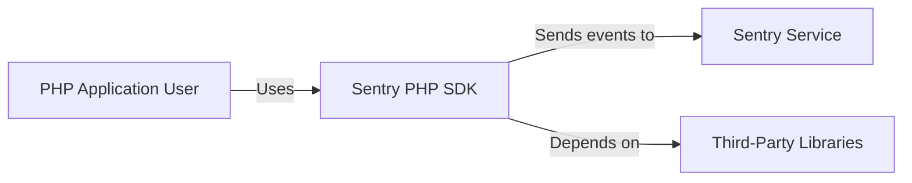
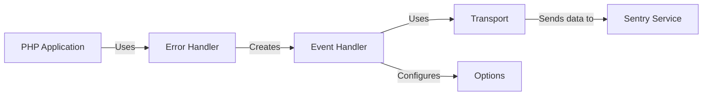
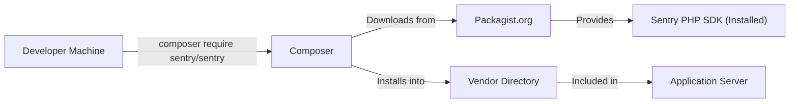
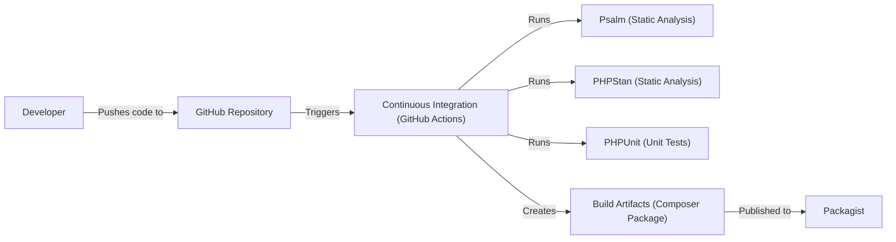

# BUSINESS POSTURE

Business Priorities and Goals:

*   Provide a PHP SDK for Sentry, enabling PHP developers to easily integrate their applications with the Sentry error tracking service.
*   Maintain a high level of reliability and stability for the SDK, ensuring minimal impact on the performance of applications using it.
*   Offer broad compatibility with various PHP versions and frameworks.
*   Provide a user-friendly API that is easy to learn and use.
*   Keep the SDK up-to-date with the latest Sentry features and best practices.
*   Facilitate efficient debugging and troubleshooting of PHP applications.

Most Important Business Risks:

*   SDK Instability: Bugs or performance issues in the SDK could negatively impact the performance or stability of applications that integrate it.
*   Compatibility Issues: Lack of compatibility with specific PHP versions, frameworks, or extensions could limit the SDK's adoption and usefulness.
*   Security Vulnerabilities: Vulnerabilities in the SDK could potentially be exploited to compromise applications or the Sentry service itself.
*   Data Privacy Concerns: Improper handling of sensitive data by the SDK could lead to privacy breaches.
*   Poor User Experience: A difficult-to-use or poorly documented SDK could hinder adoption and lead to developer frustration.
*   Lack of Maintenance: Failure to keep the SDK updated with the latest Sentry features and security patches could render it obsolete or insecure.

# SECURITY POSTURE

Existing Security Controls:

*   security control: Code Reviews: The project uses pull requests on GitHub, which implies that code reviews are part of the development process. (Described in GitHub repository's contribution guidelines).
*   security control: Static Analysis: The project uses static analysis tools like Psalm and PHPStan to identify potential code quality and security issues. (Described in the `composer.json` file and CI configuration).
*   security control: Automated Testing: The project has a comprehensive suite of unit and integration tests to ensure code correctness and prevent regressions. (Described in the `phpunit.xml.dist` file and CI configuration).
*   security control: Dependency Management: The project uses Composer to manage dependencies, allowing for tracking and updating of third-party libraries. (Described in the `composer.json` and `composer.lock` files).
*   security control: Security Policy: The project has a security policy that outlines how to report vulnerabilities. (Described in SECURITY.md file).

Accepted Risks:

*   accepted risk: Reliance on Third-Party Libraries: The SDK depends on external libraries, which could introduce vulnerabilities or compatibility issues. This risk is mitigated by using well-established libraries and keeping them updated.
*   accepted risk: Limited Control over Sentry Server: The SDK interacts with the Sentry service, which is managed separately. Any security vulnerabilities or downtime in the Sentry service could affect the SDK's functionality.

Recommended Security Controls:

*   security control: Dynamic Application Security Testing (DAST): Implement regular DAST scans to identify runtime vulnerabilities.
*   security control: Software Composition Analysis (SCA): Integrate SCA tools to automatically identify and track known vulnerabilities in third-party dependencies.
*   security control: Secrets Management: Ensure that sensitive information, such as API keys, are not hardcoded in the SDK or test code and are managed securely.

Security Requirements:

*   Authentication:
    *   The SDK must authenticate with the Sentry service using a secure mechanism, such as an API key (DSN).
    *   The SDK should not expose or leak the API key in any way.

*   Authorization:
    *   The SDK should only have the necessary permissions to send events to the Sentry service.
    *   The SDK should not attempt to access or modify any data it is not authorized to.

*   Input Validation:
    *   The SDK should validate all input received from the application to prevent injection attacks or other malicious data from being sent to Sentry.
    *   The SDK should sanitize data appropriately before sending it to Sentry.

*   Cryptography:
    *   The SDK should use secure communication channels (HTTPS) to transmit data to the Sentry service.
    *   Sensitive data, if any, stored locally by the SDK should be encrypted.

# DESIGN

## C4 CONTEXT

Element Descriptions:

*   Element:
    *   Name: User
    *   Type: Person
    *   Description: A developer using a PHP application that integrates with the Sentry PHP SDK.
    *   Responsibilities: Develops and maintains the PHP application, configures the Sentry SDK, and monitors error reports in Sentry.
    *   Security controls: N/A (External to the system)

*   Element:
    *   Name: Sentry PHP SDK
    *   Type: Software System
    *   Description: The library that provides an interface for PHP applications to interact with the Sentry service.
    *   Responsibilities: Captures errors and exceptions, collects contextual data, sends events to the Sentry service, provides configuration options.
    *   Security controls: Input validation, secure communication (HTTPS), authentication with API key.

*   Element:
    *   Name: Sentry Service
    *   Type: External Software System
    *   Description: The Sentry error tracking service that receives and processes events from the SDK.
    *   Responsibilities: Receives events, stores and aggregates error data, provides a web interface for viewing and managing errors.
    *   Security controls: Managed by Sentry (External to the SDK).

*   Element:
    *   Name: Third-Party Libraries
    *   Type: External Software System
    *   Description: Libraries that the Sentry PHP SDK depends on.
    *   Responsibilities: Provide functionalities used by the SDK, such as HTTP communication, logging, etc.
    *   Security controls: Managed by the respective library maintainers. The SDK project should keep these libraries updated.

## C4 CONTAINER

Element Descriptions:

*   Element:
    *   Name: PHP Application
    *   Type: Software System
    *   Description: The application that is using the Sentry PHP SDK.
    *   Responsibilities: Runs the application logic, integrates the Sentry SDK.
    *   Security controls: Application-specific security controls.

*   Element:
    *   Name: Error Handler
    *   Type: Container
    *   Description: Captures unhandled exceptions and errors within the PHP application.
    *   Responsibilities: Registers as the default error and exception handler, creates Event objects from captured errors.
    *   Security controls: Input validation (of error data).

*   Element:
    *   Name: Event Handler
    *   Type: Container
    *   Description: Processes captured errors and exceptions, prepares them for sending to Sentry.
    *   Responsibilities: Creates Event objects, adds contextual data, applies before-send callbacks, filters events.
    *   Security controls: Input validation, data sanitization.

*   Element:
    *   Name: Transport
    *   Type: Container
    *   Description: Handles the transmission of events to the Sentry service.
    *   Responsibilities: Sends events over HTTP(S), handles retries, manages queueing (if applicable).
    *   Security controls: Secure communication (HTTPS), authentication with API key.

*   Element:
    *   Name: Sentry Service
    *   Type: External Software System
    *   Description: The Sentry error tracking service.
    *   Responsibilities: Receives and processes events from the SDK.
    *   Security controls: Managed by Sentry (External to the SDK).

*   Element:
    *   Name: Options
    *   Type: Container
    *   Description: Manages the configuration of the SDK.
    *   Responsibilities: Stores and provides access to configuration options, such as the DSN, environment, release, etc.
    *   Security controls: Secure storage of sensitive options (e.g., DSN).

## DEPLOYMENT

Possible Deployment Solutions:

1.  Composer Package: The primary deployment method is as a Composer package. Developers include the SDK in their project's `composer.json` file, and Composer handles downloading and installing the SDK and its dependencies.
2.  Standalone PHAR Archive: A PHAR archive could be provided for users who prefer not to use Composer.
3.  Docker Image: While not a direct deployment of the SDK itself, a Docker image could be provided that includes a pre-configured PHP environment with the SDK installed. This would be useful for testing or development purposes.

Chosen Solution (Composer Package):

Element Descriptions:

*   Element:
    *   Name: Developer Machine
    *   Type: Infrastructure Node
    *   Description: The developer's local machine where they write and test code.
    *   Responsibilities: Runs development tools, including Composer.
    *   Security controls: Developer machine security best practices.

*   Element:
    *   Name: Composer
    *   Type: Software
    *   Description: The PHP dependency manager.
    *   Responsibilities: Downloads, installs, and updates project dependencies.
    *   Security controls: Uses HTTPS to communicate with Packagist, verifies package signatures (if configured).

*   Element:
    *   Name: Packagist.org
    *   Type: Infrastructure Node
    *   Description: The main Composer package repository.
    *   Responsibilities: Hosts PHP packages and their metadata.
    *   Security controls: Managed by Packagist.org.

*   Element:
    *   Name: Application Server
    *   Type: Infrastructure Node
    *   Description: The server where the PHP application is deployed.
    *   Responsibilities: Runs the PHP application and the Sentry SDK.
    *   Security controls: Server security best practices (firewall, OS hardening, etc.).

*   Element:
    *   Name: Sentry PHP SDK (Installed)
    *   Type: Software
    *   Description: The installed instance of the Sentry PHP SDK.
    *   Responsibilities: Captures and reports errors to Sentry.
    *   Security controls: As described in previous sections.

*   Element:
    *   Name: Vendor Directory
    *   Type: Directory
    *   Description: The directory where Composer installs project dependencies.
    *   Responsibilities: Contains the code for the Sentry SDK and its dependencies.
    *   Security controls: File system permissions should be properly configured.

## BUILD

Build Process Description:

1.  Developer pushes code changes to the GitHub repository.
2.  GitHub Actions (the CI system) is triggered by the push.
3.  The CI workflow performs the following steps:
    *   Checks out the code.
    *   Sets up the PHP environment.
    *   Installs dependencies using Composer.
    *   Runs static analysis tools (Psalm and PHPStan) to check for code quality and potential security issues.
    *   Runs unit and integration tests using PHPUnit.
    *   If all checks and tests pass, creates build artifacts (the Composer package).
4.  The build artifacts are published to Packagist.org, making the new version of the SDK available for installation via Composer.

Security Controls in Build Process:

*   security control: Static Analysis: Psalm and PHPStan are used to identify potential vulnerabilities and code quality issues before deployment.
*   security control: Automated Testing: PHPUnit is used to run a comprehensive test suite, ensuring that the code functions as expected and preventing regressions.
*   security control: Dependency Management: Composer is used to manage dependencies, ensuring that the correct versions of third-party libraries are used and that they can be easily updated.
*   security control: CI/CD Pipeline: GitHub Actions provides a secure and automated build pipeline, reducing the risk of manual errors and ensuring that all checks are performed consistently.

# RISK ASSESSMENT

Critical Business Processes:

*   Error Reporting: The primary business process is the reliable and accurate reporting of errors from PHP applications to the Sentry service.
*   Application Monitoring: The SDK enables developers to monitor the health and performance of their applications.
*   Issue Resolution: The SDK facilitates the efficient identification, diagnosis, and resolution of application issues.

Data Sensitivity:

*   Error Data: This includes stack traces, error messages, and contextual information about the application's state at the time of the error. This data may contain sensitive information, such as user data, database queries, or internal system details. Sensitivity: Potentially High.
*   Application Metadata: This includes information about the application's environment, such as the PHP version, operating system, and installed libraries. Sensitivity: Low to Medium.
*   User Data: The SDK allows developers to optionally include user data with error reports, such as user IDs, email addresses, or IP addresses. Sensitivity: Potentially High, depending on the specific data included.
*   DSN: The Data Source Name (DSN) is used to authenticate with the Sentry service and contains a secret key. Sensitivity: High.

# QUESTIONS & ASSUMPTIONS

Questions:

*   Are there any specific compliance requirements (e.g., GDPR, HIPAA) that the SDK must adhere to?
*   What is the expected volume of error events that the SDK will need to handle?
*   Are there any specific performance requirements for the SDK?
*   Are there any plans to support asynchronous transport of events?
*   What level of support is provided for older PHP versions?

Assumptions:

*   BUSINESS POSTURE: The primary goal is to provide a reliable and easy-to-use SDK for Sentry, prioritizing developer experience and ease of integration.
*   SECURITY POSTURE: Security is a high priority, but the SDK relies on the security of the Sentry service for many aspects of data protection.
*   DESIGN: The SDK is designed to be lightweight and have minimal impact on the performance of the applications that use it. The provided design is a simplified representation and may not cover all aspects of the actual implementation. The deployment model assumes the use of Composer as the primary distribution method.