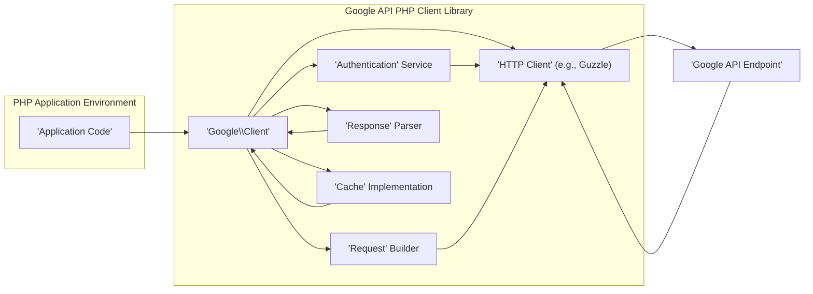
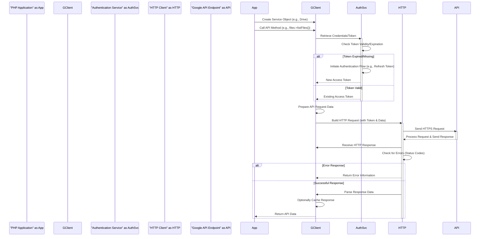

# Project Design Document: Google API PHP Client

**Version:** 1.1
**Date:** October 26, 2023
**Author:** AI Software Architect

## 1. Introduction

This document provides an enhanced and detailed design overview of the Google API PHP Client library (hereafter referred to as "the Client Library"). This document is intended to serve as a robust foundation for understanding the library's architecture, key components, and data flow, which is crucial for subsequent threat modeling activities. The target audience for this document includes security engineers, developers, and architects involved in the security assessment, development, and deployment of applications utilizing the Client Library. This revised version aims to provide greater clarity and depth to facilitate a more effective threat modeling process.

## 2. Goals and Scope

The primary goal of this document is to provide a comprehensive and detailed architectural description of the Client Library to facilitate effective and targeted threat modeling. The scope of this document includes:

*   In-depth analysis of the high-level architecture of the Client Library.
*   Detailed descriptions of key components and their specific functionalities, including interactions and data handling.
*   Comprehensive illustration of data flow within the Client Library, with a particular focus on authentication processes, API request construction, and response handling.
*   Identification of external dependencies and a detailed explanation of their interactions with the Client Library.
*   Specific deployment considerations that have direct relevance to the security posture of applications using the Client Library.

This document does not delve into the minute implementation details of every individual class or function within the Client Library's codebase. The focus remains on providing an architectural understanding relevant to security analysis.

## 3. High-Level Architecture

The Client Library acts as a crucial intermediary, streamlining communication between a PHP application and various Google APIs. It abstracts away the complexities of authentication, request formatting according to specific API requirements, and response parsing, presenting developers with a more intuitive and PHP-centric interface for interacting with diverse Google services.

**Key Architectural Elements (with expanded descriptions):**

*   **'PHP Application Environment'**: Represents the user's application code, the runtime environment, and any associated configurations that utilize the Client Library to interact with Google APIs. This includes the server environment where the PHP application is hosted.
*   **'Google\Client'**: This is the central orchestrator within the Client Library. It serves as the primary entry point for developers, managing authentication configurations (including credentials and API scopes), facilitating the creation of specific API service objects, and overseeing the overall configuration of the library's behavior.
*   **'Authentication' Service**: This component is dedicated to handling the intricate processes of authenticating with Google APIs. It encompasses the implementation of various OAuth 2.0 flows (such as the authorization code grant and service account authentication), manages the acquisition, secure storage, and refreshing of access tokens, and handles the loading of credentials from diverse sources (including JSON files and environment variables).
*   **'HTTP Client' (e.g., Guzzle)**: This represents an external library, with Guzzle being the most common choice, responsible for the fundamental task of making HTTP requests to Google API endpoints. The Client Library leverages this component for the actual network communication.
*   **'Request' Builder**: This internal component is responsible for constructing the HTTP requests that are sent to Google APIs. It takes the parameters provided by the application and formats them according to the specific requirements of the target API endpoint, including setting headers and crafting the request body.
*   **'Response' Parser**: This component handles the processing of HTTP responses received from Google APIs. It parses the response body (typically JSON), extracts relevant data, and handles potential errors indicated by HTTP status codes or within the response body itself.
*   **'Cache' Implementation**: This component provides an optional caching mechanism to store API responses. This can significantly improve application performance and reduce unnecessary API calls. It supports various caching strategies and storage backends.
*   **'Google API Endpoint'**: This represents the specific Google service being accessed (e.g., Google Cloud Storage, Gmail API, Google Drive API). Each endpoint has its own specific requirements for authentication and request formatting.

## 4. Key Components

This section provides a more detailed breakdown of the major components within the Client Library and their specific responsibilities and functionalities.

*   **`Google\Client`:**
    *   **Central Orchestration:** Acts as the primary interface for developers, managing the lifecycle of API interactions.
    *   **Authentication Management:** Configures and manages authentication parameters, including OAuth 2.0 client IDs, secrets, and API scopes.
    *   **Service Object Factory:** Provides methods to instantiate specific API service objects (e.g., `Drive`, `Sheets`).
    *   **Configuration Hub:** Centralizes library-wide configurations such as application name, developer key, and HTTP client options.
*   **Authentication Classes (e.g., `Google\Auth\OAuth2`, `Google\Auth\Credentials\ServiceAccountCredentials`):**
    *   **OAuth 2.0 Flow Implementation:** Implements various OAuth 2.0 grant types, including authorization code, client credentials, and refresh token flows.
    *   **Token Handling:** Manages the acquisition, storage (in memory, file, or custom implementations), and refreshing of access tokens.
    *   **Credential Loading:** Supports loading credentials from JSON files (for service accounts), environment variables, and potentially other sources.
    *   **Token Revocation:** Provides mechanisms for revoking access tokens when necessary.
*   **Service Classes (e.g., `Google\Service\Drive`, `Google\Service\Sheets`):**
    *   **API-Specific Interface:** Provides a strongly-typed and organized interface to specific Google APIs.
    *   **Method Mapping:** Contains methods that directly correspond to the available endpoints of the respective Google API.
    *   **Request Parameter Handling:** Facilitates the setting of request parameters and options in a structured manner.
    *   **Response Deserialization:** Handles the deserialization of API responses into PHP objects.
*   **Request and Response Handling Components:**
    *   **Request Factory:** Builds HTTP request objects (PSR-7 compatible) based on the API method calls and provided parameters. This includes setting HTTP methods, headers, and request bodies.
    *   **Response Handler:** Processes the HTTP response received from the API, checking for errors (based on status codes and response body content) and deserializing the response body.
    *   **Error Handling Logic:** Implements logic for handling API errors, potentially throwing exceptions or returning error objects.
*   **HTTP Client Abstraction (`Google\Http\REST`):**
    *   **Interface to HTTP Libraries:** Provides an abstraction layer over the underlying HTTP client library (typically Guzzle), allowing for potential flexibility in using different HTTP clients.
    *   **Request Signing:** Handles the signing of requests with the appropriate authentication credentials (e.g., adding the `Authorization` header).
    *   **Middleware Integration:** May support the integration of HTTP middleware for tasks like logging, retries, and custom request/response processing.
*   **Cache Implementation (`Google\Utils\Cache\FileCache`, `Google\Utils\Cache\MemcachedCache`, etc.):**
    *   **Caching Interface:** Defines an interface (`CacheInterface`) for different caching implementations.
    *   **Storage Mechanisms:** Provides concrete implementations for various caching mechanisms, such as file-based caching, in-memory caching (using extensions like Memcached or Redis), and potentially custom implementations.
    *   **Cache Invalidation:** Implements logic for invalidating cached responses based on time-to-live (TTL) or other criteria.
*   **Configurable Options:**
    *   **Application Metadata:** Allows setting application-specific information like the application name and version, which can be included in API requests.
    *   **Developer Key:**  Provides a mechanism for setting a developer key (if required by the API).
    *   **HTTP Client Configuration:** Enables customization of the underlying HTTP client's behavior, such as setting timeouts, proxies, and SSL verification options.
    *   **Logging Configuration:** Allows configuration of logging behavior, including the logging level and the logger implementation.

## 5. Data Flow

This section provides a more detailed illustration of the typical data flow when using the Client Library to interact with a Google API, highlighting the movement of data and the involvement of different components.

**Detailed Data Flow Description:**

1. **Initialization and Service Object Creation:** The 'PHP Application' initiates the process by instantiating the `Google\Client` object and configuring it with the necessary authentication details and API scopes. Subsequently, it uses the `Google\Client` to create a specific service object, such as `Google\Service\Drive`, to interact with a particular Google API.
2. **API Method Invocation:** The 'PHP Application' then calls a specific method on the service object, corresponding to a desired action on the Google API (e.g., `files->listFiles()`).
3. **Authentication Check and Token Retrieval:** The `Google\Client` delegates the authentication process to the 'Authentication Service'. The 'Authentication Service' checks if valid, unexpired authentication credentials (typically an OAuth 2.0 access token) are available in its storage.
    *   **Token Refresh/Acquisition:** If a valid token is not found or has expired, the 'Authentication Service' initiates the appropriate authentication flow based on the configured credentials. This might involve using a refresh token to obtain a new access token or redirecting the user for authorization.
    *   **Token Provision:** Once a valid access token is available, the 'Authentication Service' returns it to the `Google\Client`.
4. **Request Preparation:** The `Google\Client` uses the 'Request Builder' component to construct the HTTP request. This involves:
    *   Serializing the parameters provided in the API method call into the appropriate format (e.g., query parameters, request body).
    *   Adding necessary headers, including the `Authorization` header containing the access token.
    *   Setting the correct HTTP method (GET, POST, PUT, DELETE, etc.) and the API endpoint URL.
5. **HTTP Request Transmission:** The `Google\Client` utilizes the configured 'HTTP Client' (e.g., Guzzle) to send the prepared HTTP request to the 'Google API Endpoint' over a secure HTTPS connection.
6. **API Processing and Response Generation:** The 'Google API Endpoint' receives the request, authenticates it using the provided access token, processes the request according to its logic, and generates an HTTP response.
7. **HTTP Response Reception:** The 'HTTP Client' receives the HTTP response from the 'Google API Endpoint'.
8. **Response Processing and Error Handling:** The 'HTTP Client' passes the response to the `Google\Client`. The `Google\Client` uses the 'Response Parser' to:
    *   Check the HTTP status code to determine if the request was successful.
    *   Parse the response body (typically JSON) to extract the relevant data.
    *   Handle any errors indicated by the status code or within the response body.
9. **Optional Response Caching:** If caching is enabled, the `Google\Client` may store the API response in the 'Cache Implementation' for future use.
10. **Data Return to Application:** Finally, the `Google\Client` returns the processed API data (or an error indication) to the 'PHP Application'.

## 6. Security Considerations

This section provides a more detailed examination of potential security considerations relevant to the Client Library, offering specific examples of potential threats and vulnerabilities.

*   **Credential Management:**
    *   **Threat:** Exposure of API credentials (client secrets, refresh tokens, service account private keys) through insecure storage (e.g., hardcoding in code, storing in publicly accessible files).
    *   **Impact:** Unauthorized access to Google Cloud resources, data breaches, and potential financial losses.
    *   **Mitigation:** Utilize secure storage mechanisms like environment variables, dedicated secrets management services (e.g., HashiCorp Vault, Google Secret Manager), or the application's configuration management system. Avoid storing credentials directly in the codebase.
*   **Authentication Flow Vulnerabilities:**
    *   **Threat:** Misconfiguration of OAuth 2.0 flows, such as using weak or predictable `state` parameters, improper redirect URI validation, or vulnerabilities in the authorization server implementation.
    *   **Impact:** Authorization bypass, where an attacker can gain access to resources without proper authorization, or the theft of authorization codes or access tokens.
    *   **Mitigation:** Strictly adhere to OAuth 2.0 best practices, carefully validate redirect URIs, use strong and unpredictable `state` parameters to prevent CSRF attacks, and ensure the underlying authorization server is secure.
*   **Token Storage Security:**
    *   **Threat:** Storing access and refresh tokens insecurely (e.g., in plain text files, browser local storage without encryption).
    *   **Impact:** Token theft, allowing attackers to impersonate legitimate users and access their Google resources.
    *   **Mitigation:** Utilize secure storage mechanisms provided by the operating system or framework (e.g., Keychain on macOS, Credential Manager on Windows), or employ encryption when storing tokens. Consider the sensitivity of the data being accessed when choosing a storage method.
*   **Input Validation:**
    *   **Threat:** While the Client Library handles some request formatting, applications using the library might pass unsanitized user inputs as API parameters, leading to potential injection attacks (e.g., API query injection).
    *   **Impact:** Data manipulation, unauthorized data access, or denial of service on the Google API.
    *   **Mitigation:** Implement robust input validation and sanitization on the application side before passing data to the Client Library. Understand the input requirements of the specific Google API being used.
*   **Transport Security (HTTPS):**
    *   **Threat:** Man-in-the-middle (MITM) attacks if communication with Google APIs is not strictly enforced over HTTPS.
    *   **Impact:** Interception of sensitive data, including access tokens and API data.
    *   **Mitigation:** Ensure that the underlying HTTP client (e.g., Guzzle) is configured to enforce HTTPS and properly validate SSL certificates. Avoid configurations that allow insecure connections.
*   **Dependency Management:**
    *   **Threat:** Vulnerabilities in the Client Library's dependencies (e.g., Guzzle, PSR libraries) can introduce security risks if not patched promptly.
    *   **Impact:** Potential for remote code execution, denial of service, or other vulnerabilities depending on the specific dependency vulnerability.
    *   **Mitigation:** Regularly update the Client Library and all its dependencies to the latest stable versions. Utilize dependency scanning tools to identify and address known vulnerabilities.
*   **Error Handling:**
    *   **Threat:** Verbose error messages that expose sensitive information (e.g., API keys, internal paths) to unauthorized users.
    *   **Impact:** Information disclosure that could aid attackers in further compromising the system.
    *   **Mitigation:** Implement proper error handling that logs detailed error information securely but presents generic error messages to end-users. Avoid exposing sensitive details in client-facing error messages.
*   **Rate Limiting and Abuse Prevention:**
    *   **Threat:** Failure to handle API rate limits can lead to service disruption or being blocked by Google APIs. Malicious actors could exploit this to cause denial of service.
    *   **Impact:** Temporary or permanent inability to access Google APIs, impacting application functionality.
    *   **Mitigation:** Implement proper rate limit handling and backoff mechanisms in the application. Monitor API usage and implement safeguards against abuse.
*   **Caching Security:**
    *   **Threat:** Caching sensitive API responses insecurely (e.g., without encryption, in publicly accessible locations) can lead to data breaches.
    *   **Impact:** Exposure of sensitive data to unauthorized individuals.
    *   **Mitigation:** Choose caching mechanisms appropriate for the sensitivity of the data being cached. Encrypt cached data when necessary and ensure proper access controls are in place for cache storage.

## 7. Dependencies

The Client Library relies on the following external libraries, which are crucial to consider during security assessments:

*   **Guzzle HTTP Client (`guzzlehttp/guzzle`):**  A widely used PHP HTTP client for making requests. Security vulnerabilities in Guzzle can directly impact the Client Library.
*   **PSR-7 HTTP Message Interfaces (`psr/http-message`):** Defines standard interfaces for HTTP request and response messages.
*   **PSR-17 HTTP Factories (`psr/http-factory`):** Defines standard interfaces for creating HTTP message factories.
*   **PSR-18 HTTP Client Interface (`psr/http-client-implementation`):** Defines a standard interface for HTTP clients, allowing for interoperability.
*   **PSR-3 Logger Interface (`psr/log`):** Defines a standard interface for logging.
*   **php-http/discovery (`php-http/discovery`):** Helps in automatically discovering installed HTTP client implementations that adhere to PSR-18.

## 8. Deployment Considerations

Secure deployment of applications utilizing the Client Library requires careful attention to the following aspects:

*   **Secure Installation:** Ensure that the Client Library and all its dependencies are installed exclusively from trusted sources, such as Packagist, using Composer. Verify the integrity of downloaded packages.
*   **Secure Configuration Management:** Implement robust and secure methods for managing configuration settings, particularly API credentials. Avoid hardcoding credentials directly within the application code. Leverage environment variables, secure configuration management tools (e.g., Google Secret Manager, AWS Secrets Manager, Azure Key Vault), or encrypted configuration files.
*   **File System Permissions:**  Ensure that the PHP application and the web server have the minimum necessary permissions to access required files and resources. Restrict access to credential files and cache directories to prevent unauthorized access.
*   **Regular Updates and Patching:** Establish a process for regularly updating the Client Library and all its dependencies to apply security patches and address known vulnerabilities promptly.
*   **Secure Server Configuration:**  Configure the web server and PHP environment securely, including disabling unnecessary features, enabling security extensions, and keeping the server software up-to-date.
*   **Network Security:** Implement appropriate network security measures, such as firewalls and intrusion detection/prevention systems, to protect the application and its communication with Google APIs.
*   **Monitoring and Logging:** Implement comprehensive logging and monitoring to detect suspicious activity and potential security breaches. Monitor API usage patterns for anomalies.

## 9. Future Considerations

While not directly within the scope of this design document for immediate threat modeling, potential future developments or enhancements to the Client Library that could have security implications include:

*   **Enhanced Support for Modern Authentication Methods:**  Adoption of newer and potentially more secure authentication protocols beyond traditional OAuth 2.0 flows.
*   **Improved Error Handling and Security Logging:** More granular control over error reporting and enhanced security-focused logging capabilities.
*   **Strengthened Input Validation and Sanitization within the Library:**  Potentially incorporating more built-in mechanisms to help prevent common injection attacks.
*   **Automated Rate Limit Handling and Backoff Strategies:**  More sophisticated built-in mechanisms for managing API rate limits and preventing service disruptions.

This enhanced document provides a more detailed and comprehensive overview of the Google API PHP Client Library's architecture, key components, and data flow. This information is intended to be a valuable resource for conducting thorough and effective threat modeling exercises to identify and mitigate potential security risks associated with its use.