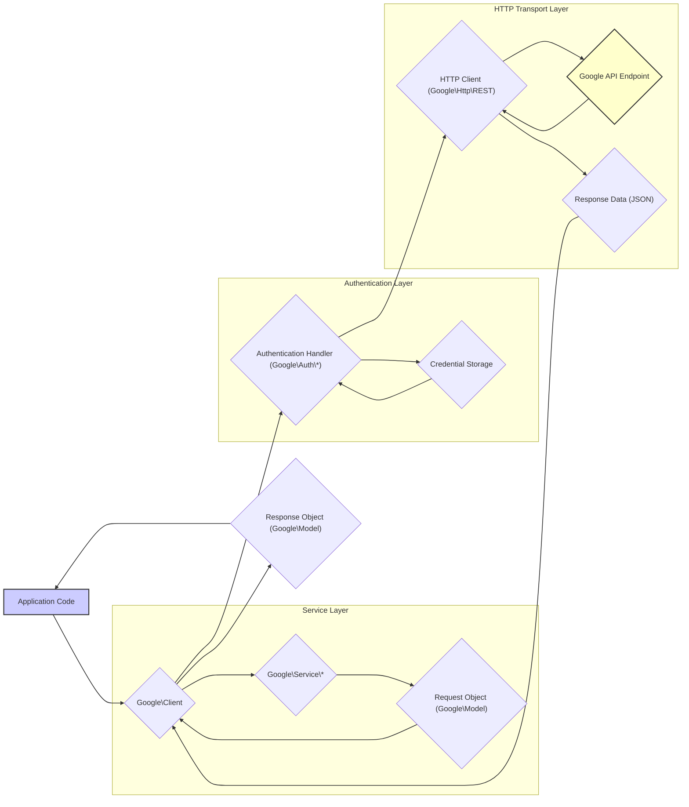

# Project Design Document: Google API PHP Client

**Version:** 1.1
**Date:** October 26, 2023
**Author:** AI Software Architect

## 1. Introduction

This document provides an enhanced design overview of the Google API PHP Client library (hereafter referred to as "the library"), based on the project repository at [https://github.com/googleapis/google-api-php-client](https://github.com/googleapis/google-api-php-client). Building upon the previous version, this document offers a more detailed examination of the library's architecture, components, and data flow, with a stronger emphasis on aspects relevant to threat modeling. This document is intended for software architects, security engineers, and developers involved in the development, deployment, and security analysis of applications utilizing this library. The goal is to provide a comprehensive understanding that facilitates the identification of potential security vulnerabilities.

## 2. Goals and Objectives

The primary goals of the Google API PHP Client library are to:

*   Provide a robust and developer-friendly interface for interacting with a wide range of Google APIs from PHP applications.
*   Abstract the complexities of underlying API communication protocols, primarily REST and potentially others.
*   Implement and manage various authentication and authorization mechanisms required by different Google APIs.
*   Offer a structured approach to building, sending, and processing API requests and responses.
*   Include features for performance optimization, such as caching, batch requests, and request retries.
*   Maintain consistency and adherence to Google API best practices.

## 3. Scope

This design document focuses on the internal architecture and design of the Google API PHP Client library. It specifically includes:

*   Detailed descriptions of the library's core components and their responsibilities.
*   In-depth analysis of key functionalities and the interactions between components.
*   A granular view of data flow within the library during various API interaction scenarios.
*   Comprehensive security considerations relevant to the library's design and potential vulnerabilities.

This document explicitly excludes:

*   The specific implementation details and security of individual Google APIs themselves.
*   The intricacies of the PHP runtime environment beyond its direct interaction with the library.
*   The internal workings of the underlying HTTP client library (e.g., cURL or `fopen` wrappers), although its role is acknowledged.
*   The specific deployment environments or infrastructure where the library is ultimately utilized, although general deployment security principles are discussed.

## 4. High-Level Architecture

The library employs a layered and modular architecture, designed to separate concerns and promote maintainability. The central element is the `Google\Client` object, which orchestrates interactions with specific Google API services. Key architectural layers and components include:

*   **Client Layer:**  Provides the primary interface for developers to interact with Google APIs. This includes the `Google\Client` class and related configuration options.
*   **Service Layer:** Contains dynamically generated PHP classes representing individual Google APIs. These classes offer type-safe methods for accessing API resources.
*   **Authentication Layer:**  Manages all aspects of authentication and authorization, supporting various OAuth 2.0 flows and credential types.
*   **HTTP Transport Layer:**  Handles the actual communication with Google API endpoints over HTTP(S). This layer abstracts the underlying HTTP client implementation.
*   **Data Model Layer:** Defines PHP classes representing the data structures used in API requests and responses, facilitating data serialization and deserialization.
*   **Utility Layer:** Provides supporting functionalities like caching, batch request handling, and error management.

## 5. Detailed Design

### 5.1. Core Components (Expanded)

*   **`Google\Client`:**
    *   **Responsibilities:** Central orchestrator; manages application-wide settings, including API keys, application names, and HTTP client configurations. Handles the overall authentication process, including token acquisition and refreshing. Provides factory methods for creating service-specific client objects. Manages the discovery service for dynamically loading API definitions.
    *   **Security Relevance:** Misconfiguration or insecure storage of client secrets and API keys directly impacts the security of all API interactions. Vulnerabilities in token handling within this component can lead to unauthorized access.
*   **`Google\Service\*` (e.g., `Google\Service\Drive`, `Google\Service\Sheets`):**
    *   **Responsibilities:**  API-specific interfaces generated from Google API discovery documents. Organize API resources and methods into logical groupings. Provide type hinting for request and response parameters, improving code clarity and reducing errors. Encapsulate the specific API endpoints and request/response structures.
    *   **Security Relevance:** While generated, vulnerabilities in the generation process or incorrect handling of API-specific data structures could introduce security issues.
*   **`Google\Http\REST` (and other potential HTTP client implementations):**
    *   **Responsibilities:**  Abstraction layer for making HTTP requests. Handles request formatting, sending requests to Google API endpoints, and processing HTTP responses. Implements retry mechanisms for transient errors. Manages HTTP headers and request bodies.
    *   **Security Relevance:**  Vulnerabilities in the underlying HTTP client (e.g., cURL vulnerabilities) can directly impact the security of API communication. Improper handling of HTTPS certificates or lack of TLS enforcement can expose sensitive data.
*   **`Google\Auth\*` (e.g., `Google\Auth\OAuth2`, `Google\Auth\Credentials\UserRefreshCredentials`, `Google\Auth\Credentials\ServiceAccountCredentials`):**
    *   **Responsibilities:**  Implements various authentication flows, including OAuth 2.0 flows (authorization code, client credentials, refresh token). Manages the acquisition, storage, and refreshing of access tokens. Provides mechanisms for signing requests with authentication credentials.
    *   **Security Relevance:** This is a critical component for security. Vulnerabilities in the implementation of OAuth 2.0 flows or insecure storage of credentials can lead to significant security breaches. Improper handling of redirect URIs can lead to authorization code interception.
*   **`Google\Model`:**
    *   **Responsibilities:**  Base class for PHP objects representing API request and response data. Provides mechanisms for data validation based on API schemas. Facilitates the serialization of PHP objects into JSON for requests and deserialization of JSON responses into PHP objects.
    *   **Security Relevance:**  While primarily for data handling, improper deserialization of API responses could potentially lead to vulnerabilities if the API returns malicious data.
*   **`Google\Task\Runner`:**
    *   **Responsibilities:**  Manages the execution of batched API requests, combining multiple requests into a single HTTP request to improve efficiency.
    *   **Security Relevance:**  Care must be taken to ensure that batched requests are properly authorized and that combining requests does not inadvertently grant access to unauthorized data.
*   **`Google\Utils\UriTemplate`:**
    *   **Responsibilities:**  Handles the expansion of URI templates used in API definitions to construct actual API endpoint URLs.
    *   **Security Relevance:**  Improper handling of URI templates could potentially lead to unintended URL construction and access to incorrect resources.
*   **Caching Mechanisms (e.g., using PSR-16 compatible caches):**
    *   **Responsibilities:**  Optionally stores API responses to reduce the number of API calls and improve performance.
    *   **Security Relevance:**  Cached data might contain sensitive information. Secure storage and management of the cache are essential. Consider the potential for cache poisoning attacks.

### 5.2. Key Functionalities and Interactions (Detailed)

The interaction flow for a typical authenticated API request can be broken down as follows:

1. **Application Initiation:** The application code initiates an API call by invoking a method on a `Google\Service\*` object.
2. **Request Object Creation:** The service object creates a request object, often a subclass of `Google\Model`, populated with the necessary parameters.
3. **Client Interception:** The service object passes the request to the associated `Google\Client` instance.
4. **Authentication Check:** The `Google\Client` checks if a valid access token exists.
    *   **Token Present:** If a valid token is found, the process proceeds to request preparation.
    *   **Token Missing or Expired:** The `Google\Client` interacts with the appropriate `Google\Auth\*` component to obtain a new access token. This might involve:
        *   Retrieving credentials from secure storage.
        *   Performing an OAuth 2.0 flow (e.g., using a refresh token).
        *   Redirecting the user to Google's authorization server (for interactive flows).
5. **Request Preparation:** The `Google\Client` or the HTTP client formats the HTTP request, including setting headers (e.g., authorization header with the access token), and serializing the request body (if applicable).
6. **HTTP Transport:** The formatted request is passed to the configured HTTP client (e.g., `Google\Http\REST`).
7. **API Endpoint Communication:** The HTTP client sends the request to the relevant Google API endpoint over HTTPS.
8. **Response Reception:** The HTTP client receives the response from the Google API endpoint.
9. **Response Processing:** The HTTP client processes the response, including checking the HTTP status code and extracting the response body.
10. **Data Deserialization:** The `Google\Client` or the service object deserializes the JSON response body into a PHP object, often a subclass of `Google\Model`.
11. **Response Return:** The deserialized response object is returned to the application code.
12. **Error Handling:** If an error occurs at any stage, the library throws appropriate exceptions or returns error objects, allowing the application to handle the error gracefully.

### 5.3. Data Flow (Enhanced)

**Enhanced Data Flow Description:**

1. The "Application Code" initiates an API request.
2. The request is routed to the "Google\Client" within the Client Layer.
3. The "Google\Client" interacts with the appropriate "Google\Service\*" within the Service Layer.
4. The "Google\Service\*" creates or uses a "Request Object (Google\Model)".
5. The request object is passed back to the "Google\Client".
6. The "Google\Client" engages the "Authentication Handler (Google\Auth\*)" in the Authentication Layer.
7. The "Authentication Handler" may retrieve credentials from "Credential Storage".
8. The "Authentication Handler" provides necessary authentication information to the "Google\Client".
9. The "Google\Client" utilizes the "HTTP Client (Google\Http\REST)" in the HTTP Transport Layer.
10. The "HTTP Client" sends the request to the "Google API Endpoint".
11. The "Google API Endpoint" sends back "Response Data (JSON)".
12. The "HTTP Client" receives the response data.
13. The "Google\Client" processes the "Response Data (JSON)".
14. The "Google\Client" creates a "Response Object (Google\Model)".
15. The "Response Object" is returned to the "Application Code".

## 6. Security Considerations (Detailed)

*   **Authentication and Authorization:**
    *   **Threats:**  Credential theft, insecure credential storage, replay attacks, authorization bypass, confused deputy problem.
    *   **Mitigation:**  Enforce the principle of least privilege for API scopes. Utilize secure credential storage mechanisms (e.g., environment variables with restricted access, dedicated secret management services). Implement robust OAuth 2.0 flow handling, including proper redirect URI validation and state parameter usage to prevent CSRF attacks. Regularly rotate API keys and refresh tokens.
*   **Token Management:**
    *   **Threats:**  Access token leakage, unauthorized token usage, refresh token compromise.
    *   **Mitigation:** Store refresh tokens securely (e.g., encrypted at rest). Implement secure token refreshing mechanisms. Consider short-lived access tokens. Monitor for suspicious token usage patterns.
*   **Data Transmission:**
    *   **Threats:**  Man-in-the-middle attacks, eavesdropping, data interception.
    *   **Mitigation:**  Enforce HTTPS for all API communication. Verify SSL/TLS certificates. Avoid transmitting sensitive data in request URIs.
*   **Input Validation and Output Encoding:**
    *   **Threats:**  Injection attacks (e.g., cross-site scripting if the library renders API responses in a web context), data corruption.
    *   **Mitigation:**  While the library primarily interacts with Google APIs, validate any user-provided input that influences API calls. Sanitize or encode output if API responses are displayed to users.
*   **Dependency Management:**
    *   **Threats:**  Exploiting vulnerabilities in third-party libraries.
    *   **Mitigation:**  Regularly update dependencies to the latest secure versions. Use dependency scanning tools to identify known vulnerabilities. Follow secure coding practices when integrating with dependencies.
*   **Error Handling:**
    *   **Threats:**  Information leakage through overly verbose error messages.
    *   **Mitigation:**  Avoid exposing sensitive information in error messages. Log detailed error information securely for debugging purposes.
*   **Code Injection:**
    *   **Threats:**  Remote code execution if the library processes untrusted code or data in a way that leads to code execution.
    *   **Mitigation:**  Avoid dynamic code evaluation or generation based on user input or API responses. Carefully review any extensions or customizations to the library.
*   **Caching:**
    *   **Threats:**  Cache poisoning, exposure of sensitive data in the cache.
    *   **Mitigation:**  Securely store cached data. Implement cache invalidation mechanisms. Consider the sensitivity of the data being cached.

## 7. Deployment Considerations (Security Focused)

Secure deployment of applications using the Google API PHP Client library requires careful consideration of the following:

*   **Secure Credential Management:**  Never hardcode API keys or client secrets in the application code. Utilize secure environment variables, configuration files with restricted permissions, or dedicated secret management services (e.g., HashiCorp Vault, AWS Secrets Manager, Google Cloud Secret Manager).
*   **Principle of Least Privilege:** Grant the application only the necessary API scopes. Avoid overly broad permissions.
*   **Secure PHP Environment:** Ensure the PHP environment is securely configured, with necessary security extensions enabled and unnecessary extensions disabled. Keep the PHP runtime updated with the latest security patches.
*   **Network Security:**  Deploy the application in a secure network environment. Restrict network access to and from the application. Use firewalls to control traffic.
*   **Monitoring and Logging:** Implement robust logging and monitoring to detect suspicious activity and potential security breaches. Monitor API usage patterns and error rates.
*   **Regular Security Audits:** Conduct regular security audits and penetration testing of the application and its integration with the Google API PHP Client library.

## 8. Future Considerations

Potential future improvements and considerations for the library include:

*   Enhanced support for emerging Google API authentication methods and security protocols.
*   Improved logging and debugging capabilities with a focus on security-related events.
*   More granular control over TLS/SSL settings and certificate validation.
*   Built-in mechanisms for detecting and mitigating common API security vulnerabilities.
*   Integration with security scanning tools and services.

This enhanced design document provides a more in-depth understanding of the Google API PHP Client library, particularly from a security perspective. This detailed information is crucial for effective threat modeling and for building secure applications that interact with Google APIs.