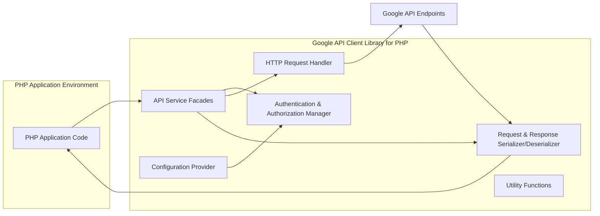
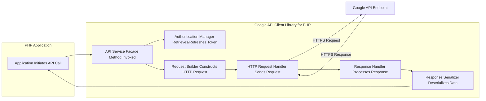

# Project Design Document: Google API Client Library for PHP

**Version:** 1.1
**Date:** October 26, 2023
**Author:** AI Software Architect

## 1. Project Overview

The Google API Client Library for PHP is designed to simplify the process of integrating PHP applications with various Google APIs. It handles the underlying complexities of HTTP communication, authentication, and data serialization, allowing developers to focus on their application logic. This document provides a detailed architectural overview of the Library, intended for use in threat modeling and understanding its internal workings. The source code for this project is available at: https://github.com/googleapis/google-api-php-client.

## 2. Goals and Objectives

The primary goals of the Library are to:

*   Provide a developer-friendly and consistent interface for accessing a wide range of Google APIs from PHP.
*   Securely manage authentication and authorization with Google services, primarily through OAuth 2.0.
*   Abstract the complexities of constructing and sending HTTP requests and parsing responses.
*   Offer robust support for various Google API features, including batch requests, media uploads/downloads, and pagination.
*   Maintain compatibility with actively supported PHP versions and adhere to PHP coding standards.
*   Provide comprehensive and up-to-date documentation and examples for developers.
*   Facilitate secure and reliable communication with Google services.

## 3. Target Audience

This document is intended for individuals involved in the security and development lifecycle of systems utilizing the Library:

*   Security architects and engineers responsible for threat modeling and security assessments.
*   Software developers contributing to the Library's codebase.
*   Technical leads and product managers overseeing the Library's development and usage.
*   DevOps engineers involved in deploying and maintaining applications that use the Library.

## 4. System Architecture

The Library employs a layered and modular architecture, promoting separation of concerns and enhancing maintainability.

### 4.1. Key Components

*   **API Service Facades:** These classes provide a high-level, object-oriented interface tailored to specific Google APIs (e.g., `Google\Service\Drive`, `Google\Service\Sheets`). Each facade encapsulates the API's resources and operations.
    *   Offer methods corresponding to specific API endpoints and actions.
    *   Handle parameter validation and request construction.
    *   Return PHP objects representing API resources.
*   **Authentication & Authorization Manager:** This component is responsible for managing the authentication lifecycle with Google APIs, primarily using OAuth 2.0.
    *   Supports various OAuth 2.0 flows (e.g., authorization code grant, service accounts, client credentials).
    *   Handles token acquisition, storage (using various strategies like file-based, in-memory, or custom implementations), and refreshing.
    *   Provides mechanisms for authorizing requests with access tokens.
    *   Manages the configuration of authentication credentials (client ID, client secret, etc.).
*   **HTTP Request Handler:** This component handles the actual communication with Google API endpoints over HTTP(S).
    *   Abstracts the underlying HTTP client implementation (typically using `curl` or a similar library).
    *   Constructs HTTP requests, including setting headers (e.g., authorization headers).
    *   Executes HTTP requests using appropriate methods (GET, POST, PUT, DELETE, etc.).
    *   Handles HTTP error responses and potentially implements retry logic.
*   **Request & Response Serializer/Deserializer:** This component manages the conversion of PHP data structures to formats suitable for API requests (typically JSON) and vice versa for API responses.
    *   Serializes PHP objects into JSON for request bodies.
    *   Deserializes JSON responses from Google APIs into PHP objects, often using specific data models.
    *   Handles potential errors during serialization and deserialization.
*   **Configuration Provider:** This component manages the Library's configuration settings.
    *   Allows setting various parameters such as API keys, application names, and HTTP client options.
    *   Supports configuration through different methods (e.g., constructor arguments, configuration files, environment variables).
*   **Utility Functions:** This component provides a collection of helper functions and classes used across the Library.
    *   Includes functions for tasks like URL manipulation, string formatting, and data validation.

## 5. Data Flow

The typical flow of data during an API request initiated by an application using the Library is as follows:

Detailed steps:

*   The PHP application code initiates an API interaction by calling a method on an API Service Facade (A -> B).
*   The API Service Facade interacts with the Authentication Manager to obtain a valid access token. This might involve retrieving an existing token or refreshing an expired one (B -> C).
*   The Request Builder within the API Service Facade constructs the HTTP request, including headers, parameters, and request body, based on the method call and provided arguments (B -> D).
*   The HTTP Request Handler takes the constructed request and sends it to the appropriate Google API endpoint over HTTPS (D -> E -> H).
*   The Google API Endpoint processes the request and returns an HTTPS response (H -> E).
*   The HTTP Request Handler receives the response and passes it to the Response Handler (E -> F).
*   The Response Serializer/Deserializer processes the response body (typically JSON), converting it into PHP objects or data structures (F -> G).
*   The deserialized data or an error object is returned to the calling application code (G -> A).

## 6. Security Considerations

This section outlines key security considerations relevant to the Library's design and usage, crucial for threat modeling activities.

*   **Authentication and Authorization (OAuth 2.0):**
    *   The Library's security heavily relies on the correct implementation and usage of OAuth 2.0.
    *   **Threat:** Improper handling or storage of client secrets could lead to unauthorized access.
    *   **Threat:** Vulnerabilities in the token retrieval or refresh mechanisms could compromise authentication.
    *   **Mitigation:** The Library should encourage secure storage of credentials and follow OAuth 2.0 best practices.
    *   **Mitigation:** Implement robust token validation and secure token storage mechanisms.
*   **Data Transmission Security (HTTPS):**
    *   All communication with Google APIs should be encrypted using HTTPS to protect data in transit.
    *   **Threat:** Man-in-the-middle attacks could intercept sensitive data if HTTPS is not enforced or properly configured.
    *   **Mitigation:** The HTTP Request Handler should enforce TLS/SSL verification and use secure connection protocols.
*   **Input Validation and Output Encoding:**
    *   While the primary responsibility lies with the application, the Library might perform some basic input validation.
    *   **Threat:** Injection vulnerabilities (e.g., command injection, header injection) could arise if user-provided data is not properly handled.
    *   **Mitigation:** The Library should sanitize or validate inputs where appropriate and encourage secure coding practices in consuming applications.
*   **Secret Management:**
    *   The Library handles sensitive credentials like API keys, client IDs, and client secrets.
    *   **Threat:** Exposure of these secrets could lead to unauthorized API usage and potential data breaches.
    *   **Mitigation:** The Library's documentation should guide developers on secure secret management practices (e.g., using environment variables, secure vault solutions).
*   **Dependency Management:**
    *   The Library depends on other PHP packages. Vulnerabilities in these dependencies could introduce security risks.
    *   **Threat:** Exploitable vulnerabilities in third-party libraries could compromise the Library's security.
    *   **Mitigation:** Regularly update dependencies and perform security audits of the dependency tree.
*   **Error Handling and Logging:**
    *   Error messages and logs should not expose sensitive information.
    *   **Threat:** Verbose error messages could reveal internal system details to attackers.
    *   **Mitigation:** Implement secure error handling practices and sanitize log output.
*   **Rate Limiting and Quotas:**
    *   While not a direct security vulnerability, exceeding API rate limits can lead to service disruption.
    *   **Threat:** Malicious actors could intentionally exhaust API quotas, causing denial of service.
    *   **Mitigation:** The Library might provide mechanisms or guidance for handling rate limits and implementing retry strategies.
*   **Code Injection Vulnerabilities:**
    *   The Library should be designed to prevent code injection vulnerabilities, especially when handling dynamic configurations or user-provided data.
    *   **Threat:** Attackers could inject malicious code if the Library processes untrusted data unsafely.
    *   **Mitigation:** Employ secure coding practices and avoid using potentially unsafe PHP functions with external input.
*   **Cross-Site Request Forgery (CSRF):**
    *   While the Library itself doesn't directly handle user sessions, applications using it need to be aware of CSRF risks when interacting with Google APIs on behalf of users.
    *   **Threat:** Attackers could potentially trick authenticated users into making unintended API calls.
    *   **Mitigation:** Applications should implement CSRF protection mechanisms.

## 7. Deployment Considerations

The Library is typically deployed as a dependency within a PHP application.

*   **Installation:** Primarily installed using Composer, the PHP dependency manager.
*   **Configuration:** Configuration parameters are usually set within the application's configuration files, environment variables, or through code.
*   **Runtime Environment:** Requires a PHP environment with necessary extensions (e.g., `curl`, `json`, `openssl`).
*   **Updates:** Regularly updating the Library to the latest version is crucial for security patches and bug fixes.

## 8. Future Considerations

Potential future enhancements and considerations for the Library include:

*   Improved support for asynchronous API calls and non-blocking operations.
*   More fine-grained control over HTTP request configurations and customization.
*   Enhanced logging and debugging capabilities.
*   Integration with more advanced authentication mechanisms.
*   Further improvements to error handling and retry logic.
*   Regular security audits and penetration testing.

This improved design document provides a more detailed and comprehensive overview of the Google API Client Library for PHP, with a stronger emphasis on security considerations relevant for threat modeling.