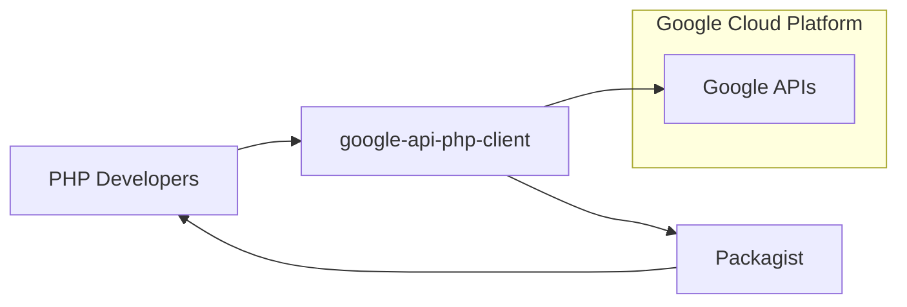
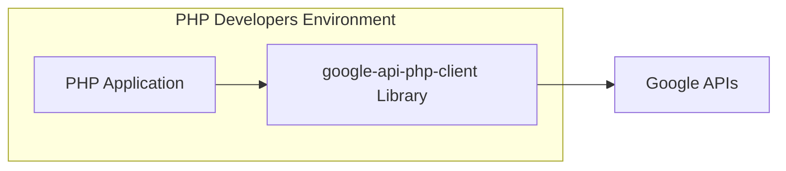
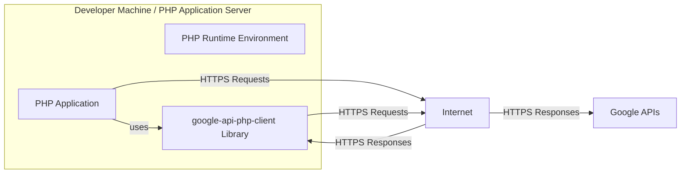
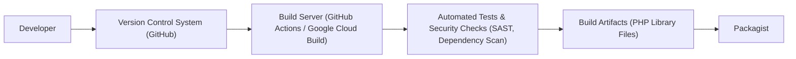

# BUSINESS POSTURE

- Business Priorities and Goals:
  - Enable PHP developers to easily and securely integrate with Google APIs.
  - Provide a well-maintained, reliable, and feature-rich client library that simplifies the process of interacting with various Google services.
  - Increase the adoption of Google Cloud Platform and Google APIs within the PHP developer community.
  - Support a wide range of Google APIs, ensuring compatibility and up-to-date functionality.
  - Facilitate rapid development and deployment of PHP applications that leverage Google services.
- Business Risks:
  - Security vulnerabilities in the client library could lead to unauthorized access to Google APIs and sensitive user data.
  - Lack of reliability or performance issues in the client library could negatively impact applications that depend on it.
  - Incompatibility with certain Google APIs or PHP environments could limit the library's usability.
  - Poor documentation or lack of community support could hinder adoption and increase development costs for users.
  - Supply chain risks associated with dependencies and build processes could compromise the integrity of the library.

# SECURITY POSTURE

- Existing Security Controls:
  - security control: Code Reviews - Implemented as part of the development process within Google. (Location: Google's internal development workflow)
  - security control: Static Analysis Security Testing (SAST) - Likely used internally by Google to scan the codebase for potential vulnerabilities. (Location: Google's internal development pipeline)
  - security control: Dependency Management - Uses Composer for managing PHP dependencies. (Location: `composer.json` and `composer.lock` files in the repository)
  - security control: HTTPS - Communication with Google APIs is enforced over HTTPS. (Location: Implemented within the client library's API request logic)
  - security control: OAuth 2.0 Support - Implements OAuth 2.0 for secure authentication and authorization with Google APIs. (Location: Implemented within the `src/Auth` directory and examples)
  - accepted risk: Open Source Vulnerability Disclosure - Vulnerabilities might be publicly disclosed before a patch is available. (Location: inherent to open source projects)
  - accepted risk: Dependency Vulnerabilities - Vulnerabilities in third-party dependencies could affect the client library. (Location: inherent to software projects using dependencies)
- Recommended Security Controls:
  - security control: Dependency Scanning - Implement automated dependency scanning to identify and address vulnerabilities in third-party libraries.
  - security control: Dynamic Analysis Security Testing (DAST) - Perform DAST on applications using the client library to identify runtime vulnerabilities.
  - security control: Software Composition Analysis (SCA) - Implement SCA to gain visibility into the software bill of materials and manage open source risks.
  - security control: Vulnerability Disclosure Program - Establish a clear process for reporting and handling security vulnerabilities.
  - security control: Security Audits - Conduct regular security audits of the client library by internal or external security experts.
- Security Requirements:
  - Authentication:
    - Requirement: Implement secure authentication mechanisms using OAuth 2.0 to access Google APIs.
    - Requirement: Support various OAuth 2.0 flows suitable for different application types (web, mobile, server-side).
    - Requirement: Securely store and manage OAuth 2.0 client secrets and refresh tokens.
  - Authorization:
    - Requirement: Enforce authorization based on API scopes to limit access to specific Google API resources.
    - Requirement: Clearly document required API scopes for each API method.
    - Requirement: Provide mechanisms for users to configure and manage API scopes.
  - Input Validation:
    - Requirement: Validate all input data sent to Google APIs to prevent injection attacks and data integrity issues.
    - Requirement: Validate responses received from Google APIs to ensure data integrity and handle unexpected responses gracefully.
    - Requirement: Sanitize user-provided input before including it in API requests or responses.
  - Cryptography:
    - Requirement: Use HTTPS for all communication with Google APIs to protect data in transit.
    - Requirement: Consider encrypting sensitive data at rest if it is stored locally by applications using the client library (though the library itself primarily handles API communication).
    - Requirement: Utilize secure cryptographic libraries and best practices when implementing cryptographic operations.

# DESIGN

- C4 CONTEXT

- C4 CONTEXT Elements:
  - - Name: PHP Developers
    - Type: Person
    - Description: Developers who use the `google-api-php-client` library to build PHP applications that interact with Google APIs.
    - Responsibilities: Develop and maintain PHP applications, integrate with Google APIs using the client library, manage application dependencies.
    - Security controls: Secure coding practices, dependency management, secure application deployment.
  - - Name: google-api-php-client
    - Type: Software System
    - Description: A PHP client library that simplifies interaction with various Google APIs. It handles authentication, request construction, response parsing, and error handling.
    - Responsibilities: Provide a PHP interface to Google APIs, manage authentication and authorization, handle API requests and responses, provide documentation and examples.
    - Security controls: Input validation, secure API request construction, secure handling of API credentials, adherence to secure coding practices.
  - - Name: Google APIs
    - Type: Software System
    - Description: A wide range of APIs provided by Google Cloud Platform and other Google services, such as Gmail API, Drive API, Cloud Storage API, etc.
    - Responsibilities: Provide various functionalities and data access through APIs, authenticate and authorize API requests, enforce API quotas and limits, ensure API security and availability.
    - Security controls: OAuth 2.0 authentication and authorization, API access controls, input validation, rate limiting, security monitoring.
  - - Name: Packagist
    - Type: Software System
    - Description: The main package repository for PHP. The `google-api-php-client` library is published on Packagist for easy installation and dependency management.
    - Responsibilities: Host and distribute PHP packages, manage package versions and dependencies, provide a platform for discovering and installing PHP libraries.
    - Security controls: Package integrity checks, malware scanning, user authentication and authorization, HTTPS for package downloads.

- C4 CONTAINER

- C4 CONTAINER Elements:
  - - Name: PHP Application
    - Type: Software System
    - Description: A PHP application developed by PHP developers that utilizes the `google-api-php-client` library to interact with Google APIs.
    - Responsibilities: Implement business logic, utilize Google APIs for specific functionalities, manage user interactions, handle application-specific security.
    - Security controls: Application-level authentication and authorization, input validation, secure data handling, protection of API credentials within the application.
  - - Name: google-api-php-client Library
    - Type: Library
    - Description: The PHP client library itself, containing PHP code that provides classes and functions for interacting with Google APIs. It is integrated into PHP applications.
    - Responsibilities: Encapsulate API interaction logic, handle authentication and authorization flows, construct and send API requests, parse API responses, provide error handling and utilities.
    - Security controls: Secure coding practices, input validation within the library, secure handling of API credentials (delegated to the application), protection against common library vulnerabilities.
  - - Name: Google APIs
    - Type: External System
    - Description: The external Google APIs that the PHP client library interacts with.
    - Responsibilities: Provide API services, authenticate and authorize requests, process requests and return responses.
    - Security controls: OAuth 2.0, API keys, rate limiting, input validation, security monitoring.

- DEPLOYMENT

- DEPLOYMENT Elements:
  - - Name: PHP Runtime Environment
    - Type: Environment
    - Description: The PHP runtime environment where the PHP application and the `google-api-php-client` library are executed. This could be a developer's local machine, a web server, or a containerized environment.
    - Responsibilities: Execute PHP code, provide necessary PHP extensions and libraries, manage application resources.
    - Security controls: Operating system security, PHP runtime security configurations, web server security configurations, container security (if applicable).
  - - Name: PHP Application
    - Type: Software
    - Description: The deployed PHP application that utilizes the `google-api-php-client` library.
    - Responsibilities: Implement application logic, handle user requests, interact with Google APIs through the client library.
    - Security controls: Application-level security controls, input validation, session management, access control, secure configuration management.
  - - Name: google-api-php-client Library
    - Type: Library
    - Description: The deployed `google-api-php-client` library, included as part of the PHP application deployment.
    - Responsibilities: Provide API client functionalities to the PHP application.
    - Security controls: Library security is ensured during development and build phases. Deployment primarily involves including the library files with the application.
  - - Name: Internet
    - Type: Infrastructure
    - Description: The public internet network used for communication between the PHP application and Google APIs.
    - Responsibilities: Provide network connectivity.
    - Security controls: Network security is generally outside the scope of the application and library, but HTTPS ensures secure communication over the internet.
  - - Name: Google APIs
    - Type: External Service
    - Description: The Google APIs services accessed over the internet.
    - Responsibilities: Provide API services, handle requests, and return responses.
    - Security controls: Google's infrastructure security, API security controls.

- BUILD

- BUILD Elements:
  - - Name: Developer
    - Type: Person
    - Description: Software developers who contribute code to the `google-api-php-client` repository.
    - Responsibilities: Write code, commit changes to the version control system, participate in code reviews.
    - Security controls: Secure development practices, code review process, access control to the repository.
  - - Name: Version Control System (GitHub)
    - Type: Tool
    - Description: GitHub repository hosting the source code of the `google-api-php-client`.
    - Responsibilities: Manage source code, track changes, facilitate collaboration, trigger build processes.
    - Security controls: Access control, branch protection, audit logs, secure communication (HTTPS, SSH).
  - - Name: Build Server (GitHub Actions / Google Cloud Build)
    - Type: Tool
    - Description: Automated build server used to compile, test, and package the library. Could be GitHub Actions, Google Cloud Build, or similar CI/CD system.
    - Responsibilities: Automate the build process, run tests, perform security checks, create build artifacts.
    - Security controls: Secure build environment, access control, build process isolation, logging and monitoring.
  - - Name: Automated Tests & Security Checks (SAST, Dependency Scan)
    - Type: Process
    - Description: Automated tests (unit, integration) and security checks (SAST, dependency scanning) performed during the build process.
    - Responsibilities: Ensure code quality, identify bugs, detect security vulnerabilities, verify dependencies.
    - Security controls: SAST tools, dependency scanning tools, security test suites, automated vulnerability analysis.
  - - Name: Build Artifacts (PHP Library Files)
    - Type: Data
    - Description: The compiled and packaged PHP library files, ready for distribution.
    - Responsibilities: Represent the distributable version of the library.
    - Security controls: Artifact signing (potentially), storage in secure repositories, integrity checks.
  - - Name: Packagist
    - Type: Repository
    - Description: The PHP package repository where the build artifacts are published for public consumption.
    - Responsibilities: Host and distribute the PHP library, manage versions, provide installation instructions.
    - Security controls: Package integrity checks, malware scanning, HTTPS for downloads, access control for publishing.

# RISK ASSESSMENT

- Critical Business Processes:
  - Secure access to Google APIs from PHP applications.
  - Reliable and functional client library for PHP developers to integrate with Google services.
  - Maintaining the integrity and security of the `google-api-php-client` library to prevent supply chain attacks.
- Data to Protect and Sensitivity:
  - API Keys and OAuth 2.0 Credentials: High sensitivity. Compromise could lead to unauthorized access to Google APIs and associated data.
  - Data Exchanged with Google APIs: Sensitivity depends on the specific API and application. Could range from low (public data) to high (sensitive user data, financial data, etc.).
  - Source Code of the Client Library: Medium sensitivity. Compromise could lead to injection of vulnerabilities or malicious code.
  - Build Artifacts (PHP Library Files): Medium to High sensitivity. Compromise could lead to distribution of malicious or vulnerable library versions.

# QUESTIONS & ASSUMPTIONS

- Questions:
  - What are the most critical Google APIs that this client library is used for?
  - What are the typical deployment environments for applications using this library (e.g., web servers, cloud platforms, specific PHP frameworks)?
  - Are there specific compliance requirements (e.g., GDPR, HIPAA) that applications using this library need to adhere to?
  - What is the process for reporting and patching vulnerabilities in the client library?
  - Are there any specific performance or scalability requirements for the client library?
- Assumptions:
  - The primary goal of the `google-api-php-client` is to provide a secure and reliable way for PHP developers to access Google APIs.
  - Security is a high priority for the development and maintenance of this library, given its role in accessing sensitive Google services.
  - The library is intended to be used in a wide range of PHP applications, from small websites to large enterprise systems.
  - Developers using this library are responsible for implementing application-level security controls and properly managing API credentials.
  - The build and release process for the library is automated and includes security checks.