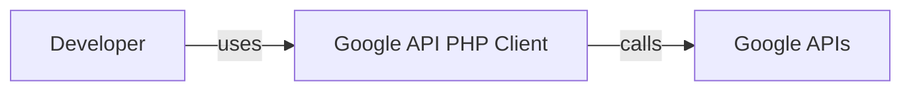
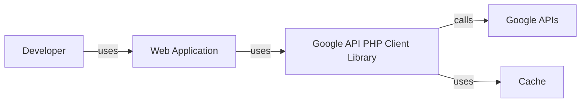
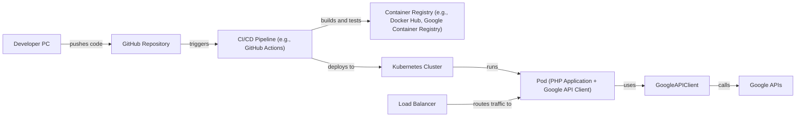
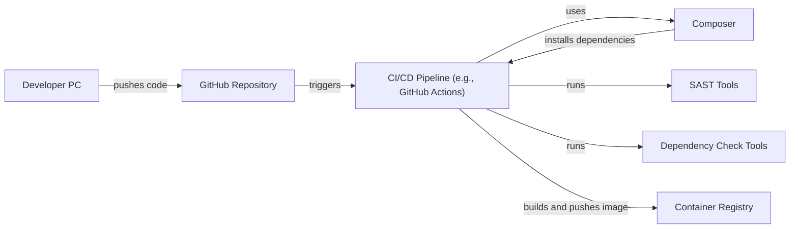

Okay, let's create a design document for the Google API PHP Client library.

# BUSINESS POSTURE

Business Priorities and Goals:

*   Enable PHP developers to easily access and integrate with Google services (e.g., Drive, YouTube, Calendar, etc.).
*   Provide a consistent and reliable interface for interacting with Google APIs.
*   Reduce the complexity of authentication, authorization, and request/response handling for developers.
*   Maintain compatibility with a wide range of PHP versions and environments.
*   Offer comprehensive documentation and support to facilitate adoption.
*   Provide open source library that can be used by anyone.
*   Library should be easy to install and use.

Business Risks:

*   Exposure of sensitive data (API keys, user data) due to improper usage or vulnerabilities in the library.
*   Service disruption or degradation due to bugs or inefficiencies in the library.
*   Compatibility issues with different PHP versions or server configurations.
*   Reputational damage due to security breaches or poor performance.
*   Legal and compliance risks related to data privacy and usage of Google services.
*   Lack of adoption due to complexity or poor documentation.
*   Vulnerabilities in dependencies.

# SECURITY POSTURE

Existing Security Controls:

*   security control: OAuth 2.0 for authentication and authorization (described in library documentation and examples).
*   security control: API key support for simpler APIs (described in library documentation).
*   security control: HTTPS for all communication with Google APIs (enforced by the library).
*   security control: Input validation for API parameters (partially implemented within the library, but relies on developers to provide valid data).
*   security control: Code reviews and static analysis during development (implied by Google's development practices).
*   security control: Dependency management using Composer (specified in `composer.json`).
*   security control: Regular updates and security patches (managed by Google and the open-source community).

Accepted Risks:

*   accepted risk: Reliance on developers to securely store and manage API keys and OAuth 2.0 credentials.
*   accepted risk: Potential for vulnerabilities in third-party dependencies (managed through Composer).
*   accepted risk: Limited control over the security of the underlying Google APIs.
*   accepted risk: Possibility of backward-incompatible changes due to updates in Google APIs.

Recommended Security Controls:

*   Implement more robust input validation and sanitization within the library to prevent common injection vulnerabilities.
*   Provide clear guidance and examples for secure credential management, including best practices for storing API keys and OAuth tokens.
*   Integrate automated security testing (e.g., SAST, DAST) into the build process.
*   Conduct regular security audits and penetration testing.
*   Implement a vulnerability disclosure program to encourage responsible reporting of security issues.
*   Provide support for more secure authentication methods, such as service accounts with workload identity federation.

Security Requirements:

*   Authentication:
    *   Support OAuth 2.0 for user authentication and authorization.
    *   Support API keys for simple API access.
    *   Provide mechanisms for securely storing and managing credentials.
    *   Support service accounts and workload identity federation.
*   Authorization:
    *   Enforce access control based on user roles and permissions.
    *   Implement granular authorization checks for specific API resources and actions.
*   Input Validation:
    *   Validate all input parameters to prevent injection vulnerabilities.
    *   Sanitize data to remove potentially harmful characters.
    *   Enforce data type and format restrictions.
*   Cryptography:
    *   Use HTTPS for all communication with Google APIs.
    *   Employ secure cryptographic algorithms and protocols.
    *   Protect sensitive data at rest and in transit.

# DESIGN

## C4 CONTEXT

Element Descriptions:

*   Element:
    *   Name: Developer
    *   Type: Person
    *   Description: A PHP developer who uses the Google API PHP Client library to interact with Google services.
    *   Responsibilities:
        *   Integrates the library into their PHP applications.
        *   Provides valid API keys or OAuth 2.0 credentials.
        *   Handles API responses and errors.
        *   Implements business logic.
    *   Security controls:
        *   Securely stores and manages API keys and OAuth credentials.
        *   Follows secure coding practices.

*   Element:
    *   Name: Google API PHP Client
    *   Type: Software System
    *   Description: A PHP library that provides a convenient interface for accessing Google APIs.
    *   Responsibilities:
        *   Handles authentication and authorization with Google services.
        *   Provides methods for making API requests.
        *   Parses API responses.
        *   Manages errors and exceptions.
    *   Security controls:
        *   Uses OAuth 2.0 and API keys for authentication.
        *   Enforces HTTPS for all communication.
        *   Performs input validation (partially).

*   Element:
    *   Name: Google APIs
    *   Type: Software System
    *   Description: A collection of web services provided by Google (e.g., Drive, YouTube, Calendar).
    *   Responsibilities:
        *   Provides various functionalities and data access to authorized users.
        *   Enforces access control and security policies.
    *   Security controls:
        *   Implements robust security measures, including authentication, authorization, and data protection.

## C4 CONTAINER

Element Descriptions:

*   Element:
    *   Name: Developer
    *   Type: Person
    *   Description: A PHP developer who uses the Google API PHP Client library to interact with Google services.
    *   Responsibilities:
        *   Integrates the library into their PHP applications.
        *   Provides valid API keys or OAuth 2.0 credentials.
        *   Handles API responses and errors.
        *   Implements business logic.
    *   Security controls:
        *   Securely stores and manages API keys and OAuth credentials.
        *   Follows secure coding practices.

*   Element:
    *   Name: Web Application
    *   Type: Container
    *   Description: Application that is using Google API PHP Client.
    *   Responsibilities:
        *   Provide business logic.
        *   Use Google API PHP Client to access Google APIs.
    *   Security controls:
        *   Follows secure coding practices.

*   Element:
    *   Name: Google API PHP Client Library
    *   Type: Container
    *   Description: A PHP library that provides a convenient interface for accessing Google APIs.
    *   Responsibilities:
        *   Handles authentication and authorization with Google services.
        *   Provides methods for making API requests.
        *   Parses API responses.
        *   Manages errors and exceptions.
    *   Security controls:
        *   Uses OAuth 2.0 and API keys for authentication.
        *   Enforces HTTPS for all communication.
        *   Performs input validation (partially).

*   Element:
    *   Name: Google APIs
    *   Type: Software System
    *   Description: A collection of web services provided by Google (e.g., Drive, YouTube, Calendar).
    *   Responsibilities:
        *   Provides various functionalities and data access to authorized users.
        *   Enforces access control and security policies.
    *   Security controls:
        *   Implements robust security measures, including authentication, authorization, and data protection.

*   Element:
    *   Name: Cache
    *   Type: Container
    *   Description: A cache (e.g., file system, memory) used to store API responses and tokens.
    *   Responsibilities:
        *   Stores API responses and tokens to improve performance and reduce API calls.
    *   Security controls:
        *   Protects cached data from unauthorized access.
        *   Uses appropriate cache expiration policies.

## DEPLOYMENT

Deployment Solutions:

1.  Standalone PHP Application: The library is included in a PHP application running on a single server or a cluster of servers behind a load balancer.
2.  Cloud-Based PHP Application (e.g., Google App Engine, AWS Elastic Beanstalk, Azure App Service): The library is deployed as part of a PHP application running on a cloud platform.
3.  Containerized PHP Application (e.g., Docker, Kubernetes): The library is packaged within a Docker container and deployed to a container orchestration platform.

Chosen Solution (Containerized PHP Application with Kubernetes):

Element Descriptions:

*   Element:
    *   Name: Developer PC
    *   Type: Node
    *   Description: The developer's workstation where code is written and tested.
    *   Responsibilities:
        *   Code development and testing.
    *   Security controls:
        *   Secure development environment.

*   Element:
    *   Name: GitHub Repository
    *   Type: Node
    *   Description: The source code repository for the PHP application and the Google API PHP Client library.
    *   Responsibilities:
        *   Version control and code storage.
    *   Security controls:
        *   Access control and code review policies.

*   Element:
    *   Name: CI/CD Pipeline (e.g., GitHub Actions)
    *   Type: Node
    *   Description: The automated build and deployment pipeline.
    *   Responsibilities:
        *   Builds the Docker image.
        *   Runs tests.
        *   Deploys the application to Kubernetes.
    *   Security controls:
        *   Secure build environment.
        *   Automated security testing.

*   Element:
    *   Name: Container Registry (e.g., Docker Hub, Google Container Registry)
    *   Type: Node
    *   Description: The registry where the Docker image is stored.
    *   Responsibilities:
        *   Stores and manages Docker images.
    *   Security controls:
        *   Access control and image scanning.

*   Element:
    *   Name: Kubernetes Cluster
    *   Type: Node
    *   Description: The container orchestration platform.
    *   Responsibilities:
        *   Manages and scales the application containers.
    *   Security controls:
        *   Network policies and access control.

*   Element:
    *   Name: Load Balancer
    *   Type: Node
    *   Description: Distributes traffic across multiple instances of the application.
    *   Responsibilities:
        *   Load balancing and traffic management.
    *   Security controls:
        *   SSL termination and DDoS protection.

*   Element:
    *   Name: Pod (PHP Application + Google API Client)
    *   Type: Node
    *   Description: A running instance of the PHP application and the Google API PHP Client library.
    *   Responsibilities:
        *   Executes the application logic.
        *   Communicates with Google APIs.
    *   Security controls:
        *   Secure container configuration.
        *   Network isolation.

*   Element:
    *   Name: Google APIs
    *   Type: Software System
    *   Description: A collection of web services provided by Google (e.g., Drive, YouTube, Calendar).
    *   Responsibilities:
        *   Provides various functionalities and data access to authorized users.
        *   Enforces access control and security policies.
    *   Security controls:
        *   Implements robust security measures, including authentication, authorization, and data protection.

## BUILD

Build Process Description:

1.  Developer pushes code changes to the GitHub repository.
2.  GitHub triggers the CI/CD pipeline (e.g., GitHub Actions).
3.  The CI pipeline uses Composer to install project dependencies.
4.  The CI pipeline runs SAST tools (e.g., PHPStan, Psalm) to identify potential code vulnerabilities.
5.  The CI pipeline runs dependency check tools (e.g., Composer audit, Snyk) to identify known vulnerabilities in dependencies.
6.  If all checks pass, the CI pipeline builds the Docker image and pushes it to the container registry.

Security Controls:

*   security control: Dependency management with Composer: `composer.json` and `composer.lock` ensure consistent and reproducible builds.
*   security control: SAST tools: Identify potential code vulnerabilities before deployment.
*   security control: Dependency check tools: Identify known vulnerabilities in dependencies.
*   security control: Secure build environment: The CI/CD pipeline runs in a secure and isolated environment.
*   security control: Image scanning: The container registry scans images for vulnerabilities.

# RISK ASSESSMENT

Critical Business Processes:

*   Accessing and managing user data through Google services.
*   Providing a reliable and secure platform for developers to integrate with Google APIs.

Data Sensitivity:

*   API keys: Highly sensitive. Compromise can lead to unauthorized access to Google services and data.
*   OAuth 2.0 tokens: Highly sensitive. Compromise can lead to unauthorized access to user data.
*   User data accessed through Google APIs: Varies in sensitivity depending on the specific API and data. Can range from public information to highly confidential data.

# QUESTIONS & ASSUMPTIONS

Questions:

*   What specific PHP versions and environments need to be supported?
*   What are the expected usage patterns and traffic volume?
*   Are there any specific compliance requirements (e.g., GDPR, HIPAA)?
*   What is the preferred caching mechanism?
*   What level of logging and monitoring is required?

Assumptions:

*   BUSINESS POSTURE: The primary goal is to provide a secure and reliable library for accessing Google APIs.
*   SECURITY POSTURE: Developers are responsible for securely managing their credentials.
*   DESIGN: The library will be used primarily in web applications.
*   DESIGN: A containerized deployment model is preferred.
*   DESIGN: Composer is used for dependency management.
*   DESIGN: Build process is automated using CI/CD.