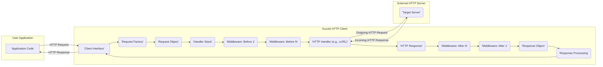

# Project Design Document: Guzzle HTTP Client

**Version:** 1.1
**Date:** October 26, 2023
**Author:** AI Software Architect

## 1. Introduction

This document provides an enhanced design overview of the Guzzle HTTP client library (referenced from [https://github.com/guzzle/guzzle](https://github.com/guzzle/guzzle)). Building upon the previous version, this document offers more granular details and clarifies potential security considerations for threat modeling purposes. It outlines the key components, data flow, and architectural considerations of the library with a stronger focus on security implications.

## 2. Project Overview

Guzzle remains a powerful PHP HTTP client library designed to simplify the process of sending HTTP requests and interacting with web services. It offers a fluent interface for constructing and dispatching requests, managing responses, and handling various HTTP features like cookies, redirects, and authentication. The core objective is to abstract the complexities of low-level HTTP communication, enabling developers to efficiently integrate with APIs and web resources. This version emphasizes the extensibility through middleware and the potential security ramifications of this architecture.

## 3. Architectural Diagram

## 4. Key Components

*   **Client Interface:** The primary point of interaction for users. It provides methods for initiating HTTP requests (e.g., `get()`, `post()`, `request()`). This component is responsible for orchestrating the request lifecycle.
*   **Request Factory:**  Responsible for instantiating `Request` objects. It takes parameters like URI, method, headers, and body and creates an immutable request representation.
*   **Request Object:** An immutable representation of an outgoing HTTP request. It encapsulates all the necessary information to send a request, ensuring data integrity during the request lifecycle.
*   **Handler Stack:** A LIFO (Last-In, First-Out) stack of middleware functions. This is a central concept in Guzzle's architecture, allowing for request and response modification.
    *   **Middleware (Before):** Middleware that operates on the request *before* it is sent to the HTTP handler. Examples include adding authentication headers, logging requests, or modifying request bodies.
    *   **HTTP Handler:** The concrete implementation responsible for sending the HTTP request over the network. This is often a wrapper around PHP's cURL extension or the `stream_socket_client` function. The choice of handler can impact performance and available features.
    *   **Middleware (After):** Middleware that operates on the response *after* it is received from the HTTP handler. Examples include handling redirects, managing cookies, or parsing response bodies.
*   **HTTP Handler (Implementation):** The actual mechanism for sending the HTTP request. Common implementations include:
    *   **cURL Handler:** Utilizes the `curl` PHP extension for making HTTP requests. Offers a wide range of features and is generally the recommended handler.
    *   **Stream Handler:** Uses PHP's built-in stream functions for making HTTP requests. May have limitations compared to the cURL handler.
    *   **Mock Handler:**  Used for testing purposes, allowing developers to simulate HTTP responses without making actual network requests.
*   **Response Object:** Represents the HTTP response received from the server. It contains the status code, headers (as a collection), and the response body (as a stream).
*   **Response Processing:** Logic, often within middleware or the application code, that interprets and manipulates the `Response` object. This might involve parsing JSON, XML, or other data formats.

## 5. Data Flow

The data flow within Guzzle follows a structured path, with middleware playing a crucial role in intercepting and modifying requests and responses:

1. The **User Application** initiates an HTTP request through the **Client Interface**.
2. The **Request Factory** creates an immutable **Request Object**.
3. The **Request Object** is passed to the **Handler Stack**.
4. **Middleware (Before)** in the stack processes the request in the order they were added. Each middleware can modify the request or short-circuit the process.
5. The request reaches the **HTTP Handler**.
6. The **HTTP Handler** sends the **Outgoing HTTP Request** to the **Target Server**.
7. The **Target Server** sends an **Incoming HTTP Response** back to the **HTTP Handler**.
8. The **HTTP Handler** creates a **Response Object**.
9. The **Response Object** is passed back through the **Handler Stack**.
10. **Middleware (After)** processes the response in the *reverse* order they were added (LIFO). Each middleware can modify the response or throw exceptions.
11. The final **Response Object** is returned to the **Client Interface**.
12. The **Client Interface** returns the **HTTP Response** to the **User Application**.

## 6. Security Considerations (Detailed for Threat Modeling)

*   **Server-Side Vulnerabilities Exploitation:** Guzzle's primary function is to interact with external servers. If these servers have vulnerabilities (e.g., SQL injection, command injection), Guzzle could be used as a conduit to exploit them if request parameters are not properly handled by the application.
    *   **Mitigation:**  Application-level input validation and sanitization before passing data to Guzzle.
*   **Man-in-the-Middle (MITM) Attacks:** Communication with the target server can be intercepted if HTTPS is not used or if SSL/TLS verification is disabled or improperly configured.
    *   **Mitigation:** Enforce HTTPS, ensure proper SSL certificate validation (using Guzzle's `verify` option), and consider using certificate pinning for critical connections.
*   **Data Injection through Request Parameters/Headers:**  If user-supplied data is directly used in request parameters or headers without proper encoding, it could lead to vulnerabilities on the target server (e.g., HTTP header injection).
    *   **Mitigation:**  Properly encode data based on the context (e.g., URL encoding for query parameters, escaping for headers). Utilize Guzzle's features for setting headers and query parameters safely.
*   **Denial of Service (DoS) Attacks:** An attacker could potentially use Guzzle to send a large number of requests to a target server, causing a denial of service.
    *   **Mitigation:** Implement rate limiting and request throttling within the application using Guzzle. Configure appropriate timeouts to prevent indefinite waiting for responses.
*   **Sensitive Data Exposure in Logs/Debugging:** Accidental logging or inclusion of sensitive data (e.g., API keys, authentication tokens) in request or response bodies or headers during development or in production logs.
    *   **Mitigation:** Implement careful logging practices, sanitize sensitive data before logging, and avoid logging request/response bodies in production unless absolutely necessary and with proper redaction.
*   **Dependency Vulnerabilities:** Vulnerabilities in Guzzle's own dependencies could introduce security risks.
    *   **Mitigation:** Regularly update Guzzle and its dependencies to the latest stable versions. Use tools like `composer audit` to identify known vulnerabilities.
*   **Middleware Security Risks:** Custom or third-party middleware could introduce vulnerabilities if not developed with security in mind (e.g., insecure data handling, bypass of security checks).
    *   **Mitigation:** Thoroughly review and vet any custom or third-party middleware. Follow secure coding practices when developing middleware.
*   **Configuration Issues Leading to Security Weaknesses:** Incorrectly configured options, such as disabling SSL verification or setting overly permissive timeouts, can create security vulnerabilities.
    *   **Mitigation:** Follow security best practices when configuring Guzzle. Ensure SSL verification is enabled in production environments. Set appropriate timeouts to prevent resource exhaustion.
*   **Cookie Security Issues:** Improper handling of cookies, such as not setting the `Secure` or `HttpOnly` flags, can lead to session hijacking or cross-site scripting (XSS) vulnerabilities.
    *   **Mitigation:**  Ensure that cookies are handled securely, especially when dealing with authentication. Utilize Guzzle's cookie management features appropriately.
*   **Redirect Handling Vulnerabilities:**  Improperly handling redirects could lead to open redirect vulnerabilities, where an attacker can trick a user into visiting a malicious site.
    *   **Mitigation:** Be cautious when following redirects, especially those initiated by user-controlled data. Guzzle's redirect middleware can be configured to limit the number of redirects.

## 7. Technology Stack

*   **Programming Language:** PHP
*   **HTTP Handling Abstraction:** Provides an abstraction layer over PHP's built-in HTTP handling capabilities.
*   **Core HTTP Handling:** Typically leverages the `curl` PHP extension for robust HTTP communication. Can also use PHP streams as a fallback.
*   **PSR Compliance:** Adheres to various PHP Standards Recommendations (PSRs), including:
    *   **PSR-7:** HTTP message interfaces (Request and Response objects).
    *   **PSR-18:** HTTP client interface.
    *   **PSR-17:** HTTP factories.
*   **Dependency Management:** Uses Composer for managing dependencies.

## 8. Deployment Model

Guzzle is deployed as a library within PHP applications. It is included as a dependency using Composer and integrated directly into the application's codebase. The security of Guzzle in a deployed environment is heavily influenced by the security of the surrounding application and the server environment.

## 9. Assumptions and Constraints

*   This document focuses on the design and architecture of the Guzzle library itself.
*   It assumes a basic understanding of HTTP and web security principles.
*   The threat modeling process will build upon this document to identify specific attack vectors and mitigation strategies.
*   The security of the underlying PHP environment and server infrastructure is considered outside the direct scope of this document, although their interaction with Guzzle is acknowledged.
*   The specific use cases and configurations of Guzzle within individual applications will influence the actual security risks.

## 10. Future Considerations

*   Detailed security analysis of specific built-in middleware components.
*   Investigation of error handling mechanisms and their potential security implications (e.g., information disclosure).
*   Review of Guzzle's configuration options and providing more specific security recommendations.
*   Continuous monitoring of Guzzle's dependencies for known vulnerabilities.
*   Further exploration of advanced security features like request signing and encryption.
