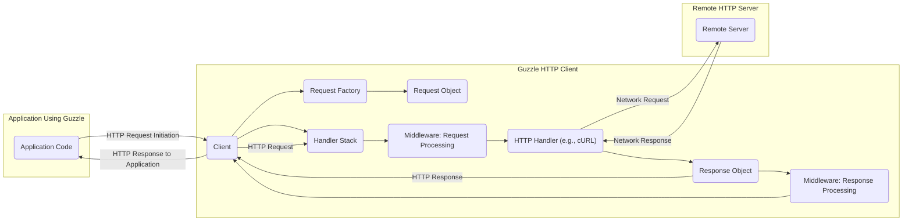
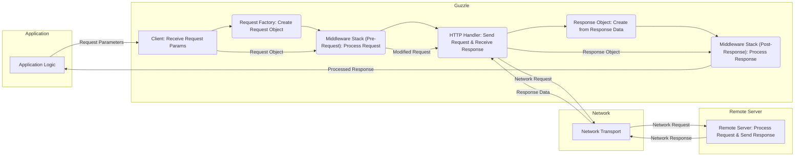

# Project Design Document: Guzzle HTTP Client

**Version:** 1.1
**Date:** October 26, 2023
**Author:** AI Software Architect

## 1. Introduction

This document provides a detailed architectural design of the Guzzle HTTP client library. It outlines the key components, data flow, and external dependencies of the library. This document is intended to serve as a comprehensive foundation for subsequent threat modeling activities, enabling a thorough analysis of potential security vulnerabilities.

## 2. Goals and Objectives

*   Provide a clear, detailed, and accurate overview of the Guzzle library's architecture.
*   Identify and describe the functionality of key components and their interactions, with a focus on data handling and security implications.
*   Illustrate the flow of data within the library, highlighting transformation points and potential areas of concern.
*   Detail external dependencies and integration points, as these represent potential attack surfaces.
*   Serve as a robust and informative basis for identifying potential security vulnerabilities, attack vectors, and mitigation strategies during threat modeling sessions.

## 3. System Architecture

Guzzle is a PHP HTTP client designed for ease of use and extensibility when interacting with web services. Its architecture leverages a middleware system to provide flexibility and customization.

**Key Architectural Elements:**

*   **Client:** The primary interface for initiating HTTP requests. It manages configuration settings, the handler stack, and the overall request execution process.
    *   Responsible for accepting request parameters from the application.
    *   Configures and orchestrates the handler stack.
    *   Returns the final `Response` object to the application.
*   **Request Factory:**  Responsible for creating immutable `Request` objects based on the provided request parameters (URI, method, headers, body).
    *   Ensures the creation of well-formed HTTP request objects.
    *   Abstracts the details of request object instantiation.
*   **Request Object:**  A representation of an outgoing HTTP request, adhering to PSR-7 standards. It encapsulates all the necessary information for an HTTP request.
    *   Contains the target URI, HTTP method, request headers, and request body.
    *   Provides methods for accessing and inspecting request attributes.
*   **Handler Stack:** A LIFO (Last-In, First-Out) queue of callable middleware functions that intercept and process both requests and responses. This allows for adding cross-cutting concerns and modifying the request/response cycle.
    *   Manages the order in which middleware is executed.
    *   Provides a central point for extending and customizing Guzzle's behavior.
*   **Middleware:** Individual, self-contained functions within the handler stack. They operate on the request before it is sent to the handler and on the response after it is received.
    *   Examples include adding default headers, logging requests, handling redirects, retrying failed requests, and authentication.
    *   Can modify the `Request` object before it's sent.
    *   Can process the `Response` object before it's returned to the client.
*   **HTTP Handler:** The concrete implementation responsible for sending the HTTP request over the network and receiving the response. Guzzle uses an adapter pattern, allowing different handlers to be used.
    *   The most common handler is the `CurlHandler`, which utilizes the PHP cURL extension.
    *   Other handlers might include stream-based handlers for non-blocking operations.
*   **Response Object:** A representation of the HTTP response received from the remote server, adhering to PSR-7 standards.
    *   Contains the HTTP status code, response headers, and response body.
    *   Provides methods for accessing and inspecting response attributes.

## 4. Data Flow

The data flow within Guzzle can be broken down into the following stages:

*   **Request Initiation:** The application code initiates an HTTP request by calling a method on the Guzzle `Client`, providing request parameters (URI, method, headers, body).
*   **Request Creation:** The `Client` utilizes the `Request Factory` to instantiate a `Request` object based on the provided parameters. This object encapsulates the initial request data.
*   **Pre-Request Middleware Processing:** The `Request` object is passed through the `Handler Stack`. Each middleware in the stack, in the defined order, has the opportunity to inspect and modify the `Request` object. This might involve adding headers, modifying the URI, or altering the request body.
*   **Network Transmission:** The modified `Request` object is passed to the configured `HTTP Handler`. The handler is responsible for the actual network communication, sending the request to the remote server.
*   **Response Reception:** The `HTTP Handler` receives the HTTP response from the remote server.
*   **Response Object Creation:** The `HTTP Handler` creates a `Response` object, encapsulating the status code, headers, and body of the received response.
*   **Post-Response Middleware Processing:** The `Response` object is passed back through the `Handler Stack` in reverse order. Each middleware has the opportunity to inspect and process the `Response` object. This might involve logging the response, handling errors, or modifying the response body.
*   **Response Delivery:** The processed `Response` object is returned by the `Client` to the application code.

## 5. Key Components

*   **`GuzzleHttp\Client`:** The primary interaction point for users.
    *   **Input:** Request parameters (URI, method, headers, body, options).
    *   **Output:** `Response` object.
    *   **Functionality:**  Orchestrates the request lifecycle, manages configuration, and interacts with the handler stack.
*   **`GuzzleHttp\Psr7\Request`:** Represents an outgoing HTTP request.
    *   **Input:** URI, method, headers, body (as streams or strings).
    *   **Output:** Immutable request object.
    *   **Functionality:** Encapsulates all request-related data. Implements PSR-7 `RequestInterface`.
*   **`GuzzleHttp\Psr7\Response`:** Represents an incoming HTTP response.
    *   **Input:** Status code, headers, body (as a stream).
    *   **Output:** Immutable response object.
    *   **Functionality:** Encapsulates all response-related data. Implements PSR-7 `ResponseInterface`.
*   **`GuzzleHttp\HandlerStack`:** Manages the middleware pipeline.
    *   **Input:** Callable middleware functions.
    *   **Output:**  Processed request and response.
    *   **Functionality:**  Adds, removes, and executes middleware in a defined order.
*   **Middleware Functions (within `GuzzleHttp\Middleware` namespace or custom):** Intercept and modify requests and responses.
    *   **Input:**  A `callable` that receives the next handler and client options. Returns a `callable` that accepts a `RequestInterface` and an array of options.
    *   **Output:** Potentially modified `RequestInterface` or `ResponseInterface`.
    *   **Functionality:** Implements specific logic for request/response manipulation (e.g., redirects, retries, authentication).
*   **HTTP Handlers (e.g., `GuzzleHttp\Handler\CurlHandler`, `GuzzleHttp\Handler\StreamHandler`):** Responsible for the actual network transmission.
    *   **Input:** `RequestInterface` object and request options.
    *   **Output:** `ResponseInterface` object.
    *   **Functionality:** Sends the HTTP request over the network and receives the response. Abstracts the underlying network communication mechanism.

## 6. External Dependencies

Guzzle relies on the following external components and libraries:

*   **PHP:** The core runtime environment.
*   **PSR-7 (HTTP Message Interfaces):** Defines interfaces for HTTP request and response messages, ensuring interoperability.
*   **PSR-18 (HTTP Client Interface):** Defines an interface for sending HTTP requests, which Guzzle implements.
*   **PSR-17 (HTTP Factories):** Defines interfaces for creating PSR-7 objects.
*   **cURL Extension (Optional but Common):** Used by the `CurlHandler` for performing HTTP requests. This, in turn, depends on system-level libraries.
    *   **OpenSSL/LibreSSL/BoringSSL:**  Underlying TLS/SSL libraries used by cURL for secure HTTPS connections.
    *   **zlib:** Used by cURL for handling compressed content.
*   **Stream Functions (Built-in PHP):** Used by the `StreamHandler` for basic HTTP requests.
*   **Other Potential Dependencies:** Specific middleware implementations might introduce additional dependencies (e.g., a logging middleware might depend on a logging library like Monolog).

## 7. Security Considerations

This section highlights potential security considerations based on the architecture, which will be the focus of detailed analysis during threat modeling.

*   **TLS/SSL Configuration Vulnerabilities:** Misconfiguration of TLS/SSL settings (e.g., insecure protocol versions, weak ciphers, lack of certificate verification) can lead to man-in-the-middle attacks. This is primarily relevant to the underlying cURL handler and its dependencies.
*   **Server-Side Request Forgery (SSRF):** If the application using Guzzle allows user-controlled input to influence the target URI, it could be exploited to make requests to internal or unintended external resources.
*   **Header Injection:** If untrusted data is directly used to set HTTP headers, it could lead to header injection vulnerabilities, potentially allowing attackers to manipulate the server's behavior or inject malicious content.
*   **Cookie Handling Issues:** Improper handling of cookies (e.g., not setting `HttpOnly` or `Secure` flags, leaking cookies) can lead to session hijacking or other cookie-related attacks.
*   **Redirection Vulnerabilities:** Unvalidated or open redirects can be exploited to redirect users to malicious sites after an interaction with the legitimate application. Middleware handling redirects needs careful scrutiny.
*   **Exposure of Sensitive Data:** Errors or logging within middleware could inadvertently expose sensitive information (e.g., API keys, authentication tokens) if not handled securely.
*   **Dependency Chain Vulnerabilities:** Vulnerabilities in Guzzle's dependencies (especially cURL and its underlying SSL libraries) can directly impact the security of applications using Guzzle. Regular updates are crucial.
*   **Middleware Security Flaws:** Custom or third-party middleware might contain security vulnerabilities if not developed with security best practices in mind.
*   **Request Smuggling:** While less common with client-side libraries, incorrect handling of chunked transfer encoding or connection management could potentially lead to request smuggling if the remote server has vulnerabilities.
*   **Denial of Service (DoS):**  Uncontrolled request timeouts or retry mechanisms in middleware could potentially be exploited to cause a denial of service on the application itself or target servers.

## 8. Assumptions and Limitations

*   This document provides a general architectural overview of Guzzle. Specific implementations and configurations within an application might introduce variations.
*   The security considerations listed are not exhaustive but highlight key areas of concern based on the architecture.
*   The threat modeling process will delve deeper into specific attack vectors and potential mitigations.
*   This document assumes a basic understanding of HTTP and web security principles.

This detailed design document provides a solid foundation for conducting a thorough threat model of the Guzzle HTTP client library, enabling the identification and mitigation of potential security risks.
