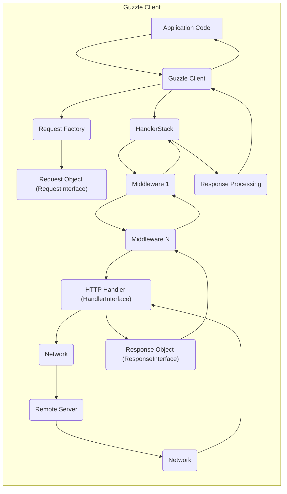

# Project Design Document: Guzzle HTTP Client

**Version:** 1.1
**Date:** October 26, 2023
**Author:** AI Software Architect

## 1. Introduction

This document provides an enhanced design overview of the Guzzle HTTP client library. It details the key components, data flow, and interactions within the library, with a specific focus on aspects relevant to security and threat modeling. This document serves as a foundation for understanding Guzzle's architecture and will be used as input for subsequent threat modeling activities.

## 2. Goals and Objectives

The primary goals of Guzzle are to:

* Provide a developer-friendly and expressive interface for making HTTP requests.
* Abstract the complexities of the HTTP protocol, including connection management and data handling.
* Offer a highly flexible and extensible architecture through the use of middleware.
* Support a wide range of HTTP features, such as various request methods (GET, POST, PUT, DELETE, etc.), custom headers, different body formats (JSON, XML, form data), and redirects.
* Efficiently handle HTTP responses, providing easy access to status codes, headers, and the response body.
* Facilitate seamless integration with other PHP libraries and frameworks through its well-defined interfaces.

## 3. System Architecture

Guzzle's architecture is designed around a central `Client` object responsible for managing and dispatching HTTP requests. The middleware system is a core architectural element, enabling request and response manipulation at various stages of the request lifecycle.

### 3.1. Key Components

* **`Client`:** The primary interface for interacting with Guzzle. It holds configuration settings (e.g., base URI, timeouts, default headers) and manages the `HandlerStack`.
* **`RequestInterface`:** An interface representing an outgoing HTTP request. Concrete implementations like `Request` encapsulate the URI, method, headers (using `HeadersInterface`), and body (using `StreamInterface`).
* **`ResponseInterface`:** An interface representing an HTTP response received from the server. Concrete implementations like `Response` provide access to the status code, reason phrase, headers (`HeadersInterface`), and body (`StreamInterface`).
* **`UriInterface`:** An interface representing a Uniform Resource Identifier (URI) as defined by RFC 3986. Concrete implementations handle URI parsing and manipulation.
* **`StreamInterface`:** An interface representing the body of an HTTP request or response. Concrete implementations allow for efficient handling of data, including streaming from files or in-memory data.
* **`HeadersInterface`:** An interface representing a collection of HTTP headers. Concrete implementations provide methods for accessing, adding, and modifying headers.
* **`HandlerInterface`:** An interface defining the contract for sending HTTP requests over the network. Concrete implementations include the `CurlHandler` (using the cURL extension) and the `StreamHandler` (using PHP's stream functions). Custom handlers can also be implemented.
* **`HandlerStack`:** A LIFO (Last-In, First-Out) stack of middleware functions. Each middleware in the stack is a callable that receives the next middleware in the chain and returns a new callable that wraps the next. This allows for request and response processing in a layered manner.
* **`Middleware`:** Individual, stateless functions within the `HandlerStack`. Middleware can inspect and modify requests before they are sent and responses after they are received. Common examples include retry logic, authentication handlers, logging, and error handling.
* **`RequestOptions`:** An array of options passed to the `Client`'s `request()` method to configure specific aspects of a request, such as timeouts, headers, body, and SSL verification settings.

### 3.2. Architectural Diagram

### 3.3. Data Flow

The typical lifecycle of an HTTP request within Guzzle involves the following steps:

* **Request Creation:** The application code initiates the process by creating a `Client` instance. Subsequently, a `RequestInterface` object is created, either directly or using a `RequestFactory`, specifying the HTTP method, `UriInterface`, `HeadersInterface`, and `StreamInterface` for the request body.
* **Middleware Processing (Outbound):** The `Client`'s `send()` method (or a convenience method like `get()`, `post()`) triggers the processing of the request through the `HandlerStack`. Each middleware in the stack is invoked in the order they were added. Middleware can inspect and modify the `RequestInterface` before it reaches the handler. This might involve adding authentication headers, logging the request, or implementing retry logic.
* **Handler Invocation:** The final middleware in the stack typically invokes the configured `HandlerInterface` (e.g., `CurlHandler`). The handler is responsible for the actual network transmission of the HTTP request.
* **Network Transmission:** The `HandlerInterface` utilizes underlying PHP extensions (like `curl`) or stream functions to send the request over the network to the remote server. This involves establishing a connection, sending headers and the request body.
* **Response Reception:** The remote server processes the request and sends back an HTTP response. The `HandlerInterface` receives the raw response data from the network.
* **Response Object Creation:** The `HandlerInterface` creates a `ResponseInterface` object, populating it with the received status code, headers, and the response body (as a `StreamInterface`).
* **Middleware Processing (Inbound):** The `ResponseInterface` is then passed back through the `HandlerStack`, but this time the middleware is invoked in the reverse order of their addition. Middleware can inspect and modify the `ResponseInterface`. This might involve logging the response, handling errors, or deserializing the response body.
* **Response Return:** The `Client` returns the processed `ResponseInterface` object to the application code.
* **Response Consumption:** The application code can then access the response's status code, headers, and body to perform further actions.

## 4. Key Interactions

Guzzle interacts with several external components and internal interfaces:

* **Remote HTTP Servers:** The core interaction involves sending requests to and receiving responses from remote servers over the network (typically TCP/IP), potentially secured by TLS/SSL.
* **Operating System:** Guzzle relies on the OS for fundamental network operations, including DNS resolution, socket creation, and management of network connections.
* **PHP Extensions (e.g., cURL, OpenSSL):** Guzzle leverages PHP extensions like `curl` for robust HTTP handling and `openssl` for cryptographic operations related to TLS/SSL. The specific extensions used can be configured.
* **File System:** Guzzle interacts with the file system for operations such as uploading files as part of a request body or streaming response bodies to local files.
* **Application Code:** The application using Guzzle provides the request parameters (URI, headers, body) and consumes the response data. The application also configures the `Client` and its middleware stack.
* **PSR-7 Interfaces:** Guzzle implements the PSR-7 HTTP message interfaces (`RequestInterface`, `ResponseInterface`, `UriInterface`, `StreamInterface`, `HeadersInterface`), promoting interoperability with other PHP libraries that adhere to these standards.

## 5. Security Considerations

Security is a critical aspect of using any HTTP client library. Here are key security considerations related to Guzzle:

* **TLS/SSL Configuration:** Guzzle relies on the underlying PHP installation and potentially the cURL library for TLS/SSL implementation. Proper configuration is crucial, including:
    * **Certificate Verification:** Ensuring that the `verify` option is enabled and that a valid CA bundle is used to verify the server's certificate, preventing man-in-the-middle attacks.
    * **Protocol Selection:** Configuring the allowed TLS protocols and cipher suites to use strong and secure options.
    * **Hostname Verification:** Ensuring that the hostname in the server's certificate matches the requested hostname.
* **Input Sanitization and Validation:** While Guzzle doesn't perform extensive input validation on URIs or headers provided by the user, it's the **application's responsibility** to sanitize and validate all input data before using it with Guzzle to prevent injection attacks (e.g., header injection, URL manipulation).
* **Output Encoding:** Guzzle provides access to the raw response body. The **application is responsible** for properly encoding and sanitizing the output before displaying it to users to prevent cross-site scripting (XSS) vulnerabilities.
* **Error Handling and Information Disclosure:**  Carefully handle exceptions and errors thrown by Guzzle. Avoid displaying sensitive information in error messages that could be exposed to unauthorized users.
* **Dependency Management:** Guzzle depends on other PHP packages. Regularly update Guzzle and its dependencies to patch any known security vulnerabilities in those packages. Use tools like Composer to manage dependencies securely.
* **Middleware Security:** Custom middleware can introduce security vulnerabilities if not implemented carefully.
    * **Authentication Middleware:** Ensure authentication middleware securely handles credentials and tokens, avoiding storage in logs or insecure locations.
    * **Authorization Middleware:** Implement proper authorization checks to ensure users only access resources they are permitted to.
    * **Logging Middleware:** Be cautious about logging sensitive information (e.g., API keys, passwords) in request or response data.
* **HTTP Handler Vulnerabilities:** The underlying HTTP handler (e.g., cURL) might have its own vulnerabilities. Keep the PHP installation and its extensions updated to benefit from security patches.
* **Cookie Security:** Guzzle handles cookies according to HTTP standards. Applications need to be aware of the security implications of cookie usage:
    * **`HttpOnly` and `Secure` flags:** Ensure these flags are set appropriately for session cookies and other sensitive cookies.
    * **Cross-Site Request Forgery (CSRF):** Implement CSRF protection mechanisms in the application, as Guzzle itself doesn't provide built-in CSRF protection.
* **Proxy Configuration Security:** If Guzzle is configured to use a proxy, the security of the proxy server becomes a concern. Ensure the proxy server is trustworthy and properly secured. Avoid hardcoding proxy credentials in the application.
* **Redirect Handling:** Be mindful of redirect behavior, especially when dealing with sensitive data. Ensure redirects are to trusted destinations and avoid following an excessive number of redirects, which could be a denial-of-service attack vector.

## 6. Deployment Considerations

Guzzle is deployed as a library within a PHP application. Security considerations for the deployment environment include:

* **PHP Version:** Use a currently supported and actively maintained version of PHP to benefit from security updates.
* **Installed Extensions:** Ensure necessary extensions like `curl` and `openssl` are installed and are the latest stable versions.
* **Web Server Configuration:** Configure the web server (e.g., Apache, Nginx) to enforce HTTPS, set secure headers (e.g., `Strict-Transport-Security`, `X-Frame-Options`), and restrict access to sensitive files.
* **Firewall Rules:** Implement firewall rules to restrict outbound connections to only necessary external services.
* **Regular Security Audits:** Conduct regular security audits of the application and its dependencies, including Guzzle, to identify and address potential vulnerabilities.

## 7. Future Considerations

Potential future enhancements and considerations for Guzzle include:

* **Improved Asynchronous Request Handling:** Further enhancements to asynchronous request capabilities for improved performance and responsiveness.
* **More Granular Control over Security Settings:** Providing more fine-grained control over TLS/SSL options and other security-related configurations.
* **Standardized Observability Features:** Integrating with common logging and tracing standards for better monitoring and debugging.
* **Enhanced Documentation on Security Best Practices:** Providing more comprehensive guidance on secure usage patterns and common pitfalls.

This enhanced design document provides a more detailed and security-focused overview of the Guzzle HTTP client library. It serves as a valuable resource for understanding Guzzle's architecture and for conducting thorough threat modeling activities.