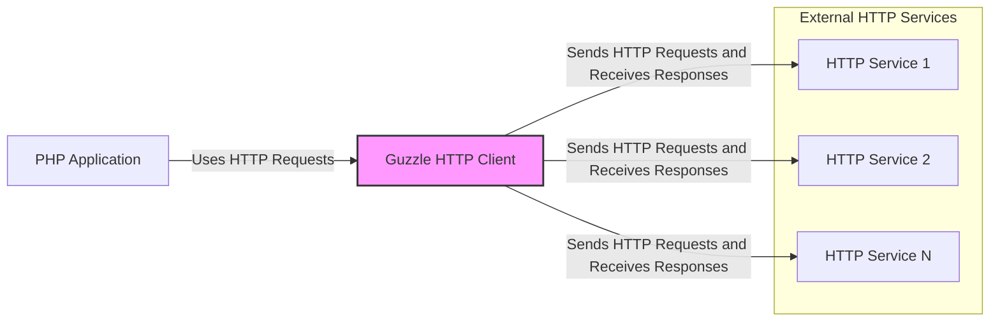
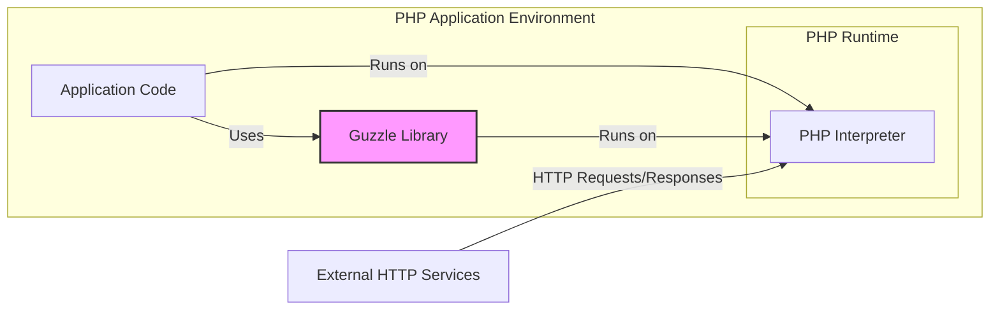
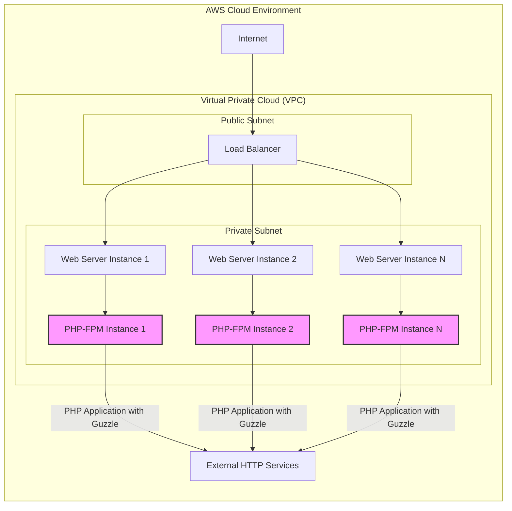

# BUSINESS POSTURE

This project is the Guzzle HTTP client, a PHP library that simplifies sending HTTP requests and integrates with web services.

- Business Priorities and Goals:
  - Provide a robust and reliable HTTP client for PHP developers.
  - Simplify the process of sending HTTP requests and handling responses.
  - Offer a flexible and extensible library to accommodate various HTTP-related tasks.
  - Maintain compatibility with different PHP versions and environments.
  - Ensure good performance and efficiency for HTTP communication.
  - Foster a strong community and provide ongoing support and updates.

- Business Risks:
  - Vulnerabilities in Guzzle could be exploited by applications using it, leading to security breaches.
  - Performance issues in Guzzle could negatively impact the performance of applications relying on it.
  - Lack of reliability or bugs in Guzzle could cause application failures or unexpected behavior.
  - Incompatibility issues with PHP versions or environments could limit adoption and usage.
  - Security vulnerabilities in dependencies of Guzzle could indirectly affect applications using Guzzle.
  - Malicious contributions to the open-source project could introduce vulnerabilities or backdoors.
  - Supply chain attacks targeting the distribution channels of Guzzle could compromise users.

# SECURITY POSTURE

- Existing Security Controls:
  - security control: Code reviews are likely performed by maintainers and contributors as part of the open-source development process. (Location: GitHub Pull Requests and Contribution Guidelines)
  - security control: Static analysis tools might be used by developers locally or in CI pipelines, although not explicitly documented. (Location: Implicit in standard software development practices)
  - security control: Unit and integration tests are present in the repository, which helps ensure code correctness and can indirectly contribute to security. (Location: `phpunit.xml.dist` and `tests/` directory)
  - accepted risk: Reliance on the open-source community for identifying and reporting security vulnerabilities.
  - accepted risk: Potential delays in patching reported vulnerabilities due to maintainer workload and release cycles.
  - accepted risk: Dependency on third-party libraries, which may introduce their own vulnerabilities.

- Recommended Security Controls:
  - security control: Implement automated static application security testing (SAST) in the CI/CD pipeline to detect potential vulnerabilities in code changes.
  - security control: Integrate dependency scanning to identify known vulnerabilities in third-party libraries used by Guzzle.
  - security control: Conduct regular security audits and penetration testing to proactively identify and address security weaknesses.
  - security control: Establish a clear vulnerability disclosure and incident response process to handle security issues effectively.
  - security control: Implement input validation and output encoding mechanisms throughout the library to prevent common web vulnerabilities.
  - security control: Consider fuzz testing to discover unexpected behavior and potential vulnerabilities in edge cases.

- Security Requirements:
  - Authentication:
    - requirement: Guzzle itself does not handle authentication directly but provides mechanisms for applications to implement various authentication schemes (e.g., Basic Auth, OAuth).
    - requirement: Ensure that examples and documentation clearly guide developers on how to securely implement authentication when using Guzzle.
  - Authorization:
    - requirement: Guzzle does not handle authorization directly; it is the responsibility of the application and the remote service.
    - requirement: Guzzle should not introduce any mechanisms that could bypass authorization controls implemented by applications or remote services.
  - Input Validation:
    - requirement: Guzzle must validate all inputs, including headers, request parameters, and body data, to prevent injection attacks and other input-related vulnerabilities.
    - requirement: Input validation should be applied consistently across all functionalities of the library.
  - Cryptography:
    - requirement: Guzzle should support secure communication protocols like HTTPS/TLS for all network interactions by default.
    - requirement: When handling sensitive data, Guzzle should encourage and facilitate the use of encryption where appropriate (e.g., encrypting request/response bodies when necessary).
    - requirement: Ensure that Guzzle uses secure cryptographic libraries and algorithms for any cryptographic operations it performs internally.

# DESIGN

## C4 CONTEXT



- Context Diagram Elements:
  - - Name: PHP Application
    - Type: Software System
    - Description: A PHP application that requires to make HTTP requests to external services. This application uses the Guzzle HTTP Client library.
    - Responsibilities:
      - Define and initiate HTTP requests using Guzzle.
      - Process HTTP responses received from external services.
      - Implement application-level security controls, such as authentication and authorization.
    - Security controls:
      - security control: Application-level authentication and authorization mechanisms.
      - security control: Input validation and output encoding for application-specific data.
      - security control: Secure storage of application secrets and credentials.

  - - Name: Guzzle HTTP Client
    - Type: Software System / Library
    - Description: A PHP library that simplifies sending HTTP requests and handling responses. It acts as an intermediary between PHP applications and external HTTP services.
    - Responsibilities:
      - Construct and send HTTP requests based on application instructions.
      - Handle HTTP responses and provide them back to the application.
      - Manage HTTP connections and related configurations.
      - Implement low-level security controls for HTTP communication.
    - Security controls:
      - security control: TLS/SSL encryption for secure communication.
      - security control: Input validation for HTTP headers and request parameters.
      - security control: Protection against common HTTP-related vulnerabilities (e.g., header injection).

  - - Name: HTTP Service 1, HTTP Service 2, HTTP Service N
    - Type: External System
    - Description: External web services or APIs that the PHP application needs to interact with via HTTP. These services are outside the scope of Guzzle and the PHP application itself.
    - Responsibilities:
      - Provide specific functionalities and data through HTTP APIs.
      - Implement their own security controls, including authentication, authorization, and data protection.
    - Security controls:
      - security control: Service-side authentication and authorization mechanisms.
      - security control: Input validation and output encoding on the service side.
      - security control: Data encryption and protection at rest and in transit (within the service infrastructure).

## C4 CONTAINER



- Container Diagram Elements:
  - - Name: PHP Interpreter
    - Type: Runtime Environment
    - Description: The PHP runtime environment responsible for executing PHP code, including the application code and the Guzzle library.
    - Responsibilities:
      - Execute PHP code.
      - Manage memory and resources for PHP applications.
      - Provide necessary PHP extensions and libraries.
    - Security controls:
      - security control: Operating system level security controls (user permissions, process isolation).
      - security control: PHP runtime security configurations (e.g., `php.ini` settings).
      - security control: Security updates and patching of the PHP runtime environment.

  - - Name: Application Code
    - Type: Software Component
    - Description: The custom PHP code of the application that utilizes the Guzzle library to interact with external HTTP services.
    - Responsibilities:
      - Implement application logic and business functionality.
      - Define and initiate HTTP requests using Guzzle.
      - Handle responses and errors from Guzzle and external services.
      - Implement application-specific security measures.
    - Security controls:
      - security control: Application-level authentication and authorization logic.
      - security control: Input validation and output encoding for application data.
      - security control: Secure handling of application secrets and credentials.

  - - Name: Guzzle Library
    - Type: Library / Container
    - Description: The Guzzle HTTP client library, providing functionalities for making HTTP requests. It is included as a dependency within the PHP application.
    - Responsibilities:
      - Provide an API for PHP applications to send HTTP requests.
      - Handle HTTP protocol details and connection management.
      - Implement security features related to HTTP communication (TLS, input validation).
    - Security controls:
      - security control: TLS/SSL encryption for secure communication.
      - security control: Input validation for HTTP headers and request parameters.
      - security control: Protection against common HTTP vulnerabilities.

  - - Name: External HTTP Services
    - Type: External System
    - Description:  External web services or APIs that the PHP application interacts with.  Represented here as a single container for simplicity, but in reality, it can be multiple distinct services.
    - Responsibilities:
      - Provide APIs and functionalities accessed by the PHP application.
      - Manage their own infrastructure and security.
    - Security controls:
      - security control: Service-side security controls (authentication, authorization, etc.).
      - security control: Infrastructure security for the external services.

## DEPLOYMENT

For PHP applications using Guzzle, a common deployment scenario is using a web server like Nginx or Apache with PHP-FPM, deployed on cloud infrastructure or on-premises servers. Let's consider a cloud-based deployment using AWS as an example.



- Deployment Diagram Elements:
  - - Name: Internet
    - Type: Network
    - Description: The public internet, representing external users accessing the application.
    - Responsibilities:
      - Provide connectivity for users to access the application.
    - Security controls:
      - security control: General internet security measures (DDoS protection, etc. - outside of this project's scope).

  - - Name: Load Balancer
    - Type: Infrastructure Component
    - Description: A load balancer (e.g., AWS ALB) distributing incoming traffic across multiple web server instances.
    - Responsibilities:
      - Distribute traffic evenly across web servers.
      - Provide SSL termination and HTTPS enforcement.
      - Enhance application availability and scalability.
    - Security controls:
      - security control: SSL/TLS termination and certificate management.
      - security control: Web Application Firewall (WAF) integration (optional).
      - security control: DDoS protection features.

  - - Name: Web Server Instance 1, Web Server Instance 2, Web Server Instance N
    - Type: Infrastructure Component / Server
    - Description: Virtual machine instances (e.g., AWS EC2) running a web server (e.g., Nginx or Apache).
    - Responsibilities:
      - Serve static content and proxy requests to PHP-FPM.
      - Handle HTTP requests and responses.
      - Provide a secure web server environment.
    - Security controls:
      - security control: Operating system hardening and security patching.
      - security control: Web server security configurations (e.g., disabling unnecessary modules).
      - security control: Network security groups/firewalls to restrict access.

  - - Name: PHP-FPM Instance 1, PHP-FPM Instance 2, PHP-FPM Instance N
    - Type: Application Server / Container
    - Description: Instances running PHP-FPM (FastCGI Process Manager) to execute PHP code. These instances host the PHP application that uses the Guzzle library.
    - Responsibilities:
      - Execute PHP application code.
      - Process requests from the web server.
      - Utilize the Guzzle library to make HTTP requests to external services.
    - Security controls:
      - security control: PHP runtime security configurations.
      - security control: Application-level security controls within the PHP application.
      - security control: Isolation from other components and services.

  - - Name: External HTTP Services
    - Type: External System
    - Description: External web services or APIs accessed by the PHP application using Guzzle.
    - Responsibilities:
      - Provide APIs and functionalities.
      - Manage their own infrastructure and security.
    - Security controls:
      - security control: Service-side security controls.
      - security control: Infrastructure security for external services.

## BUILD

```mermaid
flowchart LR
    A[Developer] -->|Code Changes, Commit, Push| B(GitHub Repository)
    B -->|Webhook, Trigger| C{CI/CD Pipeline (GitHub Actions)}
    C -->|Checkout Code, Install Dependencies (Composer)| D[Build Environment]
    D -->|Run Tests, Static Analysis, Security Scans| D
    D -->|Build Artifacts (Packaged Library)| E[Artifact Repository (Packagist)]
    E -->|Dependency Manager (Composer)| F[PHP Application Developers]
    style C fill:#f9f,stroke:#333,stroke-width:2px
```

- Build Process Elements:
  - - Name: Developer
    - Type: Human Actor
    - Description: Software developers who contribute code to the Guzzle project.
    - Responsibilities:
      - Write and maintain code for Guzzle.
      - Perform local testing and code reviews.
      - Commit and push code changes to the GitHub repository.
    - Security controls:
      - security control: Developer workstations security (antivirus, OS updates).
      - security control: Secure coding practices training.
      - security control: Code review process.

  - - Name: GitHub Repository
    - Type: Code Repository
    - Description: The central repository hosted on GitHub where the Guzzle source code is stored and managed.
    - Responsibilities:
      - Version control for the Guzzle codebase.
      - Collaboration platform for developers.
      - Trigger CI/CD pipelines on code changes.
    - Security controls:
      - security control: Access control and permissions management for the repository.
      - security control: Branch protection rules.
      - security control: Audit logging of repository activities.

  - - Name: CI/CD Pipeline (GitHub Actions)
    - Type: Automation System
    - Description: Automated CI/CD pipeline (likely using GitHub Actions) that builds, tests, and publishes the Guzzle library.
    - Responsibilities:
      - Automate the build, test, and release process.
      - Run static analysis and security scans on code changes.
      - Publish build artifacts to the artifact repository.
    - Security controls:
      - security control: Secure configuration of CI/CD pipelines.
      - security control: Secrets management for CI/CD processes.
      - security control: Isolation of build environments.
      - security control: Logging and monitoring of CI/CD activities.

  - - Name: Build Environment
    - Type: Computing Environment
    - Description: The environment where the Guzzle library is built and tested during the CI/CD process.
    - Responsibilities:
      - Provide necessary tools and dependencies for building Guzzle.
      - Execute build scripts, tests, and security scans.
      - Generate build artifacts.
    - Security controls:
      - security control: Hardened build environment.
      - security control: Regularly updated build tools and dependencies.
      - security control: Secure access to the build environment.

  - - Name: Artifact Repository (Packagist)
    - Type: Package Registry
    - Description: Packagist, the primary package repository for PHP, where Guzzle releases are published and distributed.
    - Responsibilities:
      - Host and distribute Guzzle library packages.
      - Provide a public access point for downloading Guzzle.
    - Security controls:
      - security control: Package signing and verification (if supported by Packagist).
      - security control: Security measures implemented by Packagist to protect against malicious packages.

  - - Name: PHP Application Developers
    - Type: Human Actor
    - Description: Developers who use the Guzzle library in their PHP applications.
    - Responsibilities:
      - Integrate Guzzle into their PHP applications.
      - Manage dependencies using Composer.
      - Utilize Guzzle securely in their applications.
    - Security controls:
      - security control: Dependency management practices (using Composer lock files).
      - security control: Secure coding practices when using Guzzle in applications.
      - security control: Regularly updating Guzzle library to the latest version.

# RISK ASSESSMENT

- Critical Business Processes:
  - Functionality of PHP applications that rely on Guzzle for HTTP communication.
  - Availability and reliability of web services accessed through Guzzle.
  - Data integrity and confidentiality of information exchanged via HTTP requests made by Guzzle.

- Data Sensitivity:
  - The sensitivity of data handled by Guzzle depends entirely on the applications using it.
  - Data can range from publicly accessible information to highly sensitive personal data, financial transactions, or confidential business information.
  - Guzzle itself does not store or process application data persistently, but it facilitates the transfer of data over HTTP.
  - The sensitivity level should be assessed in the context of each application that utilizes Guzzle. For applications handling sensitive data, the security of Guzzle becomes critical for protecting that data in transit.

# QUESTIONS & ASSUMPTIONS

- Questions:
  - What are the typical use cases and scenarios where Guzzle is intended to be used? (To better understand the potential attack surface and impact of vulnerabilities).
  - What are the performance requirements and constraints for Guzzle? (To balance security measures with performance considerations).
  - Are there any specific compliance requirements (e.g., PCI DSS, HIPAA) that applications using Guzzle might need to adhere to? (To identify relevant security standards and controls).
  - What is the expected lifespan and maintenance plan for Guzzle? (To understand the long-term security support and update strategy).

- Assumptions:
  - Guzzle is primarily used in server-side PHP applications.
  - Developers using Guzzle are expected to have a basic understanding of HTTP and web security principles.
  - Security is a significant concern for the Guzzle project and its users.
  - The documentation for Guzzle includes guidance on secure usage and best practices.
  - The Guzzle project benefits from community contributions and security feedback.