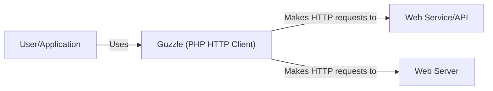
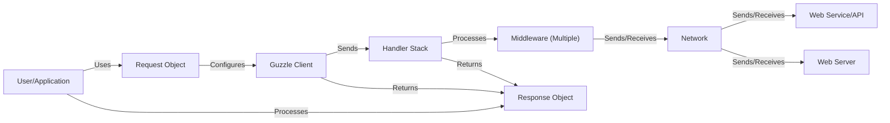
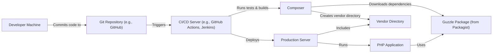
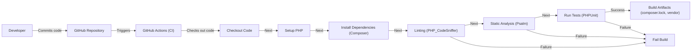

# BUSINESS POSTURE

Guzzle is a widely used PHP HTTP client. It simplifies the process of sending HTTP requests and integrating with web services.

Business Priorities:

*   Reliability: Guzzle must be a dependable library for making HTTP requests, as many applications rely on it for critical functionality.
*   Maintainability: The codebase should be easy to maintain and update, ensuring long-term viability and the ability to address security vulnerabilities promptly.
*   Ease of Use: Guzzle should be user-friendly, with a clear and consistent API, allowing developers to easily integrate it into their projects.
*   Performance: Guzzle should be performant, minimizing overhead and latency in HTTP communication.
*   Compatibility: Guzzle must maintain compatibility with a wide range of PHP versions and web servers.
*   Community Support: Foster an active and supportive community to encourage contributions, bug reports, and user feedback.

Business Goals:

*   Provide a robust and reliable HTTP client for the PHP ecosystem.
*   Facilitate seamless integration with web services and APIs.
*   Become the standard HTTP client library for PHP developers.

Most Important Business Risks:

*   Security Vulnerabilities: Vulnerabilities in Guzzle could be exploited to compromise applications that use it, leading to data breaches or other security incidents.
*   Dependency Issues: Conflicts or vulnerabilities in Guzzle's dependencies could impact its stability and security.
*   Lack of Maintenance: If Guzzle is not actively maintained, it could become outdated, insecure, and incompatible with newer technologies.
*   Loss of Community Trust: Negative perceptions or a decline in community engagement could harm Guzzle's reputation and adoption.

# SECURITY POSTURE

Existing Security Controls:

*   security control: Input Validation: Guzzle validates user-provided input, such as URLs and headers, to prevent common vulnerabilities like injection attacks. (Described in Guzzle documentation and source code).
*   security control: Secure Defaults: Guzzle uses secure default settings where possible, such as enabling HTTPS verification by default. (Described in Guzzle documentation).
*   security control: Dependency Management: Guzzle carefully manages its dependencies to minimize the risk of introducing vulnerabilities through third-party libraries. (Described in composer.json file).
*   security control: Regular Updates: Guzzle is actively maintained, with regular updates and security patches released to address vulnerabilities. (Described in GitHub releases).
*   security control: Community Reporting: Guzzle has a process for reporting security vulnerabilities, allowing researchers and users to responsibly disclose issues. (Described in SECURITY.md file).
*   security control: Code Reviews: Code changes are reviewed by maintainers to ensure code quality and security. (Described in GitHub pull requests).
*   security control: Static Analysis: Guzzle uses static analysis tools to identify potential security issues in the codebase. (Described in GitHub workflows).
*   security control: Testing: Guzzle has a comprehensive test suite to ensure functionality and prevent regressions. (Described in tests directory).

Accepted Risks:

*   accepted risk: Third-Party Library Vulnerabilities: While Guzzle manages its dependencies, there is an accepted risk that vulnerabilities in third-party libraries could impact Guzzle's security.
*   accepted risk: Zero-Day Vulnerabilities: There is an accepted risk of zero-day vulnerabilities in Guzzle or its dependencies that could be exploited before a patch is available.
*   accepted risk: Misconfiguration: There is an accepted risk that users may misconfigure Guzzle, leading to security vulnerabilities.

Recommended Security Controls:

*   security control: Fuzzing: Implement fuzzing to test Guzzle's resilience to unexpected or malformed input.
*   security control: Content Security Policy (CSP): Provide guidance and examples for using CSP with Guzzle to mitigate cross-site scripting (XSS) attacks.
*   security control: Subresource Integrity (SRI): If Guzzle loads external resources, consider implementing SRI to ensure their integrity.

Security Requirements:

*   Authentication:
    *   Guzzle should support various authentication mechanisms, including Basic Auth, Digest Auth, Bearer Tokens, and API Keys.
    *   Guzzle should securely handle sensitive credentials, preventing them from being logged or exposed in error messages.

*   Authorization:
    *   Guzzle does not directly handle authorization, as it is an HTTP client. Authorization is typically handled by the server to which Guzzle is making requests.

*   Input Validation:
    *   Guzzle must validate all user-provided input, including URLs, headers, and request bodies.
    *   Guzzle should provide mechanisms for escaping and sanitizing data to prevent injection attacks.

*   Cryptography:
    *   Guzzle should use secure cryptographic protocols (e.g., TLS 1.2+) for HTTPS communication.
    *   Guzzle should verify SSL certificates by default.
    *   Guzzle should allow users to configure custom CA bundles or disable certificate verification (with appropriate warnings).

# DESIGN

## C4 CONTEXT

Element Descriptions:

*   Element:
    *   Name: User/Application
    *   Type: User/External System
    *   Description: A PHP application or user that utilizes Guzzle to make HTTP requests.
    *   Responsibilities: Initiates HTTP requests using Guzzle, handles responses, and integrates with web services.
    *   Security controls: Implements application-level security controls, such as input validation, authentication, and authorization.

*   Element:
    *   Name: Guzzle (PHP HTTP Client)
    *   Type: Project
    *   Description: The Guzzle library itself, providing an interface for sending HTTP requests.
    *   Responsibilities: Provides a consistent API for making HTTP requests, handles request configuration, manages connections, and processes responses.
    *   Security controls: Input validation, secure defaults, dependency management, regular updates, community reporting, code reviews, static analysis, testing.

*   Element:
    *   Name: Web Service/API
    *   Type: External System
    *   Description: A remote web service or API that Guzzle interacts with.
    *   Responsibilities: Receives and processes HTTP requests from Guzzle, returns responses.
    *   Security controls: Implements its own security controls, such as authentication, authorization, and input validation.

*   Element:
    *   Name: Web Server
    *   Type: External System
    *   Description: A remote web server that Guzzle interacts with.
    *   Responsibilities: Receives and processes HTTP requests from Guzzle, returns responses.
    *   Security controls: Implements its own security controls, such as authentication, authorization, and input validation.

## C4 CONTAINER

Element Descriptions:

*   Element:
    *   Name: User/Application
    *   Type: User/External System
    *   Description: A PHP application or user that utilizes Guzzle to make HTTP requests.
    *   Responsibilities: Initiates HTTP requests using Guzzle, handles responses, and integrates with web services.
    *   Security controls: Implements application-level security controls, such as input validation, authentication, and authorization.

*   Element:
    *   Name: Request Object
    *   Type: Object
    *   Description: Represents an HTTP request to be sent.
    *   Responsibilities: Stores request data (method, URL, headers, body).
    *   Security controls: Input validation.

*   Element:
    *   Name: Guzzle Client
    *   Type: Object
    *   Description: The main interface for sending HTTP requests.
    *   Responsibilities: Manages request creation, configuration, and execution.
    *   Security controls: Secure defaults, configuration validation.

*   Element:
    *   Name: Handler Stack
    *   Type: Object
    *   Description: A stack of handlers that process the request and response.
    *   Responsibilities: Executes middleware and the final handler to send the request.
    *   Security controls: Enforces middleware security policies.

*   Element:
    *   Name: Middleware (Multiple)
    *   Type: Object
    *   Description: Functions that can modify the request or response.
    *   Responsibilities: Implements various features like retries, redirects, cookies, and authentication.
    *   Security controls: Can implement security-related logic, such as adding authentication headers or validating responses.

*   Element:
    *   Name: Network
    *   Type: Network
    *   Description: The network layer over which the HTTP request is sent.
    *   Responsibilities: Transmits data between the client and the server.
    *   Security controls: TLS encryption, certificate verification.

*   Element:
    *   Name: Web Service/API
    *   Type: External System
    *   Description: A remote web service or API that Guzzle interacts with.
    *   Responsibilities: Receives and processes HTTP requests from Guzzle, returns responses.
    *   Security controls: Implements its own security controls, such as authentication, authorization, and input validation.

*   Element:
    *   Name: Web Server
    *   Type: External System
    *   Description: A remote web server that Guzzle interacts with.
    *   Responsibilities: Receives and processes HTTP requests from Guzzle, returns responses.
    *   Security controls: Implements its own security controls, such as authentication, authorization, and input validation.

*   Element:
    *   Name: Response Object
    *   Type: Object
    *   Description: Represents the HTTP response received from the server.
    *   Responsibilities: Stores response data (status code, headers, body).
    *   Security controls: Response validation (in middleware).

## DEPLOYMENT

Possible Deployment Solutions:

1.  Composer Dependency: Guzzle is typically deployed as a dependency within a larger PHP application using Composer, the PHP dependency manager.
2.  Standalone Phar: Guzzle can also be used as a standalone Phar archive, although this is less common.

Chosen Solution (Composer Dependency):

Element Descriptions:

*   Element:
    *   Name: Developer Machine
    *   Type: Development Environment
    *   Description: The developer's local machine where code is written and tested.
    *   Responsibilities: Code development, testing, and committing to the Git repository.
    *   Security controls: Local development environment security best practices.

*   Element:
    *   Name: Git Repository (e.g., GitHub)
    *   Type: Version Control System
    *   Description: Stores the application's source code, including the Guzzle dependency declaration.
    *   Responsibilities: Version control, collaboration, and triggering CI/CD pipelines.
    *   Security controls: Access controls, branch protection rules, code review policies.

*   Element:
    *   Name: CI/CD Server (e.g., GitHub Actions, Jenkins)
    *   Type: Continuous Integration/Continuous Deployment Server
    *   Description: Automates the build, testing, and deployment process.
    *   Responsibilities: Runs tests, builds the application, and deploys it to the production server.
    *   Security controls: Secure configuration, access controls, secrets management.

*   Element:
    *   Name: Composer
    *   Type: Dependency Manager
    *   Description: The PHP dependency manager used to install Guzzle and other dependencies.
    *   Responsibilities: Resolves and downloads dependencies, creates the vendor directory.
    *   Security controls: Dependency verification, checksum validation.

*   Element:
    *   Name: Guzzle Package (from Packagist)
    *   Type: Package
    *   Description: The Guzzle package hosted on Packagist, the PHP package repository.
    *   Responsibilities: Provides the Guzzle library code.
    *   Security controls: Packagist security measures, package signing (if used).

*   Element:
    *   Name: Vendor Directory
    *   Type: Directory
    *   Description: Contains all the project's dependencies, including Guzzle.
    *   Responsibilities: Provides the necessary libraries for the application to run.
    *   Security controls: Regular updates, vulnerability scanning.

*   Element:
    *   Name: Production Server
    *   Type: Server
    *   Description: The server where the PHP application is deployed and runs.
    *   Responsibilities: Hosts and executes the application.
    *   Security controls: Server hardening, firewall, intrusion detection/prevention systems.

*   Element:
    *   Name: PHP Application
    *   Type: Application
    *   Description: The application that uses Guzzle to make HTTP requests.
    *   Responsibilities: Implements the application's business logic.
    *   Security controls: Application-level security controls.

## BUILD

Build Process Description:

1.  Developer commits code changes to the GitHub repository.
2.  GitHub Actions, the CI/CD system, is triggered by the commit.
3.  The workflow checks out the code from the repository.
4.  The workflow sets up the PHP environment.
5.  Composer installs the project's dependencies, including Guzzle, based on the composer.json and composer.lock files.
6.  Linting is performed using PHP_CodeSniffer to enforce coding standards.
7.  Static analysis is performed using Psalm to identify potential bugs and security vulnerabilities.
8.  Unit tests are run using PHPUnit to ensure code functionality and prevent regressions.
9.  If all steps are successful, the build artifacts (composer.lock and the vendor directory) are created.
10. If any step fails, the build fails, and the developer is notified.

Security Controls in Build Process:

*   Dependency Management: Composer ensures that the correct versions of dependencies are installed, and composer.lock helps prevent unexpected updates.
*   Linting: PHP_CodeSniffer enforces coding standards, which can help prevent common coding errors that could lead to vulnerabilities.
*   Static Analysis: Psalm helps identify potential security issues, such as type confusion, SQL injection, and cross-site scripting (XSS) vulnerabilities.
*   Testing: PHPUnit ensures that the code functions as expected and helps prevent regressions that could introduce security vulnerabilities.
*   CI/CD: GitHub Actions provides a secure and automated environment for building and testing the code.

# RISK ASSESSMENT

Critical Business Processes to Protect:

*   Making HTTP requests: Guzzle's primary function is to make HTTP requests, which is critical for many applications that rely on external services.
*   Integrating with web services: Guzzle facilitates integration with web services, which is essential for many applications' functionality.

Data to Protect and Sensitivity:

*   Request Data:
    *   URLs: May contain sensitive information, such as API endpoints or internal resource paths. Sensitivity: Medium.
    *   Headers: May contain authentication credentials, API keys, or other sensitive data. Sensitivity: High.
    *   Request Bodies: May contain user data, API payloads, or other sensitive information. Sensitivity: High (depending on the specific data).

*   Response Data:
    *   Headers: May contain session tokens, cookies, or other sensitive information. Sensitivity: High.
    *   Response Bodies: May contain user data, API responses, or other sensitive information. Sensitivity: High (depending on the specific data).

# QUESTIONS & ASSUMPTIONS

Questions:

*   Are there any specific compliance requirements (e.g., PCI DSS, GDPR) that Guzzle needs to adhere to?
*   What is the expected volume of HTTP requests that Guzzle will handle?
*   Are there any specific performance requirements for Guzzle?
*   Are there any plans to add support for new HTTP protocols or features (e.g., HTTP/3)?
*   What is the process for handling security vulnerabilities discovered in Guzzle?

Assumptions:

*   BUSINESS POSTURE: Guzzle is a critical component for many PHP applications, and its security and reliability are paramount.
*   SECURITY POSTURE: Guzzle's maintainers prioritize security and follow secure development practices.
*   DESIGN: Guzzle is used primarily as a Composer dependency within larger PHP applications.
*   DESIGN: The build process described is based on the Guzzle project's GitHub Actions workflows.
*   DESIGN: The deployment process assumes a typical PHP application deployment using Composer.