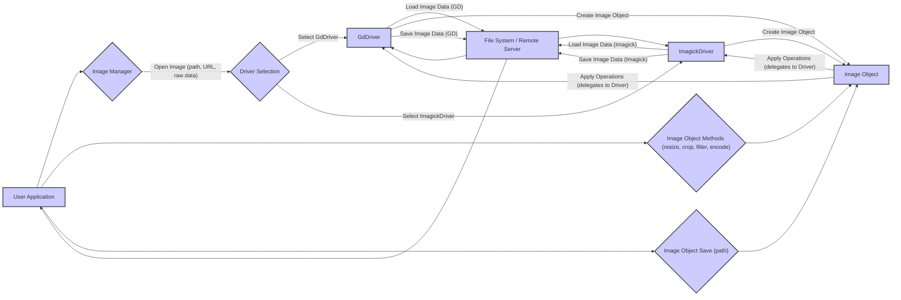

# Project Design Document: Intervention/image Library

**Version:** 1.1
**Date:** October 26, 2023
**Author:** AI Software Architect

## 1. Introduction

This document provides an enhanced design overview of the Intervention/image library, a widely used PHP library for image manipulation. This detailed design serves as a crucial foundation for subsequent threat modeling activities, enabling a comprehensive analysis of potential security vulnerabilities. It meticulously outlines the key components, data flow, and architectural considerations of the library.

## 2. Goals and Objectives

The core goal of the Intervention/image library is to offer a fluent, expressive, and unified interface for performing a wide range of common image manipulation tasks within PHP applications. Key objectives include:

*   Providing an abstract API that works consistently across different underlying image processing libraries, specifically the GD Library and Imagick.
*   Simplifying the implementation of frequent image operations such as resizing, cropping, rotating, applying various filters and effects, and watermarking.
*   Supporting a broad spectrum of common image file formats, ensuring compatibility with diverse image sources.
*   Offering a flexible and extensible architecture that allows for future additions and customizations.
*   Maintaining a user-friendly and intuitive API for developers.

## 3. Architecture Overview

Intervention/image is architected as a library that is directly integrated into PHP applications. It functions as an abstraction layer, shielding developers from the complexities of the underlying image processing extensions. The fundamental architectural elements are:

*   **User Application:** The encompassing PHP application code that instantiates and interacts with the Intervention/image library to perform image manipulation tasks.
*   **Intervention/image Core:** The central codebase of the library, responsible for providing the public API, managing configuration settings, and orchestrating the selection of the appropriate driver.
*   **Image Manager:** A pivotal component that acts as a factory for creating image instances and dynamically selecting the appropriate driver (GD or Imagick) based on the application's configuration and the availability of the extensions.
*   **Drivers (GD Library, Imagick):** Concrete implementations of the image manipulation logic, each tailored to utilize the specific functionalities offered by the respective PHP extensions. These drivers encapsulate the low-level interactions with GD and Imagick.
*   **Image Object:** A representation of an image held in memory. This object provides a chainable and expressive set of methods for performing various image manipulations. It acts as an intermediary between the user application and the underlying driver.
*   **File System / External Sources:**  The interface through which the library interacts with the file system to load and save image files, and potentially with external sources like URLs for fetching remote images.

## 4. Component Description

This section provides a more granular description of the key components within the Intervention/image library.

*   **User Application:**
    *   Represents the custom PHP application code that initiates and controls image processing workflows using the Intervention/image library.
    *   Triggers image processing tasks by invoking methods exposed by the library's API.
    *   Supplies input image data to the library, which can be in the form of a local file path, a remote URL pointing to an image, or raw image data passed directly.
    *   Receives the processed image data back from the library or instructs the library to save the modified image to a specified storage location.

*   **Intervention/image Core:**
    *   Serves as the primary entry point and defines the public API that developers use to interact with the library.
    *   Manages global configuration settings for the library, such as the preferred image processing driver.
    *   Contains the `Intervention\Image\ImageManager` class, which is central to the library's operation.
    *   Defines abstract classes and interfaces that the concrete drivers must implement, ensuring a consistent API across different image processing engines.

*   **Image Manager:**
    *   Acts as a factory responsible for instantiating `Intervention\Image\Image` objects.
    *   Dynamically determines which driver (`Gd` or `Imagick`) to utilize based on the configured preferences and the availability of the corresponding PHP extensions at runtime.
    *   Provides methods for opening images from various sources, abstracting away the details of how the image data is loaded.

*   **Drivers (GD Library, Imagick):**
    *   Implement the core image manipulation logic, leveraging the specific functionalities provided by the underlying GD Library or Imagick PHP extensions.
    *   Each driver provides concrete implementations for the methods defined in the driver interface (e.g., `resize`, `crop`, `encode`).
    *   `Intervention\Image\Gd\Driver`:  Implements image processing using the functions provided by the GD Library extension.
    *   `Intervention\Image\Imagick\Driver`: Implements image processing using the functions provided by the Imagick extension.

*   **Image Object:**
    *   Represents an image in memory after it has been loaded. Instances of this object are typically of the class `Intervention\Image\Image`.
    *   Offers a fluent and chainable interface for applying a sequence of image manipulation operations.
    *   Holds the raw image data and associated metadata (e.g., format, mime type, width, height).
    *   Delegates the actual execution of manipulation operations to the currently selected driver.

*   **File System / External Sources:**
    *   Provides the mechanism for the library to read image files from the local file system or fetch them from remote servers via URLs.
    *   Enables the library to save processed images back to the file system at specified locations.
    *   Interactions involve standard file system operations (read, write, access) and potentially HTTP requests for remote resources.

## 5. Data Flow

The typical data flow for image processing using the Intervention/image library can be broken down into the following steps:

Detailed steps:

*   The **User Application** initiates image processing by calling a method on the `ImageManager` to open an image. This involves providing the image source as a file path, a URL, or raw image data.
*   The **Image Manager** performs **Driver Selection**, determining whether to use the `GdDriver` or the `ImagickDriver` based on configuration and available extensions.
*   The selected **Driver** (`GdDriver` or `ImagickDriver`) interacts with the **File System / Remote Server** to load the image data from the specified source.
*   The **Driver** then creates an **Image Object** in memory, encapsulating the loaded image data and metadata.
*   The **User Application** subsequently calls various methods on the **Image Object** to perform desired image manipulations (e.g., `resize()`, `crop()`, `filter()`, `encode()`). These method calls often follow a chainable pattern.
*   The **Image Object** delegates the execution of these manipulation operations to the underlying **Driver** that was initially selected.
*   Finally, the **User Application** can invoke the `save()` method on the **Image Object**, providing a file path where the processed image should be stored.
*   The **Driver** writes the modified image data to the specified location in the **File System**.

## 6. Security Considerations (Initial)

This section expands on the initial security considerations, providing more detail relevant for threat modeling.

*   **Input Validation:**
    *   **Malicious Image Files:** The library must robustly handle potentially malicious image files that could exploit vulnerabilities in the underlying image processing extensions (e.g., buffer overflows, integer overflows). This includes validating file headers and internal structures.
    *   **Parameter Validation:**  User-provided parameters for image manipulation operations (e.g., dimensions for resizing, coordinates for cropping, quality settings) need rigorous validation to prevent unexpected behavior or resource exhaustion. Negative or excessively large values should be rejected.
    *   **File Path and URL Sanitization:**  File paths and URLs provided as input must be carefully sanitized to prevent path traversal attacks (accessing files outside the intended directories) and remote file inclusion vulnerabilities. Whitelisting allowed protocols and path components can be beneficial.

*   **Path Traversal:**
    *   The library needs to ensure that user-supplied file paths for loading and saving images cannot be manipulated to access or overwrite arbitrary files or directories on the server. Using absolute paths or restricting access to specific directories can mitigate this risk.

*   **Resource Exhaustion:**
    *   **Large Image Processing:** Processing extremely large or complex images can lead to excessive memory consumption and CPU usage, potentially causing denial-of-service. Implementing safeguards like memory limits and timeouts is crucial.
    *   **Recursive Operations:**  Care must be taken to avoid potential infinite loops or excessively deep recursion during image processing, which could also lead to resource exhaustion.

*   **Dependency Vulnerabilities:**
    *   The security of the Intervention/image library is inherently tied to the security of its underlying dependencies, the GD Library and Imagick extensions. Regular updates and awareness of known vulnerabilities in these extensions are essential. Using dependency management tools to track and update dependencies is recommended.

*   **Error Handling:**
    *   Insufficient or verbose error handling can leak sensitive information about the server's configuration or file system structure. Error messages should be generic and avoid revealing internal details.

*   **Remote File Inclusion (RFI):**
    *   If the library allows loading images from URLs, it's critical to implement strict validation and sanitization of these URLs to prevent attackers from including malicious remote files. Disabling or carefully controlling the use of URL-based image loading can reduce this risk. Server-side request forgery (SSRF) is also a concern here.

*   **Output Sanitization:**
    *   When outputting processed images (e.g., displaying them in a web browser), ensure proper content-type headers are set to prevent cross-site scripting (XSS) vulnerabilities if user-controlled data is embedded in the image.

## 7. Assumptions and Constraints

The following assumptions and constraints are relevant to this design and the subsequent threat modeling process:

*   It is assumed that the library will be deployed within a reasonably secure server environment with appropriate security measures in place at the operating system and web server levels.
*   The underlying PHP extensions (GD Library or Imagick) are assumed to be installed and configured correctly, and are kept up-to-date with security patches.
*   File system permissions are assumed to be configured appropriately to restrict unauthorized access to image files and directories.
*   The application utilizing the library is responsible for implementing its own authentication and authorization mechanisms to control access to image processing functionalities.
*   The library's functionality is primarily focused on image manipulation; it does not inherently provide features for secure storage or transmission of images.

## 8. Future Considerations

Potential future enhancements or changes that could impact the design and security considerations include:

*   **Support for More Image Processing Libraries/Services:** Integrating with other image processing libraries or cloud-based services could introduce new dependencies and potential attack vectors.
*   **Advanced Image Manipulation Features:** Adding more complex features like image compositing, advanced filtering algorithms, or integration with machine learning models for image analysis could introduce new vulnerabilities if not implemented securely.
*   **Asynchronous Processing:** Implementing asynchronous image processing using queues or background workers could introduce new challenges related to data integrity and security in distributed environments.
*   **Improved Performance and Resource Utilization:** Optimizations that involve caching or temporary file storage need careful consideration to prevent information leakage or unauthorized access.
*   **Enhanced Error Handling and Logging:** While important for debugging, detailed logging needs to be managed carefully to avoid exposing sensitive information.
*   **Plugin/Extension System:** Allowing third-party plugins or extensions could introduce significant security risks if the extension mechanism is not properly secured.

This enhanced design document provides a more detailed and nuanced understanding of the Intervention/image library's architecture and data flow. This deeper understanding is crucial for conducting a thorough and effective threat modeling exercise, enabling the identification and mitigation of potential security vulnerabilities.