# Project Design Document: doctrine/instantiator

**Version:** 1.1
**Date:** October 26, 2023
**Author:** AI Software Architect

## 1. Introduction

This document provides an enhanced design overview of the `doctrine/instantiator` library, specifically tailored for threat modeling. It details the library's purpose, functionality, architecture, and critical security considerations to facilitate a comprehensive security analysis.

### 1.1. Purpose

The `doctrine/instantiator` library offers a mechanism to create instances of PHP classes without executing their constructors. This capability is essential in scenarios where default object initialization needs to be bypassed, such as:

*   Generating test doubles (mocks, stubs) where constructor side effects are undesirable.
*   Populating object state from data sources, decoupling data loading from constructor logic.
*   Implementing advanced serialization or cloning functionalities.

### 1.2. Scope

This document encompasses the core functionalities of the `doctrine/instantiator` library, focusing on its public API and internal instantiation mechanisms. The scope is limited to the library's direct operations and does not extend to the usage patterns or security of applications that integrate it.

### 1.3. Target Audience

This document is primarily intended for:

*   Security architects and engineers conducting threat modeling and security assessments.
*   Software developers integrating `doctrine/instantiator` and needing to understand its security implications.
*   Anyone requiring a detailed understanding of the library's internal workings for security analysis.

## 2. Overview

The `doctrine/instantiator` library provides a streamlined interface for creating class instances in PHP, explicitly bypassing constructor execution. This is achieved through different internal strategies optimized for performance and compatibility across PHP versions. The core value proposition lies in its ability to create "raw" object instances, independent of constructor-defined initialization.

### 2.1. Core Functionality

The central function of the library is to instantiate a PHP class given its name. The library intelligently selects the most efficient method to achieve this without invoking the class's constructor.

### 2.2. Key Components

*   **`Instantiator` Class:** The primary and sole public class, offering the `instantiate()` method. This serves as the entry point for all instantiation requests.
*   **Instantiation Strategies:** Internal, dynamically selected mechanisms responsible for the actual object creation. The choice of strategy depends on the PHP version and class characteristics.

## 3. Functional Description

This section provides a detailed breakdown of the library's functionality, focusing on the input, processing, and output of its core operation.

### 3.1. `Instantiator::instantiate(string $className)`

*   **Input:** A string representing the fully qualified name of the PHP class to be instantiated. This is the sole input parameter.
*   **Output:** A new instance of the specified class. The object's properties will be uninitialized, reflecting the absence of constructor execution.
*   **Process:**
    1. The `instantiate()` method receives the `$className`.
    2. It internally determines the optimal instantiation strategy based on the current PHP version and the characteristics of the target class (e.g., whether it's an internal class).
    3. **Strategy Selection Logic:**
        *   **PHP 5.4 and above:** The library prioritizes unserialization due to its performance. It crafts a minimal serialized representation of the object and unserializes it.
        *   **Older PHP versions or specific class types:** The library falls back to using the Reflection API (`ReflectionClass::newInstanceWithoutConstructor()`).
    4. The chosen strategy is executed to create the object instance without invoking its constructor.
    5. The newly created, uninitialized object instance is returned.

### 3.2. Instantiation Strategies (Internal)

*   **Unserialization Strategy (PHP >= 5.4):**
    *   **Mechanism:** Creates a serialized string representing an instance of the target class with no properties. This string is then passed to `unserialize()`.
    *   **Benefits:** Generally faster than reflection-based instantiation.
    *   **Considerations:** Relies on the internal workings of PHP's serialization mechanism.
*   **Reflection Strategy (Fallback):**
    *   **Mechanism:** Uses the `ReflectionClass` API, specifically the `newInstanceWithoutConstructor()` method, to create an instance.
    *   **Benefits:** Works across a broader range of PHP versions and class types.
    *   **Considerations:** Can be slightly less performant than unserialization.

### 3.3. Error Handling

*   The `instantiate()` method throws a `InvalidArgumentException` if the provided `$className` is not a valid class name or if the class does not exist.

## 4. Non-Functional Requirements

This section outlines non-functional aspects relevant to the library's design and operation.

### 4.1. Security

*   The library's primary security consideration stems from its ability to bypass constructor logic. This can have implications for object integrity and security if the instantiated objects are used without proper initialization.
*   The library itself does not perform any input validation beyond checking if the class name is a string. The security of the class name source is the responsibility of the consuming application.

### 4.2. Performance

*   The library is designed for efficient object instantiation.
*   The preference for unserialization in newer PHP versions reflects a focus on performance optimization.

### 4.3. Maintainability

*   The library has a small and well-defined codebase, enhancing maintainability.
*   The separation of concerns between the `Instantiator` class and the internal strategies promotes code clarity and easier modification.

## 5. Architecture Diagram

```mermaid
graph LR
    subgraph "doctrine/instantiator Library"
        A("Instantiator Class\n(Public API)")
        B("Unserialization Strategy\n(Internal)")
        C("Reflection Strategy\n(Internal)")
    end
    D("Consuming Application") --> A
    A -- "Selects Strategy" --> B
    A -- "Selects Strategy" --> C
    B -- "Uses" --> E("PHP Runtime\n(unserialize)")
    C -- "Uses" --> F("PHP Runtime\n(ReflectionClass)")
    A --> G("Uninitialized\nObject Instance")
```

## 6. Data Flow Diagram

## 7. Dependencies

*   **PHP Runtime Environment:** The library relies on core PHP functionalities, specifically `unserialize()` and the Reflection API. No external libraries are required.

## 8. Deployment Considerations

The `doctrine/instantiator` library is typically deployed as a dependency within a PHP application or library, managed through a package manager like Composer. Its presence introduces the capability to instantiate objects without constructor execution within the consuming application's environment.

## 9. Security Considerations

This section details potential security considerations associated with the `doctrine/instantiator` library.

### 9.1. Bypassing Critical Constructor Logic

*   **Threat:** Instantiating objects without invoking their constructors can bypass essential initialization steps, including security checks, resource allocation, and state setup. This can leave objects in an invalid or insecure state.
*   **Attack Vector:** An attacker might leverage this to create objects that lack necessary security configurations or bypass intended access controls.
*   **Example:** A class constructor might establish database connections or validate user permissions. Bypassing it could lead to unauthorized data access or manipulation if the object is subsequently used.
*   **Mitigation:** Ensure that any objects instantiated using this library undergo necessary initialization steps after creation, if the constructor logic is critical for security or proper functioning.

### 9.2. Instantiation of Unexpected or Malicious Classes

*   **Threat:** If the class name provided to `Instantiator::instantiate()` originates from an untrusted source (e.g., user input, external data), it could allow the instantiation of arbitrary classes present in the application's codebase.
*   **Attack Vector:** An attacker could potentially instantiate classes with destructive methods or classes that can be exploited to gain unauthorized access or execute arbitrary code.
*   **Example:** Instantiating a class designed for file system manipulation could allow an attacker to read or write arbitrary files.
*   **Mitigation:**  Never use untrusted input directly as the class name for instantiation. Implement strict validation and sanitization of class names or use a whitelist of allowed classes.

### 9.3. Potential for Unserialization Gadgets (Indirect Risk)

*   **Threat:** While `doctrine/instantiator` uses `unserialize()` internally in a controlled manner, the ability to create objects that *can* be serialized and unserialized introduces the potential for unserialization vulnerabilities if these objects are later handled by vulnerable `unserialize()` calls elsewhere in the application.
*   **Attack Vector:** An attacker might craft malicious serialized data containing objects instantiated by this library, exploiting vulnerabilities in other parts of the application that process serialized data.
*   **Example:**  Creating an object with specific property values that, when unserialized in a different context, triggers a chain of method calls leading to arbitrary code execution.
*   **Mitigation:** Be mindful of how objects instantiated by this library are handled and ensure that any usage of `unserialize()` on these objects is secure and protected against known unserialization vulnerabilities.

### 9.4. Information Disclosure through Uninitialized Objects

*   **Threat:** Objects instantiated without their constructors might contain sensitive information in their default, uninitialized state, potentially leading to information disclosure if these objects are inadvertently exposed or logged.
*   **Attack Vector:** An attacker might be able to observe the internal state of these uninitialized objects through debugging tools or error messages.
*   **Mitigation:** Avoid exposing or logging objects immediately after instantiation without proper initialization, especially if they might contain sensitive data.

## 10. Future Considerations

*   Exploring alternative instantiation methods for improved performance or security in specific PHP environments.
*   Potentially offering configuration options to restrict the types of classes that can be instantiated.
*   Providing more detailed documentation and guidance on the security implications of bypassing constructors.

This enhanced design document provides a more detailed and security-focused overview of the `doctrine/instantiator` library. It highlights potential security considerations and encourages developers and security professionals to carefully evaluate the risks associated with bypassing constructor logic in their applications.