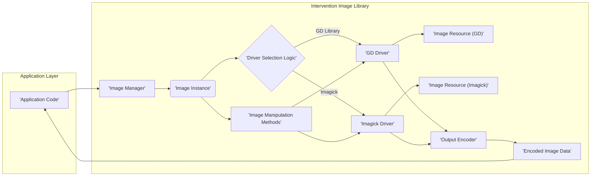
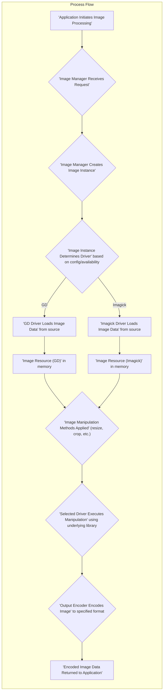

# Project Design Document: Intervention Image Library

**Version:** 1.1
**Date:** October 26, 2023
**Author:** Gemini (AI Language Model)

## 1. Introduction

This document provides an enhanced and detailed design overview of the Intervention Image library (hereafter referred to as "the Library"), a widely used PHP library for image manipulation. The primary objective of this document is to clearly articulate the Library's architecture, key components, and the flow of data during image processing. This understanding is crucial for conducting effective threat modeling and identifying potential security vulnerabilities. This document is intended for a diverse audience, including developers integrating the Library, security analysts performing security assessments, and anyone involved in understanding the Library's internal workings.

## 2. Goals

*   Provide a comprehensive and easily understandable architectural overview of the Library's structure and interactions.
*   Detail the responsibilities, functionalities, and potential security implications of each key component within the Library.
*   Clearly illustrate the data flow within the Library during various image processing operations, highlighting potential points of vulnerability.
*   Explicitly outline potential areas of security concern to guide subsequent threat modeling activities and risk assessments.
*   Serve as a reference point for developers and security professionals seeking to understand the security posture of applications utilizing the Library.

## 3. System Architecture

The Library is designed with a layered architecture, providing an abstraction layer over the underlying image processing engines (primarily GD Library and Imagick). This allows developers to interact with a consistent API regardless of the chosen driver. The core architecture can be visualized as follows:

## 4. Data Flow

The typical sequence of actions and data transformations during image processing within the Library follows this path:

## 5. Key Components

*   **Image Manager:**
    *   Serves as the primary entry point for interacting with the Library.
    *   Responsible for instantiating `Image` objects, acting as a factory.
    *   Handles the crucial decision of selecting the appropriate image processing driver (GD or Imagick) based on configuration settings or the server environment's capabilities. This selection process is a key point to consider for security, as different drivers might have different vulnerabilities.
    *   Provides methods for initiating image processing, such as opening existing images from files or creating new images.

*   **Image Instance:**
    *   Represents a single image being processed within the Library.
    *   Holds the in-memory representation of the image data, either as a GD resource or an Imagick object, depending on the selected driver.
    *   Offers a fluent and chainable interface for applying various image manipulation operations.
    *   Delegates the actual execution of manipulation tasks to the underlying driver.

*   **Driver Selection Logic:**
    *   The internal mechanism responsible for choosing between the available image processing drivers (GD or Imagick).
    *   Typically relies on a configuration setting that specifies the preferred driver. If no preference is set, it might fall back to the first available driver.
    *   The logic for determining driver availability should be robust to prevent unexpected driver selection, which could lead to issues if an application expects a specific driver's behavior or security characteristics.

*   **GD Driver:**
    *   An implementation of the Library's driver interface that utilizes the PHP GD Library extension for image processing.
    *   Translates the Library's abstract manipulation methods into specific function calls to the GD Library.
    *   Handles loading, saving, and manipulating image data using GD's functionalities. It's important to note that GD has a history of vulnerabilities related to image parsing.

*   **Imagick Driver:**
    *   Another implementation of the Library's driver interface, leveraging the PHP Imagick extension, which is a wrapper for the ImageMagick library.
    *   Translates the Library's abstract manipulation methods into calls to the ImageMagick library through the Imagick extension.
    *   Generally offers more advanced image processing capabilities compared to GD but also has its own set of potential security vulnerabilities related to its complex codebase and handling of various image formats.

*   **Image Resource (GD):**
    *   A PHP resource representing the image data as it is held and manipulated by the GD Library. This resource is internal to the GD extension.

*   **Image Resource (Imagick):**
    *   A PHP object representing the image data as it is held and manipulated by the Imagick extension. This object provides an interface to ImageMagick's functionalities.

*   **Image Manipulation Methods:**
    *   A rich set of methods exposed by the `Image` instance for performing various image transformations, such as resizing, cropping, rotating, applying filters, watermarking, and more.
    *   These methods are designed to be driver-agnostic, providing a consistent API regardless of the underlying driver. However, the actual implementation and potential vulnerabilities lie within the specific driver's handling of these methods.

*   **Output Encoder:**
    *   Responsible for converting the processed in-memory image representation into a specific output format (e.g., JPEG, PNG, GIF, WebP).
    *   Utilizes the encoding capabilities provided by the underlying image processing library (GD or Imagick). Vulnerabilities in the encoding logic of these libraries could lead to issues.

*   **Encoded Image Data:**
    *   The final output of the image processing pipeline, typically a string of bytes representing the image in the chosen format. This data is then returned to the application for further use (e.g., saving to a file, sending in an HTTP response).

## 6. Security Considerations

This section details potential security concerns that are crucial for threat modeling applications using the Library:

*   **Input Validation and Image Parsing:**
    *   **Malformed Image Files:** The underlying GD and Imagick libraries are known to have had vulnerabilities related to parsing specially crafted or malformed image files. Processing untrusted image uploads without proper validation can lead to crashes, denial-of-service (DoS), or even remote code execution (RCE) if vulnerabilities exist in the parsing logic.
    *   **Parameter Validation:**  Input parameters provided to image manipulation methods (e.g., resize dimensions, crop coordinates, filter parameters) must be strictly validated. Insufficient validation can lead to unexpected behavior, resource exhaustion, or even allow attackers to manipulate images in unintended ways. For example, providing very large dimensions for resizing could lead to excessive memory consumption.

*   **Dependency Security (GD Library and Imagick):**
    *   **Vulnerabilities in Underlying Libraries:** The security of the GD Library and ImageMagick (via the Imagick extension) is paramount. Both libraries have had numerous security vulnerabilities disclosed over time. Applications using Intervention Image are directly exposed to these vulnerabilities if the underlying libraries are not kept up-to-date. Regular updates and security patching of these dependencies are critical.
    *   **Configuration of Dependencies:**  The configuration of GD and Imagick on the server can also impact security. For instance, overly permissive policies in ImageMagick (e.g., allowing processing of remote URLs) can be exploited.

*   **Resource Management:**
    *   **Memory Exhaustion:** Processing very large or complex images can consume significant server memory. Attackers could potentially upload large, specially crafted images to exhaust server resources and cause a denial-of-service.
    *   **CPU Consumption:** Certain image manipulation operations, especially complex filters or operations on large images, can be CPU-intensive. Malicious users could trigger these operations repeatedly to overload the server's CPU.
    *   **Disk Space Consumption:** Operations involving temporary files or generating multiple image variations could lead to excessive disk space usage if not properly managed.

*   **Output Handling:**
    *   **Exif Metadata Exposure:** The Library's handling of Exif metadata (and other image metadata) needs careful consideration. Sensitive information (e.g., GPS coordinates, camera details) might be present in the metadata. Applications should have control over whether this metadata is preserved, stripped, or sanitized before serving images publicly.
    *   **Output Encoding Vulnerabilities:** Vulnerabilities within the encoding logic of GD or Imagick could potentially lead to issues, although less common than parsing vulnerabilities.

*   **Configuration Security:**
    *   **Driver Selection Control:**  The mechanism for selecting the image processing driver should be secure and not easily manipulated by untrusted input. Allowing users to directly specify the driver could lead to exploitation if one driver has known vulnerabilities.
    *   **Default Settings:**  Review the Library's default configuration settings and ensure they align with security best practices.

*   **Error Handling and Information Disclosure:**
    *   **Verbose Error Messages:**  Ensure that error messages generated by the Library or the underlying drivers do not reveal sensitive information about the server environment, file paths, or internal workings, which could aid attackers.

## 7. Assumptions and Constraints

*   It is assumed that the underlying PHP environment and operating system are properly secured and patched.
*   The security of any web server or application framework integrating the Library is outside the scope of this document, though their interaction with the Library is crucial for overall security.
*   This document focuses on the core functionalities of the Intervention Image library. Security considerations for specific integrations or custom extensions might require further analysis.

## 8. Threat Modeling Focus

This design document is specifically created to facilitate threat modeling of applications using the Intervention Image library. When conducting threat modeling, consider the following:

*   **Entry Points:** Identify all points where external data (especially image files and user inputs for manipulation) enters the Library.
*   **Data Flow Paths:** Analyze the flow of image data through the different components, looking for potential interception or manipulation points.
*   **Trust Boundaries:**  Recognize the boundaries between the application code, the Intervention Image library, and the underlying GD/Imagick libraries. Interactions across these boundaries are potential areas of risk.
*   **Assets:** Identify the key assets at risk, such as the integrity and availability of the server, the confidentiality of user data (including potentially embedded metadata), and the application's functionality.
*   **Threats:**  For each component and data flow path, consider potential threats, drawing upon the security considerations outlined in Section 6. Common threats include:
    *   **Injection:**  Exploiting vulnerabilities in image parsing or manipulation parameter handling.
    *   **Denial of Service:**  Exhausting resources through large image uploads or computationally intensive operations.
    *   **Information Disclosure:**  Leaking sensitive information through error messages or unstripped metadata.
    *   **Remote Code Execution:**  Exploiting vulnerabilities in the underlying GD or Imagick libraries.
*   **Mitigation Strategies:**  Develop strategies to mitigate the identified threats, such as input validation, dependency updates, resource limits, and secure configuration practices.

## 9. Future Considerations

*   Detailed analysis of specific image manipulation methods to identify potential edge cases or vulnerabilities.
*   Investigation of the Library's handling of different image formats and their associated security risks (e.g., SVG vulnerabilities).
*   Assessment of the security implications of any planned future features or changes to the Library's architecture.
*   Regular review and updates to this design document to reflect changes in the Library and the threat landscape.
