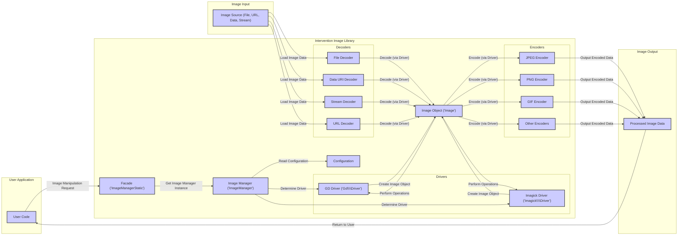

# Project Design Document: Intervention Image Library (Improved)

**1. Introduction**

This document provides an enhanced and more detailed design overview of the Intervention Image library (available at [https://github.com/intervention/image](https://github.com/intervention/image)). Building upon the previous version, this iteration further clarifies the architectural components, data flow, and functionalities, with a stronger emphasis on aspects relevant to threat modeling. This document serves as a refined foundation for subsequent threat modeling activities to identify potential security vulnerabilities and risks associated with its use.

**2. Goals and Objectives**

The primary goal of the Intervention Image library remains to provide an easy-to-use and expressive interface for common image manipulation tasks in PHP. Key objectives include:

*   Providing a fluent and readable API for image processing operations.
*   Supporting multiple underlying image processing libraries, primarily GD Library and Imagick, with potential for future extensions.
*   Offering a comprehensive suite of image manipulation operations, including resizing, cropping, watermarking, applying filters, and format conversion.
*   Simplifying common image handling tasks such as loading images from various sources, saving to different destinations, and encoding/decoding image formats.
*   Abstracting the complexities and inconsistencies of different image processing engines, providing a unified developer experience.
*   Maintaining a focus on performance and efficiency while providing a high-level API.

**3. Architecture Overview**

Intervention Image employs a layered architecture with a facade pattern to abstract the underlying image processing drivers. This design promotes flexibility and allows developers to interact with the library in a consistent manner regardless of the chosen driver. The core components include:

*   **Facade (`Intervention\Image\ImageManagerStatic`):** The primary and most common entry point for developers. It provides a set of static methods that delegate to the `ImageManager` instance. This simplifies common tasks and offers a convenient API.
*   **Image Manager (`Intervention\Image\ImageManager`):**  Responsible for the overall management of image processing. Its key responsibilities include:
    *   Reading and interpreting configuration settings to determine the active image processing driver.
    *   Instantiating the appropriate driver class based on the configuration.
    *   Providing methods for creating new `Image` objects from various sources (files, data streams, etc.).
*   **Drivers (`Intervention\Image\Gd\Driver`, `Intervention\Image\Imagick\Driver`):** These are the concrete implementations of the image processing logic. Each driver encapsulates the specific interactions with the underlying PHP extension (GD Library or Imagick). They provide methods for performing the actual image manipulations.
*   **Image Object (`Intervention\Image\Image`):** Represents an image in memory. It holds the image data, metadata (like format and mime type), and provides a fluent interface for applying manipulation operations. The specific implementation of the `Image` object might differ slightly between drivers.
*   **Encoders (`Intervention\Image\Encoders\*`):** Responsible for converting the internal `Image` object representation into a specific image format (e.g., JPEG, PNG, GIF) for saving or output. Each encoder handles the specific details of a particular format.
*   **Decoders (`Intervention\Image\Decoders\*`):** Responsible for parsing image data from various sources (files, streams, URLs) and creating the internal `Image` object representation. Each decoder handles the specific format of the input data.
*   **Configuration (`config/image.php` or application configuration):**  Allows users to customize the library's behavior. Key configuration options include:
    *   Specifying the preferred image processing driver (GD or Imagick).
    *   Setting driver-specific options (if any).
    *   Potentially configuring cache settings or other library-wide parameters.

**4. Component Details**

*   **Facade (`Intervention\Image\ImageManagerStatic`)**:
    *   Provides a static, easy-to-use API for common image operations like `make()` (to load an image) and `canvas()` (to create a new image).
    *   Internally obtains an instance of the `ImageManager` and delegates the calls.
    *   Acts as a central point of interaction for most common use cases.

*   **Image Manager (`Intervention\Image\ImageManager`)**:
    *   **Driver Selection Logic:** Reads the `driver` configuration option. If set, it attempts to instantiate the corresponding driver. If not set or the driver is unavailable, it might fall back to a default driver or throw an exception.
    *   **Instantiation:** Uses dependency injection or direct instantiation to create driver instances.
    *   **Image Creation:** Provides methods like `make()` which internally use the active driver's decoding capabilities to create an `Image` object.

*   **Drivers (`Intervention\Image\Gd\Driver`, `Intervention\Image\Imagick\Driver`)**:
    *   **Implementation Details:** Contain the core logic for image manipulation using the respective PHP extension functions (e.g., `imagecreatefromjpeg` for GD, `Imagick::readImageBlob` for Imagick).
    *   **Operation Mapping:** Implement the abstract methods defined in a potential `DriverInterface` (though not explicitly shown in the provided GitHub link, it's a common pattern) to provide concrete implementations for operations like `resize`, `crop`, `rotate`, `filter`, and `encode`.
    *   **Resource Management:** Responsible for managing resources allocated by the underlying extensions.

*   **Image Object (`Intervention\Image\Image`)**:
    *   **Data Storage:** Holds the raw image data (often as a resource or object provided by the underlying extension) and potentially metadata.
    *   **Fluent Interface:** Provides a chainable API for applying multiple manipulations (e.g., `$image->resize(100, 100)->greyscale()->save('output.jpg')`).
    *   **Driver Abstraction:**  Abstracts away the specific details of the underlying image representation used by the driver.

*   **Encoders (`Intervention\Image\Encoders\JpegEncoder`, `Intervention\Image\Encoders\PngEncoder`, etc.)**:
    *   **Format-Specific Logic:** Contain the logic to convert the internal `Image` representation into the byte stream of a specific image format (JPEG, PNG, GIF, etc.).
    *   **Quality and Options:** May allow setting encoding options like quality for JPEG or compression level for PNG.

*   **Decoders (`Intervention\Image\Decoders\FileDecoder`, `Intervention\Image\Decoders\DataUriDecoder`, etc.)**:
    *   **Source Handling:**  Handle different input sources for image data (files, data URIs, raw data streams).
    *   **Format Detection:** May perform format detection based on file extensions, MIME types, or magic numbers.
    *   **Driver Interaction:**  Use the active driver's capabilities to load and decode the image data into the internal representation.

*   **Configuration (`config/image.php` or application configuration)**:
    *   **Driver Preference:** The most critical setting, determining which underlying image processing engine will be used.
    *   **Driver Options:** May include specific settings for the chosen driver (e.g., JPEG quality).
    *   **Loading Mechanism:** Configuration is typically loaded through the application's configuration system (e.g., Laravel's `config()` helper).

**5. Data Flow (Improved)**

**Detailed Data Flow Steps:**

*   The user application initiates an image manipulation request through the `ImageManagerStatic` facade.
*   The facade obtains an instance of the `ImageManager`.
*   The `ImageManager` reads the configuration to determine the active image processing driver.
*   Based on the configuration, the `ImageManager` selects either the `Gd\Driver` or `Imagick\Driver`.
*   **Image Loading:**
    *   The user provides an image source (file path, URL, data URI, or raw data stream).
    *   The appropriate decoder (File Decoder, Data URI Decoder, Stream Decoder, or URL Decoder) is used to read the image data.
    *   The decoder utilizes the selected driver's decoding capabilities to create an `Image` object.
*   The user code interacts with the `Image` object to perform manipulation operations. These operations are delegated to the active driver.
*   The driver uses the underlying GD Library or Imagick extension to perform the image processing.
*   **Image Saving/Output:**
    *   When saving or outputting the image, the `Image` object's data is passed to an appropriate encoder (JPEG Encoder, PNG Encoder, etc.).
    *   The encoder converts the image data to the desired format.
    *   The encoded image data is then returned to the user application or saved to the specified destination.

**6. Security Considerations (Enhanced for Threat Modeling)**

This section outlines potential security considerations, categorized by component, to facilitate a more targeted threat modeling process.

*   **Input (Decoders, Image Manager):**
    *   **Malicious Image Files:**  Vulnerability to specially crafted image files that could exploit vulnerabilities in the underlying GD or Imagick libraries (e.g., buffer overflows, integer overflows).
        *   Consider threats related to various image formats (JPEG, PNG, GIF, etc.) and their specific parsing complexities.
        *   Think about "image bombs" designed to consume excessive resources.
    *   **Path Traversal (File Decoder, URL Decoder):**  If user-provided input directly controls file paths or URLs, attackers might be able to access or overwrite arbitrary files on the server.
        *   Focus on the validation and sanitization of file paths and URLs.
    *   **Remote Code Execution via Image Exploits:** Vulnerabilities in GD or Imagick could potentially lead to RCE if a malicious image is processed.
        *   Emphasize the importance of keeping GD and Imagick up-to-date.
    *   **Denial of Service (DoS):**  Processing very large or complex images could consume excessive server resources, leading to DoS.
        *   Consider resource limits and timeouts.

*   **Processing (Drivers, Image Object):**
    *   **Vulnerabilities in GD/Imagick:** The library's security is heavily dependent on the security of the underlying image processing libraries.
        *   Threat modeling should consider known vulnerabilities in specific versions of GD and Imagick.
    *   **Resource Exhaustion:**  Certain image manipulation operations (e.g., complex filters, large resizing operations) could consume significant CPU and memory.
        *   Consider the potential for abuse and the need for resource limits.
    *   **Information Disclosure:**  Error messages or logging could inadvertently reveal sensitive information about the server environment or internal library workings.
        *   Focus on secure error handling and logging practices.

*   **Output (Encoders):**
    *   **Information Leakage:**  If not handled carefully, metadata embedded in output images could reveal sensitive information.
        *   Consider options for stripping metadata.
    *   **File Overwriting:** If saving to user-specified paths, there's a risk of unintentionally overwriting important files.
        *   Focus on secure file saving practices and validation of output paths.

*   **Configuration (Image Manager, Application Configuration):**
    *   **Insecure Default Driver:**  If the default driver is known to have more vulnerabilities, it could increase risk.
    *   **Exposure of Configuration:** If the configuration file is publicly accessible, attackers could learn about the chosen driver and potentially exploit known vulnerabilities.
    *   **Injection of Malicious Configuration:** If configuration values are sourced from user input without proper sanitization, it could lead to unexpected behavior or vulnerabilities.

**7. Assumptions and Constraints**

*   The security of the Intervention Image library is inherently tied to the security of the underlying GD Library or Imagick PHP extension.
*   This design document assumes that the server environment where the library is deployed has basic security measures in place (e.g., proper file permissions, web server security).
*   The scope of this document is limited to the design of the Intervention Image library itself and does not cover the security of the applications that use it.
*   It is assumed that developers using the library will follow secure coding practices and properly validate user inputs.

**8. Future Considerations**

*   Exploring options for sandboxing or isolating the image processing operations to mitigate the impact of potential vulnerabilities in GD or Imagick.
*   Implementing more robust input validation and sanitization mechanisms within the library itself.
*   Providing more granular control over resource limits for image processing operations.
*   Adding features for automatic security updates or notifications regarding vulnerabilities in dependencies.
*   Consider incorporating static analysis tools or security audits into the development process.

This improved design document provides a more detailed and security-focused overview of the Intervention Image library. The enhanced component descriptions, refined data flow diagram, and categorized security considerations offer a stronger foundation for effective threat modeling. This document will be instrumental in identifying and mitigating potential security risks associated with the use of this library.