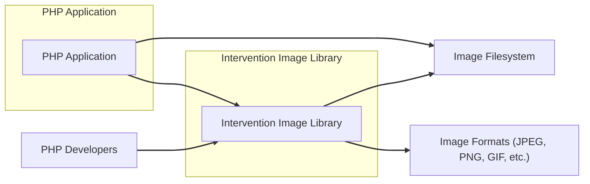
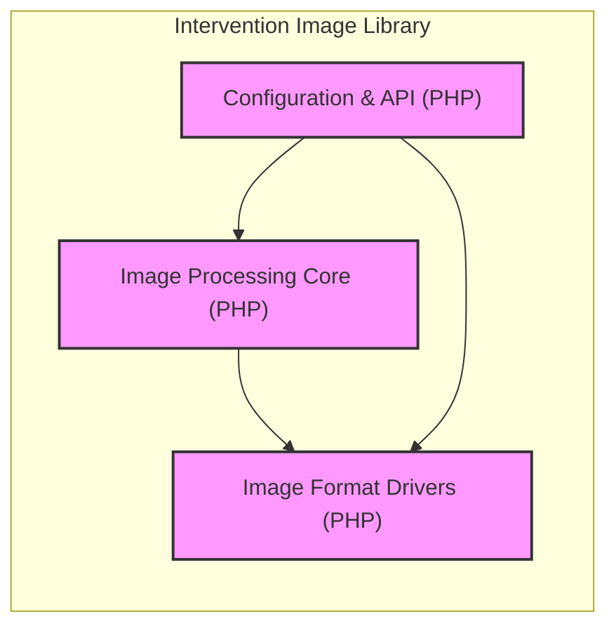
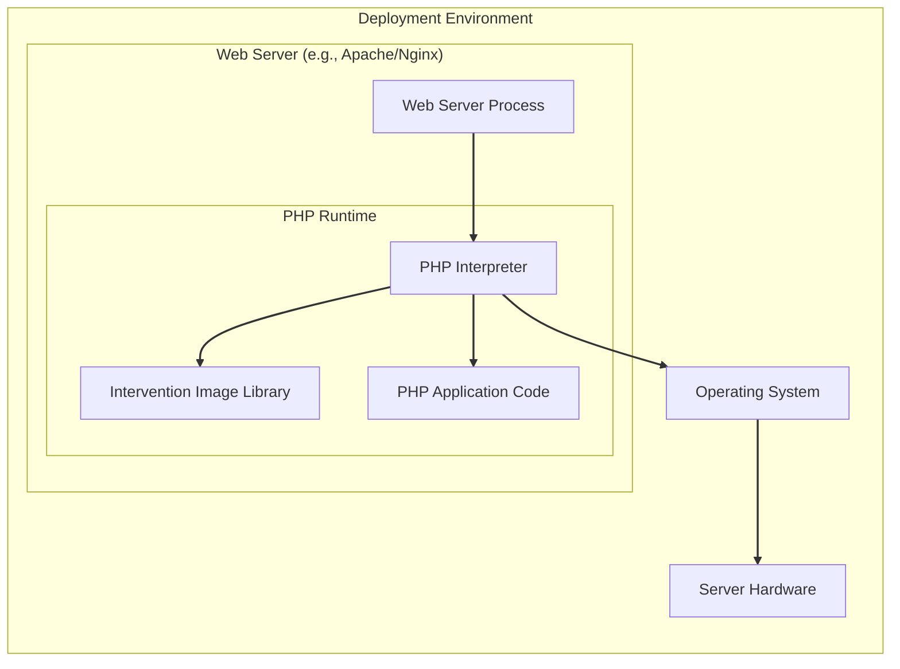

# BUSINESS POSTURE

- Business Priorities and Goals:
  - Provide a user-friendly and efficient PHP library for image manipulation.
  - Enable PHP developers to easily integrate image processing capabilities into their applications.
  - Offer a wide range of image manipulation features, supporting various image formats.
  - Maintain a stable and reliable library for consistent image processing.
  - Foster an active community around the library for contributions and support.
- Business Risks:
  - Security vulnerabilities in the library could be exploited by attackers, compromising applications that use it.
  - Poor performance or instability could lead to negative user experiences and adoption.
  - Lack of support for new image formats or features could make the library outdated.
  - Dependency on community contributions might lead to inconsistent development and maintenance.
  - Legal risks associated with improper image handling or licensing issues.

# SECURITY POSTURE

- Existing Security Controls:
  - security control: Code hosted on GitHub, benefiting from GitHub's security features (e.g., vulnerability scanning, dependency graph). Implemented by: GitHub platform.
  - security control: Open-source nature allows for community review and identification of potential vulnerabilities. Implemented by: Open-source community.
  - security control: Use of PHP, which has its own set of security best practices and common vulnerabilities. Implemented by: PHP runtime environment and developer practices.
- Accepted Risks:
  - accepted risk: Vulnerabilities might be discovered and publicly disclosed before a patch is available due to the open-source nature.
  - accepted risk: Reliance on community contributions for security fixes can lead to delays in addressing vulnerabilities.
  - accepted risk: Potential for insecure coding practices by contributors if security guidelines are not strictly enforced.
- Recommended Security Controls:
  - security control: Implement automated Static Application Security Testing (SAST) in the CI/CD pipeline to detect potential vulnerabilities in the code.
  - security control: Implement Dependency Scanning to identify and manage known vulnerabilities in third-party libraries used by the project.
  - security control: Establish a clear vulnerability disclosure policy to provide a channel for security researchers to report vulnerabilities responsibly.
  - security control: Conduct regular security audits and penetration testing to proactively identify and address security weaknesses.
  - security control: Integrate security testing (unit and integration tests focusing on security aspects) into the development process.
- Security Requirements:
  - Authentication: Not directly applicable to a library. Applications using this library are responsible for their own authentication mechanisms.
  - Authorization: Not directly applicable to a library. Applications using this library are responsible for their own authorization mechanisms to control access to images and image processing functionalities.
  - Input Validation:
    - Requirement: The library must perform robust input validation on all image data and parameters to prevent vulnerabilities such as image bombs, buffer overflows, and format string bugs.
    - Requirement: Validate image file headers and metadata to ensure they conform to expected formats and do not contain malicious data.
    - Requirement: Sanitize user-provided parameters used in image manipulation operations to prevent injection attacks.
  - Cryptography:
    - Requirement: If the library handles sensitive image data or supports encrypted image formats, ensure proper and secure cryptographic implementations are used.
    - Requirement: Avoid storing cryptographic keys or secrets within the library code. Applications using the library should manage their own keys securely if needed.

# DESIGN

## C4 CONTEXT

- Context Diagram Elements:
  - - Name: PHP Application
    - Type: Software System
    - Description: Web applications or other PHP based software that utilize the Intervention Image Library for image processing.
    - Responsibilities:
      - Utilize the Intervention Image Library to perform image manipulation tasks.
      - Manage user authentication and authorization for image related operations.
      - Handle image storage and retrieval from the filesystem.
      - Present processed images to users.
    - Security controls:
      - Application level authentication and authorization.
      - Secure storage of images.
      - Input validation of user requests.
  - - Name: Intervention Image Library
    - Type: Software System
    - Description: A PHP library providing functionalities for image manipulation, processing, and format conversion.
    - Responsibilities:
      - Provide a comprehensive API for image manipulation in PHP.
      - Support various image formats (JPEG, PNG, GIF, etc.).
      - Perform image processing operations efficiently and reliably.
      - Handle image data securely within the library's scope.
    - Security controls:
      - Input validation of image data and parameters.
      - Secure coding practices to prevent vulnerabilities.
      - Dependency management to avoid vulnerable dependencies.
  - - Name: PHP Developers
    - Type: Person
    - Description: Software developers who use the Intervention Image Library to build PHP applications.
    - Responsibilities:
      - Integrate the library into PHP applications.
      - Utilize the library's API correctly and securely.
      - Implement application-level security controls.
      - Report issues and contribute to the library.
    - Security controls:
      - Secure development practices.
      - Code review and testing.
      - Awareness of library security considerations.
  - - Name: Image Filesystem
    - Type: External System
    - Description: The file system where images are stored and retrieved. This could be local storage, cloud storage, or any other file storage system.
    - Responsibilities:
      - Store and retrieve image files.
      - Manage file permissions and access control.
      - Ensure data integrity and availability of images.
    - Security controls:
      - Access control lists (ACLs) or other permission mechanisms.
      - Encryption at rest (if required for sensitive images).
      - Regular backups and disaster recovery.
  - - Name: Image Formats (JPEG, PNG, GIF, etc.)
    - Type: External System
    - Description: Standard image file formats that the library supports for reading, writing, and processing.
    - Responsibilities:
      - Define the structure and encoding of image data.
      - Be parsed and processed by the library.
      - Be rendered by image viewers and applications.
    - Security controls:
      - Adherence to format specifications to prevent parsing vulnerabilities.
      - Handling of potentially malicious or malformed image files.

## C4 CONTAINER

- Container Diagram Elements:
  - - Name: Image Processing Core (PHP)
    - Type: Container - PHP Module
    - Description: The core logic of the library, responsible for image manipulation algorithms, pixel processing, and core functionalities.
    - Responsibilities:
      - Implement image processing algorithms (resizing, cropping, filtering, etc.).
      - Manage image data structures and pixel manipulation.
      - Provide core functionalities for image operations.
    - Security controls:
      - Input validation within core processing logic.
      - Memory management to prevent buffer overflows.
      - Secure implementation of image processing algorithms.
  - - Name: Image Format Drivers (PHP)
    - Type: Container - PHP Modules
    - Description: Modules responsible for handling different image formats (JPEG, PNG, GIF, etc.), including encoding and decoding image data.
    - Responsibilities:
      - Implement format-specific encoding and decoding logic.
      - Parse and generate image file headers and metadata.
      - Handle format-specific security considerations.
    - Security controls:
      - Input validation during format parsing.
      - Protection against format-specific vulnerabilities (e.g., JPEG exploits).
      - Secure handling of metadata.
  - - Name: Configuration & API (PHP)
    - Type: Container - PHP Module
    - Description: Provides the user-facing API of the library, handles configuration options, and manages interactions between different components.
    - Responsibilities:
      - Expose a user-friendly API for developers.
      - Manage library configuration and options.
      - Route requests to appropriate processing modules.
      - Handle error reporting and logging.
    - Security controls:
      - API input validation and sanitization.
      - Secure configuration management.
      - Rate limiting or request throttling (if applicable in usage context).

## DEPLOYMENT

- Deployment Options:
  - Option 1: Deployed as a dependency within PHP applications on various web servers (Apache, Nginx) and PHP environments (e.g., Docker containers, VMs, bare metal).
  - Option 2: Potentially used in serverless PHP environments (e.g., AWS Lambda with PHP runtime).
- Detailed Deployment (Option 1 - Typical Web Server Deployment):

- Deployment Diagram Elements:
  - - Name: Web Server Process (e.g., Apache/Nginx)
    - Type: Infrastructure - Web Server
    - Description: The web server software responsible for handling HTTP requests and serving web applications.
    - Responsibilities:
      - Receive and process HTTP requests.
      - Serve static content and proxy requests to PHP runtime.
      - Manage web server security configurations (TLS, etc.).
    - Security controls:
      - Web server security configurations (TLS/SSL, HTTP headers).
      - Access control to web server configuration files.
      - Regular security updates and patching.
  - - Name: PHP Interpreter
    - Type: Infrastructure - Runtime Environment
    - Description: The PHP runtime environment that executes PHP code, including the Intervention Image Library and the PHP application.
    - Responsibilities:
      - Execute PHP code.
      - Manage memory and resources for PHP applications.
      - Provide PHP extensions and libraries.
    - Security controls:
      - PHP security configurations (e.g., disable dangerous functions).
      - Regular PHP version updates and security patches.
      - Resource limits to prevent denial of service.
  - - Name: Intervention Image Library
    - Type: Software - PHP Library
    - Description: Deployed as part of the PHP application, loaded by the PHP interpreter when the application uses its functionalities.
    - Responsibilities:
      - Provide image processing functionalities within the PHP runtime.
      - Operate within the security context of the PHP application and runtime.
    - Security controls:
      - Inherits security controls from the PHP runtime and application environment.
      - Secure coding practices within the library itself.
  - - Name: PHP Application Code
    - Type: Software - Application
    - Description: The custom PHP application code that utilizes the Intervention Image Library.
    - Responsibilities:
      - Implement application logic and business functionalities.
      - Integrate and use the Intervention Image Library.
      - Handle application-level security concerns.
    - Security controls:
      - Application-level authentication and authorization.
      - Secure coding practices in application code.
      - Input validation and output encoding in application logic.
  - - Name: Operating System
    - Type: Infrastructure - OS
    - Description: The operating system running on the server hardware, providing core system services.
    - Responsibilities:
      - Manage system resources (CPU, memory, disk, network).
      - Provide security features (user accounts, permissions, firewalls).
      - Host the web server and PHP runtime.
    - Security controls:
      - Operating system hardening and security configurations.
      - User access control and permissions.
      - Firewall and network security.
      - Regular OS updates and patching.
  - - Name: Server Hardware
    - Type: Infrastructure - Hardware
    - Description: The physical or virtual server hardware hosting the entire deployment environment.
    - Responsibilities:
      - Provide physical resources for the system.
      - Ensure hardware security and availability.
    - Security controls:
      - Physical security of server hardware.
      - Hardware security features (e.g., secure boot).
      - Infrastructure security monitoring.

## BUILD

```mermaid
flowchart LR
    A["Developer"] --> B["Code Repository (GitHub)"];
    B --> C["CI/CD Pipeline (GitHub Actions)"];
    C --> D["Build Process (Composer, PHP)"];
    D --> E["Security Checks (SAST, Dependency Scan)"];
    E --> F["Build Artifacts (PHP Package)"];
    F --> G["Package Repository (Packagist)"];

    style A fill:#ccf,stroke:#333,stroke-width:2px
    style B fill:#ccf,stroke:#333,stroke-width:2px
    style C fill:#ccf,stroke:#333,stroke-width:2px
    style D fill:#ccf,stroke:#333,stroke-width:2px
    style E fill:#ccf,stroke:#333,stroke-width:2px
    style F fill:#ccf,stroke:#333,stroke-width:2px
    style G fill:#ccf,stroke:#333,stroke-width:2px
```

- Build Process Description:
  - Developer: Developers write code and commit changes to the GitHub repository.
  - Code Repository (GitHub): GitHub hosts the source code, manages version control, and triggers CI/CD pipelines.
  - CI/CD Pipeline (GitHub Actions): GitHub Actions is used for automated build, test, and release processes.
  - Build Process (Composer, PHP): Composer is used to manage PHP dependencies and package the library. PHP is used to execute build scripts and tests.
  - Security Checks (SAST, Dependency Scan): Automated security checks are performed during the build process, including:
    - Static Application Security Testing (SAST) to analyze code for potential vulnerabilities.
    - Dependency scanning to identify known vulnerabilities in dependencies.
  - Build Artifacts (PHP Package): The build process produces a PHP package (likely distributed via Packagist).
  - Package Repository (Packagist): Packagist is the primary PHP package repository where the library is published for distribution and consumption by PHP developers.
- Build Process Security Controls:
  - security control: Code Repository Security (GitHub): Access control, branch protection, and audit logs on the GitHub repository. Implemented by: GitHub.
  - security control: CI/CD Pipeline Security (GitHub Actions): Secure configuration of GitHub Actions workflows, secret management, and access control. Implemented by: GitHub Actions configuration.
  - security control: Automated Security Checks (SAST, Dependency Scan): Integration of SAST tools and dependency scanners in the CI/CD pipeline to detect vulnerabilities early in the development lifecycle. Implemented by: CI/CD pipeline configuration and security tools.
  - security control: Build Environment Security: Secure build environment to prevent tampering and ensure integrity of the build process. Implemented by: CI/CD environment configuration.
  - security control: Code Signing (potentially): Signing of the PHP package to ensure authenticity and integrity. Implemented by: Build process and package signing tools (if implemented).
  - security control: Dependency Management (Composer): Using Composer to manage dependencies and ensure dependency integrity. Implemented by: Composer and `composer.lock` file.

# RISK ASSESSMENT

- Critical Business Processes:
  - Image processing functionality provided by the library is critical for applications that rely on it for core features such as content creation, image manipulation for user interfaces, or data processing pipelines.
  - Availability and security of the library directly impact the applications that depend on it.
- Data Sensitivity:
  - The library processes image data, which can contain sensitive information depending on the application context. Images might include:
    - Personal photos and videos.
    - Scanned documents containing personal or confidential data.
    - Medical images.
    - Security camera footage.
    - Intellectual property embedded in images.
  - Sensitivity level depends on the application using the library and the type of images being processed. A vulnerability in the library could lead to unauthorized access, modification, or disclosure of this sensitive image data.

# QUESTIONS & ASSUMPTIONS

- Questions:
  - What are the most common use cases for the Intervention Image Library? Understanding the typical applications will help prioritize security concerns.
  - Are there any specific performance requirements or constraints for the library? Performance considerations might influence security design choices.
  - What is the expected level of security expertise among developers using this library? This will help determine the level of guidance and security features needed in the library itself.
  - Are there any compliance requirements (e.g., GDPR, HIPAA) that applications using this library might need to adhere to? Compliance needs can drive specific security requirements.
- Assumptions:
  - BUSINESS POSTURE:
    - The primary business goal is to provide a functional and easy-to-use image processing library for PHP developers.
    - Security is important but is balanced with usability and performance.
    - The library is intended for a wide range of PHP applications, including web applications.
  - SECURITY POSTURE:
    - The library is expected to be used in environments with varying security postures.
    - Developers using the library are responsible for application-level security controls.
    - Input validation and secure coding practices within the library are crucial security controls.
  - DESIGN:
    - The library is designed as a modular PHP package.
    - It relies on PHP's built-in functionalities and potentially some external PHP extensions for image processing.
    - Deployment is primarily as a dependency within PHP applications on standard web server environments.