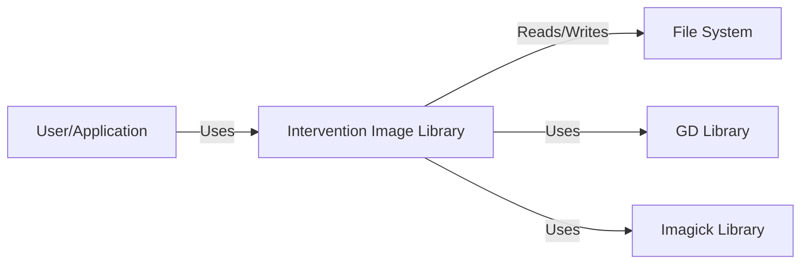
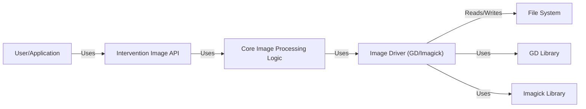
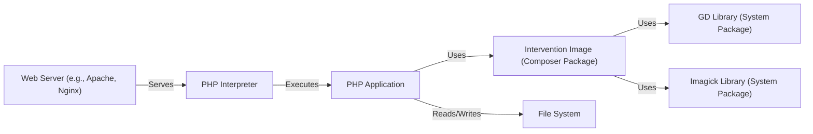
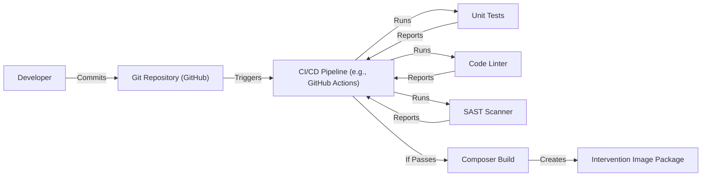

Okay, let's create a design document for the "intervention/image" project.

# BUSINESS POSTURE

Business Priorities and Goals:

*   Provide a user-friendly and efficient PHP library for image manipulation and processing.
*   Offer a wide range of image editing capabilities, including resizing, cropping, watermarking, and applying filters.
*   Maintain a clean and well-documented codebase for ease of use and contribution.
*   Ensure compatibility with various PHP versions and image formats.
*   Provide good performance for image processing tasks.
*   Establish a strong community around the project for support and future development.

Business Risks:

*   Security vulnerabilities in the library could lead to remote code execution or denial-of-service attacks on applications using it.
*   Incompatibility with specific server configurations or PHP extensions could limit the library's adoption.
*   Performance bottlenecks could impact the responsiveness of applications using the library for heavy image processing.
*   Lack of support for emerging image formats could make the library less relevant over time.
*   Inadequate documentation or community support could hinder user adoption and contribution.
*   Bugs or errors in image processing could lead to corrupted or incorrect output images.

# SECURITY POSTURE

Existing Security Controls:

*   security control: Input validation: The library likely performs some level of input validation to check for valid image file paths, dimensions, and other parameters. (Described in documentation and source code).
*   security control: File type checking: The library probably verifies the file type based on its content rather than solely relying on the file extension. (Described in documentation and source code).
*   security control: Use of established image processing libraries: The library likely relies on well-tested underlying libraries like GD or Imagick for core image manipulation functions. (Described in documentation and source code).
*   security control: Regular updates and maintenance: The project maintainers appear to actively address issues and release updates, suggesting a commitment to security. (Visible on GitHub repository).

Accepted Risks:

*   accepted risk: Dependency on external libraries (GD/Imagick): Vulnerabilities in these underlying libraries could impact the security of Intervention Image.
*   accepted risk: Potential for denial-of-service: Processing very large or maliciously crafted images could consume excessive server resources.
*   accepted risk: Limited protection against advanced image processing attacks: The library may not be designed to withstand sophisticated attacks that exploit subtle image processing flaws.

Recommended Security Controls:

*   security control: Implement a comprehensive input sanitization strategy to prevent injection attacks and ensure that all user-provided data is properly validated and escaped.
*   security control: Introduce resource limits for image processing, such as maximum file size, dimensions, and processing time, to mitigate denial-of-service risks.
*   security control: Consider integrating security-focused image processing tools or libraries to enhance protection against advanced attacks.
*   security control: Establish a clear security policy and vulnerability reporting process to encourage responsible disclosure of security issues.
*   security control: Regularly conduct security audits and penetration testing to identify and address potential vulnerabilities.
*   security control: Implement Content Security Policy (CSP) if the library is used in a web context to mitigate XSS attacks.

Security Requirements:

*   Authentication: Not directly applicable, as the library itself does not handle user authentication. However, applications using the library should implement proper authentication mechanisms.
*   Authorization: Not directly applicable, as the library does not manage user permissions. Applications using the library should implement appropriate authorization controls.
*   Input Validation:
    *   All input parameters, including file paths, dimensions, colors, and filter settings, must be strictly validated.
    *   File type verification should be based on content analysis, not just file extensions.
    *   Input sanitization should be performed to prevent injection attacks.
*   Cryptography: Not directly applicable for core image manipulation functions. If the library handles sensitive data (e.g., encrypted images), appropriate cryptographic techniques should be used.
*   Output Encoding: If the library generates output that is displayed in a web context, proper output encoding should be used to prevent XSS vulnerabilities.

# DESIGN

## C4 CONTEXT

Element Description:

*   Element:
    *   Name: User/Application
    *   Type: External Entity (User or Application)
    *   Description: Represents a user or an application that utilizes the Intervention Image library for image processing.
    *   Responsibilities: Provides input images and parameters to the library; Receives processed images from the library.
    *   Security controls: Implements authentication and authorization mechanisms; Performs input validation before passing data to the library.

*   Element:
    *   Name: Intervention Image Library
    *   Type: Software System
    *   Description: The core PHP library for image manipulation and processing.
    *   Responsibilities: Provides an API for image editing operations; Handles image loading, processing, and saving; Interacts with underlying image processing libraries.
    *   Security controls: Performs input validation; Uses secure coding practices; Relies on secure underlying libraries.

*   Element:
    *   Name: File System
    *   Type: External System
    *   Description: The server's file system where images are stored and accessed.
    *   Responsibilities: Stores image files; Provides read/write access to image files.
    *   Security controls: Implements file system permissions; Uses secure storage mechanisms.

*   Element:
    *   Name: GD Library
    *   Type: External Library
    *   Description: A widely used image processing library for PHP.
    *   Responsibilities: Provides low-level image manipulation functions.
    *   Security controls: Relies on the security of the GD library itself.

*   Element:
    *   Name: Imagick Library
    *   Type: External Library
    *   Description: An alternative image processing library for PHP, based on ImageMagick.
    *   Responsibilities: Provides low-level image manipulation functions.
    *   Security controls: Relies on the security of the Imagick library itself.

## C4 CONTAINER

Element Description:

*   Element:
    *   Name: User/Application
    *   Type: External Entity
    *   Description: Represents a user or an application that utilizes the Intervention Image library.
    *   Responsibilities: Provides input images and parameters; Receives processed images.
    *   Security controls: Implements authentication and authorization; Performs input validation.

*   Element:
    *   Name: Intervention Image API
    *   Type: Container (API)
    *   Description: The public interface of the Intervention Image library.
    *   Responsibilities: Exposes methods for image manipulation; Handles user requests; Validates input parameters.
    *   Security controls: Performs input validation; Enforces API usage limits.

*   Element:
    *   Name: Core Image Processing Logic
    *   Type: Container (Code)
    *   Description: The core logic for image manipulation and processing.
    *   Responsibilities: Implements image editing operations; Coordinates with the image driver.
    *   Security controls: Uses secure coding practices; Avoids known vulnerabilities.

*   Element:
    *   Name: Image Driver (GD/Imagick)
    *   Type: Container (Code)
    *   Description: An abstraction layer for interacting with the underlying image processing libraries (GD or Imagick).
    *   Responsibilities: Selects the appropriate image processing library; Translates API calls to library-specific functions.
    *   Security controls: Uses secure configurations for the underlying libraries.

*   Element:
    *   Name: File System
    *   Type: External System
    *   Description: The server's file system.
    *   Responsibilities: Stores image files; Provides read/write access.
    *   Security controls: Implements file system permissions; Uses secure storage.

*   Element:
    *   Name: GD Library
    *   Type: External Library
    *   Description: The GD image processing library.
    *   Responsibilities: Provides low-level image manipulation functions.
    *   Security controls: Relies on the security of the GD library.

*   Element:
    *   Name: Imagick Library
    *   Type: External Library
    *   Description: The Imagick image processing library.
    *   Responsibilities: Provides low-level image manipulation functions.
    *   Security controls: Relies on the security of the Imagick library.

## DEPLOYMENT

Possible Deployment Solutions:

1.  Composer Package: The most common way to deploy Intervention Image is as a Composer package within a PHP project.
2.  Standalone Installation: It's possible, though less common, to install the library manually without Composer.
3.  Docker Container: The library could be part of a larger application deployed within a Docker container.

Chosen Deployment Solution (Composer Package):

Element Description:

*   Element:
    *   Name: Web Server (e.g., Apache, Nginx)
    *   Type: Infrastructure Node
    *   Description: The web server that handles incoming HTTP requests.
    *   Responsibilities: Receives requests; Forwards requests to the PHP interpreter.
    *   Security controls: Implements web server security best practices; Uses HTTPS; Configures appropriate security headers.

*   Element:
    *   Name: PHP Interpreter
    *   Type: Runtime Environment
    *   Description: The PHP interpreter that executes the application code.
    *   Responsibilities: Executes PHP scripts; Manages PHP extensions.
    *   Security controls: Uses a secure PHP configuration; Keeps PHP updated; Disables unnecessary functions.

*   Element:
    *   Name: PHP Application
    *   Type: Software System
    *   Description: The application that uses the Intervention Image library.
    *   Responsibilities: Handles application logic; Uses Intervention Image for image processing.
    *   Security controls: Implements application-level security measures; Performs input validation.

*   Element:
    *   Name: Intervention Image (Composer Package)
    *   Type: Library
    *   Description: The Intervention Image library installed as a Composer package.
    *   Responsibilities: Provides image manipulation functions.
    *   Security controls: Relies on the security of the library's code and dependencies.

*   Element:
    *   Name: GD Library (System Package)
    *   Type: System Library
    *   Description: The GD library installed as a system package.
    *   Responsibilities: Provides low-level image manipulation functions.
    *   Security controls: Relies on the security of the system package.

*   Element:
    *   Name: Imagick Library (System Package)
    *   Type: System Library
    *   Description: The Imagick library installed as a system package.
    *   Responsibilities: Provides low-level image manipulation functions.
    *   Security controls: Relies on the security of the system package.

*   Element:
    *   Name: File System
    *   Type: Infrastructure Node
    *   Description: The server's file system.
    *   Responsibilities: Stores image files; Provides read/write access.
    *   Security controls: Implements file system permissions; Uses secure storage.

## BUILD

Build Process Description:

1.  Developer commits code changes to the Git repository (GitHub).
2.  The commit triggers a CI/CD pipeline (e.g., GitHub Actions).
3.  The CI pipeline runs unit tests to verify the functionality of the code.
4.  The CI pipeline runs a code linter to check for code style and potential errors.
5.  The CI pipeline runs a SAST (Static Application Security Testing) scanner to identify potential security vulnerabilities.
6.  Test, Linter and SAST results are reported back to the CI pipeline.
7.  If all tests, linters and SAST checks pass, the CI pipeline triggers a Composer build.
8.  Composer creates the Intervention Image package, including all necessary dependencies.
9.  The package is ready for deployment.

Security Controls:

*   security control: Unit Tests: Ensure that the code functions as expected and helps prevent regressions.
*   security control: Code Linter: Enforces code style consistency and helps identify potential errors.
*   security control: SAST Scanner: Detects potential security vulnerabilities in the code before deployment.
*   security control: Dependency Management (Composer): Composer helps manage dependencies and ensures that the correct versions of libraries are used.
*   security control: CI/CD Pipeline: Automates the build process and ensures that all checks are performed consistently.

# RISK ASSESSMENT

Critical Business Processes:

*   Image processing and manipulation: The core functionality of the library is to process and manipulate images. Any disruption to this process would impact users relying on the library.
*   Application functionality: Applications using the library depend on its availability and correct operation.

Data Protection:

*   Image data: The library handles image data, which may have varying levels of sensitivity depending on the application.
    *   Sensitivity:
        *   Low: Publicly available images, generic icons.
        *   Medium: User-uploaded images that may contain personal information (e.g., profile pictures).
        *   High: Sensitive images containing confidential information (e.g., medical images, financial documents).
*   Configuration data: The library may access configuration data related to image processing settings.
    *   Sensitivity: Low to Medium, depending on the specific configuration.

# QUESTIONS & ASSUMPTIONS

Questions:

*   Are there any specific compliance requirements (e.g., GDPR, HIPAA) that apply to applications using this library?
*   What are the expected image sizes and processing loads?
*   Are there any specific security concerns raised by the community or users?
*   What is the process for handling security vulnerabilities reported by external researchers?
*   Is there any plan to support image encryption or other advanced security features?

Assumptions:

*   BUSINESS POSTURE: The primary goal is to provide a reliable and user-friendly image processing library. Security is a high priority, but usability and performance are also important.
*   SECURITY POSTURE: The library relies on the security of underlying libraries (GD/Imagick) and the server environment. The project maintainers are responsive to security issues.
*   DESIGN: The library is primarily used as a Composer package within PHP applications. The deployment environment is a typical web server with PHP and either GD or Imagick installed. The build process includes automated testing and security checks.